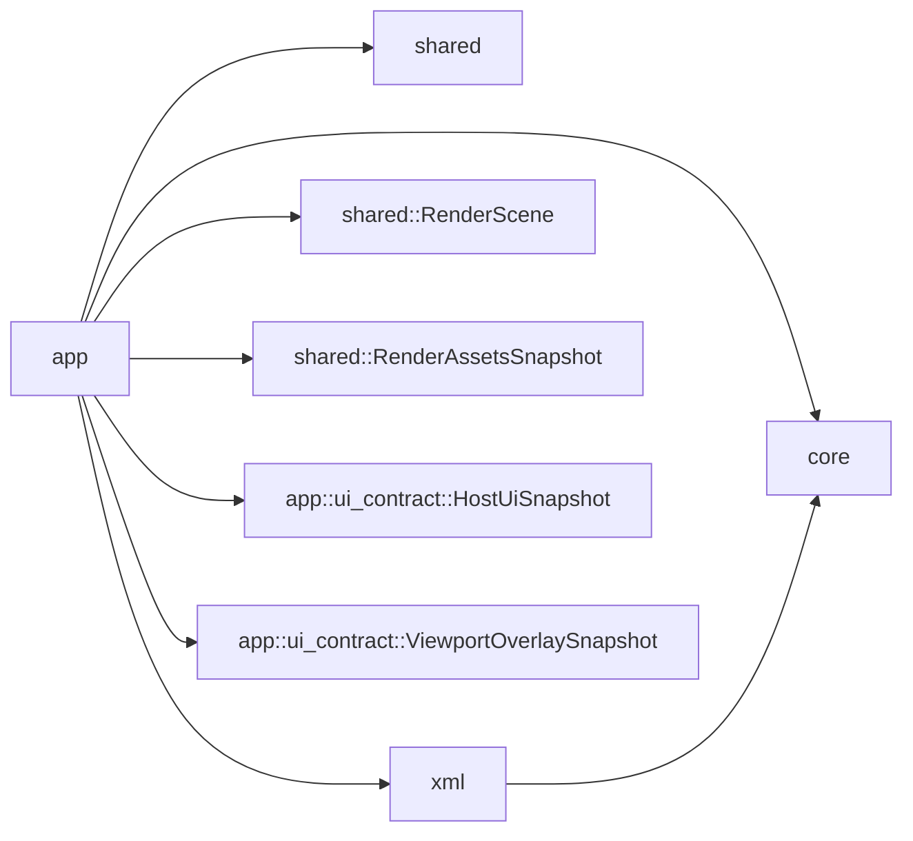

# API der Engine-Crate

## Ueberblick

`fs25_auto_drive_engine` kapselt die host-neutrale Fachlogik des Editors. Die Crate enthaelt Application-, Domain-, Shared- und Persistence-Layer, kennt aber kein `egui`, `eframe` oder anderes Frontend-Toolkit.

Der Application-Layer trennt Mutationen und Read-Projektionen jetzt explizit. `AppController` verarbeitet `AppIntent` und `AppCommand` sowie die kanonische Dialog-Drain-Seam, waehrend `app::projections` `RenderScene`, `RenderAssetsSnapshot`, `HostUiSnapshot` und `ViewportOverlaySnapshot` direkt aus `&AppState` beziehungsweise `&mut AppState` aufbaut. Sichtbare Panels und Viewport-Overlays koennen dadurch host-neutral aus der Engine gelesen werden, ohne Controller-Instanzen oder egui-spezifische Painter-Details nach aussen zu leaken. Datei- und Pfaddialoge laufen bewusst nicht ueber `HostUiSnapshot`, sondern getrennt ueber `AppController::take_dialog_requests(...)`.

Im Route-Tool-UI-Contract des Application-Layers fuehrt das Analyse-Tool `ColorPath` zusaetzlich den Parameter `junction_radius` (Meter). Der Wert wird ueber `ColorPathPanelState.junction_radius` gelesen und per `ColorPathPanelAction::SetJunctionRadius(f32)` (Clamp `0.0..=100.0`) gesetzt; in der Stage-F-Preview-Pipeline steuert er ausschliesslich das radiusbasierte Junction-Trim, waehrend die finale Punktverteilung der `PreparedSegment`s weiterhin `node_spacing` folgt.

`ColorPath` ist seit dem Wizard-Umbau (CP-03..CP-08) als mehrstufiger Wizard modelliert: die Phasen `Idle → Sampling → CenterlinePreview → JunctionEdit → Finalize` liegen als `ColorPathPanelPhase` im UI-Contract und werden ueber `ColorPathPanelAction::NextPhase`/`PrevPhase`/`Accept` geschaltet. `ColorPathPanelState` exponiert dafuer die Wizard-Flags `can_next`, `can_back` und `can_accept`. Die Legacy-Phase `ColorPathPanelPhase::Preview` sowie die Legacy-Actions `ComputePreview` und `BackToSampling` bleiben additiv als `#[deprecated]` erhalten, bis die Host-Migration in CP-11 sie endgueltig entfernt. Das engine-interne Zwischenartefakt `EditableCenterlines` haelt Junction-Positionen und Segment-IDs zwischen Stage E und Stage F und ist nicht Teil der oeffentlichen Crate-API.

Das Root-Package `fs25_auto_drive_editor` re-exportiert die wichtigsten Einstiegspunkte dieser Crate weiter, damit bestehende Tests, Benches und Rust-Konsumenten stabil bleiben.

## Kompatibilitaet (Stand: 2026-04-05)

- Rust-Edition: `2024`
- Parser-/History-Pfade sind auf Edition-2024-Scopes stabilisiert (Match-Ergonomics sowie if-let-/Drop-Reihenfolge in Undo/Redo-Pfaden).

## Oeffentliche Module

| Modul | Verantwortung |
|---|---|
| `app` | `AppController`, `AppState`, Intents, Commands, Handler, Use-Cases und Tool-Vertraege |
| `core` | `RoadMap`, Nodes, Connections, Kamera, Spatial-Index, BackgroundMap, Farmland und Heightmap |
| `shared` | `RenderScene`, `RenderAssetsSnapshot`, `RenderAssetSnapshot`, `RenderBackgroundWorldBounds`, `RenderQuality`, `EditorOptions`, i18n und weitere neutrale DTOs |
| `xml` | AutoDrive- und Curseplay-Import/Export |

## Wichtige oeffentliche Typen

| Typ | Zweck |
|---|---|
| `AppController` | Zentrale Intent-/Command-Verarbeitung und kanonische Dialog-Drain-Seam des Application-Layers |
| `AppState` | Globaler Engine-Zustand fuer Karte, Auswahl, View und Dialoge |
| `EngineUiState` | Engine-seitiger UI-Zustand mit Dialog-Queue, Dateipfaden, Status und Workflow-Flags |
| `AppIntent` | UI-/Host-seitige Absicht als Eingang des Application-Layers |
| `AppCommand` | Interne, featureweise dispatchte Mutationsbefehle |
| `RoadMap` | HashMap-basiertes Strassennetz samt Spatial-Index |
| `RenderScene` | Host-neutraler per-frame Render-Snapshot fuer Frontends und Renderer |
| `RenderAssetsSnapshot` | Host-neutraler Asset-Snapshot fuer langlebige Renderdaten (z. B. Background) |
| `RenderAssetSnapshot` | Einzelnes langlebiges Render-Asset innerhalb des Host-Vertrags |
| `HostUiSnapshot` | Host-neutrales Read-Modell fuer sichtbare Panels |
| `ViewportOverlaySnapshot` | Host-neutrales Read-Modell fuer Tool-, Clipboard-, Distanzen- und Gruppen-Overlays |

## Oeffentliche Funktionen und Re-Exports

| Signatur | Zweck |
|---|---|
| `pub use app::{AppCommand, AppController, AppIntent, AppState};` | Schlanke Root-Fassade fuer Hosts, Tests und Benches |
| `pub fn app::projections::build_render_scene(state: &AppState, viewport_size: [f32; 2]) -> RenderScene` | Baut den per-frame Render-Vertrag als freie host-neutrale Projektion |
| `pub fn app::projections::build_render_assets(state: &AppState) -> RenderAssetsSnapshot` | Baut den langlebigen Asset-Snapshot als freie host-neutrale Projektion |
| `pub fn app::projections::build_host_ui_snapshot(state: &AppState) -> HostUiSnapshot` | Baut den host-neutralen Panel-Snapshot ohne Controller-Instanz |
| `pub fn app::projections::build_viewport_overlay_snapshot(state: &mut AppState, cursor_world: Option<Vec2>) -> ViewportOverlaySnapshot` | Baut den host-neutralen Overlay-Snapshot; `&mut AppState` bleibt fuer Cache-Aufwaermung noetig |
| `pub fn parse_autodrive_config(xml_content: &str) -> Result<RoadMap>` | Liest eine AutoDrive-XML in das Domain-Modell ein |
| `pub fn write_autodrive_config(road_map: &RoadMap, heightmap: Option<&Heightmap>, terrain_height_scale: f32) -> Result<String>` | Schreibt eine `RoadMap` wieder ins AutoDrive-XML-Format |

## Beispiel

```rust
use fs25_auto_drive_engine::{
		parse_autodrive_config, AppController, AppIntent, AppState,
};

let xml = std::fs::read_to_string("AutoDrive_config.xml")?;
let road_map = parse_autodrive_config(&xml)?;

let mut controller = AppController::new();
let mut state = AppState::new();
state.road_map = Some(std::sync::Arc::new(road_map));

controller.handle_intent(&mut state, AppIntent::ResetCameraRequested)?;
let ui_snapshot = fs25_auto_drive_engine::app::projections::build_host_ui_snapshot(&state);
```

## Layer-Zuschnitt



## Weiterfuehrende API-Doku

- Die fachlichen Moduldetails werden kanonisch in den API-Dateien unter `crates/fs25_auto_drive_engine/src/*/API.md` beschrieben.
- Das Root-Package `fs25_auto_drive_editor` bleibt eine duenne Re-Export-Fassade ueber dieser Crate.
