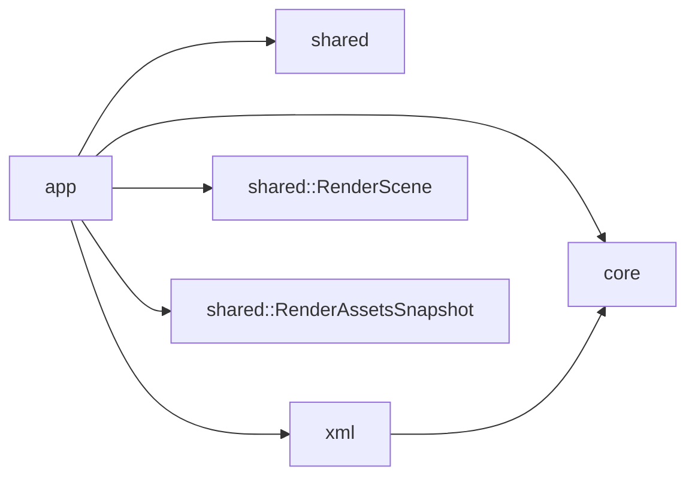

# API der Engine-Crate

## Ueberblick

`fs25_auto_drive_engine` kapselt die host-neutrale Fachlogik des Editors. Die Crate enthaelt Application-, Domain-, Shared- und Persistence-Layer, kennt aber kein `egui`, `eframe` oder anderes Frontend-Toolkit.

Das Root-Package `fs25_auto_drive_editor` re-exportiert die wichtigsten Einstiegspunkte dieser Crate weiter, damit bestehende Tests, Benches und Rust-Konsumenten stabil bleiben.

## Oeffentliche Module

| Modul | Verantwortung |
|---|---|
| `app` | `AppController`, `AppState`, Intents, Commands, Handler, Use-Cases und Tool-Vertraege |
| `core` | `RoadMap`, Nodes, Connections, Kamera, Spatial-Index, BackgroundMap, Farmland und Heightmap |
| `shared` | `RenderScene`, `RenderAssetsSnapshot`, `RenderAssetSnapshot`, `RenderBackgroundWorldBounds`, `RenderQuality`, `EditorOptions`, i18n und weitere neutrale DTOs |
| `xml` | AutoDrive- und Curseplay-Import/Export |

## Wichtige oeffentliche Typen

| Typ | Zweck |
|---|---|
| `AppController` | Zentrale Intent-Verarbeitung sowie Aufbau von `RenderScene` und `RenderAssetsSnapshot` |
| `AppState` | Globaler Engine-Zustand fuer Karte, Auswahl, View und Dialoge |
| `AppIntent` | UI-/Host-seitige Absicht als Eingang des Application-Layers |
| `AppCommand` | Interne, featureweise dispatchte Mutationsbefehle |
| `RoadMap` | HashMap-basiertes Strassennetz samt Spatial-Index |
| `RenderScene` | Host-neutraler per-frame Render-Snapshot fuer Frontends und Renderer |
| `RenderAssetsSnapshot` | Host-neutraler Asset-Snapshot fuer langlebige Renderdaten (z. B. Background) |
| `RenderAssetSnapshot` | Einzelnes langlebiges Render-Asset innerhalb des Host-Vertrags |

## Oeffentliche Funktionen und Re-Exports

| Signatur | Zweck |
|---|---|
| `pub use app::{AppCommand, AppController, AppIntent, AppState};` | Schlanke Root-Fassade fuer Hosts, Tests und Benches |
| `pub fn parse_autodrive_config(xml_content: &str) -> Result<RoadMap>` | Liest eine AutoDrive-XML in das Domain-Modell ein |
| `pub fn write_autodrive_config(road_map: &RoadMap, heightmap: Option<&Heightmap>, terrain_height_scale: f32) -> Result<String>` | Schreibt eine `RoadMap` wieder ins AutoDrive-XML-Format |

## Beispiel

```rust
use fs25_auto_drive_engine::{
		parse_autodrive_config, AppController, AppIntent, AppState,
};

let xml = std::fs::read_to_string("AutoDrive_config.xml")?;
let road_map = parse_autodrive_config(&xml)?;

let mut controller = AppController::new();
let mut state = AppState::new();
state.road_map = Some(std::sync::Arc::new(road_map));

controller.handle_intent(&mut state, AppIntent::ResetCameraRequested)?;
```

## Layer-Zuschnitt



## Weiterfuehrende API-Doku

- Die fachlichen Moduldetails werden kanonisch in den API-Dateien unter `crates/fs25_auto_drive_engine/src/*/API.md` beschrieben.
- Das Root-Package `fs25_auto_drive_editor` bleibt eine duenne Re-Export-Fassade ueber dieser Crate.
