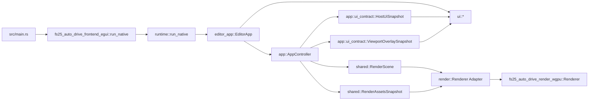

# API der egui-Frontend-Crate

## Ueberblick

`fs25_auto_drive_frontend_egui` kapselt den nativen Desktop-Host des Editors. Die Crate enthaelt die komplette egui-Oberflaeche, die eframe-Integrationsschale, den nativen Launcher und einen duennen render-seitigen Host-Adapter ueber `fs25_auto_drive_render_wgpu`.

Sie konsumiert die host-neutrale Engine, re-exportiert deren `app`-, `core`-, `shared`- und `xml`-Module fuer bestehende Frontend-Pfade und stellt mit `run_native()` den nativen Einstieg bereit.

Die Integrationsschale liest Panels ueber `HostUiSnapshot`, konsumiert Datei-/Pfaddialog-Requests ueber `take_host_dialog_requests(...)` als `HostDialogRequest` und verarbeitet Viewport-Overlays ueber `ViewportOverlaySnapshot`. Dialog-Ergebnisse werden ueber `HostSessionAction::SubmitDialogResult` in dieselbe Host-Bridge-Dispatch-Seam zurueckgefuehrt, waehrend `PanelAction` und Overlay-Klicks zentral in `AppIntent` uebersetzt werden. Die egui-Crate fuehrt dafuer keine zweite Dialog-DTO-Familie ein, sondern nutzt den kanonischen Host-Bridge-Vertrag direkt.

Die gemeinsame Host-Bridge ist in dieser Crate eine gezielte Dispatch-Seam fuer stabile, niederfrequente Host-Aktionen. `editor_app` bleibt die produktive eframe-Integrationsschale: lokale Spezialfaelle bleiben lokal, bridge-faehige Intents laufen ueber `host_bridge_adapter`, hochfrequente Viewport-/Tool-Intents bleiben im Legacy-Fallback ueber `AppController`.

`HostBridgeSession` bleibt dabei verbindlich die kanonische Session-Surface fuer egui und Flutter. Der freie Dialogpfad ueber `take_host_dialog_requests(...)` ist bewusst nur ein enger Adapter-Hilfspfad fuer den aktuellen Konsolidierungsslice des bestehenden `editor_app`-Hosts, keine zweite vollwertige Session-API.

## Kompatibilitaet (Stand: 2026-04-05)

- Rust-Edition: `2024`
- UI-Stack: `eframe/egui/egui-wgpu 0.34.1`
- Render-Seam: kompatibel zum Render-Core auf `wgpu 29.0.*`
- Scroll-Input: rohe Wheel-Impulse werden aus `MouseWheel`-Events aggregiert (statt des entfernten Feldes `raw_scroll_delta`).

## Oeffentliche Module

| Modul | Verantwortung |
|---|---|
| `editor_app` | eframe-Integrationsschale; sammelt Panels ueber `HostUiSnapshot`, drainet Dialoge ueber `take_host_dialog_requests(...)` als `HostDialogRequest` und rendert Overlays aus `ViewportOverlaySnapshot` |
| `host_bridge_adapter` | Duenner egui-Adapter fuer die gemeinsame Host-Bridge (`AppIntent` → `HostSessionAction`) mit Fokus auf stabile, niederfrequente Host-Aktionen |
| `render` | egui-Host-Adapter, revisionsbasierte Background-Upload-Bruecke und egui-Render-Callback |
| `ui` | Menues, Panels, Dialoge, Viewport-Input und egui-spezifisches Painting der host-neutralen Overlay-Snapshots |
| `app`, `core`, `shared`, `xml` | Re-Exports aus `fs25_auto_drive_engine` fuer stabile Importpfade |

## Session-Grenze (Stand 2026-04-05)

- **bridge-owned:** `host_bridge_adapter` fuer stabile, niederfrequente Host-Aktionen, host-neutrale Read-Modelle (`HostUiSnapshot`, `ViewportOverlaySnapshot`, Render-Snapshots) und der Datei-/Pfad-Dialog-Lifecycle ueber `HostDialogRequest`/`HostDialogResult` ohne egui-spezifische Parallel-DTOs.
- **bridge-gap:** Lokale `AppIntent`-zu-`HostSessionAction`-Zuordnung in `host_bridge_adapter` als Doppelpflege zur kanonischen Reverse-Zuordnung in `fs25_auto_drive_host_bridge::dispatch`.
- **host-local:** eframe-Lifecycle, egui-Widget-State, Input-Orchestrierung, Render-Callback und Upload-Glue.
- **Leitplanke:** Keine neuen host-neutralen Fluesse direkt auf `AppController`/`AppState` aufbauen.

## Wichtige oeffentliche Typen

| Typ | Zweck |
|---|---|
| `render::Renderer` | Egui-Host-Adapter fuer den host-neutralen GPU-Renderer-Kern |
| `render::RendererTargetConfig` | Re-exportierte Target-Konfiguration fuer Farbformat und MSAA des Render-Core |
| `render::BackgroundWorldBounds` | Weltkoordinatenvertrag fuer Background-Uploads |
| `render::WgpuRenderCallback` | egui/wgpu-Bruecke fuer den benutzerdefinierten Render-Pass |
| `render::WgpuRenderData` | Trager des `RenderScene`-Snapshots pro Frame |
| `ui::InputState` | Persistenter Viewport-Inputzustand pro Fenster |
| `ui::GroupOverlayEvent` | Rueckkanal fuer Gruppen-Overlay-Interaktionen |
| `app::ui_contract::HostUiSnapshot` | Host-neutraler Panel-Snapshot, den `editor_app` pro Frame konsumiert |
| `app::ui_contract::ViewportOverlaySnapshot` | Host-neutraler Overlay-Snapshot fuer Tool-, Clipboard-, Distanzen- und Gruppen-Overlays |

## Oeffentliche Funktionen und Re-Exports

| Signatur | Zweck |
|---|---|
| `pub fn run_native() -> Result<(), eframe::Error>` | Startet Logger, eframe-Fenster und `EditorApp` |
| `pub fn host_bridge_adapter::map_intent_to_host_action(intent: &AppIntent) -> Option<HostSessionAction>` | Mappt einen explizit unterstuetzten egui-Intent auf die gemeinsame Host-Bridge-Action-Surface |
| `pub fn host_bridge_adapter::apply_mapped_intent(controller: &mut AppController, state: &mut AppState, intent: &AppIntent) -> Result<bool>` | Wendet einen gemappten Intent ueber die gemeinsame Host-Dispatch-Seam direkt auf den produktiven egui-Controller/State an |
| `pub use fs25_auto_drive_engine::{app, core, shared, xml};` | Re-exportiert die host-neutrale Engine-Surface |

## Beispiel

```rust
fn main() -> Result<(), eframe::Error> {
		fs25_auto_drive_frontend_egui::run_native()
}
```

## Integrationsfluss



## Kompatibilitaet

- Das Root-Package re-exportiert `render` und `ui` weiterhin.
- `editor_app` bleibt der produktive Desktop-Flow; `host_bridge_adapter` deckt bewusst nur stabile Host-Aktionen ab und ersetzt keine hochfrequenten Viewport-/Tool-Interaktionen.
- Der Datei-/Pfad-Dialogpfad in egui laeuft ueber die kanonische Host-Dialog-Seam (`take_host_dialog_requests(...)` + `HostSessionAction::SubmitDialogResult`). `take_host_dialog_requests(...)` bleibt dabei ein schmaler Adapter-Hilfspfad fuer den bestehenden egui-Host mit lokalem Controller/State.
- Die kanonischen Moduldetails stehen in `src/editor_app/API.md`, `src/render/API.md` und `src/ui/API.md`.
