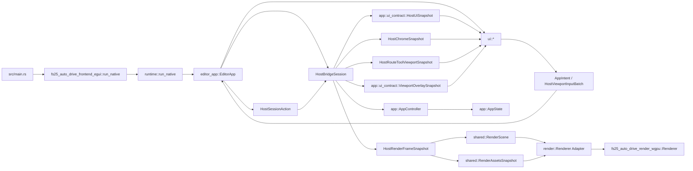

# API der egui-Frontend-Crate

## Ueberblick

`fs25_auto_drive_frontend_egui` kapselt den nativen Desktop-Host des Editors. Die Crate enthaelt die komplette egui-Oberflaeche, die eframe-Integrationsschale, den nativen Launcher und einen duennen render-seitigen Host-Adapter ueber `fs25_auto_drive_render_wgpu`.

Sie konsumiert die host-neutrale Engine, re-exportiert deren `app`-, `core`-, `shared`- und `xml`-Module fuer bestehende Frontend-Pfade und stellt mit `run_native()` den nativen Einstieg bereit.

Der Ownership-Flip ist fuer den Desktop-Host abgeschlossen: `editor_app::EditorApp` besitzt genau eine `HostBridgeSession` als einzige Session-Quelle. Panels, Chrome, Route-Tool-Viewport, Overlays und gekoppelter Render-Frame werden ueber die kanonischen Session-Read-Seams gelesen; Dialog-Anforderungen werden ueber `HostBridgeSession::take_dialog_requests()` gedraint und Ergebnisse ueber `HostSessionAction::SubmitDialogResult` in dieselbe Session-Seam zurueckgefuehrt. Die egui-Crate fuehrt dafuer keine zweite Session- oder Dialog-DTO-Familie ein.

Die gemeinsame Host-Bridge ist in dieser Crate die kanonische Dispatch- und Read-Seam fuer stabile Host-Aktionen und bridge-owned Read-Modelle. Generische Viewport-Gesten laufen als `HostSessionAction::SubmitViewportInput`, waehrend Route-Tool-Schreibpfade explizit als `HostSessionAction::RouteTool` modelliert bleiben. Die UI emittiert weiterhin `AppIntent`s; `editor_app` mappt bridge-faehige Intents zentral auf dieselbe Session-Surface und faellt nur fuer bewusst noch ungemappte, nicht-kanonische Restfaelle auf `HostBridgeSession::apply_intent(...)` zurueck.

Chrome-nahe ViewModels und Panels lesen ihre Metadaten inzwischen konsequent ueber `HostChromeSnapshot`. Modale egui-Dialoge und Popup-States arbeiten fuer host-lokale Sichtbarkeit und transienten Widget-Zustand ueber `HostLocalDialogState` statt ueber mutierende Direktzugriffe auf den Engine-`AppState`.

Das Onscreen-Rendering liest Szene und Assets ueber denselben gekoppelten `build_render_frame(...)`-Seam wie der Shared-Texture-Transportpfad; egui nutzt davon nur die Szene fuer den Paint-Callback und wiederverwendet die Assets im selben Frame fuer den revisionsbasierten Background-Sync.

## Kompatibilitaet (Stand: 2026-04-07)

- Rust-Edition: `2024`
- UI-Stack: `eframe/egui/egui-wgpu 0.34.1`
- Render-Seam: kompatibel zum Render-Core auf `wgpu 29.0.*`
- Scroll-Input: rohe Wheel-Impulse werden aus `MouseWheel`-Events aggregiert (statt des entfernten Feldes `raw_scroll_delta`); diskrete Mausrad-Notches fuer Viewport-Zoom/Alt-Rotation laufen ueber den rohen Eventstrom, waehrend glattes Trackpad-Scroll weiterhin den geglaetteten egui-Pfad nutzt.

## Oeffentliche Module

| Modul | Verantwortung |
|---|---|
| `editor_app` | eframe-Integrationsschale; besitzt die einzige `HostBridgeSession`, liest `HostUiSnapshot`/`HostChromeSnapshot`/`HostRouteToolViewportSnapshot`, drainet Dialoge ueber `HostBridgeSession::take_dialog_requests()`, liest gekoppelte RenderFrames ueber `build_render_frame(...)` und rendert Overlays aus `ViewportOverlaySnapshot` |
| `host_bridge_adapter` | Duenne Kompat-Surface mit Reexports auf die kanonische Host-Bridge-Mapping-Seam (`map_intent_to_host_action`, `apply_mapped_intent`) |
| `render` | egui-Host-Adapter, revisionsbasierte Background-Upload-Bruecke und egui-Render-Callback ueber die von `editor_app` gelieferten RenderFrame-Daten |
| `ui` | Menues, Panels, Dialoge, Viewport-Input und egui-spezifisches Painting der host-neutralen Overlay-Snapshots; Chrome-nahe Menues/Sidebars lesen Route-Tool-/Default-Metadaten ueber `HostChromeSnapshot`, Dialog-Widgets nutzen fuer host-lokale Sichtbarkeit `HostLocalDialogState`, route-tool-spezifische Viewport-Hinweise kommen ueber den von `editor_app` abgeleiteten `HostRouteToolViewportSnapshot`-Pfad |
| `app`, `core`, `shared`, `xml` | Re-Exports aus `fs25_auto_drive_engine` fuer stabile Importpfade |

## Session-Grenze (Stand 2026-04-07)

- **bridge-owned:** `HostBridgeSession`, `HostSessionAction` inklusive `RouteTool`, `HostUiSnapshot`, `HostChromeSnapshot`, `HostRouteToolViewportSnapshot`, `ViewportOverlaySnapshot`, `HostRenderFrameSnapshot`, der stateful Gesture-Pfad ueber `SubmitViewportInput` und der Datei-/Pfad-Dialog-Lifecycle ueber `take_dialog_requests()`/`HostDialogResult` laufen kanonisch ueber `fs25_auto_drive_host_bridge`.
- **bridge-gap:** Fuer stabile Host-Aktionen, bridge-owned Reads und die explizite Route-Tool-Surface aktuell geschlossen; im produktiven egui-Pfad bleiben keine direkten mutablen `AppState`-Bypaesse mehr offen.
- **host-local:** eframe-Lifecycle, egui-Widget-State, rohe Input-Orchestrierung, Render-Callback, Upload-Glue sowie Popup-/Floating-Menu-Positionierung bleiben bewusst host-spezifisch.
- **Leitplanke:** Keine neuen host-neutralen Fluesse direkt auf `AppController`/`AppState` aufbauen.

## Wichtige oeffentliche Typen

| Typ | Zweck |
|---|---|
| `render::Renderer` | Egui-Host-Adapter fuer den host-neutralen GPU-Renderer-Kern |
| `render::RendererTargetConfig` | Re-exportierte Target-Konfiguration fuer Farbformat und MSAA des Render-Core |
| `render::BackgroundWorldBounds` | Weltkoordinatenvertrag fuer Background-Uploads |
| `render::WgpuRenderCallback` | egui/wgpu-Bruecke fuer den benutzerdefinierten Render-Pass |
| `render::WgpuRenderData` | Traeger des `RenderScene`-Teils eines gekoppelten RenderFrames pro Frame |
| `ui::InputState` | Persistenter Viewport-Inputzustand pro Fenster |
| `ui::GroupOverlayEvent` | Rueckkanal fuer Gruppen-Overlay-Interaktionen |
| `app::ui_contract::HostUiSnapshot` | Host-neutraler Panel-Snapshot, den `editor_app` pro Frame konsumiert |
| `app::ui_contract::ViewportOverlaySnapshot` | Host-neutraler Overlay-Snapshot fuer Tool-, Clipboard-, Distanzen- und Gruppen-Overlays |

## Oeffentliche Funktionen und Re-Exports

| Signatur | Zweck |
|---|---|
| `pub fn run_native() -> Result<(), eframe::Error>` | Startet Logger, eframe-Fenster und `EditorApp` |
| `pub fn host_bridge_adapter::map_intent_to_host_action(intent: &AppIntent) -> Option<HostSessionAction>` | Kompat-Reexport auf die kanonische Host-Bridge-Mapping-Seam |
| `pub fn host_bridge_adapter::apply_mapped_intent(controller: &mut AppController, state: &mut AppState, intent: &AppIntent) -> Result<bool>` | Kompat-Reexport auf den kanonischen Bridge-Dispatch fuer stabile Host-Aktionen |
| `pub use fs25_auto_drive_engine::{app, core, shared, xml};` | Re-exportiert die host-neutrale Engine-Surface |

## Beispiel

```rust
fn main() -> Result<(), eframe::Error> {
    fs25_auto_drive_frontend_egui::run_native()
}
```

## Integrationsfluss



## Hinweise

- Das Root-Package re-exportiert `render` und `ui` weiterhin.
- `editor_app` bleibt der produktive Desktop-Flow; `host_bridge_adapter` ist nur noch eine Kompat-Surface ueber der kanonischen Host-Bridge und fuehrt keine lokale Mapping-Logik mehr.
- Der Datei-/Pfad-Dialogpfad in egui laeuft ueber die kanonische Host-Dialog-Seam (`HostBridgeSession::take_dialog_requests()` + `HostSessionAction::SubmitDialogResult`). `take_host_dialog_requests(...)` bleibt nur fuer externe Rust-Hosts mit eigenem `AppController`/`AppState` relevant.
- Route-Tool-Schreibpfade laufen in egui explizit ueber `HostSessionAction::RouteTool`; der generische Viewport-Gesture-Vertrag `SubmitViewportInput` bleibt bewusst tool-agnostisch.
- Der produktive egui-Pfad nutzt keine direkten `app_state_mut()`-Zugriffe mehr; read-only Checks ueber `app_state()` bleiben lokal auf Exit-/Repaint-Entscheidungen sowie einzelne UI-Reads begrenzt.
- Das egui-Onscreen-Rendering laeuft bewusst nicht ueber den Shared-Texture-Transport (`SharedTextureRuntime`); es bleibt auf dem gekoppelten `HostRenderFrameSnapshot`-Seam und verwendet lokal nur den `RenderScene`-Teil fuer den Paint-Callback.
- Die kanonischen Moduldetails stehen in `src/editor_app/API.md`, `src/render/API.md` und `src/ui/API.md`.
