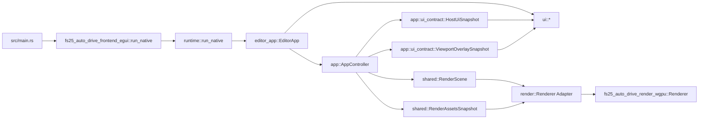

# API der egui-Frontend-Crate

## Ueberblick

`fs25_auto_drive_frontend_egui` kapselt den nativen Desktop-Host des Editors. Die Crate enthaelt die komplette egui-Oberflaeche, die eframe-Integrationsschale, den nativen Launcher und einen duennen render-seitigen Host-Adapter ueber `fs25_auto_drive_render_wgpu`.

Sie konsumiert die host-neutrale Engine, re-exportiert deren `app`-, `core`-, `shared`- und `xml`-Module fuer bestehende Frontend-Pfade und stellt mit `run_native()` den nativen Einstieg bereit.

Die Integrationsschale liest Panels/Dialoge ueber `HostUiSnapshot` und Viewport-Overlays ueber `ViewportOverlaySnapshot`. Egui-spezifisches Rendering und Input-Mapping bleiben damit im Host, waehrend `PanelAction`, `DialogResult` und Overlay-Klicks zentral wieder in `AppIntent` uebersetzt werden.

## Oeffentliche Module

| Modul | Verantwortung |
|---|---|
| `editor_app` | eframe-Integrationsschale; sammelt Panels/Dialoge ueber `HostUiSnapshot`, rendert Overlays aus `ViewportOverlaySnapshot` und haelt Laufzeittypen wie `EditorApp` crate-intern |
| `render` | egui-Host-Adapter, revisionsbasierte Background-Upload-Bruecke und egui-Render-Callback |
| `ui` | Menues, Panels, Dialoge, Viewport-Input und egui-spezifisches Painting der host-neutralen Overlay-Snapshots |
| `app`, `core`, `shared`, `xml` | Re-Exports aus `fs25_auto_drive_engine` fuer stabile Importpfade |

## Wichtige oeffentliche Typen

| Typ | Zweck |
|---|---|
| `render::Renderer` | Egui-Host-Adapter fuer den host-neutralen GPU-Renderer-Kern |
| `render::RendererTargetConfig` | Re-exportierte Target-Konfiguration fuer Farbformat und MSAA des Render-Core |
| `render::BackgroundWorldBounds` | Weltkoordinatenvertrag fuer Background-Uploads |
| `render::WgpuRenderCallback` | egui/wgpu-Bruecke fuer den benutzerdefinierten Render-Pass |
| `render::WgpuRenderData` | Trager des `RenderScene`-Snapshots pro Frame |
| `ui::InputState` | Persistenter Viewport-Inputzustand pro Fenster |
| `ui::GroupOverlayEvent` | Rueckkanal fuer Gruppen-Overlay-Interaktionen |
| `app::ui_contract::HostUiSnapshot` | Host-neutraler Panel-/Dialog-Snapshot, den `editor_app` pro Frame konsumiert |
| `app::ui_contract::ViewportOverlaySnapshot` | Host-neutraler Overlay-Snapshot fuer Tool-, Clipboard-, Distanzen- und Gruppen-Overlays |

## Oeffentliche Funktionen und Re-Exports

| Signatur | Zweck |
|---|---|
| `pub fn run_native() -> Result<(), eframe::Error>` | Startet Logger, eframe-Fenster und `EditorApp` |
| `pub use fs25_auto_drive_engine::{app, core, shared, xml};` | Re-exportiert die host-neutrale Engine-Surface |

## Beispiel

```rust
fn main() -> Result<(), eframe::Error> {
		fs25_auto_drive_frontend_egui::run_native()
}
```

## Integrationsfluss



## Kompatibilitaet

- Das Root-Package re-exportiert `render` und `ui` weiterhin.
- Die kanonischen Moduldetails stehen in `src/editor_app/API.md`, `src/render/API.md` und `src/ui/API.md`.
