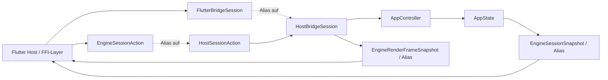

# API der Flutter-Bridge-Crate

## Ueberblick

`fs25_auto_drive_frontend_flutter_bridge` ist die Flutter-nahe Kompatibilitaets-Crate ueber `fs25_auto_drive_host_bridge`. Sie haengt nur noch von der gemeinsamen Host-Bridge ab und exportiert die bisherigen `Engine*`-Namen als Alias-Surface weiter, damit bestehende Rust- oder FFI-Call-Sites waehrend der Unified-Bridge-Migration stabil bleiben.

Eigene Session-, Controller- oder DTO-Logik enthaelt die Crate bewusst nicht mehr. Die kanonische Semantik lebt in `fs25_auto_drive_host_bridge`; diese Crate stabilisiert nur Namen und Paketgrenze fuer einen spaeteren Flutter-Transport-Layer.

## Architekturentscheidung (2026-04-05)

`fs25_auto_drive_frontend_flutter_bridge` ist als **uebergangsweise Alias-/Kompat-Surface eingefroren**.

- Keine neue Logik in dieser Crate aufbauen.
- Neue Session-/Dispatch-/DTO-Erweiterungen ausschliesslich in `fs25_auto_drive_host_bridge` umsetzen.
- Diese Crate darf nur stabile Alias-Namen und Kompat-Re-Exports enthalten.

Geplanter spaeterer Entfernungszeitpunkt (nicht Teil dieses Follow-ups):

1. Es existieren keine internen Rust-Consumer mehr, die die `Engine*`-/`Flutter*`-Aliasnamen benoetigen.
2. Externe Flutter-/FFI-Consumer sind migriert oder explizit als Breaking Change kommuniziert.
3. `ARCHITECTURE_PLAN`, `DATA_MODEL`, `ROADMAP` und betroffene `API.md`-Dateien sind fuer die Entfernung synchronisiert.

## Oeffentliche Module

| Modul | Verantwortung |
|---|---|
| `session` | Alias-Surface fuer `FlutterBridgeSession` und `EngineRenderFrameSnapshot` ueber der kanonischen Host-Bridge |
| `dto` | Alias-Surface fuer die bestehenden `Engine*`-DTO-Namen ueber den `Host*`-Vertraegen |

## Wichtige oeffentliche Typen

| Typ | Alias auf | Zweck |
|---|---|---|
| `FlutterBridgeSession` | `HostBridgeSession` | Bestehender Flutter-Name fuer die kanonische Session-Fassade |
| `EngineRenderFrameSnapshot` | `HostRenderFrameSnapshot` | Gekoppelter Render-Snapshot (`RenderScene` + `RenderAssetsSnapshot`) |
| `EngineSessionAction` | `HostSessionAction` | Expliziter Action-Vertrag fuer Host-seitige Mutationen |
| `EngineSessionSnapshot` | `HostSessionSnapshot` | Serialisierbare Zustandszusammenfassung fuer Polling-Hosts |
| `EngineSelectionSnapshot` | `HostSelectionSnapshot` | Serialisierbare Auswahl als Liste selektierter Node-IDs |
| `EngineViewportSnapshot` | `HostViewportSnapshot` | Serialisierte Kameraposition und Zoomstufe |
| `EngineDialogRequestKind` / `EngineDialogRequest` / `EngineDialogResult` | `HostDialogRequestKind` / `HostDialogRequest` / `HostDialogResult` | Semantische Host-Dialoganforderungen und Rueckmeldungen |
| `EngineActiveTool` | `HostActiveTool` | Stabiler Tool-Identifier fuer Snapshot- und Action-Vertrag |

## Oeffentliche Methoden

Die Session-API ist identisch zur kanonischen Host-Bridge; sichtbar bleiben jedoch die bisherigen Flutter-Namen.

| Signatur | Zweck |
|---|---|
| `pub fn new() -> Self` | Erstellt eine leere Bridge-Session |
| `pub fn apply_action(&mut self, action: EngineSessionAction) -> Result<()>` | Wendet eine explizite Bridge-Action auf die Session an |
| `pub fn toggle_command_palette(&mut self) -> Result<()>` | Komfort-Action zum Umschalten der Command-Palette |
| `pub fn set_editor_tool(&mut self, tool: EngineActiveTool) -> Result<()>` | Komfort-Action zum Setzen des aktiven Editor-Tools |
| `pub fn set_options_dialog_visible(&mut self, visible: bool) -> Result<()>` | Oeffnet oder schliesst den Optionen-Dialog explizit |
| `pub fn undo(&mut self) -> Result<()>` | Fuehrt einen Undo-Schritt ueber die explizite Action-Surface aus |
| `pub fn redo(&mut self) -> Result<()>` | Fuehrt einen Redo-Schritt ueber die explizite Action-Surface aus |
| `pub fn take_dialog_requests(&mut self) -> Vec<EngineDialogRequest>` | Entnimmt ausstehende Host-Dialog-Anforderungen ohne direkten State-Zugriff |
| `pub fn submit_dialog_result(&mut self, result: EngineDialogResult) -> Result<()>` | Gibt ein host-seitiges Dialog-Ergebnis semantisch an die Engine zurueck |
| `pub fn snapshot(&mut self) -> &EngineSessionSnapshot` | Liefert einen gecachten Referenz-Snapshot fuer allokationsarmes Polling |
| `pub fn snapshot_owned(&mut self) -> EngineSessionSnapshot` | Liefert eine besitzende Snapshot-Kopie fuer entkoppelte Verarbeitung |
| `pub fn build_render_scene(&self, viewport_size: [f32; 2]) -> RenderScene` | Liefert den per-frame Render-Vertrag fuer den angegebenen Viewport |
| `pub fn build_render_assets(&self) -> RenderAssetsSnapshot` | Liefert den expliziten Asset-Snapshot inklusive Revisionen |
| `pub fn build_render_frame(&self, viewport_size: [f32; 2]) -> EngineRenderFrameSnapshot` | Liefert Szene und Assets als gekoppelten read-only Render-Snapshot |

## Beispiel

```rust
use fs25_auto_drive_frontend_flutter_bridge::{EngineSessionAction, FlutterBridgeSession};

let mut session = FlutterBridgeSession::new();
session.apply_action(EngineSessionAction::ToggleCommandPalette)?;
session.undo()?;

let snapshot = session.snapshot();
let frame = session.build_render_frame([1280.0, 720.0]);

assert!(snapshot.show_command_palette);
assert!(!snapshot.can_redo);
assert_eq!(frame.scene.viewport_size(), [1280.0, 720.0]);
assert_eq!(frame.assets.background_asset_revision(), 0);
```

## Datenfluss



## Scope-Cut

- Diese Crate enthaelt keine eigene Session-, Controller- oder DTO-Logik mehr.
- Die bisherigen `Engine*`-Namen bleiben als reine Kompatibilitaets-Aliase ueber den `Host*`-Vertraegen erhalten.
- Host-native Datei-/Pfad-Dialoge laufen ueber `take_dialog_requests()` und `submit_dialog_result(...)`.
- Generischer `AppIntent`-Dispatch, direkter `AppState`-Zugriff und Engine-spezifische Escape-Hatches bleiben ausserhalb der oeffentlichen Flutter-Bridge-API.
- Transport, Method-Channel, `flutter_rust_bridge` oder andere SDK-Details folgen spaeter.
