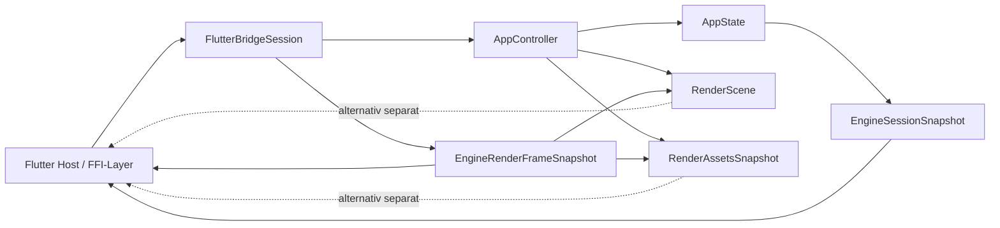

# API der Flutter-Bridge-Crate

## Ueberblick

`fs25_auto_drive_frontend_flutter_bridge` definiert die kleine Rust-seitige Andockstelle fuer ein spaeteres Flutter-Frontend. Die Crate haengt nur von `fs25_auto_drive_engine` ab und erzwingt bewusst noch kein FFI-, Method-Channel- oder Flutter-SDK.

Sie bleibt absichtlich klein: Ziel ist eine stabile Session- und DTO-Seam, an die ein spaeteres Host- oder Transport-Layer andocken kann, ohne die Engine an ein bestimmtes Frontend-Toolkit zu koppeln.

## Oeffentliche Module

| Modul | Verantwortung |
|---|---|
| `session` | `FlutterBridgeSession` als Rust-seitige Session-Fassade ueber `AppController` und `AppState` |
| `dto` | Serialisierbare Snapshots fuer Auswahl, Viewport und Session-Zusammenfassung |

## Wichtige oeffentliche Typen

| Typ | Zweck |
|---|---|
| `FlutterBridgeSession` | Host-nahe Session-Fassade mit expliziten Actions, Session-Snapshot und Render-Zugriff |
| `EngineRenderFrameSnapshot` | Gekoppelter Render-Snapshot (`RenderScene` + `RenderAssetsSnapshot`) |
| `EngineActiveTool` | Stabiler Tool-Identifier fuer `EngineSessionSnapshot.active_tool` |
| `EngineDialogRequestKind` | Stabile semantische Art einer Dialog-Anforderung |
| `EngineDialogRequest` | Serialisierbare Host-Dialog-Anforderung inklusive Save-Dateinamenvorschlag |
| `EngineDialogResult` | Serialisierbare Host-Rueckmeldung zu einer Dialog-Anforderung |
| `EngineSessionAction` | Expliziter Action-Vertrag fuer Host-seitige Mutationen |
| `EngineSessionSnapshot` | Serialisierbare Zustandszusammenfassung inkl. Undo/Redo-Verfuegbarkeit und Anzahl ausstehender Dialoge |
| `EngineSelectionSnapshot` | Serialisierbare Auswahl als Liste selektierter Node-IDs |
| `EngineViewportSnapshot` | Serialisierte Kameraposition und Zoomstufe |

## Oeffentliche Methoden

| Signatur | Zweck |
|---|---|
| `pub fn new() -> Self` | Erstellt eine leere Bridge-Session mit neuem `AppController` und `AppState` |
| `pub fn apply_action(&mut self, action: EngineSessionAction) -> Result<()>` | Wendet eine explizite Bridge-Action auf die Session an |
| `pub fn toggle_command_palette(&mut self) -> Result<()>` | Komfort-Action zum Umschalten der Command-Palette |
| `pub fn set_editor_tool(&mut self, tool: EngineActiveTool) -> Result<()>` | Komfort-Action zum Setzen des aktiven Editor-Tools |
| `pub fn set_options_dialog_visible(&mut self, visible: bool) -> Result<()>` | Oeffnet/schliesst den Optionen-Dialog explizit |
| `pub fn undo(&mut self) -> Result<()>` | Fuehrt einen Undo-Schritt ueber die explizite Action-Surface aus |
| `pub fn redo(&mut self) -> Result<()>` | Fuehrt einen Redo-Schritt ueber die explizite Action-Surface aus |
| `pub fn take_dialog_requests(&mut self) -> Vec<EngineDialogRequest>` | Entnimmt ausstehende Host-Dialog-Anforderungen ohne direkten State-Zugriff |
| `pub fn submit_dialog_result(&mut self, result: EngineDialogResult) -> Result<()>` | Gibt ein host-seitiges Dialog-Ergebnis semantisch an die Engine zurueck |
| `pub fn snapshot(&mut self) -> &EngineSessionSnapshot` | Liefert einen gecachten Referenz-Snapshot fuer allokationsarmes Polling |
| `pub fn snapshot_owned(&mut self) -> EngineSessionSnapshot` | Liefert eine besitzende Snapshot-Kopie fuer entkoppelte Verarbeitung |
| `pub fn build_render_scene(&self, viewport_size: [f32; 2]) -> RenderScene` | Liefert den per-frame Render-Vertrag fuer den angegebenen Viewport |
| `pub fn build_render_assets(&self) -> RenderAssetsSnapshot` | Liefert den expliziten Asset-Snapshot inklusive Revisionen |
| `pub fn build_render_frame(&self, viewport_size: [f32; 2]) -> EngineRenderFrameSnapshot` | Liefert Szene und Assets als gekoppelten read-only Render-Snapshot |

## Beispiel

```rust
use fs25_auto_drive_frontend_flutter_bridge::{
	EngineSessionAction, FlutterBridgeSession,
};

let mut session = FlutterBridgeSession::new();
session.apply_action(EngineSessionAction::ToggleCommandPalette)?;
session.undo()?;

let snapshot = session.snapshot();
let frame = session.build_render_frame([1280.0, 720.0]);

assert!(snapshot.show_command_palette);
assert!(!snapshot.can_redo);
assert_eq!(frame.scene.viewport_size(), [1280.0, 720.0]);
assert_eq!(frame.assets.background_asset_revision(), 0);
```

## Datenfluss



## Scope-Cut

- Diese Crate stellt Rust-seitige Session- und Render-Seams bereit.
- Undo/Redo und Dialog-Rueckmeldungen laufen ueber explizite Bridge-Aktionen statt rohem Intent-Dispatch.
- Host-native Datei-/Pfad-Dialoge laufen ueber `take_dialog_requests()` und `submit_dialog_result(...)`.
- Die Bridge exponiert absichtlich keine generische `AppIntent`-Dispatch- oder `AppState`-Escape-Hatch-Surface.
- Transport, Method-Channel, `flutter_rust_bridge` oder andere SDK-Details folgen spaeter.
