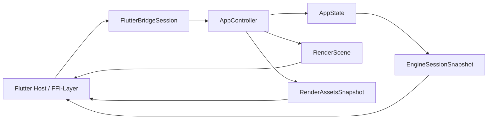

# API der Flutter-Bridge-Crate

## Ueberblick

`fs25_auto_drive_frontend_flutter_bridge` definiert die kleine Rust-seitige Andockstelle fuer ein spaeteres Flutter-Frontend. Die Crate haengt nur von `fs25_auto_drive_engine` ab und erzwingt bewusst noch kein FFI-, Method-Channel- oder Flutter-SDK.

Sie bleibt absichtlich klein: Ziel ist eine stabile Session- und DTO-Seam, an die ein spaeteres Host- oder Transport-Layer andocken kann, ohne die Engine an ein bestimmtes Frontend-Toolkit zu koppeln.

## Oeffentliche Module

| Modul | Verantwortung |
|---|---|
| `session` | `FlutterBridgeSession` als Rust-seitige Session-Fassade ueber `AppController` und `AppState` |
| `dto` | Serialisierbare Snapshots fuer Auswahl, Viewport und Session-Zusammenfassung |

## Wichtige oeffentliche Typen

| Typ | Zweck |
|---|---|
| `FlutterBridgeSession` | Host-nahe Session-Fassade mit Intent-Dispatch, Session-Snapshot und Render-Zugriff |
| `EngineRenderFrameSnapshot` | Gekoppelter Render-Snapshot (`RenderScene` + `RenderAssetsSnapshot`) |
| `EngineActiveTool` | Stabiler Tool-Identifier fuer `EngineSessionSnapshot.active_tool` |
| `EngineSessionSnapshot` | Serialisierbare Zustandszusammenfassung fuer Hosts |
| `EngineSelectionSnapshot` | Serialisierbare Auswahl als Liste selektierter Node-IDs |
| `EngineViewportSnapshot` | Serialisierte Kameraposition und Zoomstufe |

## Oeffentliche Methoden

| Signatur | Zweck |
|---|---|
| `pub fn new() -> Self` | Erstellt eine leere Bridge-Session mit neuem `AppController` und `AppState` |
| `pub fn dispatch(&mut self, intent: AppIntent) -> Result<()>` | Wendet einen bestehenden Engine-Intent auf die Session an |
| `pub fn snapshot(&mut self) -> &EngineSessionSnapshot` | Liefert einen gecachten Referenz-Snapshot fuer allokationsarmes Polling |
| `pub fn snapshot_owned(&mut self) -> EngineSessionSnapshot` | Liefert eine besitzende Snapshot-Kopie fuer entkoppelte Verarbeitung |
| `pub fn build_render_scene(&self, viewport_size: [f32; 2]) -> RenderScene` | Liefert den per-frame Render-Vertrag fuer den angegebenen Viewport |
| `pub fn build_render_assets(&self) -> RenderAssetsSnapshot` | Liefert den expliziten Asset-Snapshot inklusive Revisionen |
| `pub fn build_render_frame(&self, viewport_size: [f32; 2]) -> EngineRenderFrameSnapshot` | Liefert Szene und Assets als gekoppelten read-only Render-Snapshot |
| `pub fn state(&self) -> &AppState` | Read-only Escape-Hatch; bevorzugt sollten Snapshot-Methoden genutzt werden |

## Beispiel

```rust
use fs25_auto_drive_engine::app::AppIntent;
use fs25_auto_drive_frontend_flutter_bridge::FlutterBridgeSession;

let mut session = FlutterBridgeSession::new();
session.dispatch(AppIntent::CommandPaletteToggled)?;

let snapshot = session.snapshot();
assert!(snapshot.show_command_palette);
```

## Datenfluss



## Scope-Cut

- Diese Crate stellt Rust-seitige Session- und Render-Seams bereit.
- Transport, Method-Channel, `flutter_rust_bridge` oder andere SDK-Details folgen spaeter.
