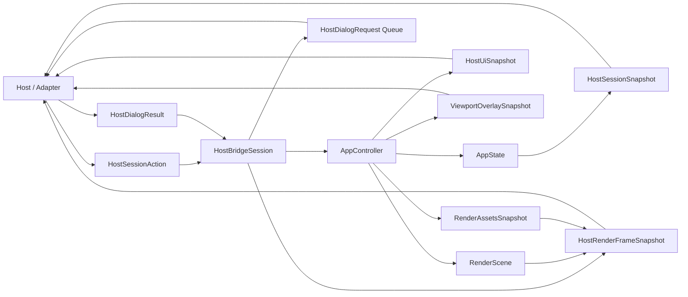

# API der Host-Bridge-Core-Crate

## Ueberblick

`fs25_auto_drive_host_bridge` ist die kanonische, toolkit-freie Host-Bridge ueber `fs25_auto_drive_engine`. Die Crate kapselt `AppController` und `AppState` in `HostBridgeSession` und buendelt damit die gemeinsame Session-Surface fuer mehrere Hosts wie egui, Flutter oder spaetere FFI-/Transport-Adapter.

`HostBridgeSession` ist verbindlich die kanonische Session-Surface fuer egui und Flutter. Host-spezifische Adapter duerfen neue host-neutrale Session-Seams nicht mehr direkt auf `AppController`/`AppState` aufbauen, sondern ausschliesslich ueber diese Bridge-Surface.

Fuer bestehende Flutter-/FFI-Call-Sites stellt die Crate die bisherigen `Engine*`-Typnamen und den Session-Namen `FlutterBridgeSession` direkt als Kompatibilitaets-Aliase bereit. Damit koennen externe Consumer direkt auf `fs25_auto_drive_host_bridge` wechseln, ohne im selben Schritt alle Symbolnamen umzubenennen.

Die Bridge exponiert Mutationen ausschliesslich ueber explizite `HostSessionAction`-DTOs. Die Action-Surface deckt stabile, niederfrequente Host-Aktionen ab (Datei-/Dialog-Anforderungen, Kamera-/Viewport-Shortcuts, Historie, Optionen, Toolwechsel, Exit), nicht jedoch hochfrequente Viewport- oder Tool-Drag-Interaktionen. Fuer read-only Hosts liefert sie kleine Session-Snapshots, host-neutrale Panel-Read-Modelle, Viewport-Overlay-Snapshots sowie gekoppelten Render-Output aus `RenderScene` und `RenderAssetsSnapshot`.

Die Crate bleibt absichtlich host-neutral: keine eframe/egui-Runtime, keine Flutter-FFI und keine wgpu-RenderPass-Lifecycle-Logik.

Die konsolidierte Host-Dialog-Seam bildet die interne Engine-Queue `DialogRequest`/`DialogResult` verlustfrei auf die host-stabilen DTOs `HostDialogRequest`/`HostDialogResult` ab. Hosts mit eigener Session nutzen dafuer `HostBridgeSession::take_dialog_requests()` und `submit_dialog_result(...)`; Hosts mit eigenem `AppController`/`AppState` verwenden dieselbe Mapping-Logik ueber `take_host_dialog_requests(...)` plus `HostSessionAction::SubmitDialogResult`.

`take_host_dialog_requests(...)` ist dabei bewusst keine zweite Session-API, sondern ein enger Adapter-Hilfspfad fuer den aktuellen Konsolidierungsslice: Er ueberbrueckt bestehende Host-Integrationen mit lokalem Controller/State, waehrend `HostBridgeSession` die kanonische Session-Surface und Zielrichtung bleibt.

## Session-Grenze (Stand 2026-04-05)

- **bridge-owned:** Explizite Action-/Snapshot-Seams (`HostSessionAction`, `HostSessionSnapshot`, `HostUiSnapshot`, `ViewportOverlaySnapshot`, Render-Read-Seams) und beide Mapping-Richtungen (`AppIntent` <-> `HostSessionAction`) sind zentral in der Host-Bridge verfuegbar.
- **bridge-gap:** Host-Adapter koennen in Uebergangsphasen noch lokale Integrationslogik parallel zur kanonischen Bridge-Dispatch-Seam pflegen.
- **host-local:** eframe-/egui- und Render-Glue bleiben bewusst ausserhalb der Bridge.

## Oeffentliche Module

| Modul | Verantwortung |
|---|---|
| `dispatch` | Wiederverwendbare Rust-Host-Dispatch-Seam (`HostSessionAction` <-> `AppIntent`) und bridge-owned Read-Helper-Seams fuer lokale Controller/State-Hosts |
| `session` | `HostBridgeSession` als kanonische Session-Fassade ueber der Engine |
| `dto` | Serialisierbare Host-Actions, Dialog-DTOs, Session-Snapshots plus `Engine*`-Kompatibilitaets-Aliase |

## Oeffentliche Dispatch-Funktionen

| Signatur | Zweck |
|---|---|
| `pub fn map_intent_to_host_action(intent: &AppIntent) -> Option<HostSessionAction>` | Uebersetzt einen stabilen Engine-Intent in eine explizite Host-Action |
| `pub fn map_host_action_to_intent(action: HostSessionAction) -> Option<AppIntent>` | Uebersetzt eine Host-Action in einen stabilen Engine-Intent |
| `pub fn apply_mapped_intent(controller: &mut AppController, state: &mut AppState, intent: &AppIntent) -> Result<bool>` | Wendet einen stabil gemappten Intent direkt ueber die gemeinsame Host-Seam an |
| `pub fn apply_host_action(controller: &mut AppController, state: &mut AppState, action: HostSessionAction) -> Result<bool>` | Wendet die gemeinsame Dispatch-Seam direkt auf einen bestehenden Rust-Host-State an |
| `pub fn take_host_dialog_requests(controller: &AppController, state: &mut AppState) -> Vec<HostDialogRequest>` | Enger Adapter-Hilfspfad fuer Hosts mit lokalem Controller/State; entnimmt ausstehende Dialog-Anforderungen und mappt sie auf den kanonischen Host-Dialog-DTO-Vertrag |
| `pub fn build_host_ui_snapshot(controller: &AppController, state: &AppState) -> HostUiSnapshot` | Baut den host-neutralen Panel-Snapshot fuer Hosts mit lokalem Controller/State |
| `pub fn build_viewport_overlay_snapshot(controller: &AppController, state: &mut AppState, cursor_world: Option<Vec2>) -> ViewportOverlaySnapshot` | Baut den host-neutralen Overlay-Snapshot fuer lokale Host-Adapter |
| `pub fn build_render_scene(controller: &AppController, state: &AppState, viewport_size: [f32; 2]) -> RenderScene` | Baut den per-frame Render-Vertrag fuer lokale Host-Adapter |
| `pub fn build_render_assets(controller: &AppController, state: &AppState) -> RenderAssetsSnapshot` | Baut den langlebigen Render-Asset-Snapshot fuer lokale Host-Adapter |

## Wichtige oeffentliche Typen

| Typ | Zweck |
|---|---|
| `HostBridgeSession` | Toolkit-freie Session-Fassade mit expliziten Mutationen und Read-Snapshots |
| `FlutterBridgeSession` | Kompatibilitaetsalias auf `HostBridgeSession` |
| `HostRenderFrameSnapshot` | Gekoppelter Render-Snapshot (`RenderScene` + `RenderAssetsSnapshot`) |
| `EngineRenderFrameSnapshot` | Kompatibilitaetsalias auf `HostRenderFrameSnapshot` |
| `HostSessionAction` | Kanonische Mutationsoberflaeche fuer Host-seitige Eingriffe |
| `EngineSessionAction` | Kompatibilitaetsalias auf `HostSessionAction` |
| `HostSessionSnapshot` | Kleine serialisierbare Session-Zusammenfassung fuer Polling-Hosts |
| `EngineSessionSnapshot` | Kompatibilitaetsalias auf `HostSessionSnapshot` |
| `HostSelectionSnapshot` / `HostViewportSnapshot` | Read-only Detail-Snapshots fuer Auswahl und Kamera |
| `EngineSelectionSnapshot` / `EngineViewportSnapshot` | Kompatibilitaets-Aliase auf die kanonischen Host-Snapshots |
| `HostDialogRequestKind` / `HostDialogRequest` / `HostDialogResult` | Semantische Host-Dialoganforderungen und Rueckmeldungen |
| `EngineDialogRequestKind` / `EngineDialogRequest` / `EngineDialogResult` | Kompatibilitaets-Aliase auf den kanonischen Host-Dialog-Vertrag |
| `HostActiveTool` | Stabiler Tool-Identifier fuer Snapshot- und Action-Vertrag |
| `EngineActiveTool` | Kompatibilitaetsalias auf `HostActiveTool` |
| `HostUiSnapshot` / `ViewportOverlaySnapshot` | Host-neutrale Read-Modelle fuer Panels bzw. Viewport-Overlays, am Crate-Root re-exportiert |

## Oeffentliche Methoden

| Signatur | Zweck |
|---|---|
| `pub fn new() -> Self` | Erstellt eine neue Bridge-Session mit leerem Engine-State |
| `pub fn apply_action(&mut self, action: HostSessionAction) -> Result<()>` | Wendet eine explizite Host-Aktion an |
| `pub fn toggle_command_palette(&mut self) -> Result<()>` | Komfort-Action fuer die Command-Palette |
| `pub fn set_editor_tool(&mut self, tool: HostActiveTool) -> Result<()>` | Komfort-Action fuer den Toolwechsel |
| `pub fn set_options_dialog_visible(&mut self, visible: bool) -> Result<()>` | Oeffnet oder schliesst den Optionen-Dialog explizit |
| `pub fn undo(&mut self) -> Result<()>` | Fuehrt Undo ueber die Action-Surface aus |
| `pub fn redo(&mut self) -> Result<()>` | Fuehrt Redo ueber die Action-Surface aus |
| `pub fn take_dialog_requests(&mut self) -> Vec<HostDialogRequest>` | Entnimmt ausstehende semantische Dialoganforderungen aus der Session |
| `pub fn submit_dialog_result(&mut self, result: HostDialogResult) -> Result<()>` | Gibt ein Host-Dialogergebnis semantisch an die Engine zurueck |
| `pub fn snapshot(&mut self) -> &HostSessionSnapshot` | Liefert den gecachten Session-Snapshot fuer allokationsarmes Polling |
| `pub fn snapshot_owned(&mut self) -> HostSessionSnapshot` | Liefert den Snapshot als besitzende Kopie |
| `pub fn build_render_scene(&self, viewport_size: [f32; 2]) -> RenderScene` | Liefert den per-frame Render-Vertrag |
| `pub fn build_render_assets(&self) -> RenderAssetsSnapshot` | Liefert den langlebigen Asset-Snapshot |
| `pub fn build_render_frame(&self, viewport_size: [f32; 2]) -> HostRenderFrameSnapshot` | Liefert Szene und Assets als gekoppelten read-only Render-Output |
| `pub fn build_host_ui_snapshot(&self) -> HostUiSnapshot` | Liefert host-neutrale Paneldaten |
| `pub fn build_viewport_overlay_snapshot(&mut self, cursor_world: Option<Vec2>) -> ViewportOverlaySnapshot` | Liefert host-neutrale Viewport-Overlay-Daten; `&mut self` bleibt absichtlich noetig, weil der App-Layer dabei Overlay- und Boundary-Caches aufwaermt |

## Beispiel

```rust
use fs25_auto_drive_host_bridge::{HostBridgeSession, HostSessionAction};

let mut session = HostBridgeSession::new();
session.apply_action(HostSessionAction::ToggleCommandPalette)?;

let snapshot = session.snapshot();
let frame = session.build_render_frame([1280.0, 720.0]);

assert!(snapshot.show_command_palette);
assert_eq!(frame.scene.viewport_size(), [1280.0, 720.0]);
```

## Datenfluss



## Kompatibilitaets-Aliase

`fs25_auto_drive_host_bridge` bietet die Legacy-Namen fuer direkte Consumer-Migration:

| Aliasname | Kanonischer Typ |
|---|---|
| `FlutterBridgeSession` | `HostBridgeSession` |
| `EngineRenderFrameSnapshot` | `HostRenderFrameSnapshot` |
| `EngineSessionAction` | `HostSessionAction` |
| `EngineSessionSnapshot` | `HostSessionSnapshot` |
| `EngineSelectionSnapshot` | `HostSelectionSnapshot` |
| `EngineViewportSnapshot` | `HostViewportSnapshot` |
| `EngineDialogRequestKind` / `EngineDialogRequest` / `EngineDialogResult` | `HostDialogRequestKind` / `HostDialogRequest` / `HostDialogResult` |
| `EngineActiveTool` | `HostActiveTool` |

## Hinweise

- `snapshot()` arbeitet ueber einen Dirty-Cache und baut `HostSessionSnapshot` nur nach erfolgreichen Mutationen oder entnommenen Dialog-Requests neu auf.
- `HostBridgeSession::apply_action(...)` delegiert intern an dieselbe `dispatch`-Seam, die auch nicht-Session-basierte Rust-Hosts nutzen koennen.
- `take_dialog_requests()` und `submit_dialog_result(...)` bilden die kanonische Dialog-Seam der Session-API. Fuer Adapter mit eigenem `AppController`/`AppState` steht dieselbe Mapping-Logik zusaetzlich ueber `take_host_dialog_requests(...)` als schmaler Adapter-Hilfspfad bereit.
- Die Mapping-Seam fuer stabile, niederfrequente Host-Aktionen liegt zentral in `dispatch` (`map_intent_to_host_action`, `map_host_action_to_intent`, `apply_mapped_intent`, `apply_host_action`).
- Die bridge-owned Read-Seams fuer lokale Controller/State-Hosts sind zentral in `dispatch` verfuegbar (`build_host_ui_snapshot`, `build_viewport_overlay_snapshot`, `build_render_scene`, `build_render_assets`).
- Host-Adapter mit eigenem `AppController`/`AppState` koennen den Datei-/Pfad-Dialogpfad ueber `take_host_dialog_requests(...)` und `HostSessionAction::SubmitDialogResult` auf denselben Bridge-DTO-/Dispatch-Vertrag konsolidieren.
