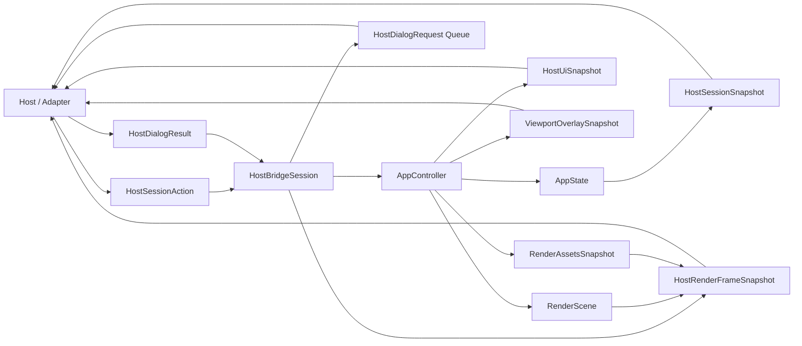

# API der Host-Bridge-Core-Crate

## Ueberblick

`fs25_auto_drive_host_bridge` ist die kanonische, toolkit-freie Host-Bridge ueber `fs25_auto_drive_engine`. Die Crate kapselt `AppController` und `AppState` in `HostBridgeSession` und buendelt damit die gemeinsame Session-Surface fuer mehrere Hosts wie egui, Flutter oder spaetere FFI-/Transport-Adapter.

Die Bridge exponiert Mutationen ausschliesslich ueber explizite `HostSessionAction`-DTOs. Fuer read-only Hosts liefert sie kleine Session-Snapshots, host-neutrale Panel-/Dialog-Read-Modelle, Viewport-Overlay-Snapshots sowie gekoppelten Render-Output aus `RenderScene` und `RenderAssetsSnapshot`.

Die Crate bleibt absichtlich host-neutral: keine eframe/egui-Runtime, keine Flutter-FFI und keine wgpu-RenderPass-Lifecycle-Logik.

## Oeffentliche Module

| Modul | Verantwortung |
|---|---|
| `dispatch` | Wiederverwendbare Rust-Host-Dispatch-Seam (`HostSessionAction` -> `AppIntent`) ueber `AppController` und `AppState` |
| `session` | `HostBridgeSession` als kanonische Session-Fassade ueber der Engine |
| `dto` | Serialisierbare Host-Actions, Dialog-DTOs und Session-Snapshots |

## Oeffentliche Dispatch-Funktionen

| Signatur | Zweck |
|---|---|
| `pub fn map_host_action_to_intent(action: HostSessionAction) -> Option<AppIntent>` | Uebersetzt eine Host-Action in einen stabilen Engine-Intent |
| `pub fn apply_host_action(controller: &mut AppController, state: &mut AppState, action: HostSessionAction) -> Result<bool>` | Wendet die gemeinsame Dispatch-Seam direkt auf einen bestehenden Rust-Host-State an |

## Wichtige oeffentliche Typen

| Typ | Zweck |
|---|---|
| `HostBridgeSession` | Toolkit-freie Session-Fassade mit expliziten Mutationen und Read-Snapshots |
| `HostRenderFrameSnapshot` | Gekoppelter Render-Snapshot (`RenderScene` + `RenderAssetsSnapshot`) |
| `HostSessionAction` | Kanonische Mutationsoberflaeche fuer Host-seitige Eingriffe |
| `HostSessionSnapshot` | Kleine serialisierbare Session-Zusammenfassung fuer Polling-Hosts |
| `HostSelectionSnapshot` / `HostViewportSnapshot` | Read-only Detail-Snapshots fuer Auswahl und Kamera |
| `HostDialogRequestKind` / `HostDialogRequest` / `HostDialogResult` | Semantische Host-Dialoganforderungen und Rueckmeldungen |
| `HostActiveTool` | Stabiler Tool-Identifier fuer Snapshot- und Action-Vertrag |
| `HostUiSnapshot` / `ViewportOverlaySnapshot` | Host-neutrale Read-Modelle fuer Panels/Dialoge bzw. Viewport-Overlays, die die Session direkt aus der Engine weiterreicht |

## Oeffentliche Methoden

| Signatur | Zweck |
|---|---|
| `pub fn new() -> Self` | Erstellt eine neue Bridge-Session mit leerem Engine-State |
| `pub fn apply_action(&mut self, action: HostSessionAction) -> Result<()>` | Wendet eine explizite Host-Aktion an |
| `pub fn toggle_command_palette(&mut self) -> Result<()>` | Komfort-Action fuer die Command-Palette |
| `pub fn set_editor_tool(&mut self, tool: HostActiveTool) -> Result<()>` | Komfort-Action fuer den Toolwechsel |
| `pub fn set_options_dialog_visible(&mut self, visible: bool) -> Result<()>` | Oeffnet oder schliesst den Optionen-Dialog explizit |
| `pub fn undo(&mut self) -> Result<()>` | Fuehrt Undo ueber die Action-Surface aus |
| `pub fn redo(&mut self) -> Result<()>` | Fuehrt Redo ueber die Action-Surface aus |
| `pub fn take_dialog_requests(&mut self) -> Vec<HostDialogRequest>` | Entnimmt ausstehende semantische Dialoganforderungen aus der Session |
| `pub fn submit_dialog_result(&mut self, result: HostDialogResult) -> Result<()>` | Gibt ein Host-Dialogergebnis semantisch an die Engine zurueck |
| `pub fn snapshot(&mut self) -> &HostSessionSnapshot` | Liefert den gecachten Session-Snapshot fuer allokationsarmes Polling |
| `pub fn snapshot_owned(&mut self) -> HostSessionSnapshot` | Liefert den Snapshot als besitzende Kopie |
| `pub fn build_render_scene(&self, viewport_size: [f32; 2]) -> RenderScene` | Liefert den per-frame Render-Vertrag |
| `pub fn build_render_assets(&self) -> RenderAssetsSnapshot` | Liefert den langlebigen Asset-Snapshot |
| `pub fn build_render_frame(&self, viewport_size: [f32; 2]) -> HostRenderFrameSnapshot` | Liefert Szene und Assets als gekoppelten read-only Render-Output |
| `pub fn build_host_ui_snapshot(&self) -> HostUiSnapshot` | Liefert host-neutrale Panel- und Dialogdaten |
| `pub fn build_viewport_overlay_snapshot(&mut self, cursor_world: Option<Vec2>) -> ViewportOverlaySnapshot` | Liefert host-neutrale Viewport-Overlay-Daten; `&mut self` bleibt absichtlich noetig, weil der App-Layer dabei Overlay- und Boundary-Caches aufwaermt |

## Beispiel

```rust
use fs25_auto_drive_host_bridge::{HostBridgeSession, HostSessionAction};

let mut session = HostBridgeSession::new();
session.apply_action(HostSessionAction::ToggleCommandPalette)?;

let snapshot = session.snapshot();
let frame = session.build_render_frame([1280.0, 720.0]);

assert!(snapshot.show_command_palette);
assert_eq!(frame.scene.viewport_size(), [1280.0, 720.0]);
```

## Datenfluss



## Hinweise

- `snapshot()` arbeitet ueber einen Dirty-Cache und baut `HostSessionSnapshot` nur nach erfolgreichen Mutationen oder entnommenen Dialog-Requests neu auf.
- `HostBridgeSession::apply_action(...)` delegiert intern an dieselbe `dispatch`-Seam, die auch nicht-Session-basierte Rust-Hosts nutzen koennen.
- `take_dialog_requests()` und `submit_dialog_result(...)` bilden die einzige oeffentliche Dialog-Seam der Bridge.
- `fs25_auto_drive_frontend_flutter_bridge` re-exportiert diese Surface als `FlutterBridgeSession` bzw. `Engine*`-Aliase; `fs25_auto_drive_frontend_egui` mappt ueber `host_bridge_adapter` aktuell nur ein bewusst kleines Intent-Subset.
