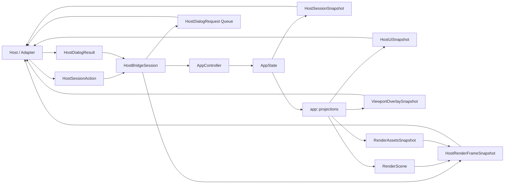

# API der Host-Bridge-Core-Crate

## Ueberblick

`fs25_auto_drive_host_bridge` ist die kanonische, toolkit-freie Host-Bridge ueber `fs25_auto_drive_engine`. Die Crate kapselt `AppController` und `AppState` in `HostBridgeSession` und buendelt damit die gemeinsame Session-Surface fuer den egui-Host, direkte Flutter-/FFI-Consumer und spaetere Transport-Adapter.

`HostBridgeSession` ist verbindlich die kanonische Session-Surface fuer den egui-Host sowie direkte Flutter-/FFI-Consumer. Host-spezifische Adapter duerfen neue host-neutrale Session-Seams nicht mehr direkt auf `AppController`/`AppState` aufbauen, sondern ausschliesslich ueber diese Bridge-Surface.

Fuer bestehende Flutter-/FFI-Call-Sites stellt die Crate die bisherigen `Engine*`-Typnamen und den Session-Namen `FlutterBridgeSession` direkt als Kompatibilitaets-Aliase bereit. Damit koennen externe Consumer direkt auf `fs25_auto_drive_host_bridge` wechseln, ohne im selben Schritt alle Symbolnamen umzubenennen.

Der aktuell produktive Flutter-Pfad konsumiert diese Kanonik ueber den Linux-first-C-ABI-Adapter `fs25_auto_drive_host_bridge_ffi`. Dieser Transportadapter fuehrt bewusst keine zweite Session- oder DTO-Surface ein, sondern serialisiert nur die bereits hier definierten Host-Vertraege. Fuer die nicht direkt `serde`-faehigen Read-Modelle `HostUiSnapshot` und `ViewportOverlaySnapshot` stellt die DTO-Fassade zusaetzlich explizite JSON-Helfer bereit, damit Adapter keine impliziten Engine-Imports oder ad-hoc-Snapshot-Mappings benoetigen.

Fuer serialisierbare Hosts mit host-lokal editiertem Overview-Dialog exponiert `HostBridgeSession` zusaetzlich die DTO-basierte Write-Seam `update_overview_options_dialog(...)`. Damit koennen Flutter-/FFI-Adapter den aktuellen Dialog-Draft ausschliesslich ueber `HostOverviewOptionsDialogSnapshot` in die Session zurueckspiegeln, ohne Engine-`shared`-Typen oder lokale UI-Seams direkt zu beruehren.

Die oeffentlichen Module `dispatch` und `dto` bleiben dabei stabile Fassaden. Seit der Audit-Remediation ist ihre interne Implementierung in thematische Untermodule aufgeteilt, ohne dass sich die Re-Export-Surface fuer Rust-, egui- oder FFI-Consumer geaendert hat.

Dasselbe gilt fuer `session`: Die interne Implementierung ist in `session/{lifecycle,read_models,snapshots,tests}.rs` sowie die bereits bestehenden Hilfsmodule aufgeteilt, waehrend die oeffentliche Session-Surface (`HostBridgeSession` und zugehoerige Typen/Methoden) unveraendert bleibt.

Die Bridge exponiert Mutationen ausschliesslich ueber explizite `HostSessionAction`-DTOs. Die Action-Surface deckt stabile Host-Aktionen ab (Datei-/Dialog-Anforderungen, Kamera-/Viewport-Shortcuts, Historie, Optionen, Toolwechsel, Exit), Node-Properties (`QueryNodeDetails`, `SetNodeFlag`), Marker-Management (`OpenCreateMarkerDialog`, `OpenEditMarkerDialog`, `CancelMarkerDialog`, `CreateMarker`, `UpdateMarker`, `RemoveMarker`), Selektions- und Clipboard-Basisaktionen (`DeleteSelected`, `SelectAll`, `InvertSelection`, `ClearSelection`, `CopySelection`, `PasteStart`, `PasteConfirm`, `PasteCancel`), Connection-Management (`AddConnection`, `RemoveConnectionBetween`, `SetConnectionDirection`, `SetConnectionPriority`, `ConnectSelectedNodes`, `SetAllConnectionsDirectionBetweenSelected`, `InvertAllConnectionsBetweenSelected`, `SetAllConnectionsPriorityBetweenSelected`, `RemoveAllConnectionsBetweenSelected`), View-/Background-Aktionen (`ZoomIn`, `ZoomOut`, `ZoomToFit`, `CenterOnNode`, `SetRenderQuality`, `ToggleBackgroundVisibility`, `SetBackgroundLayerVisibility`, `ScaleBackground`), Datei-/Dialog-Follow-ups (`ClearHeightmap`, Heightmap-Warnung, ZIP-/Overview-Folgeschritte, Dedup-Bestaetigung, Save-Overview-Bestaetigung), Group-/Resample-Aktionen (`StartResampleSelection`, `ApplyCurrentResample`, `StartGroupEdit`, `ApplyGroupEdit`, `CancelGroupEdit`, `OpenGroupEditTool`, `SetGroupBoundaryNodes`, `ToggleGroupLock`, `DissolveGroup`, `ConfirmDissolveGroup`, `GroupSelectionAsGroup`, `RemoveSelectedNodesFromGroup`, `RecomputeNodeSegmentSelection`), Extras (`OpenTraceAllFieldsDialog`, `ConfirmTraceAllFields`, `CancelTraceAllFields`), den screen-space-basierten Viewport-Input-Slice via `SubmitViewportInput` sowie eine explizite Route-Tool-Action-Familie `HostRouteToolAction` (Toolwahl, Panel-Aktionen, Execute/Cancel/Recreate, Tangenten, Drag/Lasso/Rotate und Segment-/Node-Anpassungen). Diese Basisaktionen mappen bidirektional auf die stabilen Engine-Intents fuer Datei-/Dialog-Follow-ups, View-/Chrome-Steuerung, Marker-/Group-Workflows, Loeschen, Selektion, Clipboard und Connection-Verwaltung; eine bewegte Paste-Vorschau (`PastePreviewMoved`) bleibt bewusst ausserhalb dieses niederfrequenten Host-Vertrags. Fuer read-only Hosts liefert die Crate weiterhin kleine Session-Snapshots, host-neutrale Panel-Read-Modelle, Viewport-Overlay-Snapshots, einen minimalen serialisierbaren Viewport-Geometry-Snapshot, einen dedizierten Route-Tool-Viewport-Snapshot, einen expliziten Node-Details-Vertrag (`HostNodeDetails`), einen Marker-Management-Snapshot (`HostMarkerListSnapshot`), einen Verbindungspaar-Snapshot (`HostConnectionPairSnapshot`), einen host-neutralen Kontextmenue-Snapshot (`HostContextMenuSnapshot`) mit zentraler Precondition-Auswertung sowie gekoppelten Render-Output aus `RenderScene` und `RenderAssetsSnapshot`. Zusaetzlich bietet die Session fuer Rust-Hosts schmale UI-Local-Seams (`HostPanelPropertiesState`, `HostDialogUiState`, `HostViewportInputContext`) sowie den expliziten host-lokalen Chrome-/Dialogzustand `HostLocalDialogState`, erreichbar ueber `chrome_state()` und `chrome_state_mut()`. Diese lokalen Seams invalidieren den kleinen `HostSessionSnapshot` nicht automatisch. Wenn ein Rust-Host darueber ausnahmsweise Felder mutiert, die in `HostSessionSnapshot` gespiegelt werden, muss er `HostBridgeSession::mark_snapshot_dirty()` explizit aufrufen. Als temporaere Read-Seam bleibt nur noch `app_state()` sichtbar; `app_state_mut()` ist aus der oeffentlichen API entfernt. Dieser gekoppelte RenderFrame ist jetzt sowohl ueber `HostBridgeSession::build_render_frame(...)` als auch ueber den freien Dispatch-Helper `build_render_frame(...)` fuer lokale Rust-Hosts verfuegbar. Einen separaten oeffentlichen Typ `ChromeState` gibt es nicht mehr; read-only Chrome-Daten laufen ueber `HostChromeSnapshot`, lokale mutierbare Chrome-/Dialog-Flags ueber `HostLocalDialogState`.

Fuer Flutter- und FFI-Hosts mit serialisierbarer Dialog-Oberflaeche exponiert die Session zusaetzlich `HostDialogSnapshot` als expliziten Read-Seam fuer alle im egui-Host gerenderten Dialoge und Popups (Heightmap-Warnung, Marker, Dedup, ZIP-Browser, Overview-Dialogs, Save-Overview, Trace-All-Fields, Group-Settings und Confirm-Dissolve). Damit muessen Hosts fuer read-only Dialogdaten nicht mehr auf die lokalen Rust-Seams `dialog_ui_state_mut()` oder `chrome_state()` zugreifen.

Der Overview-Dialog-Vertrag spiegelt dabei jetzt die persistente Layer- und Quellenbasis fuer das geplante Hintergrund-Layer-System: `HostOverviewLayersSnapshot` enthaelt zusaetzlich das Terrain-Basisflag, und `HostFieldDetectionSource` kennt mit `ZipGroundGdm` eine zweite ZIP-basierte Feldquelle neben `FromZip`.

Fuer Properties-, Group-Edit- und Streckenteilungsdaten exponiert die Session zusaetzlich `HostEditingSnapshot`. Dieser Read-Seam bildet die heute ueber `panel_properties_state_mut()` und `viewport_input_context_mut()` gelesenen Editing-Zustaende host-neutral ab: selektionsrelevante bearbeitbare Gruppen, aktiver Group-Edit inklusive Boundary-Kandidaten, Resample-/Streckenteilungs-Metriken sowie editing-nahe Laufzeitoptionen.

Fuer host-native Kontextmenues exponiert die Session zusaetzlich `HostContextMenuSnapshot`. Dieser Read-Seam spiegelt die egui-Kontextmenue-Variante sowie die dazugehoerigen Aktionen inklusive Enablement zentral in der Bridge, damit Hosts Selektion-, Gruppen-, Clipboard-, Verbindungs- und Route-Tool-Preconditions nicht lokal nachbauen muessen.

Der konsolidierte Host-Dialog-Vertrag deckt neben `open_file` und `save_file` auch `heightmap` und `background_map` ab. Ob ein Host dafuer einen nativen Picker oder einen lokalen Fallback nutzt, bleibt explizit host-local; der Bridge-Vertrag aendert sich dafuer nicht.

Die Crate bleibt absichtlich host-neutral: keine eframe/egui-Runtime, keine Flutter-FFI und keine wgpu-RenderPass-Lifecycle-Logik.

Die konsolidierte Host-Dialog-Seam bildet die interne Engine-Queue `DialogRequest`/`DialogResult` verlustfrei auf die host-stabilen DTOs `HostDialogRequest`/`HostDialogResult` ab. Hosts mit eigener Session nutzen dafuer `HostBridgeSession::take_dialog_requests()` und `submit_dialog_result(...)`; Hosts mit eigenem `AppController`/`AppState` verwenden dieselbe Mapping-Logik ueber `take_host_dialog_requests(...)` plus `HostSessionAction::SubmitDialogResult`.

`take_host_dialog_requests(...)` ist dabei bewusst keine zweite Session-API, sondern ein enger Adapter-Hilfspfad fuer den aktuellen Konsolidierungsslice: Er ueberbrueckt bestehende Host-Integrationen mit lokalem Controller/State, waehrend `HostBridgeSession` die kanonische Session-Surface und Zielrichtung bleibt.

Mit `HostChromeSnapshot` existiert zusaetzlich ein expliziter host-neutraler Read-Seam fuer Menues, Defaults, Status und Route-Tool-Metadaten. Der Snapshot spiegelt jetzt auch die Verfuegbarkeit gespeicherter Hintergrund-Layer sowie deren aktuelle Runtime-Sichtbarkeit ueber `background_layers_available` und `background_layer_entries`. Egui konsumiert diesen Snapshot lokal; der FFI-Adapter spiegelt dieselbe Surface additiv ueber `fs25ad_host_bridge_session_chrome_snapshot_json(...)`.

## Session-Grenze (Stand 2026-04-07)

- **bridge-owned:** Explizite Action-/Snapshot-Seams (`HostSessionAction`, `HostRouteToolAction`, `HostSessionSnapshot`, `HostUiSnapshot`, `HostChromeSnapshot`, `HostRouteToolViewportSnapshot`, `ViewportOverlaySnapshot`, Render-Read-Seams inklusive gekoppeltem `build_render_frame(...)`) und die stateful Viewport-Input-Familie (`HostViewportInputBatch`, `HostViewportInputState`) liegen zentral in der Host-Bridge.
- **bridge-gap:** Fuer stabile Host-Aktionen, bridge-owned Read-Seams und den kanonischen Viewport-Gesture-Slice aktuell geschlossen; lokale Host-Glue-Logik bleibt nur fuer bewusst spaetere/out-of-scope Pfade ausserhalb der Bridge.
- **host-local:** eframe-/egui- und Render-Glue bleiben bewusst ausserhalb der Bridge; Route-Tool-Interaktionen laufen dort nur noch als Producer fuer die explizite Bridge-Action-Familie.

## Bewusste Nicht-Ziele fuer Slice 0

- Kein zweiter Flutter-spezifischer Session- oder DTO-Vertrag neben `HostBridgeSession`.
- Keine zweite, Flutter-spezifische Viewport-Input-Surface neben `HostSessionAction::SubmitViewportInput`.
- Kein generischer Route-Tool-Write-Vertrag innerhalb von `SubmitViewportInput`; Route-Tool-Write-Pfade laufen explizit ueber `HostSessionAction::RouteTool`.
- Keine toolkit-spezifische Runtime-, Packaging- oder Loader-Logik in dieser Core-Crate.

## Oeffentliche Module

| Modul | Verantwortung |
|---|---|
| `dispatch` | Wiederverwendbare Rust-Host-Dispatch-Seam (`HostSessionAction` <-> `AppIntent`) und bridge-owned Read-Helper-Seams fuer lokale Controller/State-Hosts; bleibt als stabile Fassade intern in `actions`, `mappings`, `snapshot` und `viewport_input` aufgeteilt |
| `session` | `HostBridgeSession` als kanonische Session-Fassade ueber der Engine |
| `dto` | Serialisierbare Host-Actions, Kontextmenue-, Dialog-, Editing-, Node-Details-, Marker- und Connection-Pair-DTOs, Session-Snapshots, explizite JSON-Helfer fuer `HostUiSnapshot`/`ViewportOverlaySnapshot` plus `Engine*`-Kompatibilitaets-Aliase; bleibt als stabile Fassade intern in `actions`, `connection_pair`, `context_menu`, `dialogs`, `editing`, `input`, `markers`, `node_details`, `route_tool`, `viewport`, `chrome` und `ui_json` aufgeteilt |

## Oeffentliche DTO-Helfer

| Signatur | Zweck |
|---|---|
| `pub fn host_ui_snapshot_json(snapshot: &HostUiSnapshot) -> serde_json::Result<String>` | Serialisiert den host-neutralen UI-Snapshot (`HostUiSnapshot`) als UTF-8-JSON fuer Transport-Adapter |
| `pub fn viewport_overlay_snapshot_json(snapshot: &ViewportOverlaySnapshot) -> serde_json::Result<String>` | Serialisiert den host-neutralen Viewport-Overlay-Snapshot (`ViewportOverlaySnapshot`) als UTF-8-JSON fuer Transport-Adapter |

## Oeffentliche Dispatch-Funktionen

| Signatur | Zweck |
|---|---|
| `pub fn map_intent_to_host_action(intent: &AppIntent) -> Option<HostSessionAction>` | Uebersetzt einen stabilen Engine-Intent in eine explizite Host-Action |
| `pub fn map_host_action_to_intent(action: HostSessionAction) -> Option<AppIntent>` | Uebersetzt eine Host-Action in einen stabilen Engine-Intent |
| `pub fn apply_mapped_intent(controller: &mut AppController, state: &mut AppState, intent: &AppIntent) -> Result<bool>` | Wendet einen stabil gemappten Intent direkt ueber die gemeinsame Host-Seam an |
| `pub fn apply_host_action(controller: &mut AppController, state: &mut AppState, action: HostSessionAction) -> Result<bool>` | Wendet die gemeinsame Dispatch-Seam direkt auf einen bestehenden Rust-Host-State an |
| `pub fn apply_host_action_with_viewport_input_state(controller: &mut AppController, state: &mut AppState, input_state: &mut HostViewportInputState, action: HostSessionAction) -> Result<bool>` | Wendet auch stateful `SubmitViewportInput`-Actions direkt auf einen bestehenden Rust-Host-State an |
| `pub fn apply_viewport_input_batch(controller: &mut AppController, state: &mut AppState, input_state: &mut HostViewportInputState, batch: HostViewportInputBatch) -> Result<bool>` | Interpretiert den kleinen screen-space Viewport-Input-Vertrag bridge-owned auf bestehende Engine-Intents |
| `pub fn take_host_dialog_requests(controller: &AppController, state: &mut AppState) -> Vec<HostDialogRequest>` | Enger Adapter-Hilfspfad fuer Hosts mit lokalem Controller/State; entnimmt ausstehende Dialog-Anforderungen und mappt sie auf den kanonischen Host-Dialog-DTO-Vertrag |
| `pub fn build_host_ui_snapshot(state: &AppState) -> HostUiSnapshot` | Baut den host-neutralen Panel-Snapshot fuer Hosts mit lokalem State |
| `pub fn build_host_chrome_snapshot(state: &AppState) -> HostChromeSnapshot` | Baut den host-neutralen Chrome-Snapshot fuer Menues, Defaults, Status und Route-Tool-Metadaten |
| `pub fn build_route_tool_viewport_snapshot(state: &AppState) -> HostRouteToolViewportSnapshot` | Baut den host-neutralen Route-Tool-Viewport-Snapshot fuer lokale Host-Adapter |
| `pub fn build_viewport_overlay_snapshot(state: &mut AppState, cursor_world: Option<Vec2>) -> ViewportOverlaySnapshot` | Baut den host-neutralen Overlay-Snapshot fuer lokale Host-Adapter |
| `pub fn build_render_scene(state: &AppState, viewport_size: [f32; 2]) -> RenderScene` | Baut den per-frame Render-Vertrag fuer lokale Host-Adapter |
| `pub fn build_render_frame(state: &AppState, viewport_size: [f32; 2]) -> HostRenderFrameSnapshot` | Baut Szene und Assets als gekoppelten read-only RenderFrame fuer lokale Rust-Hosts |
| `pub fn build_viewport_geometry_snapshot(state: &AppState, viewport_size: [f32; 2]) -> HostViewportGeometrySnapshot` | Baut einen kleinen, serialisierbaren Geometry-Snapshot fuer FFI-/Polling-Hosts |
| `pub fn build_render_assets(state: &AppState) -> RenderAssetsSnapshot` | Baut den langlebigen Render-Asset-Snapshot fuer lokale Host-Adapter |

## Wichtige oeffentliche Typen

| Typ | Zweck |
|---|---|
| `HostBridgeSession` | Toolkit-freie Session-Fassade mit expliziten Mutationen und Read-Snapshots |
| `FlutterBridgeSession` | Kompatibilitaetsalias auf `HostBridgeSession` |
| `HostRenderFrameSnapshot` | Gekoppelter Render-Snapshot (`RenderScene` + `RenderAssetsSnapshot`) |
| `EngineRenderFrameSnapshot` | Kompatibilitaetsalias auf `HostRenderFrameSnapshot` |
| `HostSessionAction` | Kanonische Mutationsoberflaeche fuer Host-seitige Eingriffe |
| `HostRouteToolAction` | Explizite Action-Familie fuer Route-Tool-Schreibpfade auf der Session-Surface |
| `HostMarkerInfo` / `HostMarkerListSnapshot` | Serialisierbarer Marker-Vertrag fuer Listen, Details und Filter im Flutter-Marker-Panel |
| `HostNodeDetails` / `HostNodeNeighbor` / `HostNodeMarkerInfo` | Serialisierbarer Node-Properties-Vertrag fuer Flutter-Properties-Ansichten |
| `HostConnectionPairSnapshot` / `HostConnectionPairEntry` | Serialisierbarer Verbindungspaar-Vertrag: alle Verbindungen zwischen genau zwei Nodes mit Richtung und Prioritaet |
| `HostNodeFlag` | Vollstaendiger, host-neutraler NodeFlag-Vertrag fuer Anzeige und Bearbeitung |
| `HostRouteToolId` / `HostTangentSource` | Stabile Route-Tool- und Tangenten-DTOs fuer Action- und Read-Vertrag |
| `HostViewportInputBatch` / `HostViewportInputEvent` | Kleine screen-space Viewport-Input-Familie fuer Resize, Pointer- und Scroll-Events |
| `HostPointerButton` / `HostTapKind` / `HostInputModifiers` | Stabile Transport-DTOs fuer Pointer-Buttons, Tap-Art und Modifiers |
| `HostViewportInputState` | Kleiner bridge-owned Drag-/Resize-Zustand fuer Session oder lokale Rust-Hosts |
| `EngineMarkerInfo` / `EngineMarkerListSnapshot` | Kompatibilitaets-Aliase auf die kanonischen Marker-DTOs |
| `EngineNodeDetails` / `EngineNodeFlag` / `EngineNodeNeighbor` / `EngineNodeMarkerInfo` | Kompatibilitaets-Aliase auf die kanonischen Node-Properties-DTOs |
| `EngineConnectionPairEntry` / `EngineConnectionPairSnapshot` | Kompatibilitaets-Aliase auf die kanonischen Connection-Pair-DTOs |
| `EngineSessionAction` | Kompatibilitaetsalias auf `HostSessionAction` |
| `HostSessionSnapshot` | Kleine serialisierbare Session-Zusammenfassung fuer Polling-Hosts inklusive `is_dirty` relativ zum letzten Load/Save |
| `EngineSessionSnapshot` | Kompatibilitaetsalias auf `HostSessionSnapshot` |
| `HostChromeSnapshot` | Host-neutrales Read-Modell fuer Menues, Defaults, Status, Route-Tool-Availability und gespeicherte Hintergrund-Layer |
| `HostBackgroundLayerKind` / `HostBackgroundLayerEntry` | Stabile Chrome-DTOs fuer einzelne gespeicherte Hintergrund-Layer und deren Runtime-Sichtbarkeit |
| `HostContextMenuSnapshot` / `HostContextMenuAction` / `HostContextMenuVariant` | Host-neutrales Read-Modell fuer Kontextmenue-Variante, Aktionsliste und zentrales Enablement |
| `HostDialogSnapshot` | Host-neutrales Read-Modell fuer alle egui-Dialoge und Popup-aehnlichen Dialog-Drafts |
| `HostOverviewLayersSnapshot` / `HostFieldDetectionSource` | Serialisierbare Overview-Dialog-DTOs fuer Layer-Sichtbarkeit (inkl. `terrain`) und Feldquellen (inkl. `zip_ground_gdm`) |
| `HostEditingSnapshot` | Host-neutrales Read-Modell fuer Properties-, Group-Edit- und Streckenteilungsdaten |
| `HostEditableGroupSummary` / `HostGroupEditSnapshot` / `HostGroupBoundaryCandidateSnapshot` | Serialisierbare Group-Edit-DTOs fuer selektionsrelevante Gruppen, aktiven Edit-Zustand und Boundary-Kandidaten |
| `HostResampleEditSnapshot` / `HostResampleMode` / `HostEditingOptionsSnapshot` | Serialisierbare Streckenteilungs- und editing-nahe Options-DTOs fuer Flutter-/Host-Panels |
| `HostHeightmapWarningDialogSnapshot` / `HostMarkerDialogSnapshot` / `HostDedupDialogSnapshot` / `HostZipBrowserSnapshot` / `HostOverviewOptionsDialogSnapshot` / `HostPostLoadDialogSnapshot` / `HostSaveOverviewDialogSnapshot` / `HostTraceAllFieldsDialogSnapshot` / `HostGroupSettingsDialogSnapshot` / `HostConfirmDissolveDialogSnapshot` | Serialisierbare Detail-DTOs der einzelnen Dialogarten inklusive Sichtbarkeit und Draft-Daten |
| `HostLocalDialogState` | Host-lokaler mutierbarer Chrome-/Dialogzustand; ersetzt einen separaten oeffentlichen `ChromeState`-Typ |
| `HostRouteToolEntrySnapshot` / `HostRouteToolSelectionSnapshot` | Serialisierbare Route-Tool-Metadaten fuer Surface, Gruppe, Icon-Key, Availability und Gruppen-Memory |
| `HostDefaultConnectionDirection` / `HostDefaultConnectionPriority` | Stabile Default-Enums fuer Verbindungsrichtung und Prioritaet im Chrome-Snapshot |
| `HostSelectionSnapshot` / `HostViewportSnapshot` | Read-only Detail-Snapshots fuer Auswahl und Kamera |
| `HostViewportGeometrySnapshot` | Minimaler, serialisierbarer Viewport-Geometry-Snapshot fuer Nodes, Connections, Marker und Kamera-/Viewport-Metadaten |
| `HostRouteToolViewportSnapshot` / `HostTangentMenuSnapshot` / `HostTangentOptionSnapshot` | Route-Tool-spezifische Read-DTOs fuer Drag-Targets, Segment-Shortcuts und Tangenten-Menues |
| `HostPanelPropertiesState` | Schmaler Rust-Host-Seam fuer Properties/Edit-Panel (Read-Daten + lokale `distanzen`/`options`-Writes) |
| `HostDialogUiState` | Schmaler Rust-Host-Seam fuer host-lokale Dialog-UI-Mutationen ohne Vollzugriff auf `AppState` |
| `HostViewportInputContext` | Schmaler Rust-Host-Seam fuer Viewport-Event-Sammler (Read-Daten + lokale `distanzen`-Writes) |
| `EngineSelectionSnapshot` / `EngineViewportSnapshot` | Kompatibilitaets-Aliase auf die kanonischen Host-Snapshots |
| `EngineViewportGeometrySnapshot` | Kompatibilitaetsalias auf den kanonischen Geometry-Snapshot |
| `HostDialogRequestKind` / `HostDialogRequest` / `HostDialogResult` | Semantische Host-Dialoganforderungen und Rueckmeldungen |
| `EngineDialogRequestKind` / `EngineDialogRequest` / `EngineDialogResult` | Kompatibilitaets-Aliase auf den kanonischen Host-Dialog-Vertrag |
| `HostActiveTool` | Stabiler Tool-Identifier fuer Snapshot- und Action-Vertrag |
| `EngineActiveTool` | Kompatibilitaetsalias auf `HostActiveTool` |
| `HostUiSnapshot` / `ViewportOverlaySnapshot` | Host-neutrale Read-Modelle fuer Panels bzw. Viewport-Overlays, am Crate-Root re-exportiert |

## Oeffentliche Methoden

| Signatur | Zweck |
|---|---|
| `pub fn new() -> Self` | Erstellt eine neue Bridge-Session mit leerem Engine-State |
| `pub fn apply_action(&mut self, action: HostSessionAction) -> Result<()>` | Wendet eine explizite Host-Aktion an |
| `pub fn apply_intent(&mut self, intent: AppIntent) -> Result<()>` | Uebergangs-Seam fuer noch nicht migrierte Intent-Call-Sites |
| `pub fn app_state(&self) -> &AppState` | Temporaere Read-Seam fuer den Session-Ownership-Flip |
| `pub fn is_dirty(&self) -> bool` | Liefert den semantischen Dirty-Zustand relativ zum letzten erfolgreichen Load/Save |
| `pub fn mark_snapshot_dirty(&mut self)` | Invalidiert den gecachten `HostSessionSnapshot` explizit nach snapshot-relevanten lokalen Mutationen |
| `pub fn chrome_state(&self) -> &HostLocalDialogState` | Liefert eine read-only Referenz auf den host-lokalen Chrome-/Dialogzustand |
| `pub fn chrome_state_mut(&mut self) -> &mut HostLocalDialogState` | Liefert den mutierbaren host-lokalen Chrome-/Dialogzustand; bei snapshot-relevanten Aenderungen anschliessend `mark_snapshot_dirty()` aufrufen |
| `pub fn panel_properties_state_mut(&mut self) -> HostPanelPropertiesState<'_>` | Liefert den schmalen Rust-Host-Seam fuer Properties/Edit-Panel-Zugriffe; der Zugriff bleibt Snapshot-transparent |
| `pub fn dialog_ui_state_mut(&mut self) -> HostDialogUiState<'_>` | Liefert den schmalen Rust-Host-Seam fuer host-lokale Dialogzustands-Mutationen; snapshot-relevante Aenderungen muessen anschliessend explizit invalidiert werden |
| `pub fn viewport_input_context_mut(&mut self) -> HostViewportInputContext<'_>` | Liefert den schmalen Rust-Host-Seam fuer Viewport-Input-Sammler; der Zugriff bleibt Snapshot-transparent |
| `pub fn clear_floating_menu(&mut self)` | Schliesst das host-lokale Floating-Menue explizit |
| `pub fn toggle_floating_menu(&mut self, kind: FloatingMenuKind, pointer_pos: Option<Vec2>)` | Schaltet das host-lokale Floating-Menue an einer optionalen Pointer-Position um |
| `pub fn set_status_message(&mut self, message: Option<String>)` | Setzt die aktuelle Statusmeldung explizit |
| `pub fn toggle_command_palette(&mut self) -> Result<()>` | Komfort-Action fuer die Command-Palette |
| `pub fn set_editor_tool(&mut self, tool: HostActiveTool) -> Result<()>` | Komfort-Action fuer den Toolwechsel |
| `pub fn set_options_dialog_visible(&mut self, visible: bool) -> Result<()>` | Oeffnet oder schliesst den Optionen-Dialog explizit |
| `pub fn undo(&mut self) -> Result<()>` | Fuehrt Undo ueber die Action-Surface aus |
| `pub fn redo(&mut self) -> Result<()>` | Fuehrt Redo ueber die Action-Surface aus |
| `pub fn take_dialog_requests(&mut self) -> Vec<HostDialogRequest>` | Entnimmt ausstehende semantische Dialoganforderungen aus der Session |
| `pub fn submit_dialog_result(&mut self, result: HostDialogResult) -> Result<()>` | Gibt ein Host-Dialogergebnis semantisch an die Engine zurueck |
| `pub fn snapshot(&mut self) -> &HostSessionSnapshot` | Liefert den gecachten Session-Snapshot fuer allokationsarmes Polling |
| `pub fn snapshot_owned(&mut self) -> HostSessionSnapshot` | Liefert den Snapshot als besitzende Kopie |
| `pub fn dialog_snapshot(&self) -> HostDialogSnapshot` | Liefert einen serialisierbaren Read-Snapshot aller egui-Dialoge und Popup-Drafts |
| `pub fn editing_snapshot(&self) -> HostEditingSnapshot` | Liefert einen serialisierbaren Read-Snapshot fuer Properties-, Group-Edit- und Streckenteilungsdaten |
| `pub fn context_menu_snapshot(&self, focus_node_id: Option<u64>) -> HostContextMenuSnapshot` | Liefert einen serialisierbaren Read-Snapshot fuer die aktuelle Kontextmenue-Variante und ihre zentral validierten Aktionen |
| `pub fn set_inspected_node_id(&mut self, id: Option<u64>)` | Setzt die aktuell fuer den Node-Details-Endpunkt inspizierte Node-ID |
| `pub fn inspected_node_id(&self) -> Option<u64>` | Liefert die aktuell fuer den Node-Details-Endpunkt inspizierte Node-ID |
| `pub fn node_details_json(&self) -> Option<String>` | Liefert den aktuell inspizierten Node als `HostNodeDetails`-JSON fuer Flutter |
| `pub fn node_details(&self, node_id: u64) -> Option<HostNodeDetails>` | Liefert die Details eines Nodes als getypten Rust-Struct ohne JSON-Serialisierung und ohne Seiteneffekt auf `inspected_node_id` |
| `pub fn marker_list(&self) -> HostMarkerListSnapshot` | Liefert die komplette Markerliste als getypten Rust-Struct |
| `pub fn connection_pair(&self, node_a: u64, node_b: u64) -> HostConnectionPairSnapshot` | Liefert die Verbindungsdetails zwischen zwei Nodes |
| `pub fn should_exit(&self) -> bool` | Prueft, ob die Applikation beendet werden soll |
| `pub fn marker_list_json(&self) -> String` | Liefert alle Marker als `HostMarkerListSnapshot`-JSON fuer Flutter |
| `pub fn build_render_scene(&self, viewport_size: [f32; 2]) -> RenderScene` | Liefert den per-frame Render-Vertrag |
| `pub fn build_render_assets(&self) -> RenderAssetsSnapshot` | Liefert den langlebigen Asset-Snapshot |
| `pub fn build_render_frame(&self, viewport_size: [f32; 2]) -> HostRenderFrameSnapshot` | Liefert Szene und Assets als gekoppelten read-only Render-Output |
| `pub fn build_viewport_geometry_snapshot(&self, viewport_size: [f32; 2]) -> HostViewportGeometrySnapshot` | Liefert einen kleinen, serialisierbaren Geometry-Snapshot fuer Transport-Adapter |
| `pub fn build_host_ui_snapshot(&self) -> HostUiSnapshot` | Liefert host-neutrale Paneldaten |
| `pub fn build_host_chrome_snapshot(&self) -> HostChromeSnapshot` | Liefert host-neutrale Chrome-Daten fuer Menues, Defaults und Status |
| `pub fn build_route_tool_viewport_snapshot(&self) -> HostRouteToolViewportSnapshot` | Liefert host-neutrale Route-Tool-Viewport-Daten |
| `pub fn build_viewport_overlay_snapshot(&mut self, cursor_world: Option<Vec2>) -> ViewportOverlaySnapshot` | Liefert host-neutrale Viewport-Overlay-Daten; `&mut self` bleibt absichtlich noetig, weil der App-Layer dabei Overlay- und Boundary-Caches aufwaermt |

## Beispiel

```rust
use fs25_auto_drive_host_bridge::{HostBridgeSession, HostSessionAction};

let mut session = HostBridgeSession::new();
session.apply_action(HostSessionAction::ToggleCommandPalette)?;

let snapshot = session.snapshot();
let frame = session.build_render_frame([1280.0, 720.0]);

assert!(snapshot.show_command_palette);
assert_eq!(frame.scene.viewport_size(), [1280.0, 720.0]);
```

## Datenfluss



## Kompatibilitaets-Aliase

`fs25_auto_drive_host_bridge` bietet die Legacy-Namen fuer direkte Consumer-Migration:

| Aliasname | Kanonischer Typ |
|---|---|
| `FlutterBridgeSession` | `HostBridgeSession` |
| `EngineRenderFrameSnapshot` | `HostRenderFrameSnapshot` |
| `EngineSessionAction` | `HostSessionAction` |
| `EngineSessionSnapshot` | `HostSessionSnapshot` |
| `EngineSelectionSnapshot` | `HostSelectionSnapshot` |
| `EngineViewportSnapshot` | `HostViewportSnapshot` |
| `EngineDialogRequestKind` / `EngineDialogRequest` / `EngineDialogResult` | `HostDialogRequestKind` / `HostDialogRequest` / `HostDialogResult` |
| `EngineConnectionPairEntry` / `EngineConnectionPairSnapshot` | `HostConnectionPairEntry` / `HostConnectionPairSnapshot` |
| `EngineActiveTool` | `HostActiveTool` |

## Hinweise

- `snapshot()` arbeitet ueber einen Dirty-Cache und baut `HostSessionSnapshot` nur nach erfolgreichen Mutationen, expliziter Invalidation oder entnommenen Dialog-Requests neu auf.
- `HostBridgeSession::apply_action(...)` delegiert intern an dieselbe `dispatch`-Seam, die auch nicht-Session-basierte Rust-Hosts nutzen koennen.
- `HostSessionAction` umfasst zwei Schreibfamilien: den kleinen screen-space-basierten Viewport-Input-Slice (`SubmitViewportInput`) sowie die explizite Route-Tool-Familie (`RouteTool`).
- `HostSessionAction::QueryNodeDetails` ist bewusst session-lokal: Die Aktion aktualisiert nur den inspizierten Node fuer `node_details_json()` und erzeugt keinen Engine-Intent.
- Die getypten Read-Methoden `node_details()`, `marker_list()` und `connection_pair()` arbeiten ohne JSON-Serialisierung und ohne Seiteneffekte; `node_details_json()` und `marker_list_json()` nutzen intern dieselben Builder und serialisieren nur zusaetzlich.
- Die Connection-Management-Actions (`AddConnection`, `RemoveConnectionBetween`, `SetConnectionDirection`, `SetConnectionPriority`, `ConnectSelectedNodes`, `SetAllConnectionsDirectionBetweenSelected`, `InvertAllConnectionsBetweenSelected`, `SetAllConnectionsPriorityBetweenSelected`, `RemoveAllConnectionsBetweenSelected`) mappen bidirektional auf die stabilen Engine-Intents fuer Verbindungsbearbeitung.
- Stateful Viewport-Input benoetigt `HostViewportInputState`. `HostBridgeSession` besitzt diesen Zustand intern; lokale Rust-Hosts verwenden dafuer `apply_host_action_with_viewport_input_state(...)` oder `apply_viewport_input_batch(...)`.
- Route-Tool-Write-Pfade laufen bewusst nicht ueber `SubmitViewportInput`, sondern ausschliesslich ueber `HostSessionAction::RouteTool`.
- Die schmalen UI-Local-Seams (`HostPanelPropertiesState`, `HostDialogUiState`, `HostViewportInputContext`, `HostLocalDialogState`) sind bewusst Rust-Host-intern und nicht als serialisierbare FFI-DTO-Surface gedacht. Fuer serialisierbare Dialog-, Editing- und Kontextmenue-Daten stehen stattdessen `dialog_snapshot()` mit `HostDialogSnapshot`, `editing_snapshot()` mit `HostEditingSnapshot` sowie `context_menu_snapshot()` mit `HostContextMenuSnapshot` zur Verfuegung. Der Zugriff bleibt fuer lokale `distanzen`-/`options`-/Dialog-States Snapshot-transparent; snapshot-relevante Escape-Hatch-Mutationen muessen explizit ueber `mark_snapshot_dirty()` invalidiert werden.
- Der produktive egui-Host nutzt fuer nicht serialisierte UI-Local-Zustaende die schmalen Session-Seams sowie `chrome_state()` beziehungsweise `chrome_state_mut()`. `app_state_mut()` ist aus der oeffentlichen Host-Bridge-API entfernt.
- `take_dialog_requests()` und `submit_dialog_result(...)` bilden die kanonische Dialog-Seam der Session-API. Fuer Adapter mit eigenem `AppController`/`AppState` steht dieselbe Mapping-Logik zusaetzlich ueber `take_host_dialog_requests(...)` als schmaler Adapter-Hilfspfad bereit.
- Die Mapping-Seam fuer stabile, niederfrequente Host-Aktionen liegt zentral in `dispatch` (`map_intent_to_host_action`, `map_host_action_to_intent`, `apply_mapped_intent`, `apply_host_action`).
- `apply_host_action(...)` bleibt absichtlich stateless. Fuer `SubmitViewportInput` liefert diese Hilfsfunktion daher einen Fehler statt stiller Semantik-Drift; stateful Input laeuft ueber `HostBridgeSession` oder die dedizierte Dispatch-Hilfe mit `HostViewportInputState`.
- Die bridge-owned Read-Seams fuer lokale State-Hosts sind zentral in `dispatch` verfuegbar (`build_host_ui_snapshot`, `build_host_chrome_snapshot`, `build_route_tool_viewport_snapshot`, `build_viewport_overlay_snapshot`, `build_render_scene`, `build_render_frame`, `build_viewport_geometry_snapshot`, `build_render_assets`) und delegieren fuer Render-, Panel- und Overlay-Projektionen in `fs25_auto_drive_engine::app::projections`.
- Der serialisierbare Geometry-Snapshot bleibt bewusst klein und read-only: Nodes, Connections, Marker sowie Kamera-/Viewport-Metadaten. Der neue Write-Slice ist gezielt auf den stabilen Viewport-Input begrenzt und zieht keine Route-Tool-spezifischen oder Touch-Vertraege mit.
- Host-Adapter mit eigenem `AppController`/`AppState` koennen den Datei-/Pfad-Dialogpfad ueber `take_host_dialog_requests(...)` und `HostSessionAction::SubmitDialogResult` auf denselben Bridge-DTO-/Dispatch-Vertrag konsolidieren.
