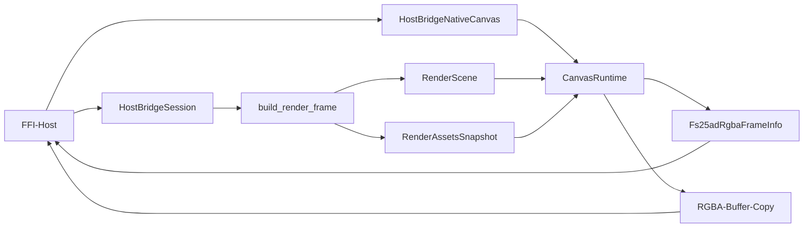

# API der C-ABI-Host-Bridge

## Ueberblick

`fs25_auto_drive_host_bridge_ffi` ist der duenne Linux-first-Transportadapter ueber der kanonischen `HostBridgeSession`. Die Crate fuehrt keine zweite fachliche Surface ein: Mutationen laufen weiter ueber `HostSessionAction`, inklusive des ersten schreibenden Viewport-Input-Slices `HostSessionAction::SubmitViewportInput`, Dialoge ueber `HostDialogRequest`/`HostDialogResult`, Session-Polling ueber `HostSessionSnapshot` und der minimale Viewport-Read-Pfad ueber `HostViewportGeometrySnapshot`.

Technikentscheidung fuer Slice 0: JSON ueber eine kleine C-ABI mit `char*`-Payloads. Das ist heute baubar, direkt per `dart:ffi` nutzbar und vermeidet in dieser Runde den Overhead eines zusaetzlichen Codegen-Stacks wie `flutter_rust_bridge`.

Seit Slice 1 des portablen Native-Canvas-Pfads enthaelt die Crate zusaetzlich einen duenneren binaeren Pixelpfad: Ein opaquer Canvas-Handle baut pro Renderaufruf ueber die bestehende `HostBridgeSession` einen gekoppelten `RenderScene`/`RenderAssetsSnapshot`-Frame, rendert ihn im host-neutralen Render-Core in ein Offscreen-Target und kopiert das letzte RGBA-Bild in einen vom Host allozierten Buffer.

Fuer native C/C++-Hosts liegt der stabile Vertragsheader unter `include/fs25ad_host_bridge.h`. Der Header ist die kanonische Symbolflaeche fuer Session-, Canvas- und FrameInfo-Typen.

## ABI-Typen

| Typ | Zweck |
|---|---|
| `FS25AD_HOST_BRIDGE_ABI_VERSION` | Explizite ABI-Version des FFI-Vertrags (`1`) |
| `FS25AD_HOST_BRIDGE_CANVAS_CONTRACT_VERSION` | Explizite Version des Canvas-Vertrags (`1`) |
| `*mut HostBridgeSession` | Opaquer Session-Handle fuer die kanonische Host-Bridge-Surface |
| `*mut HostBridgeNativeCanvas` | Opaquer nativer Offscreen-Canvas mit eigener wgpu-Runtime |
| `Fs25adRgbaFrameInfo` | Explizite Frame-Metadaten (`width`, `height`, `bytes_per_row`, Pixel-/Alpha-Modus, `byte_len`) |

## Exportierte Funktionen

| Symbol | Zweck |
|---|---|
| `fs25ad_host_bridge_abi_version() -> u32` | Liefert die ABI-Version des nativen Host-Bridge-Vertrags |
| `fs25ad_host_bridge_canvas_contract_version() -> u32` | Liefert die Version des nativen Canvas-Vertrags |
| `fs25ad_host_bridge_session_new() -> *mut HostBridgeSession` | Erstellt eine neue kanonische Bridge-Session |
| `fs25ad_host_bridge_session_dispose(session)` | Gibt eine Session frei |
| `fs25ad_host_bridge_session_snapshot_json(session) -> *mut c_char` | Liefert `HostSessionSnapshot` als UTF-8-JSON |
| `fs25ad_host_bridge_session_apply_action_json(session, action_json) -> bool` | Liest `HostSessionAction` aus UTF-8-JSON und mutiert die Session |
| `fs25ad_host_bridge_session_take_dialog_requests_json(session) -> *mut c_char` | Liefert ein JSON-Array aus `HostDialogRequest` und drainet die Queue |
| `fs25ad_host_bridge_session_submit_dialog_result_json(session, result_json) -> bool` | Liest `HostDialogResult` aus UTF-8-JSON und fuehrt ihn in die Session zurueck |
| `fs25ad_host_bridge_session_viewport_geometry_json(session, width, height) -> *mut c_char` | Liefert `HostViewportGeometrySnapshot` als UTF-8-JSON |
| `fs25ad_host_bridge_last_error_message() -> *mut c_char` | Liefert die letzte thread-lokale Fehlernachricht als UTF-8-String |
| `fs25ad_host_bridge_string_free(value)` | Gibt von der Bibliothek allozierten UTF-8-String-Speicher frei |
| `fs25ad_host_bridge_canvas_new(width, height) -> *mut HostBridgeNativeCanvas` | Erstellt einen nativen Offscreen-Canvas fuer RGBA-Frames |
| `fs25ad_host_bridge_canvas_dispose(canvas)` | Gibt einen nativen Canvas-Handle frei |
| `fs25ad_host_bridge_canvas_resize(canvas, width, height) -> bool` | Realloziert den nativen Canvas auf eine neue Zielgroesse |
| `fs25ad_host_bridge_canvas_render_rgba(session, canvas) -> bool` | Baut ueber die bestehende Session den aktuellen Render-Frame und rendert ihn als RGBA |
| `fs25ad_host_bridge_canvas_last_frame_info(canvas, out_info) -> bool` | Liefert Metadaten des zuletzt erfolgreich gerenderten RGBA-Frames |
| `fs25ad_host_bridge_canvas_copy_last_frame_rgba(canvas, dst, dst_len) -> bool` | Kopiert den zuletzt gerenderten RGBA-Frame in einen Host-Buffer |

## Transportvertrag

- Session-Handles sind opaque Pointer auf die kanonische `HostBridgeSession`.
- Native Hosts pruefen beim Start mindestens `fs25ad_host_bridge_abi_version()` und fuer den Pixelpfad zusaetzlich `fs25ad_host_bridge_canvas_contract_version()` gegen die Header-Makros.
- Alle JSON-Payloads verwenden exakt die bereits in `fs25_auto_drive_host_bridge` definierten DTOs.
- Dialog-Requests fuer `open_file`, `save_file`, `heightmap` und `background_map` bleiben reine Host-DTOs; nativer Picker oder Host-Fallback werden oberhalb dieser C-ABI entschieden.
- Schreibender Viewport-Input (`Resize`, Pointer-Drags/Taps, Scroll-Zoom) wird ohne neues ABI-Symbol als `HostSessionAction::SubmitViewportInput` ueber `fs25ad_host_bridge_session_apply_action_json(...)` transportiert.
- Fehler laufen minimal ueber `bool`/`null` plus `fs25ad_host_bridge_last_error_message()`.
- Der Geometry-Read-Pfad ist bewusst read-only und Slice-0-klein: Nodes, Connections, Marker sowie Kamera-/Viewport-Metadaten.

## Native-Canvas-ABI (Slice 1)

- Canvas-Handles sind opaque Pointer und halten nur wgpu-Runtime plus den letzten gerenderten Frame.
- `fs25ad_host_bridge_canvas_render_rgba(...)` nutzt pro Aufruf ausschliesslich den bestehenden Read-Seam `HostBridgeSession::build_render_frame(...)`.
- Es gibt keinen zweiten Session-Vertrag und keinen Flutter-spezifischen Parallelpfad.
- `fs25ad_host_bridge_canvas_new(...)` und `fs25ad_host_bridge_canvas_resize(...)` schlagen kontrolliert fehl, wenn Breite/Hoehe `0` sind, Device-Limits ueberschreiten oder interne Groessenberechnungen ueberlaufen wuerden.
- `Fs25adRgbaFrameInfo.bytes_per_row` ist immer dicht gepackt: `width * 4`.
- `Fs25adRgbaFrameInfo.pixel_format = 1` bedeutet `RGBA8 sRGB`.
- `Fs25adRgbaFrameInfo.alpha_mode = 1` bedeutet `premultiplied alpha`.
- Die festen Werte fuer ABI-Version, Canvas-Contract-Version, Pixel-Format und Alpha-Modus sind sowohl als Header-Makros als auch als Laufzeit-Symbole verfuegbar.
- Der Host besitzt den Zielbuffer; `copy_last_frame_rgba` alloziert keine Rust-Puffer ueber FFI.
- Zeilenreihenfolge ist `top-to-bottom`.
- Blocking-Readback-Fehler und Timeouts werden als normaler ABI-Fehler (`false` plus `last_error_message`) an den Host propagiert.

## Header-Handshake-Beispiel (C)

```c
#include "fs25ad_host_bridge.h"

bool fs25ad_contract_ok(void) {
	if (fs25ad_host_bridge_abi_version() != FS25AD_HOST_BRIDGE_ABI_VERSION) {
		return false;
	}
	if (fs25ad_host_bridge_canvas_contract_version() != FS25AD_HOST_BRIDGE_CANVAS_CONTRACT_VERSION) {
		return false;
	}
	return true;
}
```

## Beispiel

```rust
use std::ffi::c_void;

#[repr(C)]
struct Fs25adRgbaFrameInfo {
	width: u32,
	height: u32,
	bytes_per_row: u32,
	pixel_format: u32,
	alpha_mode: u32,
	byte_len: usize,
}

unsafe extern "C" {
	fn fs25ad_host_bridge_session_new() -> *mut c_void;
	fn fs25ad_host_bridge_session_dispose(session: *mut c_void);

	fn fs25ad_host_bridge_canvas_new(width: u32, height: u32) -> *mut c_void;
	fn fs25ad_host_bridge_canvas_dispose(canvas: *mut c_void);
	fn fs25ad_host_bridge_canvas_render_rgba(session: *mut c_void, canvas: *mut c_void) -> bool;
	fn fs25ad_host_bridge_canvas_last_frame_info(
		canvas: *mut c_void,
		out_info: *mut Fs25adRgbaFrameInfo,
	) -> bool;
	fn fs25ad_host_bridge_canvas_copy_last_frame_rgba(
		canvas: *mut c_void,
		dst: *mut u8,
		dst_len: usize,
	) -> bool;
}

unsafe {
	let session = fs25ad_host_bridge_session_new();
	let canvas = fs25ad_host_bridge_canvas_new(640, 360);

	assert!(fs25ad_host_bridge_canvas_render_rgba(session, canvas));

	let mut info = Fs25adRgbaFrameInfo {
		width: 0,
		height: 0,
		bytes_per_row: 0,
		pixel_format: 0,
		alpha_mode: 0,
		byte_len: 0,
	};
	assert!(fs25ad_host_bridge_canvas_last_frame_info(canvas, &mut info));

	let mut pixels = vec![0_u8; info.byte_len];
	assert!(fs25ad_host_bridge_canvas_copy_last_frame_rgba(
		canvas,
		pixels.as_mut_ptr(),
		pixels.len(),
	));

	fs25ad_host_bridge_canvas_dispose(canvas);
	fs25ad_host_bridge_session_dispose(session);
}
```

## Datenfluss



## Bewusste Nicht-Ziele der FFI-Slices

- Kein Flutter-only Parallelvertrag neben `HostBridgeSession` und den kanonischen Host-DTOs.
- Keine neue C-ABI-Funktion fuer den ersten Viewport-Input-Slice; der bestehende JSON-Action-Entry-Point bleibt verbindlich.
- Kein Route-Tool-, Lasso-, Doppelklick-, Rotations- oder Touch-Viewportvertrag ueber diese C-ABI in diesem Slice.
- Kein Codegen- oder Binding-Stack als Produktivvoraussetzung fuer den ersten Host-Slice.
- Kein finales Multi-Plattform-Packaging; Linux ist bewusst der erste produktive Transportpfad.
- Keine Shared-Texture-, Streaming- oder Async-Pixelpfade in Slice 1.

## Build-Artefakt

Auf Linux erzeugt `cargo build -p fs25_auto_drive_host_bridge_ffi` eine ladbare Shared Library `libfs25_auto_drive_host_bridge_ffi.so`.