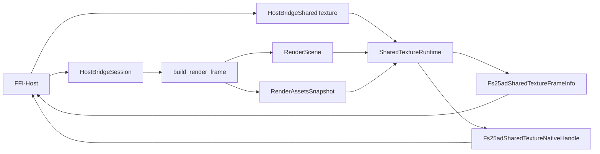

# API der C-ABI-Host-Bridge

## Ueberblick

`fs25_auto_drive_host_bridge_ffi` ist der duenner Linux-first-Transportadapter ueber der kanonischen `HostBridgeSession`. Die Crate fuehrt keine zweite fachliche Surface ein: Mutationen laufen weiter ueber `HostSessionAction` (inklusive expliziter Route-Tool-Action-Familie und `SetBackgroundLayerVisibility` fuer gespeicherte Overview-Layer), Dialoge ueber `HostDialogRequest`/`HostDialogResult`, Session-Polling ueber `HostSessionSnapshot`, Node-Details ueber `HostNodeDetails`, Marker-Listen ueber `HostMarkerListSnapshot`, Connection-Pairs ueber `HostConnectionPairSnapshot`, Dirty-State ueber einen kleinen Integer-Seam, UI-Polling ueber `HostUiSnapshot`, Chrome-Polling ueber `HostChromeSnapshot`, Dialog-Polling ueber `HostDialogSnapshot`, Editing-Polling ueber `HostEditingSnapshot`, Kontextmenue-Polling ueber `HostContextMenuSnapshot`, Route-Tool-Viewport-Polling ueber `HostRouteToolViewportSnapshot` und Overlay-Polling ueber `ViewportOverlaySnapshot`.

Seit der FFI-Haertungswelle sind alle pointer-konsumierenden Exporte in Rust explizit als `unsafe extern "C"` markiert. Panic-Isolation und thread-lokale Fehlerweitergabe haerten dabei dieselbe kanonische Surface, ohne eine zweite FFI-seitige DTO- oder Session-Familie einzufuehren.

Seit dem Hard-Cut ist der RGBA-Pixelbuffer-v1 entfernt. Der einzige native Render-Transportpfad ist jetzt Shared-Texture mit explizitem Acquire/Release-Lifecycle.

Unter den Feature-Flags `flutter`, `flutter-linux` und `flutter-android` exportiert die Crate zusaetzlich eine Flutter Control-Plane API. Dazu gehoeren sichere Rust-Helfer in `flutter_api.rs` sowie die direkte `fs25ad_flutter_session_*`-C-FFI-Surface fuer `dart:ffi`/`ffigen`. Daneben bleibt der Low-Level C-FFI GPU-Runtime-Stack fuer Vulkan-basierte Flutter-Texture-Exporte erhalten; der produktive Descriptorpfad exportiert dabei auf Linux DMA-BUF und auf Android AHardwareBuffer.

Der Rendertransport ist separat ueber `FS25AD_HOST_BRIDGE_SHARED_TEXTURE_CONTRACT_VERSION = 3` versioniert. Die exportierten Native-Handle-Werte sind explizit opaque Runtime-Pointer fuer denselben Prozessraum und keine backend-nativen Vulkan-/Metal-/DX-Interop-Handles.

Additiv dazu exportiert die Crate jetzt den separaten `Texture-Registration-v4`-Vertrag (`FS25AD_HOST_BRIDGE_TEXTURE_REGISTRATION_V4_CONTRACT_VERSION = 4`). `v3` bleibt unveraendert fuer bestehende opaque Runtime-Pointer-Consumer; `v4` fuehrt gemeinsame Capability-Negotiation und gemeinsame Frame-Metadaten ein, trennt Payload-Familien aber plattformspezifisch fuer Windows, Linux und Android.

Der v4-Vertrag ist bewusst nur der additive ABI-/Lifecycle-Slice. Echte externe Host-Registration bleibt zweistufig: Der Render-Stack braucht backend-native Export-/Attach-Pfade, und der jeweilige Flutter-/C++-Host braucht einen nativen Import-/Surface-Pfad fuer dieselbe Payload-Familie.

Fuer native C/C++-Hosts liegt der stabile Vertragsheader unter `include/fs25ad_host_bridge.h`.

## ABI-Typen

| Typ | Zweck |
|---|---|
| `FS25AD_HOST_BRIDGE_ABI_VERSION` | Explizite ABI-Version des FFI-Vertrags (`4`) |
| `FS25AD_HOST_BRIDGE_SHARED_TEXTURE_CONTRACT_VERSION` | Explizite Version des opaque Shared-Texture-Vertrags (`3`) |
| `FS25AD_HOST_BRIDGE_TEXTURE_REGISTRATION_V4_CONTRACT_VERSION` | Explizite Version des additiven Texture-Registration-v4-Vertrags (`4`) |
| `*mut HostBridgeSession` | Opaquer Session-Handle fuer die kanonische Host-Bridge-Surface |
| `*mut Fs25adFlutterSessionHandle` | Opaquer Flutter-Session-Handle ueber derselben kanonischen `HostBridgeSession` |
| `*mut HostBridgeSharedTexture` | Opaquer Shared-Texture-Handle mit eigener wgpu-Runtime |
| `*mut HostBridgeTextureRegistrationV4` | Opaquer Handle des additiven v4-Lifecycle-Pfads |
| `Fs25adSharedTextureCapabilities` | Statische Laufzeitfaehigkeiten (Format/Alpha/Native-Handle-Art/Lifecycle-Regel) |
| `Fs25adSharedTextureFrameInfo` | Explizite Frame-Metadaten (`width`, `height`, Format/Alpha, IDs, Lease-Token) |
| `Fs25adSharedTextureNativeHandle` | Opaque Runtime-Pointerwerte (`texture_ptr`, `texture_view_ptr`) fuer denselben Prozessraum, keine backend-nativen Interop-Handles |
| `Fs25adTextureRegistrationV4Capabilities` | Gemeinsame v4-Capabilities inkl. Plattformzeilen fuer Windows/Linux/Android |
| `Fs25adTextureRegistrationV4FrameInfo` | Gemeinsame v4-Frame-Metadaten |
| `Fs25adTextureRegistrationV4WindowsDescriptor` | Windows-spezifische Descriptor-Familie |
| `Fs25adTextureRegistrationV4LinuxDmabufDescriptor` | Linux-spezifische DMA-BUF-Descriptor-Familie |
| `Fs25adTextureRegistrationV4AndroidHardwareBufferDescriptor` | Android-spezifische AHardwareBuffer-Descriptor-Familie des aktiven ExportLease-Pfads |
| `Fs25adTextureRegistrationV4AndroidSurfaceDescriptor` | Legacy-Android-Surface-Attachment-Familie fuer aeltere Consumer |

## Exportierte Funktionen

| Symbol | Zweck |
|---|---|
| `fs25ad_host_bridge_abi_version() -> u32` | Liefert die ABI-Version des nativen Host-Bridge-Vertrags |
| `fs25ad_host_bridge_shared_texture_contract_version() -> u32` | Liefert die Version des aktuellen Shared-Texture-Vertrags |
| `fs25ad_host_bridge_shared_texture_capabilities(out_caps) -> bool` | Liefert Laufzeitfaehigkeiten des Shared-Texture-Pfads |
| `fs25ad_host_bridge_session_new() -> *mut HostBridgeSession` | Erstellt eine neue kanonische Bridge-Session |
| `fs25ad_host_bridge_session_dispose(session)` | Gibt eine Session frei |
| `fs25ad_host_bridge_session_snapshot_json(session) -> *mut c_char` | Liefert `HostSessionSnapshot` als UTF-8-JSON |
| `fs25ad_host_bridge_session_chrome_snapshot_json(session) -> *mut c_char` | Liefert `HostChromeSnapshot` als UTF-8-JSON |
| `fs25ad_host_bridge_session_node_details_json(session) -> *mut c_char` | Liefert den aktuell inspizierten Node als `HostNodeDetails`-JSON oder `NULL`, wenn kein passender Node vorliegt |
| `fs25ad_host_bridge_session_marker_list_json(session) -> *mut c_char` | Liefert `HostMarkerListSnapshot` als UTF-8-JSON |
| `fs25ad_host_bridge_session_connection_pair_json(session, node_a, node_b) -> *mut c_char` | Liefert den `HostConnectionPairSnapshot` fuer genau zwei Nodes als UTF-8-JSON |
| `fs25ad_host_bridge_session_is_dirty(session) -> int32_t` | Liefert den Dirty-Zustand als `1` (dirty), `0` (clean) oder `-1` (Fehler) |
| `fs25ad_host_bridge_session_ui_snapshot_json(session) -> *mut c_char` | Liefert den host-neutralen `HostUiSnapshot` als UTF-8-JSON |
| `fs25ad_host_bridge_session_dialog_snapshot_json(session) -> *mut c_char` | Liefert `HostDialogSnapshot` als UTF-8-JSON |
| `fs25ad_host_bridge_session_editing_snapshot_json(session) -> *mut c_char` | Liefert `HostEditingSnapshot` als UTF-8-JSON |
| `fs25ad_host_bridge_session_context_menu_snapshot_json(session, focus_node_id_or_neg1) -> *mut c_char` | Liefert `HostContextMenuSnapshot` als UTF-8-JSON; `-1` bedeutet kein Fokus-Node |
| `fs25ad_host_bridge_session_route_tool_viewport_json(session) -> *mut c_char` | Liefert `HostRouteToolViewportSnapshot` als UTF-8-JSON |
| `fs25ad_host_bridge_session_viewport_overlay_json(session, cursor_world_x, cursor_world_y) -> *mut c_char` | Liefert den host-neutralen `ViewportOverlaySnapshot` als UTF-8-JSON |
| `fs25ad_host_bridge_session_apply_action_json(session, action_json) -> bool` | Liest `HostSessionAction` aus UTF-8-JSON und mutiert die Session |
| `fs25ad_host_bridge_session_take_dialog_requests_json(session) -> *mut c_char` | Liefert ein JSON-Array aus `HostDialogRequest` und drainet die Queue |
| `fs25ad_host_bridge_session_submit_dialog_result_json(session, result_json) -> bool` | Liest `HostDialogResult` aus UTF-8-JSON und fuehrt ihn in die Session zurueck |
| `fs25ad_host_bridge_session_viewport_geometry_json(session, width, height) -> *mut c_char` | Liefert `HostViewportGeometrySnapshot` als UTF-8-JSON |
| `fs25ad_host_bridge_last_error_message() -> *mut c_char` | Liefert die letzte thread-lokale Fehlernachricht als UTF-8-String |
| `fs25ad_host_bridge_string_free(value)` | Gibt von der Bibliothek allozierten UTF-8-String-Speicher frei |
| `fs25ad_host_bridge_shared_texture_new(width, height) -> *mut HostBridgeSharedTexture` | Erstellt einen nativen Shared-Texture-Handle |
| `fs25ad_host_bridge_shared_texture_dispose(texture)` | Gibt den Shared-Texture-Handle frei |
| `fs25ad_host_bridge_shared_texture_resize(texture, width, height) -> bool` | Realloziert die Shared-Texture auf eine neue Zielgroesse |
| `fs25ad_host_bridge_shared_texture_render(session, texture) -> bool` | Baut ueber die bestehende Session den aktuellen Render-Frame und rendert ihn in die Shared-Texture |
| `fs25ad_host_bridge_shared_texture_acquire(texture, out_frame_info, out_native_handle) -> bool` | Leased den zuletzt gerenderten Frame und liefert Metadaten plus Runtime-Pointerwerte |
| `fs25ad_host_bridge_shared_texture_release(texture, frame_token) -> bool` | Gibt den aktiven Frame-Lease wieder frei |
| `fs25ad_host_bridge_texture_registration_v4_contract_version() -> u32` | Liefert die Version des additiven Texture-Registration-v4-Vertrags |
| `fs25ad_host_bridge_texture_registration_v4_capabilities(out_caps) -> bool` | Liefert die gemeinsame v4-Capability-Matrix fuer Windows/Linux/Android |
| `fs25ad_host_bridge_texture_registration_v4_new(platform, width, height) -> *mut HostBridgeTextureRegistrationV4` | Erstellt einen v4-Handle fuer eine Zielplattform (capability-gated) |
| `fs25ad_host_bridge_texture_registration_v4_dispose(texture)` | Gibt einen v4-Handle frei |
| `fs25ad_host_bridge_texture_registration_v4_resize(texture, width, height) -> bool` | Aendert die Zielgroesse eines v4-Handles |
| `fs25ad_host_bridge_texture_registration_v4_render(session, texture) -> bool` | Rendert den aktuellen Session-Frame ueber den v4-Lifecycle |
| `fs25ad_host_bridge_texture_registration_v4_acquire(texture, out_frame_info) -> bool` | Leased den zuletzt gerenderten v4-Frame |
| `fs25ad_host_bridge_texture_registration_v4_release(texture, frame_token) -> bool` | Gibt den aktiven v4-Frame-Lease frei |
| `fs25ad_host_bridge_texture_registration_v4_get_windows_descriptor(texture, frame_token, out_descriptor) -> bool` | Liefert den Windows-Descriptor fuer den aktiven v4-Lease |
| `fs25ad_host_bridge_texture_registration_v4_get_linux_dmabuf_descriptor(texture, frame_token, out_descriptor) -> bool` | Liefert den Linux-DMA-BUF-Descriptor fuer den aktiven v4-Lease |
| `fs25ad_host_bridge_texture_registration_v4_get_android_hardware_buffer_descriptor(texture, frame_token, out_descriptor) -> bool` | Liefert den Android-AHardwareBuffer-Descriptor fuer den aktiven v4-Lease |
| `fs25ad_host_bridge_texture_registration_v4_get_android_surface_descriptor(texture, frame_token, out_descriptor) -> bool` | Legacy: Liefert den veralteten Android-Surface-Descriptor fuer Alt-Consumer |
| `fs25ad_host_bridge_texture_registration_v4_attach_android_surface(texture, surface_descriptor) -> bool` | Legacy: Attached ein veraltetes Android-Surface an den v4-Handle |
| `fs25ad_host_bridge_texture_registration_v4_detach_android_surface(texture) -> bool` | Legacy: Detacht ein zuvor attached Android-Surface |

### Flutter-Feature-Exporte

Die folgenden Symbole werden nur mit aktivem `flutter`-Feature exportiert und spiegeln die bestehende Flutter-Control-Plane 1:1 als direkte C-ABI fuer `dart:ffi`/`ffigen`:

| Symbol | Zweck |
|---|---|
| `fs25ad_flutter_session_new() -> *mut Fs25adFlutterSessionHandle` | Erstellt eine neue Flutter-Session als opaque C-ABI-Handle |
| `fs25ad_flutter_session_dispose(session)` | Gibt einen Flutter-Session-Handle frei |
| `fs25ad_flutter_session_apply_action_json(session, action_json) -> bool` | Liest `HostSessionAction` aus UTF-8-JSON und mutiert die Flutter-Session |
| `fs25ad_flutter_session_take_dialog_requests_json(session) -> *mut c_char` | Liefert ein JSON-Array aus `HostDialogRequest` und drainet die Queue |
| `fs25ad_flutter_session_submit_dialog_result_json(session, result_json) -> bool` | Liest `HostDialogResult` aus UTF-8-JSON und fuehrt ihn in die Flutter-Session zurueck |
| `fs25ad_flutter_session_snapshot_json(session) -> *mut c_char` | Liefert `HostSessionSnapshot` als UTF-8-JSON |
| `fs25ad_flutter_session_node_details_json(session) -> *mut c_char` | Liefert den aktuell inspizierten Node als `HostNodeDetails`-JSON oder `NULL`, wenn kein passender Node vorliegt |
| `fs25ad_flutter_session_marker_list_json(session) -> *mut c_char` | Liefert `HostMarkerListSnapshot` als UTF-8-JSON |
| `fs25ad_flutter_session_route_tool_viewport_json(session) -> *mut c_char` | Liefert `HostRouteToolViewportSnapshot` als UTF-8-JSON |
| `fs25ad_flutter_session_connection_pair_json(session, node_a, node_b) -> *mut c_char` | Liefert den `HostConnectionPairSnapshot` fuer genau zwei Nodes als UTF-8-JSON |
| `fs25ad_flutter_session_is_dirty(session) -> int32_t` | Liefert den Dirty-Zustand als `1` (dirty), `0` (clean) oder `-1` (Fehler) |
| `fs25ad_flutter_session_ui_snapshot_json(session) -> *mut c_char` | Liefert den host-neutralen `HostUiSnapshot` als UTF-8-JSON |
| `fs25ad_flutter_session_chrome_snapshot_json(session) -> *mut c_char` | Liefert `HostChromeSnapshot` als UTF-8-JSON |
| `fs25ad_flutter_session_dialog_snapshot_json(session) -> *mut c_char` | Liefert `HostDialogSnapshot` als UTF-8-JSON |
| `fs25ad_flutter_session_editing_snapshot_json(session) -> *mut c_char` | Liefert `HostEditingSnapshot` als UTF-8-JSON |
| `fs25ad_flutter_session_context_menu_snapshot_json(session, focus_node_id_or_neg1) -> *mut c_char` | Liefert `HostContextMenuSnapshot` als UTF-8-JSON; `-1` bedeutet kein Fokus-Node |
| `fs25ad_flutter_session_viewport_overlay_json(session, cursor_world_x, cursor_world_y) -> *mut c_char` | Liefert den host-neutralen `ViewportOverlaySnapshot` als UTF-8-JSON |
| `fs25ad_flutter_session_viewport_geometry_json(session, width, height) -> *mut c_char` | Liefert `HostViewportGeometrySnapshot` als UTF-8-JSON |
| `fs25ad_flutter_session_acquire_shared_arc_raw(session) -> int64_t` | Klont den geteilten `Arc<Mutex<HostBridgeSession>>` als rohen Integer fuer weitergereichte GPU-FFI-Seams |
| `fs25ad_flutter_session_release_shared_arc_raw(raw)` | Gibt einen zuvor via `acquire_shared_arc_raw` geklonten Arc frei |

## Transportvertrag

- Session-Handles sind opaque Pointer auf die kanonische `HostBridgeSession`.
- **Unsafe-Kontrakt:** Versionsabfragen, `_new`-Funktionen und `fs25ad_host_bridge_last_error_message()` bleiben sichere `extern "C"`-Entry-Points ohne fremde Input-Pointer. Alle uebrigen Funktionen mit dereferenzierten Fremd-Pointern sind als `pub unsafe extern "C" fn` deklariert. Rust-Aufrufer muss sicherstellen, dass Pointer aus dem jeweiligen `_new`-Call stammen und noch nicht freigegeben wurden.
- **Panic-Schutz:** Alle pointer-konsumierenden Exporte sind intern durch `ffi_guard_bool!`/`ffi_guard_ptr!` (`std::panic::catch_unwind`) geschützt. Ein interner Rust-Panic wird als `false`/`null` zurückgegeben; keinesfalls wird der Panic über die FFI-Grenze propagiert (UB).
- Native Hosts pruefen beim Start mindestens `fs25ad_host_bridge_abi_version()` und fuer den Rendertransport zusaetzlich `fs25ad_host_bridge_shared_texture_contract_version()` gegen die Header-Makros.
- Fuer den additiven v4-Pfad pruefen Hosts zusaetzlich `fs25ad_host_bridge_texture_registration_v4_contract_version()`.
- Die allgemeine C-ABI ist seit dem additiven Export `fs25ad_host_bridge_session_route_tool_viewport_json(...)` ueber `FS25AD_HOST_BRIDGE_ABI_VERSION = 4` versioniert; die spaeter additiv ergaenzten generischen Read-Seams (`node_details`, `marker_list`, `connection_pair`, `is_dirty`, `ui`, `dialog`, `editing`, `context_menu`, `viewport_overlay`) bleiben bewusst ABI-kompatibel und benoetigen keinen Versionssprung. Der native Shared-Texture-Transport bleibt separat ueber `FS25AD_HOST_BRIDGE_SHARED_TEXTURE_CONTRACT_VERSION = 3` versioniert.
- `v4` ist additive Interop-Surface neben `v3`; `v3` wird nicht still umgedeutet.
- Alle JSON-Payloads verwenden exakt die bereits in `fs25_auto_drive_host_bridge` definierten DTOs; `HostChromeSnapshot` enthaelt damit auch `background_layers_available` plus `background_layer_entries` fuer host-native Layer-Menues.
- Schreibender Viewport-Input (`Resize`, Single-/Double-Taps, Pan/Move/Rect/Select-Lasso per Drag, Scroll-Zoom) wird weiterhin ohne neues Symbol als `HostSessionAction::SubmitViewportInput` ueber `fs25ad_host_bridge_session_apply_action_json(...)` transportiert.
- Route-Tool-Write-Pfade werden explizit als `HostSessionAction::RouteTool` ueber dieselbe JSON-Action-Surface transportiert (nicht ueber den generischen Viewport-Input-Vertrag).
- Shared-Texture-Rendering nutzt pro Aufruf ausschliesslich den bestehenden Read-Seam `HostBridgeSession::build_render_frame(...)`.
- Zugriffe auf Session- und Shared-Texture-Handle sind intern serialisiert (Mutex je Handle).
- Fehler laufen minimal ueber `bool`/`null` plus `fs25ad_host_bridge_last_error_message()`.

## Shared-Texture-Lifecycle

- `new` erzeugt Runtime + Offscreen-Shared-Texture-Ziel.
- `render` schreibt den aktuellen Session-Frame in die Shared-Texture.
- `acquire` liefert genau einen aktiven Lease mit `frame_token`.
- Solange ein Lease aktiv ist, muessen Hosts zuerst `release` aufrufen, bevor `render` oder `resize` erneut erlaubt ist.
- `Fs25adSharedTextureNativeHandle` enthaelt opaque Runtime-Pointerwerte fuer denselben Prozessraum.
- Diese Pointer sind keine backend-nativen Vulkan-/Metal-/DX-Interop-Handles und nur im selben Prozessraum gueltig.
- `dispose` darf nicht parallel zu anderen Aufrufen auf demselben Handle erfolgen; nach `dispose` ist jeder Zugriff ungueltig.
- Es gibt keinen Pixelbuffer-Fallback und keinen RGBA-Copy-Pfad mehr.

## Flutter-C-FFI-Vertrag

- `Fs25adFlutterSessionHandle` kapselt denselben kanonischen Session-Besitz wie die sicheren Rust-Helfer in `flutter_api.rs` (`Arc<Mutex<HostBridgeSession>>`), fuehrt aber keine zweite DTO- oder Session-Familie ein.
- Alle `fs25ad_flutter_session_*`-JSON-Payloads verwenden dieselben `HostSessionAction`-, `HostDialog*`- und Snapshot-DTOs wie die generische Host-Bridge-Surface.
- Die Flutter-C-FFI-Surface ist die kanonische Rust-Seite fuer `dart:ffi`/`ffigen`; `flutter_api.rs` bleibt der sichere Rust-Helfer-Layer fuer dieselbe Session-Implementierung.
- `fs25ad_flutter_session_acquire_shared_arc_raw()` gibt bei Fehlern `0` zurueck; `release_shared_arc_raw(0)` ist ein definierter No-op.

## Texture-Registration-v4 (additiv)

- Gemeinsame v4-Capability-Negotiation bleibt hostneutral (`platform`, `registration_model`, `payload_family`, `availability`).
- Gemeinsame v4-Frame-Metadaten bleiben ueber alle Plattformfamilien gleich (`Fs25adTextureRegistrationV4FrameInfo`).
- Payload-Familien sind plattformspezifisch getrennt:
	- Windows: `Fs25adTextureRegistrationV4WindowsDescriptor`
	- Linux: `Fs25adTextureRegistrationV4LinuxDmabufDescriptor`
	- Android aktiv: `Fs25adTextureRegistrationV4AndroidHardwareBufferDescriptor`
	- Android legacy: `Fs25adTextureRegistrationV4AndroidSurfaceDescriptor`
- Echte externe Host-Registration ist nicht allein mit diesem Rust-Repo erledigt. Neben backend-nativer Export-/Attach-Erzeugung im Renderer braucht jeder externe Host einen nativen Import-/Surface-Pfad fuer dieselbe Payload-Familie.
- Stand dieser Ausbaustufe: Windows und Linux bleiben im v4-Host-Bridge-Pfad `NotYetImplemented` oder `Unsupported`. Android meldet auf Android-Targets bereits `ExportLease` plus `AHardwareBuffer`, aber der v4-Host-Bridge-Lifecycle ist noch nicht an den produktiven Renderer-Export verdrahtet; Lifecycle-/Payload-Aufrufe melden deshalb weiterhin explizite Fehler statt stiller Fallbacks.
- Die Legacy-Android-Surface-Symbole bleiben exportiert, sind aber veraltet und verweisen neue Consumer auf den AHardwareBuffer-ExportLease-Pfad.
- Konkreter technischer Blocker im aktuellen Stack:
	- Windows: Das Repo erzeugt bisher nur regulaere `wgpu::Texture`-Ziele. Der verwendete `wgpu 29`-`TextureDescriptor` enthaelt keine Export-/Shared-Handle-Parameter; ohne backend-spezifische Export-Erzeugung und ohne zusaetzlichen nativen Host-Importpfad fuer DXGI-/D3D11-Registration im Consumer entsteht kein produktiver Flutter-/C++-Interop-Pfad.
	- Linux: Der v4-Host-Bridge-Pfad ist noch nicht an den bereits separaten DMA-BUF-Export-Stack verdrahtet; es fehlt weiterhin der native Host-Importpfad fuer DMA-BUF im Consumer.
	- Android: Der Renderer kann `AHardwareBuffer` exportieren, aber der v4-Host-Bridge-Pfad reicht diese Export-Leases noch nicht bis in den ABI-Getter durch. Zusaetzlich fehlt ein nativer Consumer-Importpfad fuer `AHardwareBuffer` ausserhalb dieser Crate.
- Es gibt keinen Pixelbuffer-Fallback und keine Reinterpretation von `v3`-Runtime-Pointern als `v4`-Interop-Handles.

## Header-Handshake-Beispiel (C)

```c
#include "fs25ad_host_bridge.h"

bool fs25ad_contract_ok(bool use_v4) {
	if (fs25ad_host_bridge_abi_version() != FS25AD_HOST_BRIDGE_ABI_VERSION) {
		return false;
	}
	if (fs25ad_host_bridge_shared_texture_contract_version() != FS25AD_HOST_BRIDGE_SHARED_TEXTURE_CONTRACT_VERSION) {
		return false;
	}
	if (use_v4 &&
		fs25ad_host_bridge_texture_registration_v4_contract_version() !=
			FS25AD_HOST_BRIDGE_TEXTURE_REGISTRATION_V4_CONTRACT_VERSION) {
		return false;
	}
	return true;
}
```

## Beispiel

```rust
use std::ffi::c_void;

#[repr(C)]
struct Fs25adSharedTextureFrameInfo {
	width: u32,
	height: u32,
	pixel_format: u32,
	alpha_mode: u32,
	texture_id: u64,
	texture_generation: u64,
	frame_token: u64,
}

#[repr(C)]
struct Fs25adSharedTextureNativeHandle {
	texture_ptr: usize,
	texture_view_ptr: usize,
}

unsafe extern "C" {
	fn fs25ad_host_bridge_session_new() -> *mut c_void;
	fn fs25ad_host_bridge_session_dispose(session: *mut c_void);

	fn fs25ad_host_bridge_shared_texture_new(width: u32, height: u32) -> *mut c_void;
	fn fs25ad_host_bridge_shared_texture_dispose(texture: *mut c_void);
	fn fs25ad_host_bridge_shared_texture_render(session: *mut c_void, texture: *mut c_void) -> bool;
	fn fs25ad_host_bridge_shared_texture_acquire(
texture: *mut c_void,
out_frame_info: *mut Fs25adSharedTextureFrameInfo,
out_native_handle: *mut Fs25adSharedTextureNativeHandle,
) -> bool;
	fn fs25ad_host_bridge_shared_texture_release(texture: *mut c_void, frame_token: u64) -> bool;
}

unsafe {
	let session = fs25ad_host_bridge_session_new();
	let texture = fs25ad_host_bridge_shared_texture_new(640, 360);

	assert!(fs25ad_host_bridge_shared_texture_render(session, texture));

	let mut frame = Fs25adSharedTextureFrameInfo {
		width: 0,
		height: 0,
		pixel_format: 0,
		alpha_mode: 0,
		texture_id: 0,
		texture_generation: 0,
		frame_token: 0,
	};
	let mut handle = Fs25adSharedTextureNativeHandle {
		texture_ptr: 0,
		texture_view_ptr: 0,
	};
	assert!(fs25ad_host_bridge_shared_texture_acquire(
texture,
&mut frame,
		&mut handle,
	));

	assert!(fs25ad_host_bridge_shared_texture_release(texture, frame.frame_token));

	fs25ad_host_bridge_shared_texture_dispose(texture);
	fs25ad_host_bridge_session_dispose(session);
}
```

## Datenfluss



## Bewusste Nicht-Ziele

- Kein Flutter-only Parallelvertrag neben `HostBridgeSession`.
- Keine zweite Session-/Action-/Render-DTO-Familie in `fs25_auto_drive_host_bridge`.
- Kein Pixelbuffer-/RGBA-Copy-Kompatpfad.
- Kein Umbau des egui-Onscreen-Hosts auf Shared-Texture-Transport; egui bleibt auf dem RenderFrame-Seam mit lokalem `RenderPass`-Glue.

## Feature-Flags

| Feature | Zweck |
|---|---|
| `flutter` | Aktiviert `flutter_api.rs` und die direkte `fs25ad_flutter_session_*`-C-FFI-Surface fuer Flutter |
| `flutter-linux` | Impliziert `flutter`. Aktiviert `fs25_auto_drive_render_wgpu/flutter-linux` und das Modul `flutter_gpu.rs` mit C-FFI GPU-Runtime fuer Linux/Vulkan |
| `flutter-android` | Impliziert `flutter`. Aktiviert `fs25_auto_drive_render_wgpu/flutter-android` und den Android-AHardwareBuffer-Exportpfad im Low-Level-Modul `flutter_gpu.rs` |

## Flutter Control-Plane API (`flutter_api.rs`, Feature `flutter`)

Typsichere High-Level-Funktionen fuer die Flutter-seitige Session-Steuerung, die von der direkten C-FFI-Surface in `lib.rs` wiederverwendet werden.

### Typ: `FlutterSessionHandle`

Opaquer Session-Handle mit `Arc<Mutex<HostBridgeSession>>` fuer thread-sicheren Zugriff aus Darts Isolate-Modell.

### Funktionen

| Signatur | Zweck |
|---|---|
| `flutter_session_new() -> FlutterSessionHandle` | Erzeugt eine neue Flutter-Session |
| `flutter_session_dispose(handle: FlutterSessionHandle)` | Gibt die Session frei |
| `flutter_session_apply_action(handle, action_json: String) -> Result<()>` | Wendet eine JSON-serialisierte `HostSessionAction` an |
| `flutter_session_take_dialog_requests_json(handle) -> Result<String>` | Liefert ein JSON-Array aus `HostDialogRequest` und drainet die Dialog-Queue |
| `flutter_session_submit_dialog_result_json(handle, result_json: String) -> Result<()>` | Liest `HostDialogResult` aus JSON und fuehrt ihn in die Session zurueck |
| `flutter_session_is_dirty(handle) -> Result<bool>` | Liefert den semantischen Dirty-Zustand relativ zum letzten erfolgreichen Load/Save |
| `flutter_session_snapshot_json(handle) -> Result<String>` | Liefert den `HostSessionSnapshot` als JSON |
| `flutter_session_node_details_json(handle) -> Option<String>` | Liefert den aktuell inspizierten Node als `HostNodeDetails`-JSON |
| `flutter_session_marker_list_json(handle) -> String` | Liefert alle Marker als `HostMarkerListSnapshot`-JSON |
| `flutter_session_route_tool_viewport_json(handle) -> Result<String>` | Liefert den `HostRouteToolViewportSnapshot` als JSON |
| `flutter_session_connection_pair_json(handle, node_a, node_b) -> Result<String>` | Liefert den `HostConnectionPairSnapshot` fuer genau zwei Nodes als JSON |
| `flutter_session_ui_snapshot_json(handle) -> Result<String>` | Liefert den host-neutralen `HostUiSnapshot` als JSON |
| `flutter_session_chrome_snapshot_json(handle) -> Result<String>` | Liefert den `HostChromeSnapshot` als JSON |
| `flutter_session_dialog_snapshot_json(handle) -> Result<String>` | Liefert den `HostDialogSnapshot` als JSON |
| `flutter_session_editing_snapshot_json(handle) -> Result<String>` | Liefert den `HostEditingSnapshot` als JSON |
| `flutter_session_context_menu_snapshot_json(handle, focus_node_id_or_neg1) -> Result<String>` | Liefert den `HostContextMenuSnapshot` als JSON; `-1` bedeutet kein Fokus-Node |
| `flutter_session_viewport_overlay_json(handle, cursor_world_x, cursor_world_y) -> Result<String>` | Liefert den host-neutralen `ViewportOverlaySnapshot` als JSON |
| `flutter_session_viewport_geometry_json(handle, width, height) -> Result<String>` | Liefert den `HostViewportGeometrySnapshot` als JSON |

### Zusaetzliche C-ABI-Wrapper

| Symbol | Zweck |
|---|---|
| `fs25ad_flutter_session_new() -> *mut FlutterSessionHandle` | Erzeugt einen opaken C-ABI-Handle fuer dieselbe Flutter-Session-Implementierung |
| `fs25ad_flutter_session_dispose(handle)` | Gibt einen zuvor ueber `fs25ad_flutter_session_new` erzeugten C-ABI-Handle frei |

### Status

Die Rust-Seite verwendet keinen separaten Bridge-Codegen mehr. Flutter bindet die nativen Symbole direkt ueber `fs25ad_flutter_session_*` bzw. `dart:ffi`/`ffigen` an.

## Flutter GPU-Runtime (`flutter_gpu.rs`, Feature `flutter-linux` / `flutter-android`)

Low-Level C-FFI fuer den GPU-Hot-Path auf Vulkan. Der produktive Descriptor-Export bleibt plattformspezifisch: Linux nutzt DMA-BUF, Android nutzt AHardwareBuffer.

### Typ: `GpuRuntimeHandle`

Interner GPU-Runtime-Zustand: haelt `wgpu::Instance`, `Adapter`, `Device`, `Queue`, `SharedTextureRuntime`, eine plattformspezifische `PlatformExternalTexture` (`VulkanDmaBufTexture` auf Linux bzw. `VulkanAhbTexture` auf Android) und einen `Arc<Mutex<HostBridgeSession>>`. Der Renderer-Zustand schreibt pro Frame direkt in die exportierbare Vulkan-Texture.

### Lebenszyklus

```text
fs25ad_gpu_runtime_new()
  → fs25ad_gpu_runtime_resize()      // optional bei Groessenaenderung
  → fs25ad_gpu_runtime_render()      // pro Frame
	→ fs25ad_gpu_runtime_export_texture() // Linux: pro Frame nach render
		oder
		fs25ad_gpu_runtime_export_android_hardware_buffer() // Android: pro Frame nach render
  → fs25ad_gpu_runtime_dispose()    // am Ende
```

Alternativ fuer den integrierten Flutter-Pfad:

```text
fs25ad_flutter_session_new()
	→ fs25ad_gpu_runtime_new_with_session(session, width, height)
	→ flutter_session_apply_action(...) / fs25ad_host_bridge_* / sonstige Session-Mutationen
	→ fs25ad_gpu_runtime_render(runtime)
```

### C-FFI-Funktionen

| Symbol | Zweck |
|---|---|
| `fs25ad_gpu_runtime_new(width, height) -> *mut GpuRuntimeHandle` | Erzeugt GPU-Runtime mit Vulkan-Backend. NULL bei Fehler |
| `fs25ad_gpu_runtime_new_with_session(session_handle, width, height) -> *mut GpuRuntimeHandle` | Erzeugt GPU-Runtime mit geteilter `HostBridgeSession` aus der Flutter-Control-Plane |
| `fs25ad_gpu_runtime_render(handle) -> bool` | Rendert den aktuellen Frame direkt in die exportierbare Vulkan-Texture |
| `fs25ad_gpu_runtime_export_texture(handle, out_descriptor) -> bool` | Exportiert den Linux-DMA-BUF-v4-Descriptor `Fs25adTextureRegistrationV4LinuxDmabufDescriptor` (unsafe) |
| `fs25ad_gpu_runtime_export_android_hardware_buffer(handle, out_descriptor) -> bool` | Exportiert den Android-AHardwareBuffer-v4-Descriptor `Fs25adTextureRegistrationV4AndroidHardwareBufferDescriptor` (unsafe, nur auf Android verfuegbar) |
| `fs25ad_gpu_runtime_resize(handle, width, height) -> bool` | Passt die Render-Target-Groesse an |
| `fs25ad_gpu_runtime_dispose(handle)` | Gibt den GPU-Runtime-Handle frei (unsafe) |

### C-Repr: `Fs25adTextureRegistrationV4LinuxDmabufDescriptor`

C-kompatible Repr des Linux-DMA-BUF-v4-Descriptors fuer den Export an Flutter/Impeller.

### C-Repr: `Fs25adTextureRegistrationV4AndroidHardwareBufferDescriptor`

C-kompatible Repr des Android-AHardwareBuffer-v4-Descriptors fuer den Export an Flutter/Impeller. Enthaelt einen opaken `AHardwareBuffer*`-Zeiger, der bereits per `AHardwareBuffer_acquire()` fuer den Empfaenger inkrementiert wurde. Der Empfaenger muss spaeter `AHardwareBuffer_release()` aufrufen.

### Status

- GPU-Runtime-Erzeugung (Vulkan-Instanz, Device, Queue) funktional
- Session-Sharing zwischen `FlutterSessionHandle` und `GpuRuntimeHandle` ueber `Arc<Mutex<HostBridgeSession>>` additiv verfuegbar
- Rendern direkt in die exportierbare Vulkan-Texture funktional
- DMA-BUF-Export ueber Vulkan External Memory (`vkGetMemoryFdKHR`) funktional; der FFI-Vertrag liefert den FD jetzt im v4-Linux-DMA-BUF-Descriptor statt als nackten `out_fd`
- Android-AHardwareBuffer-Export ueber den Low-Level-GPU-Runtime-Pfad funktional; der FFI-Vertrag liefert den Pointer im v4-Android-AHardwareBuffer-Descriptor
- Panic-Isolation ueber `ffi_guard_bool!` / `catch_unwind`

### `SharedTextureRuntime::new_for_flutter()` (Feature `flutter-linux` / `flutter-android`)

Konstruktor in `shared_texture_v2.rs` der eine explizit Vulkan-exklusive wgpu-Instanz via `create_vulkan_instance()` nutzt, um GPU-Sharing mit Flutter/Impeller zu ermoeglichen.

## Build-Artefakt

Auf Linux erzeugt `cargo build -p fs25_auto_drive_host_bridge_ffi` eine ladbare Shared Library `libfs25_auto_drive_host_bridge_ffi.so`.
