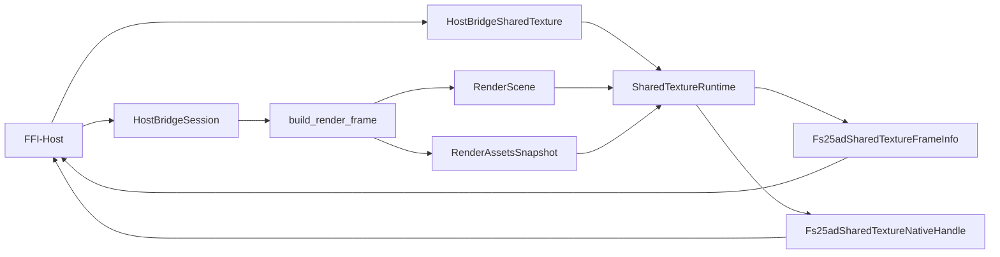

# API der C-ABI-Host-Bridge

## Ueberblick

`fs25_auto_drive_host_bridge_ffi` ist der duenner Linux-first-Transportadapter ueber der kanonischen `HostBridgeSession`. Die Crate fuehrt keine zweite fachliche Surface ein: Mutationen laufen weiter ueber `HostSessionAction`, Dialoge ueber `HostDialogRequest`/`HostDialogResult`, Session-Polling ueber `HostSessionSnapshot` und der minimale Viewport-Read-Pfad ueber `HostViewportGeometrySnapshot`.

Seit dem Hard-Cut ist der RGBA-Pixelbuffer-v1 entfernt. Der einzige native Render-Transportpfad ist jetzt Shared-Texture mit explizitem Acquire/Release-Lifecycle.

Der Rendertransport ist separat ueber `FS25AD_HOST_BRIDGE_SHARED_TEXTURE_CONTRACT_VERSION = 3` versioniert. Die exportierten Native-Handle-Werte sind explizit opaque Runtime-Pointer fuer denselben Prozessraum und keine backend-nativen Vulkan-/Metal-/DX-Interop-Handles.

Additiv dazu exportiert die Crate jetzt den separaten `Texture-Registration-v4`-Vertrag (`FS25AD_HOST_BRIDGE_TEXTURE_REGISTRATION_V4_CONTRACT_VERSION = 4`). `v3` bleibt unveraendert fuer bestehende opaque Runtime-Pointer-Consumer; `v4` fuehrt gemeinsame Capability-Negotiation und gemeinsame Frame-Metadaten ein, trennt Payload-Familien aber plattformspezifisch fuer Windows, Linux und Android.

Der v4-Vertrag ist bewusst nur der additive ABI-/Lifecycle-Slice. Echte externe Host-Registration bleibt zweistufig: Der Render-Stack braucht backend-native Export-/Attach-Pfade, und der jeweilige Flutter-/C++-Host braucht einen nativen Import-/Surface-Pfad fuer dieselbe Payload-Familie.

Fuer native C/C++-Hosts liegt der stabile Vertragsheader unter `include/fs25ad_host_bridge.h`.

## ABI-Typen

| Typ | Zweck |
|---|---|
| `FS25AD_HOST_BRIDGE_ABI_VERSION` | Explizite ABI-Version des FFI-Vertrags (`2`) |
| `FS25AD_HOST_BRIDGE_SHARED_TEXTURE_CONTRACT_VERSION` | Explizite Version des opaque Shared-Texture-Vertrags (`3`) |
| `FS25AD_HOST_BRIDGE_TEXTURE_REGISTRATION_V4_CONTRACT_VERSION` | Explizite Version des additiven Texture-Registration-v4-Vertrags (`4`) |
| `*mut HostBridgeSession` | Opaquer Session-Handle fuer die kanonische Host-Bridge-Surface |
| `*mut HostBridgeSharedTexture` | Opaquer Shared-Texture-Handle mit eigener wgpu-Runtime |
| `*mut HostBridgeTextureRegistrationV4` | Opaquer Handle des additiven v4-Lifecycle-Pfads |
| `Fs25adSharedTextureCapabilities` | Statische Laufzeitfaehigkeiten (Format/Alpha/Native-Handle-Art/Lifecycle-Regel) |
| `Fs25adSharedTextureFrameInfo` | Explizite Frame-Metadaten (`width`, `height`, Format/Alpha, IDs, Lease-Token) |
| `Fs25adSharedTextureNativeHandle` | Opaque Runtime-Pointerwerte (`texture_ptr`, `texture_view_ptr`) fuer denselben Prozessraum, keine backend-nativen Interop-Handles |
| `Fs25adTextureRegistrationV4Capabilities` | Gemeinsame v4-Capabilities inkl. Plattformzeilen fuer Windows/Linux/Android |
| `Fs25adTextureRegistrationV4FrameInfo` | Gemeinsame v4-Frame-Metadaten |
| `Fs25adTextureRegistrationV4WindowsDescriptor` | Windows-spezifische Descriptor-Familie |
| `Fs25adTextureRegistrationV4LinuxDmabufDescriptor` | Linux-spezifische DMA-BUF-Descriptor-Familie |
| `Fs25adTextureRegistrationV4AndroidSurfaceDescriptor` | Android-spezifische Surface-Attachment-Familie |

## Exportierte Funktionen

| Symbol | Zweck |
|---|---|
| `fs25ad_host_bridge_abi_version() -> u32` | Liefert die ABI-Version des nativen Host-Bridge-Vertrags |
| `fs25ad_host_bridge_shared_texture_contract_version() -> u32` | Liefert die Version des aktuellen Shared-Texture-Vertrags |
| `fs25ad_host_bridge_shared_texture_capabilities(out_caps) -> bool` | Liefert Laufzeitfaehigkeiten des Shared-Texture-Pfads |
| `fs25ad_host_bridge_session_new() -> *mut HostBridgeSession` | Erstellt eine neue kanonische Bridge-Session |
| `fs25ad_host_bridge_session_dispose(session)` | Gibt eine Session frei |
| `fs25ad_host_bridge_session_snapshot_json(session) -> *mut c_char` | Liefert `HostSessionSnapshot` als UTF-8-JSON |
| `fs25ad_host_bridge_session_apply_action_json(session, action_json) -> bool` | Liest `HostSessionAction` aus UTF-8-JSON und mutiert die Session |
| `fs25ad_host_bridge_session_take_dialog_requests_json(session) -> *mut c_char` | Liefert ein JSON-Array aus `HostDialogRequest` und drainet die Queue |
| `fs25ad_host_bridge_session_submit_dialog_result_json(session, result_json) -> bool` | Liest `HostDialogResult` aus UTF-8-JSON und fuehrt ihn in die Session zurueck |
| `fs25ad_host_bridge_session_viewport_geometry_json(session, width, height) -> *mut c_char` | Liefert `HostViewportGeometrySnapshot` als UTF-8-JSON |
| `fs25ad_host_bridge_last_error_message() -> *mut c_char` | Liefert die letzte thread-lokale Fehlernachricht als UTF-8-String |
| `fs25ad_host_bridge_string_free(value)` | Gibt von der Bibliothek allozierten UTF-8-String-Speicher frei |
| `fs25ad_host_bridge_shared_texture_new(width, height) -> *mut HostBridgeSharedTexture` | Erstellt einen nativen Shared-Texture-Handle |
| `fs25ad_host_bridge_shared_texture_dispose(texture)` | Gibt den Shared-Texture-Handle frei |
| `fs25ad_host_bridge_shared_texture_resize(texture, width, height) -> bool` | Realloziert die Shared-Texture auf eine neue Zielgroesse |
| `fs25ad_host_bridge_shared_texture_render(session, texture) -> bool` | Baut ueber die bestehende Session den aktuellen Render-Frame und rendert ihn in die Shared-Texture |
| `fs25ad_host_bridge_shared_texture_acquire(texture, out_frame_info, out_native_handle) -> bool` | Leased den zuletzt gerenderten Frame und liefert Metadaten plus Runtime-Pointerwerte |
| `fs25ad_host_bridge_shared_texture_release(texture, frame_token) -> bool` | Gibt den aktiven Frame-Lease wieder frei |
| `fs25ad_host_bridge_texture_registration_v4_contract_version() -> u32` | Liefert die Version des additiven Texture-Registration-v4-Vertrags |
| `fs25ad_host_bridge_texture_registration_v4_capabilities(out_caps) -> bool` | Liefert die gemeinsame v4-Capability-Matrix fuer Windows/Linux/Android |
| `fs25ad_host_bridge_texture_registration_v4_new(platform, width, height) -> *mut HostBridgeTextureRegistrationV4` | Erstellt einen v4-Handle fuer eine Zielplattform (capability-gated) |
| `fs25ad_host_bridge_texture_registration_v4_dispose(texture)` | Gibt einen v4-Handle frei |
| `fs25ad_host_bridge_texture_registration_v4_resize(texture, width, height) -> bool` | Aendert die Zielgroesse eines v4-Handles |
| `fs25ad_host_bridge_texture_registration_v4_render(session, texture) -> bool` | Rendert den aktuellen Session-Frame ueber den v4-Lifecycle |
| `fs25ad_host_bridge_texture_registration_v4_acquire(texture, out_frame_info) -> bool` | Leased den zuletzt gerenderten v4-Frame |
| `fs25ad_host_bridge_texture_registration_v4_release(texture, frame_token) -> bool` | Gibt den aktiven v4-Frame-Lease frei |
| `fs25ad_host_bridge_texture_registration_v4_get_windows_descriptor(texture, frame_token, out_descriptor) -> bool` | Liefert den Windows-Descriptor fuer den aktiven v4-Lease |
| `fs25ad_host_bridge_texture_registration_v4_get_linux_dmabuf_descriptor(texture, frame_token, out_descriptor) -> bool` | Liefert den Linux-DMA-BUF-Descriptor fuer den aktiven v4-Lease |
| `fs25ad_host_bridge_texture_registration_v4_get_android_surface_descriptor(texture, frame_token, out_descriptor) -> bool` | Liefert den Android-Surface-Descriptor fuer den aktiven v4-Lease |
| `fs25ad_host_bridge_texture_registration_v4_attach_android_surface(texture, surface_descriptor) -> bool` | Attached ein Android-Surface an den v4-Handle |
| `fs25ad_host_bridge_texture_registration_v4_detach_android_surface(texture) -> bool` | Detacht ein zuvor attached Android-Surface |

## Transportvertrag

- Session-Handles sind opaque Pointer auf die kanonische `HostBridgeSession`.
- Native Hosts pruefen beim Start mindestens `fs25ad_host_bridge_abi_version()` und fuer den Rendertransport zusaetzlich `fs25ad_host_bridge_shared_texture_contract_version()` gegen die Header-Makros.
- Fuer den additiven v4-Pfad pruefen Hosts zusaetzlich `fs25ad_host_bridge_texture_registration_v4_contract_version()`.
- Die allgemeine C-ABI bleibt ueber `FS25AD_HOST_BRIDGE_ABI_VERSION = 2` versioniert; der einzige native Rendertransport ist separat ueber `FS25AD_HOST_BRIDGE_SHARED_TEXTURE_CONTRACT_VERSION = 3` versioniert.
- `v4` ist additive Interop-Surface neben `v3`; `v3` wird nicht still umgedeutet.
- Alle JSON-Payloads verwenden exakt die bereits in `fs25_auto_drive_host_bridge` definierten DTOs.
- Schreibender Viewport-Input (`Resize`, Pointer-Drags/Taps, Scroll-Zoom) wird weiterhin ohne neues Symbol als `HostSessionAction::SubmitViewportInput` ueber `fs25ad_host_bridge_session_apply_action_json(...)` transportiert.
- Shared-Texture-Rendering nutzt pro Aufruf ausschliesslich den bestehenden Read-Seam `HostBridgeSession::build_render_frame(...)`.
- Zugriffe auf Session- und Shared-Texture-Handle sind intern serialisiert (Mutex je Handle).
- Fehler laufen minimal ueber `bool`/`null` plus `fs25ad_host_bridge_last_error_message()`.

## Shared-Texture-Lifecycle

- `new` erzeugt Runtime + Offscreen-Shared-Texture-Ziel.
- `render` schreibt den aktuellen Session-Frame in die Shared-Texture.
- `acquire` liefert genau einen aktiven Lease mit `frame_token`.
- Solange ein Lease aktiv ist, muessen Hosts zuerst `release` aufrufen, bevor `render` oder `resize` erneut erlaubt ist.
- `Fs25adSharedTextureNativeHandle` enthaelt opaque Runtime-Pointerwerte fuer denselben Prozessraum.
- Diese Pointer sind keine backend-nativen Vulkan-/Metal-/DX-Interop-Handles und nur im selben Prozessraum gueltig.
- `dispose` darf nicht parallel zu anderen Aufrufen auf demselben Handle erfolgen; nach `dispose` ist jeder Zugriff ungueltig.
- Es gibt keinen Pixelbuffer-Fallback und keinen RGBA-Copy-Pfad mehr.

## Texture-Registration-v4 (additiv)

- Gemeinsame v4-Capability-Negotiation bleibt hostneutral (`platform`, `registration_model`, `payload_family`, `availability`).
- Gemeinsame v4-Frame-Metadaten bleiben ueber alle Plattformfamilien gleich (`Fs25adTextureRegistrationV4FrameInfo`).
- Payload-Familien sind plattformspezifisch getrennt:
	- Windows: `Fs25adTextureRegistrationV4WindowsDescriptor`
	- Linux: `Fs25adTextureRegistrationV4LinuxDmabufDescriptor`
	- Android: `Fs25adTextureRegistrationV4AndroidSurfaceDescriptor`
- Echte externe Host-Registration ist nicht allein mit diesem Rust-Repo erledigt. Neben backend-nativer Export-/Attach-Erzeugung im Renderer braucht jeder externe Host einen nativen Import-/Surface-Pfad fuer dieselbe Payload-Familie.
- Stand dieser Ausbaustufe: Kein produktiver v4-Backend-Pfad in diesem Rust-Repo. Capabilities markieren Plattformpfade explizit als `NotYetImplemented` oder `Unsupported`; Lifecycle-/Payload-Aufrufe melden explizite Fehler statt stiller Fallbacks.
- Konkreter technischer Blocker im aktuellen Stack:
	- Windows: Das Repo erzeugt bisher nur regulaere `wgpu::Texture`-Ziele. Der verwendete `wgpu 29`-`TextureDescriptor` enthaelt keine Export-/Shared-Handle-Parameter; ohne backend-spezifische Export-Erzeugung und ohne zusaetzlichen nativen Host-Importpfad fuer DXGI-/D3D11-Registration im Consumer entsteht kein produktiver Flutter-/C++-Interop-Pfad.
	- Linux: Der Renderpfad erzeugt keine exportierbare Vulkan-External-Memory. Es gibt deshalb in diesem Repo weder DMA-BUF-FD-/Modifier-Export noch einen zusaetzlichen nativen Host-Importpfad fuer DMA-BUF im Consumer.
	- Android: Das Rust-Repo rendert nur in interne Offscreen-Texturen. Ein echter Android-v4-Pfad braucht ein hostseitig bereitgestelltes `ANativeWindow`/Surface-Ziel und zusaetzlichen nativen Host-Code fuer die Ziel-Lifecycle-Integration im Consumer.
- Es gibt keinen Pixelbuffer-Fallback und keine Reinterpretation von `v3`-Runtime-Pointern als `v4`-Interop-Handles.

## Header-Handshake-Beispiel (C)

```c
#include "fs25ad_host_bridge.h"

bool fs25ad_contract_ok(bool use_v4) {
	if (fs25ad_host_bridge_abi_version() != FS25AD_HOST_BRIDGE_ABI_VERSION) {
		return false;
	}
	if (fs25ad_host_bridge_shared_texture_contract_version() != FS25AD_HOST_BRIDGE_SHARED_TEXTURE_CONTRACT_VERSION) {
		return false;
	}
	if (use_v4 &&
		fs25ad_host_bridge_texture_registration_v4_contract_version() !=
			FS25AD_HOST_BRIDGE_TEXTURE_REGISTRATION_V4_CONTRACT_VERSION) {
		return false;
	}
	return true;
}
```

## Beispiel

```rust
use std::ffi::c_void;

#[repr(C)]
struct Fs25adSharedTextureFrameInfo {
	width: u32,
	height: u32,
	pixel_format: u32,
	alpha_mode: u32,
	texture_id: u64,
	texture_generation: u64,
	frame_token: u64,
}

#[repr(C)]
struct Fs25adSharedTextureNativeHandle {
	texture_ptr: usize,
	texture_view_ptr: usize,
}

unsafe extern "C" {
	fn fs25ad_host_bridge_session_new() -> *mut c_void;
	fn fs25ad_host_bridge_session_dispose(session: *mut c_void);

	fn fs25ad_host_bridge_shared_texture_new(width: u32, height: u32) -> *mut c_void;
	fn fs25ad_host_bridge_shared_texture_dispose(texture: *mut c_void);
	fn fs25ad_host_bridge_shared_texture_render(session: *mut c_void, texture: *mut c_void) -> bool;
	fn fs25ad_host_bridge_shared_texture_acquire(
texture: *mut c_void,
out_frame_info: *mut Fs25adSharedTextureFrameInfo,
out_native_handle: *mut Fs25adSharedTextureNativeHandle,
) -> bool;
	fn fs25ad_host_bridge_shared_texture_release(texture: *mut c_void, frame_token: u64) -> bool;
}

unsafe {
	let session = fs25ad_host_bridge_session_new();
	let texture = fs25ad_host_bridge_shared_texture_new(640, 360);

	assert!(fs25ad_host_bridge_shared_texture_render(session, texture));

	let mut frame = Fs25adSharedTextureFrameInfo {
		width: 0,
		height: 0,
		pixel_format: 0,
		alpha_mode: 0,
		texture_id: 0,
		texture_generation: 0,
		frame_token: 0,
	};
	let mut handle = Fs25adSharedTextureNativeHandle {
		texture_ptr: 0,
		texture_view_ptr: 0,
	};
	assert!(fs25ad_host_bridge_shared_texture_acquire(
texture,
&mut frame,
		&mut handle,
	));

	assert!(fs25ad_host_bridge_shared_texture_release(texture, frame.frame_token));

	fs25ad_host_bridge_shared_texture_dispose(texture);
	fs25ad_host_bridge_session_dispose(session);
}
```

## Datenfluss



## Bewusste Nicht-Ziele

- Kein Flutter-only Parallelvertrag neben `HostBridgeSession`.
- Keine zweite Session-/Action-/Render-DTO-Familie in `fs25_auto_drive_host_bridge`.
- Kein Pixelbuffer-/RGBA-Copy-Kompatpfad.
- Kein Umbau des egui-Onscreen-Hosts auf Shared-Texture-Transport; egui bleibt auf dem RenderFrame-Seam mit lokalem `RenderPass`-Glue.

## Build-Artefakt

Auf Linux erzeugt `cargo build -p fs25_auto_drive_host_bridge_ffi` eine ladbare Shared Library `libfs25_auto_drive_host_bridge_ffi.so`.
