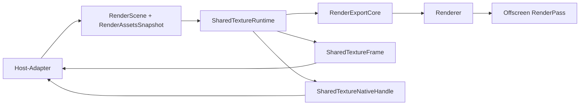

# API der Render-wgpu-Crate

## Ueberblick

`fs25_auto_drive_render_wgpu` enthaelt den host-neutralen wgpu-Renderer-Kern. Die Crate konsumiert ausschliesslich read-only Render-Snapshots (`RenderScene` + `RenderAssetsSnapshot`) und kennt weder `egui`, `eframe` noch Flutter-spezifische SDK-Typen.

Seit dem Shared-Texture-Hard-Cut ist der alte RGBA-Pixelbuffer-Pfad entfernt. Offscreen-Hosts nutzen jetzt ausschliesslich `SharedTextureRuntime` mit explizitem Acquire/Release-Lifecycle. Die ABI-Versionierung des opaque Runtime-Vertrags sitzt bewusst im FFI-Adapter; der egui-Onscreen-Host bleibt ein direkter `RenderPass`-Pfad ueber denselben RenderFrame-Seam.

## Kompatibilitaet (Stand: 2026-04-06)

- Rust-Edition: `2024`
- GPU-Backend: `wgpu 29.0.*`
- Pipeline-Layouts nutzen die aktuellen `wgpu`-29-Deskriptoren (`bind_group_layouts` mit `Option`, `immediate_size`, `multiview_mask`).

## Komponenten

| Komponente | Verantwortung |
|---|---|
| `lib.rs` | Oeffentliche Root-API (`Renderer`, `RendererTargetConfig`, Shared-Texture-Typen) |
| `export_core.rs` | Interner, transportneutraler Export-Kern (Target-Guards, Background-Sync, Offscreen-Renderpass) |
| `shared_texture.rs` | Shared-Texture-Runtime mit Frame-Lifecycle und opaque Runtime-Handle-Metadaten |
| `background_renderer.rs` | Hintergrund-Quad, Upload und zoomabhaengiges Sampling |
| `marker_renderer.rs` | Marker-Instancing und Pin-Texturpfad |
| `connection_renderer/` | Linien, Pfeile und Viewport-Culling fuer Verbindungen |
| `node_renderer.rs` | Node-Instancing und Selektion-Rendering |
| `texture.rs` | Texture-/Sampler-Erstellung aus `DynamicImage` |

## Oeffentliche Typen

| Typ | Zweck |
|---|---|
| `Renderer` | Host-neutraler GPU-Renderer fuer `RenderScene` |
| `RendererTargetConfig` | Zielkonfiguration des Render-Targets (`color_format`, `sample_count`) |
| `SharedTextureRuntime` | Offscreen-Shared-Texture-Runtime ohne CPU-Readback |
| `SharedTextureFrame` | Metadaten eines gerenderten/geleasten Shared-Texture-Frames |
| `SharedTextureNativeHandle` | Opaque Runtime-Pointerwerte (`texture_ptr`, `texture_view_ptr`) fuer denselben Prozessraum |
| `SharedTexturePixelFormat` | Aktuell fest verdrahtet: `Rgba8Srgb` |
| `SharedTextureAlphaMode` | Aktuell fest verdrahtet: `Premultiplied` |
| `SharedTextureError` | Fehler fuer Groesse, Viewport-Mismatch und Frame-Lease-Lifecycle |
| `BackgroundWorldBounds` | Weltkoordinaten des Background-Quads im 2D-Koordinatensystem des Render-Core (`x/y`) |
| `RenderScene` | Re-exportierter per-frame Render-Vertrag aus `fs25_auto_drive_engine::shared` |
| `RenderQuality` | Re-exportierte Qualitaetsstufe des Render-Vertrags |

## Oeffentliche Re-Exports

- `pub use fs25_auto_drive_engine::shared;` - Zugriff auf den stabilen Snapshot-Vertrag aus derselben Crate-Oberflaeche

## Oeffentliche Methoden

| Signatur | Zweck |
|---|---|
| `Renderer::new(device, queue, target_config)` | Erstellt den Renderer mit raw `wgpu` und initialisiert alle Sub-Renderer |
| `Renderer::render_scene(device, queue, render_pass, scene)` | Rendert den aktuellen `RenderScene`-Snapshot |
| `Renderer::set_background(device, queue, image, world_bounds, scale)` | Setzt oder aktualisiert das Background-Asset im Kern |
| `Renderer::clear_background()` | Entfernt das Background-Asset |
| `SharedTextureRuntime::new(device, queue, size)` | Erstellt eine Offscreen-Shared-Texture-Runtime |
| `SharedTextureRuntime::resize(device, size)` | Realloziert das Offscreen-Ziel bei Groessenaenderung |
| `SharedTextureRuntime::render_frame(device, queue, scene, assets)` | Synchronisiert Assets revisionsbasiert und rendert den Frame in die Shared-Texture |
| `SharedTextureRuntime::acquire_frame()` | Leased den zuletzt gerenderten Frame fuer den Host |
| `SharedTextureRuntime::release_frame(frame_token)` | Gibt den aktiven Frame-Lease wieder frei |
| `SharedTextureRuntime::frame()` | Liefert die Metadaten des zuletzt gerenderten Frames ohne Lease-Aenderung |
| `SharedTextureRuntime::native_handle(frame_token)` | Liefert opaque Runtime-Pointerwerte fuer den aktiven Lease |

## Shared-Texture-Vertrag

- Offscreen-Farbformat: `wgpu::TextureFormat::Rgba8UnormSrgb`
- Sample-Count: `1`
- Clear-Farbe: transparentes Schwarz
- Exportierter Alpha-Modus: `Premultiplied`
- Exportiertes Pixel-Format: `RGBA8 sRGB`
- Zielgroessen werden gegen `0` und `max_texture_dimension_2d` validiert.
- Background-Sync ist revisionsbasiert ueber `RenderAssetsSnapshot::background_asset_revision()` und `background_transform_revision()`.
- Acquire/Release ist explizit: Solange ein Frame geleast ist, blockiert die Runtime `render_frame()` und `resize()` mit `SharedTextureError::FrameInUse`.
- `SharedTextureNativeHandle` enthaelt opaque Runtime-Pointerwerte fuer denselben Prozessraum, keine backend-nativen Vulkan-/Metal-/DX-Interop-Handles.
- Die Versionierung dieses opaque Runtime-Vertrags liegt bewusst im FFI-Adapter (`FS25AD_HOST_BRIDGE_SHARED_TEXTURE_CONTRACT_VERSION = 3`).
- `SharedTextureRuntime` ist der einzige Offscreen-Transportpfad im Rust-Repo; ein Pixelbuffer-Fallback existiert nicht mehr.
- Domain-X/Z wird intern auf Render-X/Y umgelegt (`min_z/max_z -> min_y/max_y`).

## Beispiel

```rust
let target_config = RendererTargetConfig::new(surface_format, 4);
let mut renderer = Renderer::new(device, queue, target_config);
renderer.render_scene(device, queue, render_pass, &scene);

let mut runtime = SharedTextureRuntime::new(device, queue, [800, 600])?;
runtime.render_frame(device, queue, &scene, &assets)?;
let frame = runtime.acquire_frame()?;
let native = runtime.native_handle(frame.frame_token)?;
runtime.release_frame(frame.frame_token)?;
assert!(native.texture_ptr > 0);
```

## Datenfluss



## Scope

- Diese Crate enthaelt nur den GPU-Kern und keine Host-Callback-Logik.
- Host-spezifische Adapter (egui-Callback, C-ABI, Flutter-Glue) bleiben in den Host-Crates.
- `SharedTextureRuntime` ersetzt den frueheren Pixelbuffer-Pfad vollstaendig.
- Der egui-Onscreen-Pfad bleibt bewusst ein direkter `RenderScene`-Paint-Callback ueber `egui_wgpu` und wird nicht als Shared-Texture-Transport beschrieben.
