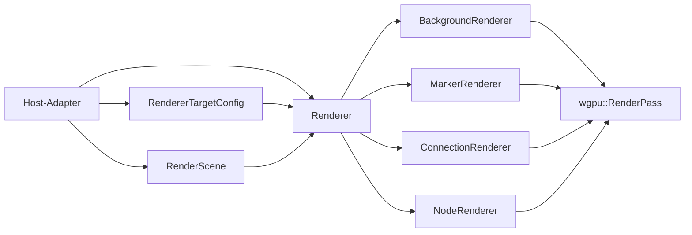

# API der Render-wgpu-Crate

## Ueberblick

`fs25_auto_drive_render_wgpu` enthaelt den host-neutralen wgpu-Renderer-Kern. Die Crate konsumiert ausschliesslich read-only Render-Snapshots (`RenderScene`) und raw `wgpu`-Typen, kennt aber kein `egui`, `eframe` oder Flutter-SDK.

Die Crate ist bewusst klein an der Oberflaeche und gross im Inneren: Hosts reichen nur `RendererTargetConfig`, `RenderScene` und optionale Background-Uploads hinein; Batching, Culling, Draw-Reihenfolge und GPU-Ressourcen bleiben vollstaendig innerhalb des Kerns.

Seit Slice 1 des portablen Native-Canvas-Pfads enthaelt die Crate zusaetzlich eine gemeinsame Offscreen-Canvas-Runtime. Sie konsumiert denselben read-only Render-Vertrag (`RenderScene` + `RenderAssetsSnapshot`), synchronisiert Background-Assets revisionsbasiert und liefert dicht gepackte RGBA-Frames mit blocking Readback fuer FFI- oder Flutter-Hosts.

## Kompatibilitaet (Stand: 2026-04-05)

- Rust-Edition: `2024`
- GPU-Backend: `wgpu 29.0.*`
- Pipeline-Layouts nutzen die aktuellen `wgpu`-29-Deskriptoren (`bind_group_layouts` mit `Option`, `immediate_size`, `multiview_mask`).

## Komponenten

| Komponente | Verantwortung |
|---|---|
| `lib.rs` | Oeffentliche Root-API (`Renderer`, `RendererTargetConfig`, Re-Exports) |
| `canvas.rs` | Offscreen-Canvas-Runtime, RGBA-Readback und Canvas-Frame-Typen |
| `background_renderer.rs` | Hintergrund-Quad, Upload und zoomabhaengiges Sampling |
| `marker_renderer.rs` | Marker-Instancing und Pin-Texturpfad |
| `connection_renderer/` | Linien, Pfeile und Viewport-Culling fuer Verbindungen |
| `node_renderer.rs` | Node-Instancing und Selektion-Rendering |
| `texture.rs` | Texture-/Sampler-Erstellung aus `DynamicImage` |

## Oeffentliche Typen

| Typ | Zweck |
|---|---|
| `Renderer` | Host-neutraler GPU-Renderer fuer `RenderScene` |
| `RendererTargetConfig` | Zielkonfiguration des Render-Targets (`color_format`, `sample_count`) |
| `CanvasRuntime` | Offscreen-Canvas mit RGBA-Readback fuer portable Hosts |
| `CanvasFrame` | CPU-seitig gepufferter letzter RGBA-Frame |
| `CanvasFrameInfo` | Explizite Frame-Metadaten (`width`, `height`, `bytes_per_row`, Pixel-/Alpha-Modus) |
| `CanvasPixelFormat` | Aktuell fest verdrahtet: `Rgba8Srgb` |
| `CanvasAlphaMode` | Aktuell fest verdrahtet: `Premultiplied` |
| `CanvasError` | Fehler fuer Groesse, Device-Limits, Viewport-Mismatch und endliche Readback-Waits |
| `BackgroundWorldBounds` | Weltkoordinaten des Background-Quads im 2D-Koordinatensystem des Render-Core (`x/y`) |
| `RenderScene` | Re-exportierter per-frame Render-Vertrag aus `fs25_auto_drive_engine::shared` |
| `RenderQuality` | Re-exportierte Qualitaetsstufe des Render-Vertrags |

## Oeffentliche Re-Exports

- `pub use fs25_auto_drive_engine::shared;` — Zugriff auf den stabilen Snapshot-Vertrag aus derselben Crate-Oberflaeche

## Oeffentliche Methoden

| Signatur | Zweck |
|---|---|
| `Renderer::new(device, queue, target_config)` | Erstellt den Renderer mit raw `wgpu` und initialisiert alle Sub-Renderer |
| `Renderer::render_scene(device, queue, render_pass, scene)` | Rendert den aktuellen `RenderScene`-Snapshot |
| `Renderer::set_background(device, queue, image, world_bounds, scale)` | Setzt oder aktualisiert das Background-Asset im Kern |
| `Renderer::clear_background()` | Entfernt das Background-Asset |
| `CanvasRuntime::new(device, queue, size)` | Erstellt ein Offscreen-Target mit `Rgba8UnormSrgb` und Sample-Count `1` |
| `CanvasRuntime::resize(device, size)` | Realloziert Offscreen-Target und Readback-Buffer |
| `CanvasRuntime::render_frame(device, queue, scene, assets)` | Synchronisiert Background-Assets revisionsbasiert, rendert transparenten Offscreen-Frame und liest ihn blocking als RGBA aus |
| `CanvasRuntime::frame()` | Liefert den zuletzt erfolgreich gerenderten Frame |

## Canvas-Vertrag

- Offscreen-Farbformat: `wgpu::TextureFormat::Rgba8UnormSrgb`
- Sample-Count: `1`
- Clear-Farbe: transparentes Schwarz
- Exportierte Pixel: Top-down, dicht gepackt, `bytes_per_row = width * 4`
- Exportierter Alpha-Modus: `Premultiplied`
- Exportiertes Pixel-Format: `RGBA8 sRGB`
- Canvas-Groessen werden gegen `0`, `max_texture_dimension_2d`, `max_buffer_size` und Integer-Overflow validiert, bevor Textur- oder Buffer-Allokationen erfolgen.
- Background-Sync: revisionsbasiert ueber `RenderAssetsSnapshot::background_asset_revision()` und `background_transform_revision()`
- Der blocking Readback wartet nur endlich und meldet Poll-/Callback-Timeouts explizit als `CanvasError`.
- Domain-X/Z wird intern auf Render-X/Y umgelegt (`min_z/max_z -> min_y/max_y`)

## Beispiel

```rust
let target_config = RendererTargetConfig::new(surface_format, 4);
let mut renderer = Renderer::new(device, queue, target_config);

renderer.render_scene(device, queue, render_pass, &scene);

let mut canvas = CanvasRuntime::new(device, queue, [800, 600])?;
let frame = canvas.render_frame(device, queue, &scene, &assets)?;
assert_eq!(frame.info.bytes_per_row, 800 * 4);
```

## Datenfluss



## Scope

- Diese Crate enthaelt nur den GPU-Kern und keine Host-Callback-Logik.
- Host-spezifische Adapter (z. B. egui `CallbackTrait`) bleiben in den Frontend-Crates.
- Portable Canvas-Hosts erzeugen und verwalten ihre wgpu-Instanz ausserhalb dieser Crate; `CanvasRuntime` kapselt nur Offscreen-Target, Asset-Sync, Draw und Readback.
- Engine-seitige Background-Bounds mit X/Z-Achsen werden vor `set_background()` im jeweiligen Host-Adapter auf die 2D-X/Y-Welt des Render-Core abgebildet.
