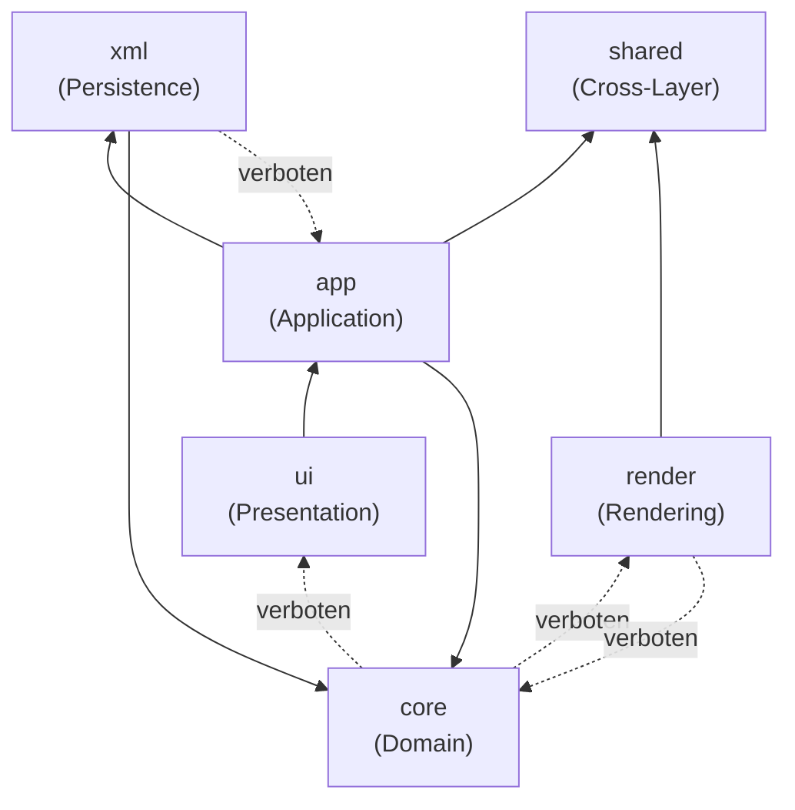
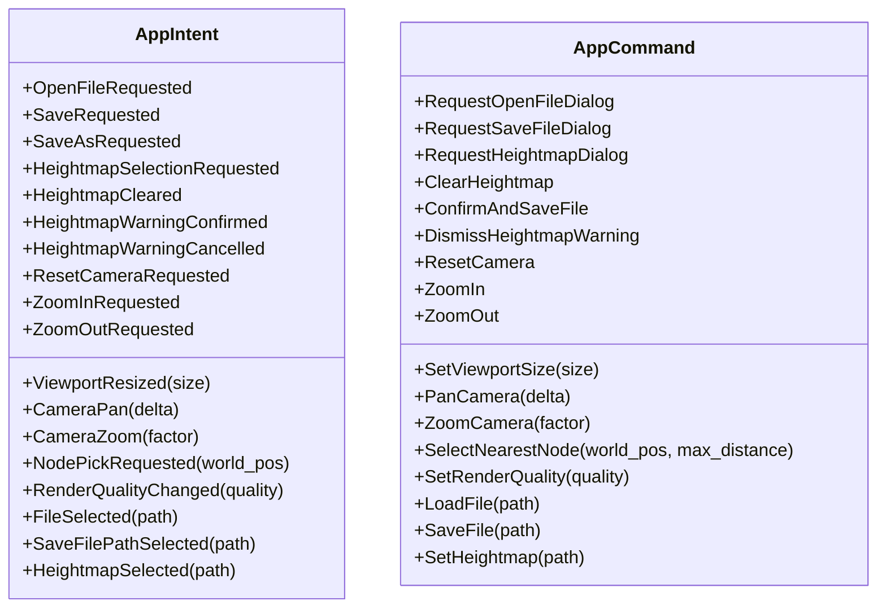
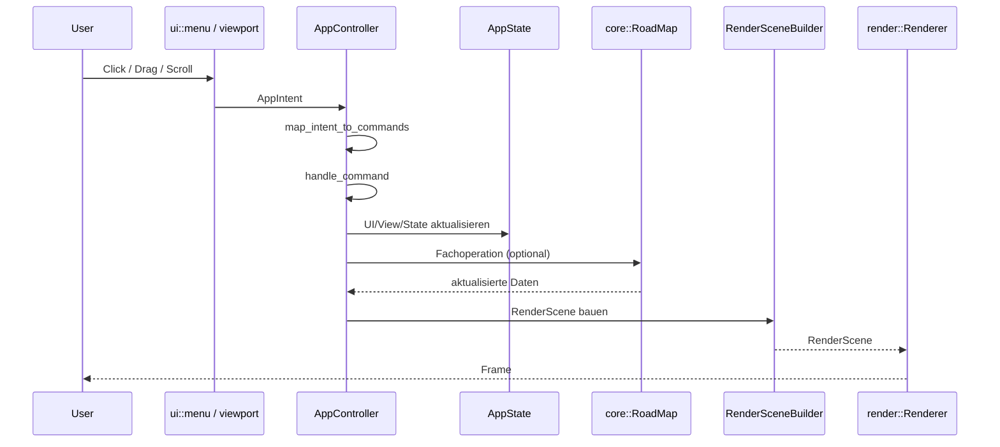
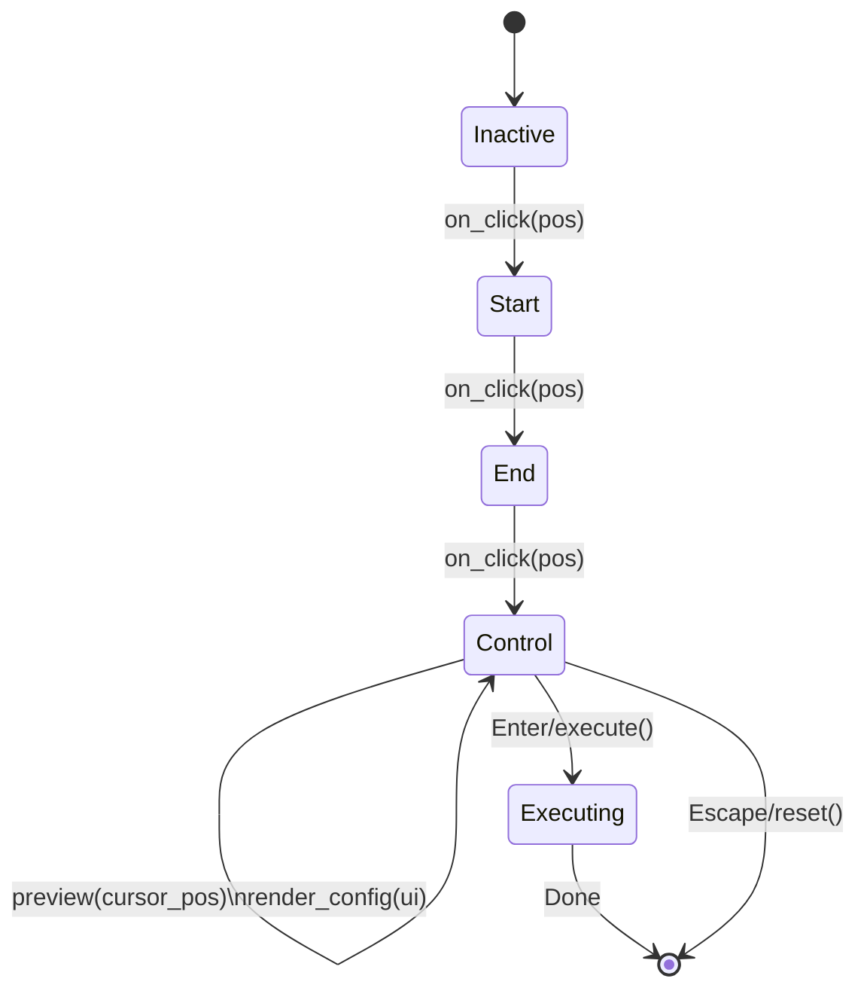
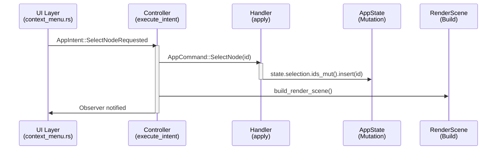

# Architektur-Plan (Soll-Zustand)

Stand: 2026-02-23  
Status: Umgesetzt — Architektur-Grenzen und API-Verträge aktiv durchgesetzt

## Zielbild

Dieser Plan trennt strikt in fünf Schichten plus ein geteiltes Shared-Modul:
- UI (`src/ui/*`): Darstellung + Intent-Erzeugung
- Application (`src/app/*`): Event-Verarbeitung + Orchestrierung + Use-Cases
- Domain (`src/core/*`): Datenmodell + Fachlogik
- Persistence (`src/xml/*`): XML-Mapping und I/O
- Rendering (`src/render/*`): GPU-Darstellung aus vorbereiteten Renderdaten
- Shared (`src/shared/*`): Gemeinsame Typen (RenderScene, RenderQuality)

Kernfluss: **Input -> AppIntent -> AppController -> AppCommand -> AppState/Domain -> RenderScene -> Renderer**.

## Systemübersicht

```mermaid
flowchart LR
  subgraph UI[UI Layer (egui)]
    MENU[menu.rs]
    STATUS[status.rs]
    VIEWPORT[Viewport Input]
  end

  subgraph APP[Application Layer]
    EVENTS[AppIntent]
    CMDS[AppCommand]
    CTRL[AppController]
    STATE[AppState]
    SCENEB[RenderSceneBuilder]
  end

  subgraph CORE[Domain Layer]
    ROAD[RoadMap]
    NODE[MapNode]
    CONN[Connection]
    MARKER[MapMarker]
    META[AutoDriveMeta]
  end

  subgraph INFRA[Infrastructure]
    XML[xml::parser / xml::writer]
    RENDER[render::Renderer]
  end

  MENU --> EVENTS
  VIEWPORT --> EVENTS
  EVENTS --> CTRL
  CTRL --> CMDS
  CMDS --> CTRL
  CTRL --> STATE
  CTRL --> CORE
  CORE --> CTRL
  CTRL --> SCENEB
  SCENEB --> RENDER

  XML --> CORE
  CORE --> XML

  STATUS -. read-only .-> STATE
```

### Layer-Grenzen (erlaubte Import-Richtungen)



> **Regel:** Pfeile zeigen "darf importieren". Gestrichelt = explizit verboten (CI-geprüft via `scripts/check_layer_boundaries.sh`).


### UI Layer (`src/ui/*`)
**Verantwortung**
- Panels, Menüs, Viewport-HUD anzeigen
- Benutzeraktionen in `AppIntent` übersetzen

**Modul-Aufbau:**
- `input.rs` — Orchestrator, delegiert an Sub-Module
  - `keyboard.rs` — Tastatur-Shortcuts (Delete, Escape, Ctrl+A)
  - `drag.rs` — Drag-Operationen (Pan, Move, Rect-/Lasso-Selektion)
  - `context_menu.rs` — Rechtsklick-Kontextmenü
- `menu.rs` — Top-Menü-Leiste
- `status.rs` — Statusleiste
- `toolbar.rs` — Werkzeugleiste
- `properties.rs` — Properties-Panel
  - intern modularisiert über `properties/`-Submodule (u. a. Selektoren und Distanzen-Panel)
- `options_dialog.rs` — Optionen-Dialog (Farben, Größen, Zoom)
- `tool_preview.rs` — Tool-Preview-Overlay (Route-Tool-Vorschau im Viewport)
- `dialogs.rs` — Datei-Dialoge und modale Fenster

**Darf**
- Read-only auf UI/View-Teile von `AppState`
- Events an Application Layer senden
- Nur aus `app` importieren (re-exportierte Core-Typen)

**Darf nicht**
- `core` direkt importieren
- `RoadMap` direkt mutieren
- XML lesen/schreiben
- Renderer direkt steuern

### Application Layer (`src/app/*`)
**Verantwortung**
- Zentrale Event-Verarbeitung (`AppController`)
- Use-Cases (Load/Save, Kamera, Selektion, Heightmap, Tools)
- Aufbau von `RenderScene` aus Domain + ViewState
- Re-Export von Core-Typen für UI (z.B. `ConnectionDirection`, `ConnectionPriority`, `RoadMap`)

**Use-Case-Module:**
- `use_cases/file_io.rs` — Laden, Speichern, Heightmap-Warnung
- `use_cases/camera.rs` — Kamera-Operationen
- `use_cases/viewport.rs` — Viewport-Logik
- `use_cases/heightmap.rs` — Heightmap-Laden und Konfiguration
- `use_cases/selection/` — Selektions-Use-Cases
- `use_cases/editing/` — Editing-Use-Cases
- `state.rs` — Fassade; Typen in `state/{app_state,dialogs,editor,selection,view}.rs`

### Overview-Crate (`crates/fs25_map_overview/src/*`)
**Verantwortung**
- Generierung der Übersichtsmap (Terrain-Komposition + optionale Overlays)

**Modulnotiz**
- `composite.rs` wird schrittweise in `composite/`-Submodule zerlegt (Start mit `legend.rs`).

**Darf**
- Domain-API aufrufen
- XML-Use-Cases ausführen
- Renderer nur über `RenderScene` beliefern

### Domain/Core Layer (`src/core/*`)
**Verantwortung**
- Fachmodell (`RoadMap`, Knoten/Kanten, Marker, Meta)
- Invarianten und Regeln (IDs, Flags, Verbindungslogik)
- Deterministische Queries

**Darf nicht**
- UI-/egui-Typen kennen
- wgpu/Renderer-Typen kennen
- Dateidialoge oder direkte I/O enthalten

### Persistence Layer (`src/xml/*`)
**Verantwortung**
- XML <-> Domain Mapping (SoA, Delimiter-Regeln, Flag-Bereinigung)
- Datei-Ein-/Ausgabe für AD-Konfigurationen

**Darf nicht**
- UI- oder Kamera-Entscheidungen treffen
- Renderlogik enthalten

### Rendering Layer (`src/render/*`)
**Verantwortung**
- GPU-Ressourcen, Batching, Draw-Calls, Culling
- Darstellung auf Basis von `RenderScene`
- **Shader-Deduplication:** `shaders.wgsl` wird einmal in `Renderer::new()` geladen und an alle Sub-Renderer weitergegeben

**Darf nicht**
- Domain mutieren
- XML/Datei-I/O durchführen

## API-Verträge (Ist)

### Intent/Command-Vertrag



### Application API

```text
pub struct AppController;

impl AppController {
  pub fn handle_intent(&mut self, state: &mut AppState, intent: AppIntent) -> anyhow::Result<()>;
  pub fn handle_command(&mut self, state: &mut AppState, command: AppCommand) -> anyhow::Result<()>;
  pub fn build_render_scene(&self, state: &AppState, viewport_size: [f32; 2]) -> RenderScene;
}
```

```text
pub struct AppState {
  pub road_map: Option<Arc<RoadMap>>,
  pub view: ViewState,
  pub ui: UiState,
  pub selection: SelectionState,
  pub editor: EditorToolState,
  pub command_log: CommandLog,
  pub history: EditHistory,
  pub options: EditorOptions,
  pub show_options_dialog: bool,
  pub should_exit: bool,
}
```

```text
pub struct ViewState {
  pub camera: Camera2D,
  pub viewport_size: [f32; 2],
  pub render_quality: RenderQuality,
  pub background_map: Option<Arc<BackgroundMap>>,
  pub background_visible: bool,
  pub background_scale: f32,
  pub background_dirty: bool,  // Signalisiert GPU-Upload erforderlich
}
```

```text
pub struct SelectionState {
  pub selected_node_ids: Arc<HashSet<u64>>,
  pub selection_anchor_node_id: Option<u64>,
}
```

### Render-Vertrag

```text
pub struct RenderScene {
  pub road_map: Option<Arc<RoadMap>>,
  pub camera: Camera2D,
  pub viewport_size: [f32; 2],
  pub render_quality: RenderQuality,
  pub selected_node_ids: Arc<HashSet<u64>>,
  pub connect_source_node: Option<u64>,
  pub background_map: Option<Arc<BackgroundMap>>,
  pub background_visible: bool,
  pub options: EditorOptions,
}

impl Renderer {
  pub fn render_scene(
    &mut self,
    device: &wgpu::Device,
    queue: &wgpu::Queue,
    render_pass: &mut wgpu::RenderPass<'static>,
    scene: &RenderScene,
  );
}
```

## Event- und Render-Fluss



## Abhängigkeitsregeln

```mermaid
flowchart LR
  UI --> APP
  APP --> CORE
  APP --> XML
  APP --> SHARED
  RENDER --> SHARED
  XML --> CORE

  CORE -.x.-> UI
  CORE -.x.-> RENDER
  RENDER -.x.-> CORE
  XML -.x.-> APP
  RENDER -.x.-> UI
  UI -.x.-> XML
```

Verbindliche Regeln:
1. UI spricht nur mit `app` (`AppIntent` + read-only State) und `shared` (z.B. `EditorOptions`). **Kein direkter `core`-Import.**
2. Domain (`core`) kennt keine Infrastruktur (UI/Render/XML-Details).
3. Renderer konsumiert nur `RenderScene` und importiert `Camera2D`/`RoadMap` aus `core` (nicht aus `app`).
4. XML bleibt technisch; fachliche Entscheidungen liegen in `core`/`app`.
5. `AppState` enthält keine I/O-Logik; Dateisystem-Operationen sind in `use_cases::file_io` zentralisiert.
6. Renderer darf keine UI-Typen importieren. **Ausnahme:** `render/callback.rs` implementiert `egui_wgpu::CallbackTrait` — das ist die wgpu-Brücke zwischen egui und dem Rendering-System, kein semantischer UI-Import.
6. `app/mod.rs` re-exportiert alle Core-Typen, die UI benötigt (z.B. `ConnectionDirection`, `ConnectionPriority`, `RoadMap`).
7. `shared`-Modul enthält Typen, die von mehreren Layern genutzt werden (`RenderScene`, `RenderQuality`).

## Aktuelle Modulstruktur

```text
src/
  app/
    mod.rs              # Re-Exports (ConnectionDirection, ConnectionPriority, RoadMap, etc.)
    controller.rs       # AppController: Intent → Command Dispatch an Handler
    events.rs           # AppIntent & AppCommand Enums
    state.rs            # AppState, ViewState, SelectionState, UiState, MarkerDialogState, DedupDialogState
    render_scene.rs     # RenderScene-Builder
    command_log.rs      # Command-Log für Debugging
    history.rs          # Undo/Redo-History
    intent_mapping.rs   # Intent → Command Mapping (reine Funktion)
    handlers/           # Feature-Handler für Command-Verarbeitung
      mod.rs
      file_io.rs        # Datei-Operationen (Öffnen, Speichern, Heightmap)
      view.rs           # Kamera, Viewport, Background-Map
      selection.rs       # Selektions-Operationen
      editing.rs        # Node/Connection-Editing, Marker
      route_tool.rs     # Route-Tool-Operationen
      dialog.rs         # Dialog-State und Anwendungssteuerung
      history.rs        # Undo/Redo
    tools/
      mod.rs            # RouteTool-Trait + ToolManager + snap_to_node()
      common/           # Gemeinsame Tool-Infrastruktur (alle Submodule privat)
        mod.rs          # Re-Exporte
        geometry.rs     # angle_to_compass, populate_neighbors
        tangent.rs      # TangentSource, TangentState, render_tangent_combo
        lifecycle.rs    # ToolLifecycleState, SegmentConfig, LastEdited
        builder.rs      # assemble_tool_result
      curve/
        mod.rs          # Bézier-Kurven-Tool (Grad 2 + 3) — Einstiegspunkt
        state.rs        # CurveTool Struct, Enums, Konstruktor
        lifecycle.rs    # RouteTool-Implementierung
        drag.rs         # Drag-Logik (Steuerpunkt-Verschiebung)
        config_ui.rs    # egui-Konfigurationspanel
        geometry.rs     # Bézier-Mathe (Interpolation, Tangenten)
        tests.rs        # Unit-Tests
      spline/
        mod.rs          # Catmull-Rom-Spline-Tool — Einstiegspunkt
        state.rs        # SplineTool Struct, Konstruktor
        lifecycle.rs    # RouteTool-Implementierung
        config_ui.rs    # egui-Konfigurationspanel
        geometry.rs     # Spline-Geometrie (Arc-Length-Resampling)
        tests.rs        # Unit-Tests
      straight_line/
        mod.rs          # Gerade-Linie-Tool — Einstiegspunkt
        state.rs        # StraightLineTool Struct, Konstruktor
        lifecycle.rs    # RouteTool-Implementierung
        config_ui.rs    # egui-Konfigurationspanel
        geometry.rs     # Linien-Geometrie
        tests.rs        # Unit-Tests
    use_cases/
      mod.rs
      file_io.rs        # Load, Save, Heightmap-Warnung, Dateipfad-Handling
      heightmap.rs      # Heightmap-Laden und Konfiguration
      viewport.rs       # Viewport-Resize
      camera.rs         # Kamera-Reset, Zoom, Pan
      background_map.rs # Background-Map laden/konfigurieren
      selection/        # Selektions-Use-Cases (Pick, Rect, Lasso, Segment, Move)
      editing/          # Editing-Use-Cases (Connect, Delete, Direction, Priority, Marker, Route-Tool)
  core/
    mod.rs
    camera.rs           # Camera2D + pick_radius_world()
    node.rs             # MapNode, NodeFlag
    connection.rs       # Connection, ConnectionDirection, ConnectionPriority
    road_map.rs         # RoadMap (HashMap-basiert, lazy Spatial-Index-Rebuild)
    road_map/
      dedup.rs          # Duplikat-Erkennung und -Bereinigung
      tests.rs          # Unit-Tests für RoadMap
    spatial.rs          # SpatialIndex (kiddo KD-Tree)
    heightmap.rs        # Heightmap + bikubische Interpolation
    map_marker.rs       # MapMarker
    meta.rs             # AutoDriveMeta
  xml/
    mod.rs
    parser.rs           # parse_autodrive_config()
    parser/
      tests.rs          # Unit-Tests für Parser
    writer.rs           # write_autodrive_config()
  render/
    mod.rs
    node_renderer.rs    # GPU-Instanced Nodes
    connection_renderer.rs  # Verbindungslinien + Pfeile
    background_renderer.rs  # Background-Map-Quad mit Texture
    marker_renderer.rs  # GPU-Instanced Map-Marker (Pin-Symbole)
    texture.rs          # Texture-Erstellung aus DynamicImage
    callback.rs         # wgpu Render-Callback für egui
    types.rs            # GPU-Typen, RenderContext, Konstanten
    shaders.wgsl        # WGSL Shader (Node, Connection, Background, Marker)
  shared/
    mod.rs
    render_scene.rs     # RenderScene (Übergabevertrag App → Render)
    render_quality.rs   # RenderQuality Enum
    options.rs          # Zentrale Konfigurationskonstanten + EditorOptions
  ui/
    mod.rs
    menu.rs             # Top-Menü
    status.rs           # Statusleiste
    toolbar.rs          # Werkzeugleiste
    properties.rs       # Properties-Panel
    input.rs            # Input-Orchestrator
    keyboard.rs         # Tastatur-Shortcuts
    drag.rs             # Drag-Operationen
    context_menu.rs     # Rechtsklick-Kontextmenü
    dialogs.rs          # Datei-Dialoge
    options_dialog.rs   # Optionen-Dialog
    tool_preview.rs     # Tool-Preview-Overlay
```

**Hinweis:** `Camera2D` lebt in `core/camera.rs` (reiner Geometrie-Typ). `app` re-exportiert ihn für Abwärtskompatibilität.

## Umsetzungsphasen

### Phase 1: Intent-Grenze ✅
- `AppIntent` als einziges UI->App Übergabeformat etabliert
- UI von direkten Domain-Mutationen entkoppelt
- Input-Sammeln in `collect_app_events(...)` gekapselt

### Phase 2: Controller-Zentrum ✅
- `AppController::handle_intent(...)` als zentraler Einstieg
- Intent->Command Mapping und `handle_command(...)` eingezogen
- Load/Save, Kamera und Viewport in dedizierte Use-Cases verschoben
- Heightmap-Logik in eigenständigen Use-Case extrahiert

### Phase 3: RenderScene-Vertrag ✅
- `RenderScene` als stabile Schnittstelle app->render eingeführt (in `shared`)
- Renderpfad auf read-only Renderdaten umgestellt
- Orphaned `render/scene.rs` entfernt

### Phase 4: Modularisierung ✅
- UI-Input aufgeteilt in `keyboard`, `drag`, `context_menu` Sub-Module
- Pick-Distanz-Berechnung zentralisiert (`Camera2D::pick_radius_world()`)
- UI importiert nur aus `app` (Core-Typen re-exportiert)
- API-Dokumentation auf aktuellen Stand gebracht

### Phase 5: Edit-Workflow ✅
- Selection/Move/Connect über Intents + Use-Cases implementiert
- Undo/Redo auf Snapshot-Basis (CommandLog/History vorhanden)
- Background-Map-Rendering (DDS/PNG/JPG) mit Use-Cases
- Marker-Rendering + erstellen/löschen via Use-Cases

### Phase 6: Handler-Split + Architektur-Guardrails ✅
- `handle_command()` in Feature-Handler aufgeteilt (`handlers/`)
- Controller ist jetzt schlanker Dispatcher, Logik in Handlern
- UI→Core-Layerverletzung behoben (properties.rs)
- CI-Check-Script für Schichtgrenzen (`scripts/check_layer_boundaries.sh`)
- Alle unwrap()-Aufrufe in Produktionscode durch graceful handling ersetzt
- Route-Tool-Intents: `RouteToolClicked`, `RouteToolExecuteRequested`, `RouteToolCancelled`, `SelectRouteToolRequested`, `RouteToolConfigChanged`
- Duplikat-Erkennung: `DeduplicateConfirmed`, `DeduplicateCancelled`
- Optionen-Dialog: `OpenOptionsDialogRequested`, `CloseOptionsDialogRequested`, `OptionsChanged`, `ResetOptionsRequested`

## Definition of Done

- Keine Domain-Mutationslogik in `ui`.
- `main.rs` enthält nur Bootstrap/Wiring.
- Alle User-Interaktionen laufen über `AppIntent`.
- Renderer arbeitet ohne direkten Domain-Zugriff.
- XML-Funktionalität ist unabhängig von UI/Render testbar.

## Nicht-Ziele

- Kein vollständiger Renderer-Rewrite in einem Schritt
- Kein Big-Bang-Umbau aller Tools
- Kein Wechsel des Dateiformats

---

## Detaillierte Diagramme

### Tool-Lifecycle (RouteTool-Pattern)



### Command-Intent-Flow



### Layer-Isolation (Compile-Time Guardrails)

```mermaid
graph TB
    UI["🎨 UI Layer<br/>context_menu, keyboard, dialogs<br/>→ emits AppIntent"]
    APP["⚙️ App Layer<br/>controller, handlers, use_cases<br/>→ mutates AppState"]
    CORE["💾 Core Layer<br/>road_map, node, connection<br/>→ pure data structures"]
    SHARED["🔗 Shared<br/>RenderScene, EditorOptions<br/>→ Schnittstelle"]
    RENDER["🖥️ Render Layer<br/>Vertex/Fragment Shader, GPU Batching<br/>→ consumes RenderScene"]
    XML["📄 XML<br/>parser, writer<br/>→ I/O, unabhängig"]
    
    UI -->|uses| APP
    APP -->|uses| CORE
    APP -->|writes to| SHARED
    RENDER -->|reads from| SHARED
    APP -->|uses| XML
    CORE -->|never| RENDER
    CORE -->|never| UI
    UI -->|never| CORE
    
    style UI fill:#FFC
    style APP fill:#FCF
    style CORE fill:#CFF
    style SHARED fill:#FEE
    style RENDER fill:#FCC
    style XML fill:#EEE
