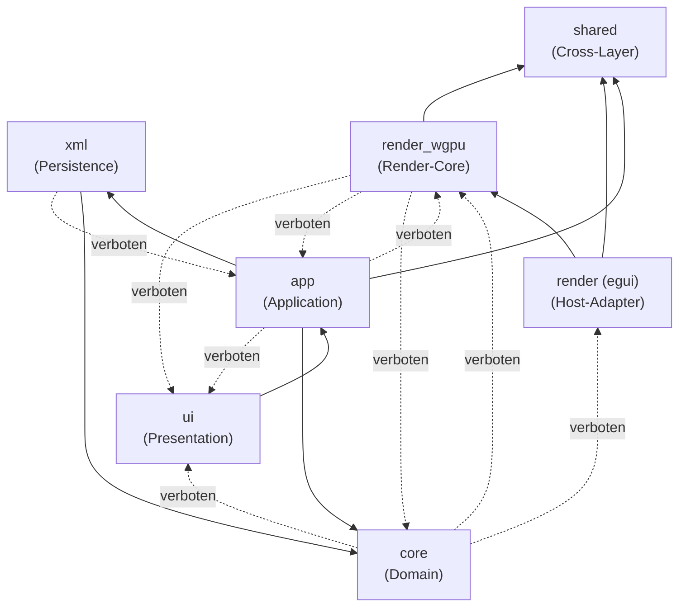
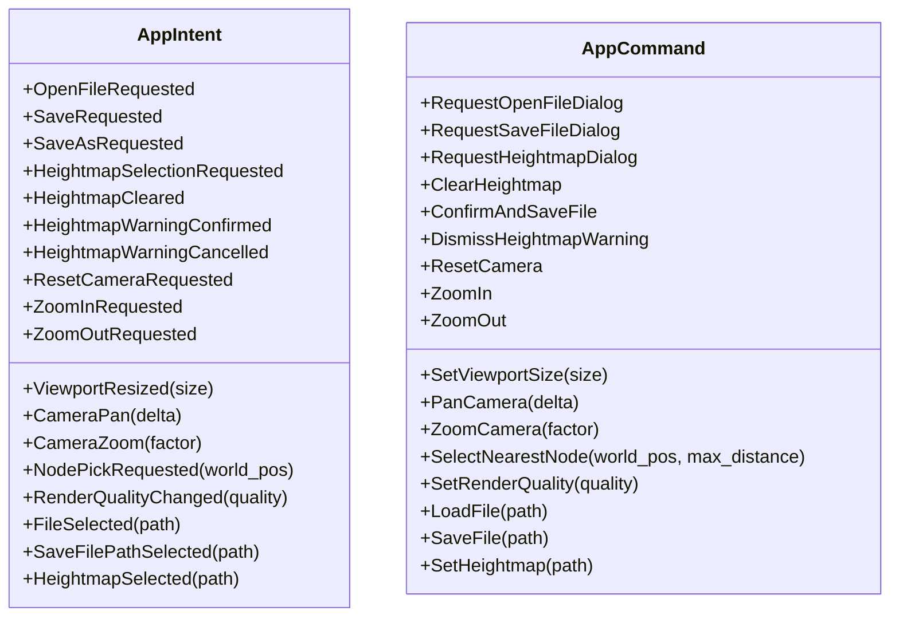
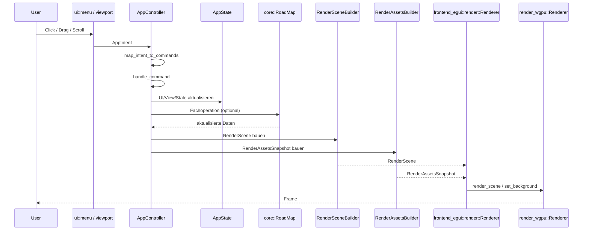
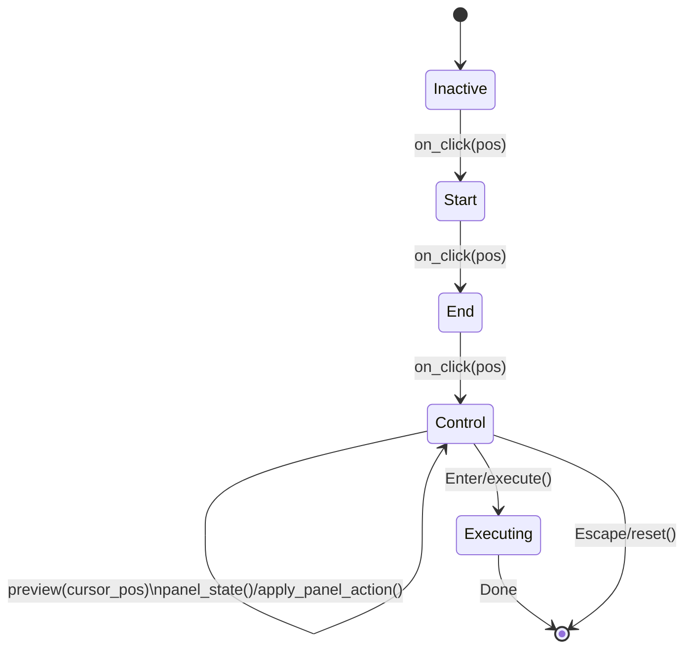
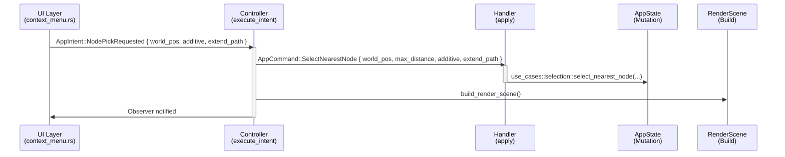
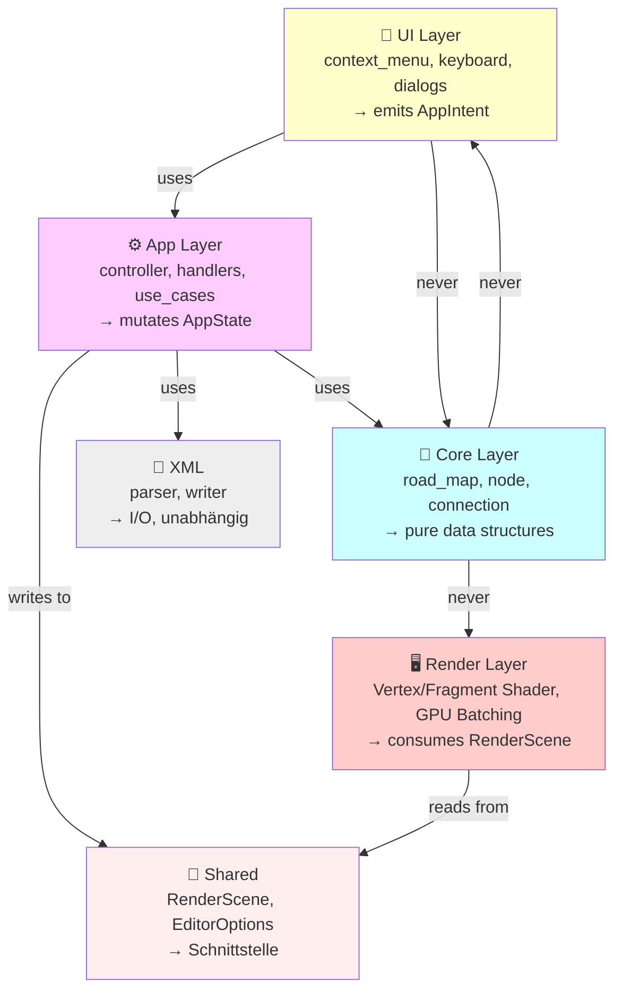

# Architektur-Plan (Soll-Zustand)

Stand: 2026-04-04  
Status: Workspace-Split umgesetzt — Root-Fassade, Engine-Crate, render_wgpu-Core-Crate und egui-Host-Adapter sind stabil; die gemeinsame Host-Bridge-Core-Crate ist als kanonische Session-/Action-/Snapshot-Surface ueber der Engine eingefuehrt, die Host-Adapter-Migration bleibt in Arbeit

## Zielbild

Dieser Plan trennt fachliche Verantwortlichkeiten in Workspace-Crates mit klaren Layern. Das Root-Package bleibt bewusst als duenne Kompat-Fassade und Launcher erhalten:

- Root-Package (`src/lib.rs`, `src/main.rs`): Re-Export-Fassade und nativer Launcher
- Engine (`crates/fs25_auto_drive_engine/src/{app,core,shared,xml}`): host-neutrale Fachlogik
- Host-Bridge-Core (`crates/fs25_auto_drive_host_bridge/src/*`): toolkit-freie gemeinsame Session-/Action-/Snapshot-Seam ueber der Engine
- Render-Core (`crates/fs25_auto_drive_render_wgpu/src/*`): host-neutraler wgpu-Renderer-Kern
- Egui-Frontend (`crates/fs25_auto_drive_frontend_egui/src/{ui,editor_app,runtime,render,host_bridge_adapter}`): Desktop-Host, egui-UI, Render-Adapter und duenne Unified-Bridge-Mapping-Helfer
- Flutter-Bridge (`crates/fs25_auto_drive_frontend_flutter_bridge/src/{session,dto}`): duenne Adapter-/Kompat-Schicht mit Alias-Surface ueber der Host-Bridge
- Overview-Crate (`crates/fs25_map_overview/src/*`): Karten-/Farmland-Generierung

Kernfluss: **Input -> AppIntent -> AppController -> AppCommand -> AppState/Domain -> RenderScene + RenderAssetsSnapshot + HostUiSnapshot + ViewportOverlaySnapshot -> Host-Adapter -> Renderer-Core**.

Die Integrationsschale ist bewusst kein zusaetzlicher Fach-Layer. Sie koordiniert `ui`, `app` und den Host-Adapter in `render`, enthaelt aber keine eigenen Use-Cases oder Domain-Logik.

## Systemübersicht

```mermaid
flowchart LR
  subgraph UI[UI Layer (egui)]
    MENU[menu.rs]
    STATUS[status.rs]
    VIEWPORT[Viewport Input]
  end

  subgraph APP[Application Layer]
    EVENTS[AppIntent]
    CMDS[AppCommand]
    CTRL[AppController]
    STATE[AppState]
    SCENEB[RenderSceneBuilder]
    ASSETB[RenderAssetsBuilder]
  end

  subgraph CORE[Domain Layer]
    ROAD[RoadMap]
    NODE[MapNode]
    CONN[Connection]
    MARKER[MapMarker]
    META[AutoDriveMeta]
  end

  subgraph INFRA[Infrastructure]
    XML[xml::parser / xml::writer]
    RENDER_HOST[frontend_egui::render::Renderer]
    RENDER_CORE[render_wgpu::Renderer]
  end

  MENU --> EVENTS
  VIEWPORT --> EVENTS
  EVENTS --> CTRL
  CTRL --> CMDS
  CMDS --> CTRL
  CTRL --> STATE
  CTRL --> CORE
  CORE --> CTRL
  CTRL --> SCENEB
  CTRL --> ASSETB
  SCENEB --> RENDER_HOST
  ASSETB --> RENDER_HOST
  RENDER_HOST --> RENDER_CORE

  XML --> CORE
  CORE --> XML

  STATUS -. read-only .-> STATE
```

### Layer-Grenzen (erlaubte Import-Richtungen)


```mermaid
graph BT
    CORE["core\n(Domain)"]
    XML["xml\n(Persistence)"]
    APP["app\n(Application)"]
    UI["ui\n(Presentation)"]
    RENDER_HOST["render (egui)\n(Host-Adapter)"]
    RENDER_CORE["render_wgpu\n(Render-Core)"]
    SHARED["shared\n(Cross-Layer)"]

    XML  --> CORE
    APP  --> CORE
    APP  --> XML
    APP  --> SHARED
    UI   --> APP
    RENDER_HOST --> SHARED
    RENDER_HOST --> RENDER_CORE
    RENDER_CORE --> SHARED

    CORE  -.->|verboten| UI
    CORE  -.->|verboten| RENDER_HOST
    CORE  -.->|verboten| RENDER_CORE
    APP   -.->|verboten| UI
    APP   -.->|verboten| RENDER_CORE
    RENDER_CORE -.->|verboten| CORE
    RENDER_CORE -.->|verboten| APP
    RENDER_CORE -.->|verboten| UI
    XML   -.->|verboten| APP
```

> **Regel:** Pfeile zeigen "darf importieren". Gestrichelt = explizit verboten (CI-geprüft via `scripts/check_layer_boundaries.sh`).

### Integrationsschale (`crates/fs25_auto_drive_frontend_egui/src/editor_app/*`, `crates/fs25_auto_drive_frontend_egui/src/runtime.rs`, `src/main.rs`)

**Verantwortung**

- Startet `EditorApp` aus `runtime.rs` heraus und bindet eframe/wgpu ueber den egui-Host-Adapter an den render_wgpu-Kern an
- Sammelt pro Frame Panel-, Dialog-, Viewport- und Overlay-Events als `Vec<AppIntent>`, verarbeitet schalenlokale Events by-value und reicht nur die verbleibenden Intents an `AppController` weiter
- Registriert den Render-Callback und verwaltet nur fensterlokalen Integrationszustand (`render::Renderer`, `ui::InputState`, Cursor-/Icon-Caches)

**Darf**

- `ui`, `app` und `render` koordinieren
- Read-only auf `AppState` zugreifen, wenn Panels oder Overlays Daten benoetigen

**Darf nicht**

- Eigene Fachlogik oder Duplicate-Use-Cases enthalten
- Domain-Daten am `AppController` vorbei mutieren

**API-Hinweis**

- Kanonische Doku: [`../crates/fs25_auto_drive_frontend_egui/src/editor_app/API.md`](../crates/fs25_auto_drive_frontend_egui/src/editor_app/API.md)

### UI Layer (`crates/fs25_auto_drive_frontend_egui/src/ui/*`)

**Verantwortung**

- Panels, Menüs, Viewport-HUD anzeigen
- Benutzeraktionen in `AppIntent` übersetzen

**Modul-Aufbau:**

- `input.rs` — Orchestrator, delegiert an Sub-Module
  - `keyboard.rs` — Tastatur-Shortcuts (Delete, Escape, Ctrl+A, W/G/B/A/R/Z/K fuer Floating-Menues)
  - `drag.rs` — Drag-Operationen (Pan, Move, Rect-/Lasso-Selektion)
  - `context_menu.rs` — Rechtsklick-Kontextmenü
- `common.rs` — Widgetnahe UI-Helfer fuer numerische Eingaben, Mausrad-Impulse und den zentralen Route-Tool-Availability-Kontext
- `menu.rs` — Top-Menü-Leiste
- `status.rs` — Statusleiste
- `defaults_panel.rs` — Linke Sidebar mit Long-Press-Gruppen (Werkzeuge, RouteTool-Gruppen `Basics/Section/Analysis`, Defaults, Hintergrund; 64px breit)
- `long_press.rs` — Wiederverwendbares Long-Press-Dropdown-Widget (`LongPressState`, `LongPressGroup<T>`, `render_long_press_button`)
- `floating_menu.rs` — Schwebendes Kontextmenue an der Mausposition (T/G/B/A/R/Z; `FloatingMenuKind::Tools` bzw. `FloatingMenuKind::RouteTools(RouteToolGroup)`)
- `command_palette.rs` — Zentrales Overlay fuer statische Befehle plus alle katalogsichtbaren Route-Tools; disabled Eintraege bleiben sichtbar und tragen ihren Grund
- `edit_panel.rs` — Kontextabhaengiges Edit-Panel fuer Gruppen-Edit, Streckenteilung und aktives Route-Tool
- `properties.rs` — Properties-Panel
  - intern modularisiert über `properties/`-Submodule (u. a. Selektoren und Distanzen-Panel)
- `options_dialog/` — Optionen-Dialog (modales Fenster plus thematische `sections/*`)
- `tool_preview.rs` — Tool-Preview-Overlay (Route-Tool-Vorschau im Viewport)
- `dialogs.rs` — Datei-Dialoge und modale Fenster

Numerische Mausrad-Interaktion bleibt bewusst im UI-Layer: `ui::common` kapselt Scroll-Auswertung, Modifier-Semantik und Wertanpassung fuer Numeric-Widgets. Route-Tool- und Analysis-Panels reichen weiterhin nur das boolesche Gate `wheel_enabled` weiter; Komma-Float-Felder im Options-Dialog nutzen ueber `apply_wheel_step_default()` repo-weit den Default-Schritt `0.1`, waehrend Felder mit bewusst groberen Prozent-/Grad- oder ganzzahligen Pixel-Schritten ihre expliziten Schrittweiten behalten. Gehoverte Numeric-Widgets konsumieren Raw-/Smooth-Scroll-Impulse bereits in `wheel_dir()`, damit umgebende ScrollAreas kein Scroll-Through zeigen.

**Darf**

- Read-only auf UI/View-Teile von `AppState`
- Events an Application Layer senden
- Aus `app` und seinen expliziten Submodulen importieren; nur die stabile Leseoberflaeche (`Camera2D`, `RoadMap`, `ConnectionDirection`, `ConnectionPriority`, `RenderQuality`, `ZipImageEntry` usw.) bleibt direkt aus `app` re-exportiert, Tool-Vertraege laufen explizit ueber `app::tool_contract`, `app::ui_contract` und `app::tools::*`

**Darf nicht**

- `core` direkt importieren
- `RoadMap` direkt mutieren
- XML lesen/schreiben
- Renderer direkt steuern

### Application Layer (`crates/fs25_auto_drive_engine/src/app/*`)

**Verantwortung**

- Zentrale Event-Verarbeitung (`AppController`)
- Schlanke Event-Fassaden in `events/intent.rs` und `events/command.rs`; die kanonischen Enum-Definitionen liegen in `events/*/definition.rs`, damit Root-Dateien als stabile Einstiegspunkte klein bleiben
- Use-Cases (Load/Save, Kamera, Selektion, Heightmap, Tools)
- Aufbau von `RenderScene` aus Domain + ViewState
- Aufbau von `RenderAssetsSnapshot` als expliziter Asset-Vertrag fuer Host-Adapter
- Aufbau von `HostUiSnapshot` als semantischer Fenster-/Dialog-Vertrag (`PanelState`, `PanelAction`, `DialogRequest`, `DialogResult`)
- Aufbau von `ViewportOverlaySnapshot` als host-neutraler Overlay-Vertrag fuer Tool-/Clipboard-/Gruppen-Overlays
- Schmale Read-only-Fassade fuer UI und Integrationsschale: app-eigene Typen plus bewusst ausgewaehlte Core-/Shared-Typen wie `ConnectionDirection`, `ConnectionPriority`, `RoadMap`, `Camera2D`, `RenderQuality`, `ZipImageEntry`
- Kanonischer RouteTool-Katalog (`tools/catalog.rs`) als Single Source of Truth fuer `RouteToolId`, `RouteToolGroup`, `RouteToolBackingMode`, `RouteToolIconKey`, Surface-Sichtbarkeit und Aktivierungs-Voraussetzungen
- Egui-freier Route-Tool-Panel-Vertrag als stabile Fassade in `ui_contract.rs` und `ui_contract/route_tool_panel.rs`; die eigentlichen DTO-Familien liegen intern in `route_tool_panel/common.rs`, `curve_family.rs`, `generator_family.rs` und `analysis_family.rs`
- Host-neutrale Dialog-/Fenster-Vertraege in `ui_contract/host_ui.rs`; Datei-/Pfad-Dialoge laufen als `DialogRequest`-Queue in `UiState` statt als verteilte `show_*`-Flags
- Host-neutrale Overlay-Vertraege in `ui_contract/viewport_overlay.rs`; Overlay-Ableitung (Route-Preview, Clipboard, Distanzen, Segment-Locks, Group-Boundaries) laeuft zentral im App-Layer statt im Painter
- Konsolidierte Asset-Leseflaeche im `AppState`: `farmland_polygons_arc()`, `farmland_grid_arc()` und `background_image_arc()` kapseln die kanonischen Tool-/Host-Zugriffe; `view.background_map` bleibt Primaerquelle fuer Hintergrundbilder, `background_image` nur Kompatibilitaets-Fallback
- Separater Tool-Editing-Layer (`tool_editing/*`) fuer persistente Tool-Snapshots, Rehydrierung sowie Cancel/Undo im destruktiven Tool-Edit-Flow
- Undo/Redo-Snapshots sichern neben `road_map` und `selection` auch `group_registry` und `tool_edit_store`; laufende `ActiveToolEditSession`s bleiben transiente Orchestrierungsdaten ausserhalb des Snapshot-Formats

**Abgrenzung**

- `crates/fs25_auto_drive_frontend_egui/src/editor_app/*` gehoert nicht zum Application-Layer. Die Integrationsschale kapselt nur eframe-Frame-Zyklus, Event-Sammlung und Overlay-Anbindung und delegiert fachliche Mutationen an `AppController`.

**Use-Case-Module:**

- `use_cases/file_io.rs` — Laden, Speichern, Heightmap-Warnung
- `use_cases/camera.rs` — Kamera-Operationen
- `use_cases/viewport.rs` — Viewport-Logik
- `use_cases/heightmap.rs` — Heightmap-Laden und Konfiguration
- `use_cases/selection/` — Selektions-Use-Cases
- `use_cases/editing/` — Editing-Use-Cases
- `state.rs` — Fassade; Typen in `state/{app_state,dialogs,editor,selection,view}.rs`

### Overview-Crate (`crates/fs25_map_overview/src/*`)

**Verantwortung**

- Generierung der Übersichtsmap (Terrain-Komposition + optionale Overlays)
- Extraktion von Farmland-Polygonen fuer das `FieldBoundaryTool`

**Modulnotiz**

- `composite.rs` wird schrittweise in `composite/`-Submodule zerlegt (Start mit `legend.rs`).
- Detaillierte API: siehe [`crates/fs25_map_overview/API.md`](../crates/fs25_map_overview/API.md)

**Darf**

- Domain-API aufrufen
- XML-Use-Cases ausführen
- Renderer nur über `RenderScene` beliefern

### Domain/Core Layer (`crates/fs25_auto_drive_engine/src/core/*`)

**Verantwortung**

- Fachmodell (`RoadMap`, Knoten/Kanten, Marker, Meta)
- Invarianten und Regeln (IDs, Flags, Verbindungslogik)
- Deterministische Queries

**Darf nicht**

- UI-/egui-Typen kennen
- wgpu/Renderer-Typen kennen
- Dateidialoge oder direkte I/O enthalten

### Persistence Layer (`crates/fs25_auto_drive_engine/src/xml/*`)

**Verantwortung**

- XML <-> Domain Mapping (SoA, Delimiter-Regeln, Flag-Bereinigung)
- Datei-Ein-/Ausgabe für AD-Konfigurationen

**Darf nicht**

- UI- oder Kamera-Entscheidungen treffen
- Renderlogik enthalten

### Rendering Core Layer (`crates/fs25_auto_drive_render_wgpu/src/*`)

**Verantwortung**

- GPU-Ressourcen, Batching, Draw-Calls, Culling
- Darstellung auf Basis von `RenderScene`
- Host-neutrale API via raw `wgpu` (`RendererTargetConfig`, `Renderer::render_scene`, `set_background`, `clear_background`)

**Darf nicht**

- App-, UI- oder XML-Layer importieren
- eframe/egui-spezifische Typen kennen
- Domain mutieren

### Rendering Host Layer (`crates/fs25_auto_drive_frontend_egui/src/render/*`)

**Verantwortung**

- Egui-Callback und Fenster-Glue (`WgpuRenderCallback`)
- Adaptiert Hostzustand (`egui_wgpu::RenderState`) auf `fs25_auto_drive_render_wgpu::Renderer`
- Fuehrt Asset-Sync ueber `RenderAssetsSnapshot` und Revisionszaehler aus
- Mappt Engine-Bounds (`min_x/max_x/min_z/max_z`) beim Background-Upload auf den 2D-Render-Core (`min_x/max_x/min_y/max_y`)

**Darf nicht**

- Domain mutieren
- XML/Datei-I/O durchführen

## API-Verträge (Ist)

### Intent/Command-Vertrag


```mermaid
classDiagram
  class AppIntent {
    +OpenFileRequested
    +SaveRequested
    +SaveAsRequested
    +HeightmapSelectionRequested
    +HeightmapCleared
    +HeightmapWarningConfirmed
    +HeightmapWarningCancelled
    +ResetCameraRequested
    +ZoomInRequested
    +ZoomOutRequested
    +ViewportResized(size)
    +CameraPan(delta)
    +CameraZoom(factor)
    +NodePickRequested(world_pos)
    +RenderQualityChanged(quality)
    +FileSelected(path)
    +SaveFilePathSelected(path)
    +HeightmapSelected(path)
  }

  class AppCommand {
    +RequestOpenFileDialog
    +RequestSaveFileDialog
    +RequestHeightmapDialog
    +ClearHeightmap
    +ConfirmAndSaveFile
    +DismissHeightmapWarning
    +ResetCamera
    +ZoomIn
    +ZoomOut
    +SetViewportSize(size)
    +PanCamera(delta)
    +ZoomCamera(factor)
    +SelectNearestNode(world_pos, max_distance)
    +SetRenderQuality(quality)
    +LoadFile(path)
    +SaveFile(path)
    +SetHeightmap(path)
  }
```

### Application API

```text
pub struct AppController;

impl AppController {
  pub fn handle_intent(&mut self, state: &mut AppState, intent: AppIntent) -> anyhow::Result<()>;
  pub fn handle_command(&mut self, state: &mut AppState, command: AppCommand) -> anyhow::Result<()>;
  pub fn build_render_scene(&self, state: &AppState, viewport_size: [f32; 2]) -> RenderScene;
  pub fn build_render_assets(&self, state: &AppState) -> RenderAssetsSnapshot;
  pub fn build_host_ui_snapshot(&self, state: &AppState) -> HostUiSnapshot;
  pub fn build_viewport_overlay_snapshot(&self, state: &mut AppState, cursor_world: Option<Vec2>) -> ViewportOverlaySnapshot;
}
```

```text
pub struct AppState {
  pub road_map: Option<Arc<RoadMap>>,
  pub view: ViewState,
  pub ui: UiState,
  pub selection: SelectionState,
  pub editor: EditorToolState,
  pub clipboard: Clipboard,
  pub command_log: CommandLog,
  pub history: EditHistory,
  pub options: EditorOptions,
  pub group_registry: GroupRegistry,
  pub farmland_polygons: Option<Arc<Vec<FieldPolygon>>>,
  pub farmland_grid: Option<Arc<FarmlandGrid>>,
  pub background_image: Option<Arc<DynamicImage>>,
  pub tool_edit_store: ToolEditStore,
  pub should_exit: bool,
}
```

```text
pub struct ViewState {
  pub camera: Camera2D,
  pub viewport_size: [f32; 2],
  pub render_quality: RenderQuality,
  pub background_map: Option<Arc<BackgroundMap>>,
  pub background_visible: bool,
  pub background_scale: f32,
  pub background_asset_revision: u64,
  pub background_transform_revision: u64,
}
```

```text
pub struct SelectionState {
  pub selected_node_ids: Arc<IndexSet<u64>>,
  pub selection_anchor_node_id: Option<u64>,
}
```

### Render-Vertrag

```text
pub struct RenderScene {
  // private Felder
}

pub struct RenderAssetsSnapshot {
  // private Felder
}

pub enum RenderAssetSnapshot {
  Background(RenderBackgroundAssetSnapshot),
}

pub struct EngineRenderFrameSnapshot {
  pub scene: RenderScene,
  pub assets: RenderAssetsSnapshot,
}

pub struct HostUiSnapshot {
  pub panels: Vec<PanelState>,
  pub dialog_requests: Vec<DialogRequest>,
}

pub struct ViewportOverlaySnapshot {
  pub route_tool_preview: Option<ToolPreview>,
  pub clipboard_preview: Option<ClipboardOverlaySnapshot>,
  pub distance_preview: Option<PolylineOverlaySnapshot>,
  pub group_locks: Vec<GroupLockOverlaySnapshot>,
  pub group_boundaries: Vec<GroupBoundaryOverlaySnapshot>,
  pub show_no_file_hint: bool,
}

pub enum EngineSessionAction {
  ToggleCommandPalette,
  SetEditorTool { tool: EngineActiveTool },
  OpenOptionsDialog,
  CloseOptionsDialog,
  Undo,
  Redo,
  SubmitDialogResult { result: EngineDialogResult },
}

// enthaelt intern:
// - RenderMap-Snapshot (Nodes, Connections, Marker, KD-Index)
// - RenderCamera-Snapshot
// - Selection-/Hidden-/Dimmed-Mengen
// - RenderQuality, Optionen und Hintergrundstatus

impl fs25_auto_drive_render_wgpu::Renderer {
  pub fn render_scene(
    &mut self,
    device: &wgpu::Device,
    queue: &wgpu::Queue,
    render_pass: &mut wgpu::RenderPass<'_>,
    scene: &RenderScene,
  );
  pub fn set_background(&mut self, device: &wgpu::Device, queue: &wgpu::Queue, image: &image::DynamicImage, world_bounds: BackgroundWorldBounds, scale: f32);
  pub fn clear_background(&mut self);
}
```

`HostUiSnapshot` und `ViewportOverlaySnapshot` sind die host-neutralen Read-Modelle fuer Panels/Dialoge bzw. Viewport-Overlays. Egui konsumiert beide Modelle read-only und mappt `PanelAction`, `DialogResult` sowie Overlay-Klicks zentral auf `AppIntent`. Die Flutter-Bridge bleibt parallel auf explizite `EngineSessionAction`-Mutationen (inkl. Undo/Redo/Dialog-Result), gecachte `EngineSessionSnapshot`-/`EngineRenderFrameSnapshot`-Abfragen sowie den host-neutralen Dialog-Lifecycle (`take_dialog_requests()`/`submit_dialog_result(...)`) begrenzt; generischer `AppIntent`-Dispatch und `AppState`-Escape-Hatches bleiben ausserhalb der oeffentlichen Bridge-Surface.

`render_scene::build()` baut den render-seitigen `RenderMap`-Snapshot nur bei geaenderter `RoadMap::render_cache_key()` neu auf und legt ihn in `AppState::render_map_cache` ab. Jeder Rebuild protokolliert `nodes`, `connections`, `markers` und `approx_bytes`, damit Performance-Reports neben Laufzeiten auch die Snapshot-Groesse desselben Datensatzes dokumentieren koennen. `render_assets::build()` liefert parallel den host-neutralen Asset-Snapshot; Hintergrund-Sync laeuft ueber `background_asset_revision`/`background_transform_revision` statt Dirty-Flags. `build_viewport_overlay_snapshot()` liefert parallel den host-neutralen Overlay-Read-Modell-Snapshot fuer UI/Bridge-Hosts. Die egui-Integrationsschale vergleicht Asset-Revisionen gegen ihre letzten Upload-Staende und rendert Overlays ausschliesslich aus dem Snapshot; die Flutter-Bridge kann alternativ `EngineRenderFrameSnapshot` als gekoppelten read-only Render-Output liefern.

## Event- und Render-Fluss


```mermaid
sequenceDiagram
  participant User
  participant UI as ui::menu / viewport
  participant Ctrl as AppController
  participant State as AppState
  participant Core as core::RoadMap
  participant Scene as RenderSceneBuilder
  participant Assets as RenderAssetsBuilder
  participant RenderHost as frontend_egui::render::Renderer
  participant RenderCore as render_wgpu::Renderer

  User->>UI: Click / Drag / Scroll
  UI->>Ctrl: AppIntent
  Ctrl->>Ctrl: map_intent_to_commands
  Ctrl->>Ctrl: handle_command
  Ctrl->>State: UI/View/State aktualisieren
  Ctrl->>Core: Fachoperation (optional)
  Core-->>Ctrl: aktualisierte Daten
  Ctrl->>Scene: RenderScene bauen
  Ctrl->>Assets: RenderAssetsSnapshot bauen
  Scene-->>RenderHost: RenderScene
  Assets-->>RenderHost: RenderAssetsSnapshot
  RenderHost->>RenderCore: render_scene / set_background
  RenderCore-->>User: Frame
```

## Abhängigkeitsregeln

```mermaid
flowchart LR
  UI --> APP
  APP --> CORE
  APP --> XML
  APP --> SHARED
  RENDER_HOST --> SHARED
  RENDER_HOST --> RENDER_CORE
  RENDER_CORE --> SHARED
  XML --> CORE

  CORE -.x.-> UI
  CORE -.x.-> RENDER_HOST
  CORE -.x.-> RENDER_CORE
  RENDER_CORE -.x.-> CORE
  RENDER_CORE -.x.-> APP
  XML -.x.-> APP
  RENDER_CORE -.x.-> UI
  UI -.x.-> XML
```

Verbindliche Regeln:

1. UI spricht nur mit `app` (`AppIntent` + read-only State) und `shared` (z.B. `EditorOptions`). **Kein direkter `core`-Import.**
2. Domain (`core`) kennt keine Infrastruktur (UI/Render/XML-Details).
3. Renderer-Core konsumiert nur `RenderScene` plus render-eigene Upload-Vertraege und importiert keine Core-Typen.
4. XML bleibt technisch; fachliche Entscheidungen liegen in `core`/`app`.
5. `AppState` enthält keine I/O-Logik; Dateisystem- und Options-Persistenz liegen in Use-Cases bzw. der Integrationsschale, nicht im State oder in `shared`.
6. Der render_wgpu-Core darf keine UI-Typen importieren. **Ausnahme:** `crates/fs25_auto_drive_frontend_egui/src/render/callback.rs` implementiert als Host-Glue `egui_wgpu::CallbackTrait`.
7. `app/mod.rs` bleibt eine schmale Lese-Fassade: app-eigene Typen plus bewusst ausgewaehlte Core-/Shared-Typen fuer UI und Integrationsschale; Tool-Vertraege und tool-spezifische Helfer werden nicht mehr ueber `app` root-reexportiert.
8. `shared`-Modul enthält nur neutrale Typen und Utilities, die von mehreren Layern genutzt werden (`RenderScene`, `RenderAssetsSnapshot`, `RenderQuality`, `EditorOptions`, `i18n`, Geometrie-Helfer). Egui-Eingabe-Helfer leben in `ui`, Runtime-/Pfad-Policy in `app` bzw. `editor_app`. Importrichtung: `UI → shared`, `App → shared`, `Render-Host/Core → shared` (alle erlaubt).

## Aktuelle Modulstruktur

```text
src/
  lib.rs              # Root-Fassade: re-exportiert engine::{app,core,shared,xml} sowie frontend_egui::{render,ui}
  main.rs             # Nativer Launcher; ruft fs25_auto_drive_frontend_egui::run_native()

crates/
  fs25_auto_drive_engine/
    src/
      lib.rs          # Host-neutrale Crate-Wurzel
      app/            # Controller, State, Handlers, Use-Cases, Tool-Vertraege und Tool-Implementierungen
      core/           # Domain-Typen, Spatial-Index, BackgroundMap, Farmland und Heightmap
      shared/         # RenderScene, RenderQuality, EditorOptions, i18n und neutrale Geometrie
      xml/            # AutoDrive- und Curseplay-Import/Export
  fs25_auto_drive_host_bridge/
    src/
      lib.rs          # Toolkit-freie kanonische Host-Bridge-Core-Surface
      session/        # HostBridgeSession als kanonische Session-Fassade
      dto/            # HostSessionAction, HostSessionSnapshot, HostDialog*-DTOs
  fs25_auto_drive_render_wgpu/
    src/
      lib.rs          # Host-neutraler wgpu-Renderer-Kern
      connection_renderer/, node_renderer.rs, marker_renderer.rs, background_renderer.rs
      shaders.wgsl    # Gemeinsame Shader fuer alle Sub-Renderer
  fs25_auto_drive_frontend_egui/
    src/
      lib.rs          # Desktop-Frontend-Wurzel; re-exportiert Engine-Module fuer Kompatibilitaet
      runtime.rs      # eframe-Bootstrap und run_native()
      editor_app/     # eframe-Integrationsschale, Event-Sammlung, Overlays, Render-Callback
      host_bridge_adapter.rs # duenne AppIntent -> HostSessionAction-Mapping-Helfer fuer die Migration
      render/         # Host-Adapter + egui-Callback ueber fs25_auto_drive_render_wgpu
      ui/             # egui-Panels, Dialoge, Input und Overlays
  fs25_auto_drive_frontend_flutter_bridge/
    src/
      lib.rs          # Flutter-Adapter-/Kompat-Wurzel ueber der Host-Bridge
      session/        # Alias-Surface fuer FlutterBridgeSession/RenderFrame
      dto/            # Alias-Surface fuer Engine*-DTO-Namen
  fs25_map_overview/
    src/              # Terrain-, Farmland-, POI- und Hillshade-Generierung fuer Uebersichtskarten
```

**Hinweis:** `Camera2D` lebt in `crates/fs25_auto_drive_engine/src/core/camera.rs` (reiner Geometrie-Typ). `app` re-exportiert ihn als Teil der stabilen UI-Leseflaeche; Tool-Vertraege bleiben in expliziten `app::*`-Submodulen. Das Root-Package selbst bleibt eine duenne Kompat-Fassade ohne eigene Fachlogik.

## Umsetzungsphasen

### Phase 1: Intent-Grenze ✅

- `AppIntent` als einziges UI->App Übergabeformat etabliert
- UI von direkten Domain-Mutationen entkoppelt
- Input-Sammeln in `collect_app_events(...)` gekapselt

### Phase 2: Controller-Zentrum ✅

- `AppController::handle_intent(...)` als zentraler Einstieg
- Intent->Command Mapping und `handle_command(...)` eingezogen
- Load/Save, Kamera und Viewport in dedizierte Use-Cases verschoben
- Heightmap-Logik in eigenständigen Use-Case extrahiert

### Phase 3: RenderScene-Vertrag ✅

- `RenderScene` als stabile Schnittstelle app->render eingeführt (in `shared`)
- Renderpfad auf read-only Render-Snapshots ohne `RoadMap`-/`Camera2D`-Vertrag umgestellt
- Orphaned `render/scene.rs` entfernt

### Phase 4: Modularisierung ✅

- UI-Input aufgeteilt in `keyboard`, `drag`, `context_menu` Sub-Module
- Pick-Distanz-Berechnung zentralisiert (`Camera2D::pick_radius_world()`)
- UI importiert aus `app` und dessen expliziten Submodulen; nur die stabile Leseoberflaeche bleibt direkt aus `app` re-exportiert
- API-Dokumentation auf aktuellen Stand gebracht

### Phase 5: Edit-Workflow ✅

- Selection/Move/Connect über Intents + Use-Cases implementiert
- Undo/Redo auf Snapshot-Basis (CommandLog/History vorhanden)
- Background-Map-Rendering (DDS/PNG/JPG) mit Use-Cases
- Marker-Rendering + erstellen/löschen via Use-Cases

### Phase 6: Handler-Split + Architektur-Guardrails ✅

- `handle_command()` in Feature-Handler aufgeteilt (`handlers/`)
- Controller ist jetzt schlanker Dispatcher, Logik in Handlern
- UI→Core-Layerverletzung behoben (properties.rs)
- CI-Check-Script für Schichtgrenzen (`scripts/check_layer_boundaries.sh`)
- Alle unwrap()-Aufrufe in Produktionscode durch graceful handling ersetzt
- Route-Tool-Intents: `RouteToolClicked`, `RouteToolExecuteRequested`, `RouteToolCancelled`, `SelectRouteToolRequested`, `RouteToolConfigChanged`, `RouteToolWithAnchorsRequested`, `RouteToolTangentSelected`, `RouteToolLassoCompleted`, `RouteToolRecreateRequested`
- Duplikat-Erkennung: `DeduplicateConfirmed`, `DeduplicateCancelled`
- Optionen-Dialog: `OpenOptionsDialogRequested`, `CloseOptionsDialogRequested`, `OptionsChanged`, `ResetOptionsRequested`

### Phase 7: Renderer-Seam fuer Multi-Host ✅

- `RenderAssetsSnapshot` als expliziter Asset-Vertrag ergaenzt
- Background-Dirty-Flag durch monotone Asset-/Transform-Revisionen ersetzt
- `fs25_auto_drive_render_wgpu` als host-neutralen Renderer-Core extrahiert
- egui-`render` auf Host-Adapter reduziert (Callback bleibt host-spezifisch)
- Flutter-Bridge exponiert read-only `build_render_scene()`/`build_render_assets()`/`build_render_frame()` plus explizite `EngineSessionAction`-Mutationen via `apply_action()`; generischer `AppIntent`-Dispatch und `AppState`-Escape-Hatches bleiben ausserhalb der oeffentlichen Bridge-API

## Definition of Done

- Keine Domain-Mutationslogik in `ui`.
- `src/main.rs` und `crates/fs25_auto_drive_frontend_egui/src/runtime.rs` enthalten nur Bootstrap/Wiring; `crates/fs25_auto_drive_frontend_egui/src/editor_app/*` bleibt die duenne eframe-Integrationsschale.
- Alle User-Interaktionen laufen über `AppIntent`.
- Renderer arbeitet ohne direkten Domain-Zugriff.
- XML-Funktionalität ist unabhängig von UI/Render testbar.

## Nicht-Ziele

- Kein vollständiger Renderer-Rewrite in einem Schritt
- Kein Big-Bang-Umbau aller Tools
- Kein Wechsel des Dateiformats

---

## Detaillierte Diagramme

### Tool-Lifecycle (RouteTool-Pattern)

- Der feste Tool-Kern besteht aus `RouteToolCore`, `RouteToolPanelBridge` und `RouteToolHostSync`.
- Optionale Verhaltensweisen werden ueber additive Capability-Traits modelliert und vom `ToolManager` per Discovery angesprochen.
- `handlers/route_tool.rs`, `state/editor.rs` und die UI lesen keine No-Op-Hooks mehr direkt vom Umbrella-Trait, sondern fragen gezielt Drag-, Tangent-, Recreate-, Chain- oder Lasso-Capabilities ab.


```mermaid
stateDiagram-v2
  [*] --> Inactive
  Inactive --> Start: on_click(pos)
  Start --> End: on_click(pos)
  End --> Control: on_click(pos)
  Control --> Control: preview(cursor_pos)\npanel_state()/apply_panel_action()
  Control --> Executing: Enter/execute()
  Executing --> [*]: Done
  Control --> [*]: Escape/reset()
```

#### Analyse-Tool-Stages

- `ColorPathTool` trennt intern sieben Stages: A Sampling-Input, B Matching-Spezifikation, C Pixel-Maske + Sampling-Vorschau, D Maskenaufbereitung, E Skeleton-/Netzextraktion, F Preview-Aufbereitung und G Execute-Konvertierung.
- `lifecycle.rs` bleibt dabei auf Orchestrierung, Phase-Wechsel und die Implementierung der jeweiligen Basisvertraege/Capabilities beschraenkt; die Stage-Logik lebt in `pipeline.rs` und `preview.rs`.
- Preview und Execute teilen `PreparedSegment` als gemeinsame Wahrheit; es gibt bewusst keine Dirty-Bits, keine Cache-Ketten und keine gestaffelte Invalidation.

### Command-Intent-Flow


```mermaid
sequenceDiagram
participant UI as UI Layer<br/>(context_menu.rs)
participant CTRL as Controller<br/>(execute_intent)
participant HAND as Handler<br/>(apply)
participant STATE as AppState<br/>(Mutation)
participant SCENE as RenderScene<br/>(Build)

UI->>CTRL: AppIntent::NodePickRequested { world_pos, additive, extend_path }
activate CTRL
CTRL->>HAND: AppCommand::SelectNearestNode { world_pos, max_distance, additive, extend_path }
activate HAND
HAND->>STATE: use_cases::selection::select_nearest_node(...)
deactivate HAND
CTRL->>SCENE: build_render_scene()
CTRL->>UI: Observer notified
deactivate CTRL
```

### Layer-Isolation (Compile-Time Guardrails)


```mermaid
graph TB
    UI["🎨 UI Layer<br/>context_menu, keyboard, dialogs<br/>→ emits AppIntent"]
    APP["⚙️ App Layer<br/>controller, handlers, use_cases<br/>→ mutates AppState"]
    CORE["💾 Core Layer<br/>road_map, node, connection<br/>→ pure data structures"]
    SHARED["🔗 Shared<br/>RenderScene, EditorOptions<br/>→ Schnittstelle"]
    RENDER["🖥️ Render Layer<br/>Vertex/Fragment Shader, GPU Batching<br/>→ consumes RenderScene"]
    XML["📄 XML<br/>parser, writer<br/>→ I/O, unabhängig"]
    
    UI -->|uses| APP
    APP -->|uses| CORE
    APP -->|writes to| SHARED
    RENDER -->|reads from| SHARED
    APP -->|uses| XML
    CORE -->|never| RENDER
    CORE -->|never| UI
    UI -->|never| CORE
    
    style UI fill:#FFC
    style APP fill:#FCF
    style CORE fill:#CFF
    style SHARED fill:#FEE
    style RENDER fill:#FCC
    style XML fill:#EEE
```

---

## Performance-Patterns (aktiv, Stand 2026-03-07)

### Zoom-Kompensation (`EditorOptions.zoom_compensation_max`)

Nodes und Verbindungen erhalten eine garantierte Mindestgröße im Viewport, unabhängig vom Zoomlevel:

```
display_size = base_size * zoom_compensation(zoom)
zoom_compensation(zoom) = clamp(1 / zoom * ref_zoom, 1.0, max)
```

- `zoom_compensation_max` ist konfigurierbar (Standard: 4.0)
- Verhindert, dass Nodes bei 100k+ Waypoints auf < 1px schrumpfen
- Implementiert in `shared::options` (`zoom_compensation()`) und im Render-Hotpath angewendet

### Node-Decimation (Grid-Decimation, `EditorOptions.node_decimation_spacing_px`)

Nodes, die im aktuellen Zoom enger als N Pixel liegen, werden für das Rendering zusammengefasst:

```
Für jeden Node: world_to_screen(pos) → in NxN Pixel-Grid einordnen → nur ersten pro Zelle zeichnen
```

- Reduktion der Instanz-Daten im GPU-Hotpath bei weit herausgezoomter Ansicht
- `node_decimation_spacing_px = 0.0` deaktiviert Decimation vollständig
- Selektierte Nodes werden nie dezimiert (immer gezeichnet)

### Arc-basierter Clone-Schutz (`Arc<EditorOptions>`, `Arc<IndexSet<u64>>`)

Häufig geklonte State-Teile werden in `Arc` verpackt:
- `RenderScene.options: Arc<EditorOptions>` — O(1)-Clone statt Deep-Copy pro Frame
- `SelectionState.selected_node_ids: Arc<IndexSet<u64>>` — Copy-on-Write (CoW) via `Arc::make_mut`

### Lazy Spatial Index (`ensure_spatial_index()`)

`SpatialIndex` intern: `kiddo::ImmutableKdTree<f64, 2>`.  
Nach node-mutierenden Operationen wird dirty-Flag gesetzt; Rebuild erfolgt lazy beim nächsten Query — nicht sofort nach jeder Einzeloperation in Bulk-Loops.

---

## Tool-Encapsulation-Regeln (Stand 2026-03-07)

### Verbotene Abhaengigkeiten

- Tools (`crates/fs25_auto_drive_engine/src/app/tools/`) duerfen **niemals** auf `crates/fs25_auto_drive_frontend_egui/src/render/`, `crates/fs25_auto_drive_render_wgpu/src/`, `wgpu`, `RenderScene` oder `RenderAssetsSnapshot` zugreifen
- Tools erhalten ausschliesslich `&RoadMap` (read-only) als Domain-Kontext
- Keine GPU-spezifischen Typen (Vertex-Buffer, Shader, Pipelines) in Tool-Code
- Kein Zugriff auf `AppState` — der Handler (`crates/fs25_auto_drive_engine/src/app/handlers/route_tool.rs`) vermittelt

### Preview-Vertrag

- `preview()` liefert **reine Geometrie** (`Vec<Vec2>` + Index-basierte Verbindungen)
- Keine Farben, Texturen oder Render-Hints im `ToolPreview`-Output
- Die Konvertierung zu visuellen Elementen erfolgt im UI-Layer (`crates/fs25_auto_drive_frontend_egui/src/ui/tool_preview.rs`)
- Tools kennen weder `egui::Color32`, `egui::Painter` noch `egui::Ui`; das Floating-Panel liest `RouteToolPanelState` und sendet `RouteToolPanelAction` ueber den App-Intent-Flow zurueck

### Gruppen-Editierbarkeit

- Nur group-backed editierbare Tools implementieren `RouteToolGroupEdit` und liefern damit ein `RouteToolEditPayload`
- `FieldPath` und `ColorPath` bleiben `Ephemeral`; fuer sie gibt es keinen `ToolEditStore`-Eintrag und keinen destruktiven Tool-Edit
- `GroupRegistry` bleibt tool-neutral; Tool-Edit wird ueber `ToolEditStore` + `RouteToolId` freigeschaltet, nicht ueber Felder im `GroupRecord`
- Alle Pflicht-Surfaces lesen Route-Tools ueber `resolve_route_tool_entries()`; deaktivierte Tools bleiben sichtbar und tragen ihren Disabled-Grund
- `GroupRecord.locked` verhindert versehentliche Mutation
- Undo-Snapshot wird vor jeder Mutation automatisch erstellt (`apply_tool_result`); fuer Tool-Edit/Undo umfasst der Snapshot-Vertrag auch `GroupRegistry` und `ToolEditStore`, waehrend transiente Edit-Sessions getrennt behandelt werden

### ToolResult-Aufbau

- Lineare Ketten-Tools nutzen `assemble_tool_result()` (`common/builder.rs`)
- Spezial-Topologien (geschlossene Ringe, Multi-Seiten-Offsets) bauen `ToolResult` manuell
- Alle `ToolResult`-Instanzen verwenden den **gleichen Struct** — einheitliches Interface

```
Tool.preview() → ToolPreview (pure Geometrie)
     ↓
UI: paint_preview() → egui::Painter (2D-Overlay)

Tool.execute() → ToolResult (Nodes + Connections)
     ↓
Handler: apply_tool_result() → RoadMap-Mutation
     ↓
Naechster Frame: RenderScene aktualisiert den gecachten Render-Snapshot bei geaenderter RoadMap-Revision
```
