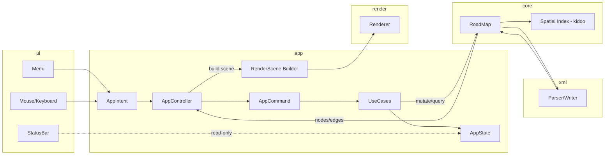

# Architektur-Ueberblick

## Datenfluss

## Grundsaetze

- Die UI sendet nur `AppIntent`, mutiert aber keine Core-Daten direkt.
- Die App mappt Intents auf Commands und fuehrt Mutationen zentral ueber Use-Cases aus.
- Der Core enthaelt Datenmodell, XML-IO und Spatial-Queries.
- Das Rendering bekommt nur vorbereitete Render-Daten.
