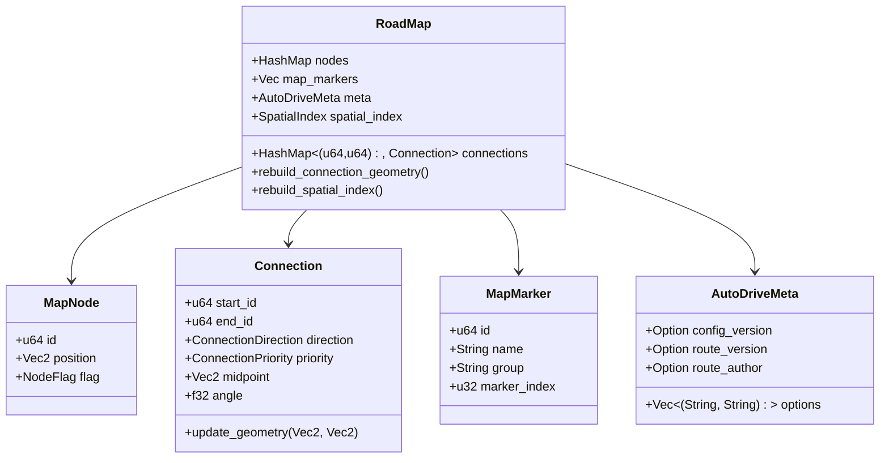
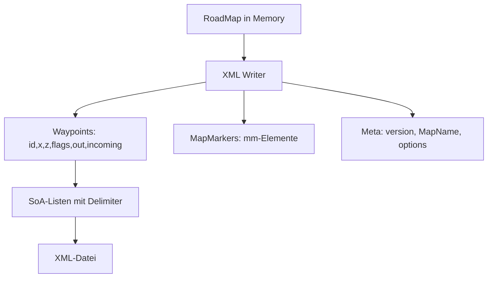
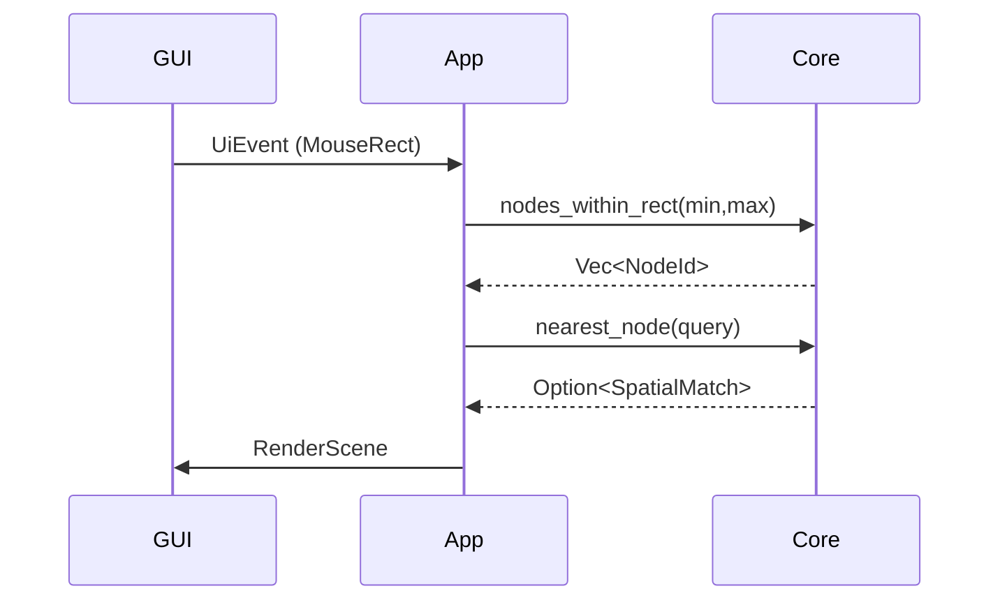

# Datenmodell und -fluss

## Überblick

Das Core-Datenmodell speichert AutoDrive-Konfigurationen als `RoadMap` mit Nodes, Connections, Map-Markern und Metadaten. Nodes sind 2D (x,z), Connections enthalten Richtung/Priorität plus Geometrie (Midpoint/Angle) für Rendering. Alles ist in Rust-Structs abgebildet und wird über XML (SoA-Format) persistiert.

## Datenabbildung

### RoadMap
- **Nodes**: `HashMap<u64, MapNode>` – ID → Node
- **Connections**: `HashMap<(u64, u64), Connection>` – (start_id, end_id) → Connection
- **MapMarkers**: `Vec<MapMarker>` – Liste der Marker
- **Meta**: `AutoDriveMeta` – Nicht-renderrelevante XML-Felder
- **SpatialIndex**: Persistenter KD-Tree für schnelle Node-Abfragen

### MapNode
- **id**: u64 (eindeutig)
- **position**: Vec2 (x,z – 2D)
- **flag**: NodeFlag (Regular, SubPrio, Warning)

### Connection
- **start_id/end_id**: u64 (Referenzen auf Nodes)
- **direction**: ConnectionDirection (Regular, Dual, Reverse)
- **priority**: ConnectionPriority (Regular, SubPriority)
- **midpoint/angle**: Vec2/f32 (Geometrie für Rendering)

### MapMarker
- **id**: u64 (Node-ID)
- **name/group**: String
- **marker_index**: u32

### AutoDriveMeta
- **config_version/route_version/route_author**: Option<String>
- **options**: Vec<(String, String)> (in Original-Reihenfolge)



## Speicherung

Daten werden als XML gespeichert (SoA-Format):
- **Waypoints**: Parallele Listen `<id>`, `<x>`, `<z>`, `<flags>`, `<out>`, `<incoming>`
- **Connections**: Abgeleitet aus `out`/`incoming` beim Schreiben
- **MapMarkers**: `<mapmarker>`-Block mit Attributen
- **Meta**: Header-Felder wie `<version>`, `<MapName>`, `<ADRouteAuthor>`, plus Optionen

Delimiter: Komma für Listen, Semikolon für verschachtelte Listen.



## Abfragen

Queries laufen im Core über `kiddo` (Spatial Index):
- **Nearest**: `nearest_node(query) -> Option<SpatialMatch>` – Nächster Node inkl. Distanz
- **Radius**: `nodes_within_radius(query, radius) -> Vec<SpatialMatch>` – Nodes im Radius
- **Range**: `nodes_within_rect(min, max) -> Vec<NodeId>` – Nodes im Rechteck
- **Geometry**: `rebuild_connection_geometry()` – Aktualisiert Midpoint/Angle nach Node-Moves

GUI fragt Bereiche ab, Core liefert IDs, App baut RenderScene.



## Heightmap-System

Y-Koordinaten (Höhenwerte) werden beim XML-Export aus PNG-Heightmaps berechnet.

### HeightmapData
```rust
pub struct Heightmap {
    image: DynamicImage,
    width: u32,
    height: u32,
    world_bounds: WorldBounds,
}

pub struct WorldBounds {
    pub min_x: f32,
    pub min_z: f32,
    pub max_x: f32,
    pub max_z: f32,
}
```

### Interpolation
- **Methode:** Bikubische Interpolation (16 Nachbarpixel)
- **Spline:** Catmull-Rom für glatte Kurven
- **Mapping:** Grauwert 0 (schwarz) = min. Höhe, 255 (weiß) = max. Höhe
- **Präzision:**Kommawerte durch Interpolation zwischen Pixeln
- **Clipping:** Koordinaten außerhalb werden auf Heightmap-Rand geclippt

### Workflow
1. User wählt Heightmap-PNG beim Speichern (optional)
2. Für jeden Node: `y = heightmap.sample_height(x, z, height_scale)`
3. Fallback ohne Heightmap: `y = 0.0`
4. Warnung wenn keine Heightmap ausgewählt

### WorldBounds-Konfiguration
```rust
// Standard FS25-Map (2048×2048m, zentriert bei 0,0)
let bounds = WorldBounds::default_fs25();  // -1024 bis +1024

// Custom Map-Größe
let bounds = WorldBounds::from_map_size(4096.0);  // -2048 bis +2048
```

**Hinweis:** Editor arbeitet in 2D (x,z), Y-Werte existieren nur im Export.

---

## Invarianten

- Connections sind Source of Truth; Adjazenzlisten werden abgeleitet
- Node-Positionen sind 2D (x,z); y wird beim Export aus Heightmap berechnet
- Flag-Bereinigung (2/4 -> 0) beim XML-Import
- Geometrie wird im Core gepflegt und bei Moves aktualisiert</content>
<parameter name="filePath">/home/mro/Share/repos/fs25_auto_drive_editor/docs/DATA_MODEL.md