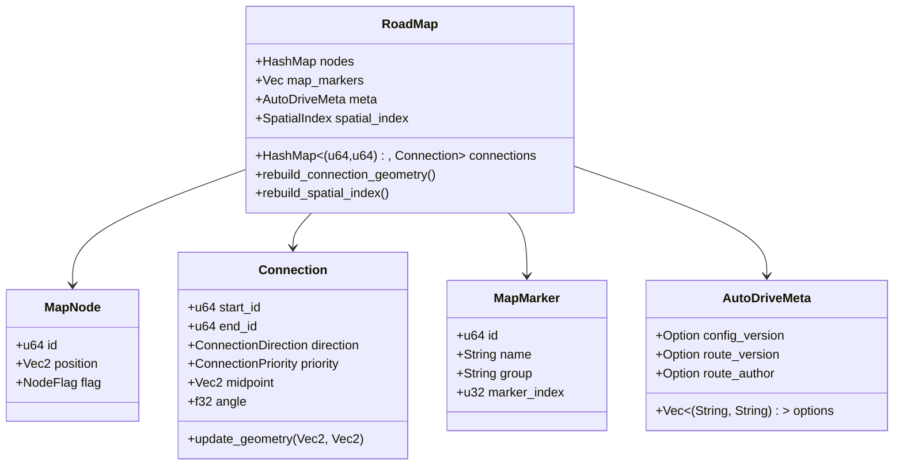
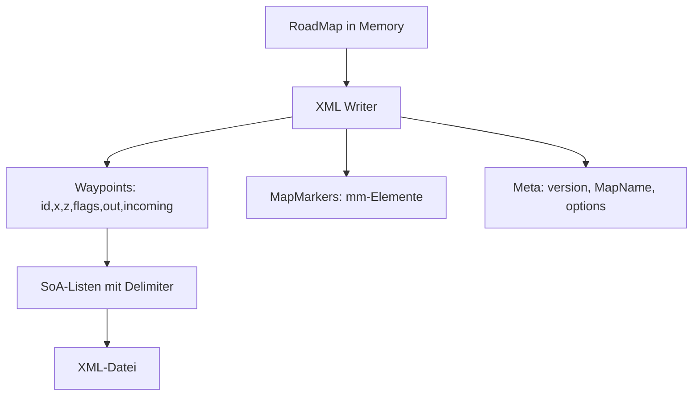
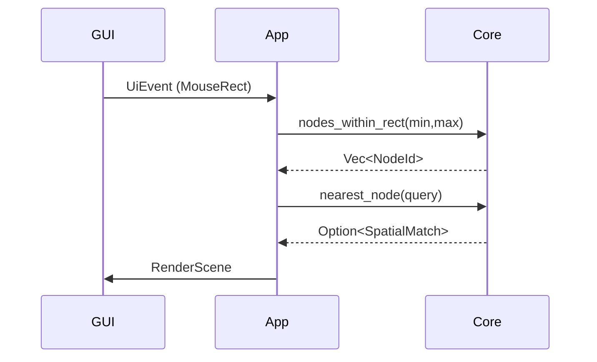

# Datenmodell und -fluss

## Ueberblick

Das Core-Datenmodell speichert AutoDrive-Konfigurationen als `RoadMap` mit Nodes, Connections, Map-Markern und Metadaten. Nodes sind 2D (x,z), Connections enthalten Richtung/Prioritaet plus Geometrie (Midpoint/Angle) fuer Rendering. Alles ist in Rust-Structs abgebildet und wird ueber XML (SoA-Format) persistiert.

## Datenabbildung

### RoadMap

- **Nodes**: `HashMap<u64, MapNode>` – ID → Node
- **Connections**: `HashMap<(u64, u64), Connection>` – (start_id, end_id) → Connection
- **MapMarkers**: `Vec<MapMarker>` – Liste der Marker
- **Meta**: `AutoDriveMeta` – Nicht-renderrelevante XML-Felder
- **SpatialIndex**: Persistenter KD-Tree fuer schnelle Node-Abfragen

### MapNode

- **id**: u64 (eindeutig)
- **position**: Vec2 (x,z – 2D)
- **flag**: NodeFlag (Regular, SubPrio, Warning)

### Connection

- **start_id/end_id**: u64 (Referenzen auf Nodes)
- **direction**: ConnectionDirection (Regular, Dual, Reverse)
- **priority**: ConnectionPriority (Regular, SubPriority)
- **midpoint/angle**: Vec2/f32 (Geometrie fuer Rendering)

### MapMarker

- **id**: u64 (Node-ID)
- **name/group**: String
- **marker_index**: u32

### AutoDriveMeta

- **config_version/route_version/route_author**: Option<String>
- **options**: Vec<(String, String)> (in Original-Reihenfolge)


```mermaid
classDiagram
    class RoadMap {
        +HashMap<u64, MapNode> nodes
        +HashMap<(u64,u64), Connection> connections
        +Vec<MapMarker> map_markers
        +AutoDriveMeta meta
        +SpatialIndex spatial_index
        +rebuild_connection_geometry()
        +rebuild_spatial_index()
    }

    class MapNode {
        +u64 id
        +Vec2 position
        +NodeFlag flag
    }

    class Connection {
        +u64 start_id
        +u64 end_id
        +ConnectionDirection direction
        +ConnectionPriority priority
        +Vec2 midpoint
        +f32 angle
        +update_geometry(Vec2, Vec2)
    }

    class MapMarker {
        +u64 id
        +String name
        +String group
        +u32 marker_index
    }

    class AutoDriveMeta {
        +Option<String> config_version
        +Option<String> route_version
        +Option<String> route_author
        +Vec<(String, String)> options
    }

    RoadMap --> MapNode
    RoadMap --> Connection
    RoadMap --> MapMarker
    RoadMap --> AutoDriveMeta
```

## Speicherung

Daten werden als XML gespeichert (SoA-Format):

- **Waypoints**: Parallele Listen `<id>`, `<x>`, `<z>`, `<flags>`, `<out>`, `<incoming>`
- **Connections**: Abgeleitet aus `out`/`incoming` beim Schreiben
- **MapMarkers**: `<mapmarker>`-Block mit Attributen
- **Meta**: Header-Felder wie `<version>`, `<MapName>`, `<ADRouteAuthor>`, plus Optionen

Delimiter: Komma fuer Listen, Semikolon fuer verschachtelte Listen.


```mermaid
flowchart TD
    A[RoadMap in Memory] --> B[XML Writer]
    B --> C[Waypoints: id,x,z,flags,out,incoming]
    B --> D[MapMarkers: mm-Elemente]
    B --> E[Meta: version, MapName, options]
    C --> F[SoA-Listen mit Delimiter]
    F --> G[XML-Datei]
```

## Abfragen

Queries laufen im Core ueber `kiddo` (Spatial Index):

- **Nearest**: `nearest_node(query) -> Option<SpatialMatch>` – Naechster Node inkl. Distanz
- **Radius**: `nodes_within_radius(query, radius) -> Vec<SpatialMatch>` – Nodes im Radius
- **Range**: `nodes_within_rect(min, max) -> Vec<NodeId>` – Nodes im Rechteck
- **Geometry**: `rebuild_connection_geometry()` – Aktualisiert Midpoint/Angle nach Node-Moves

GUI fragt Bereiche ab, Core liefert IDs, App baut RenderScene.


```mermaid
sequenceDiagram
    participant GUI
    participant App
    participant Core

    GUI->>App: UiEvent (MouseRect)
    App->>Core: nodes_within_rect(min,max)
    Core-->>App: Vec<NodeId>
    App->>Core: nearest_node(query)
    Core-->>App: Option<SpatialMatch>
    App->>GUI: RenderScene
```

## Heightmap-System

Y-Koordinaten (Hoehenwerte) werden beim XML-Export aus PNG-Heightmaps berechnet.

### HeightmapData

```rust
pub struct Heightmap {
    image: DynamicImage,
    width: u32,
    height: u32,
    world_bounds: WorldBounds,
}

pub struct WorldBounds {
    pub min_x: f32,
    pub min_z: f32,
    pub max_x: f32,
    pub max_z: f32,
}
```

### Interpolation

- **Methode:** Bikubische Interpolation (16 Nachbarpixel)
- **Spline:** Catmull-Rom fuer glatte Kurven
- **Mapping:** Grauwert 0 (schwarz) = min. Hoehe, 255 (weiss) = max. Hoehe
- **Praezision:** Kommawerte durch Interpolation zwischen Pixeln
- **Clipping:** Koordinaten ausserhalb werden auf Heightmap-Rand geclippt

### Workflow

1. User waehlt Heightmap-PNG beim Speichern (optional)
2. Fuer jeden Node: `y = heightmap.sample_height(x, z, height_scale)`
3. Fallback ohne Heightmap: `y = 0.0`
4. Warnung wenn keine Heightmap ausgewaehlt

### WorldBounds-Konfiguration

```rust
// Standard FS25-Map (2048×2048m, zentriert bei 0,0)
let bounds = WorldBounds::default_fs25();  // -1024 bis +1024

// Custom Map-Groesse
let bounds = WorldBounds::from_map_size(4096.0);  // -2048 bis +2048
```

**Hinweis:** Editor arbeitet in 2D (x,z), Y-Werte existieren nur im Export.

---

## Invarianten

- Connections sind Source of Truth; Adjazenzlisten werden abgeleitet
- Node-Positionen sind 2D (x,z); y wird beim Export aus Heightmap berechnet
- Flag-Bereinigung (2/4 -> 0) beim XML-Import
- Geometrie wird im Core gepflegt und bei Moves aktualisiert

---

## Application-State-Strukturen

### AppState

```rust
pub struct AppState {
    pub road_map: Option<Arc<RoadMap>>,
    pub view: ViewState,
    pub ui: UiState,
    pub selection: SelectionState,
    pub editor: EditorToolState,
    pub clipboard: Clipboard,
    pub paste_preview_pos: Option<Vec2>,
    pub command_log: CommandLog,
    pub history: EditHistory,
    pub options: EditorOptions,
    pub group_registry: GroupRegistry,
    pub farmland_polygons: Option<Arc<Vec<FieldPolygon>>>,
    pub farmland_grid: Option<Arc<FarmlandGrid>>,
    pub background_image: Option<Arc<DynamicImage>>,
    pub group_editing: Option<GroupEditState>,
    pub tool_edit_store: ToolEditStore,
    pub active_tool_edit_session: Option<ActiveToolEditSession>,
    pub should_exit: bool,
    // private: options_arc, dimmed_ids_cache, render_map_cache
}
```

- Zentraler Laufzeitzustand fuer Controller/Handler/UI
- `road_map` und `selection.selected_node_ids` sind `Arc`-basiert fuer guenstige Frame-Uebergaben
- Clipboard-, Paste-Preview- und Tool-Edit-Zustand bleiben im App-Layer und werden von dort in Read-Modelle fuer Hosts ueberfuehrt
- Dialog- und Tool-Fenster laufen semantisch ueber `UiState` plus `HostUiSnapshot`
- Host-native Datei-/Pfad-Dialoge werden als `DialogRequest`-Queue in `UiState` gehalten
- Viewport-Overlays laufen host-neutral ueber `ViewportOverlaySnapshot` (Route-Preview, Clipboard-, Distanzen-, Segment- und Boundary-Overlays)

### SelectionState

```rust
pub struct SelectionState {
    pub selected_node_ids: Arc<IndexSet<u64>>,  // Arc fuer O(1)-Clone (Copy-on-Write)
    pub selection_anchor_node_id: Option<u64>,  // Anker fuer Pfad-Selektion
    pub generation: u64,                        // Cache-Invalidierung fuer Read-Modelle
}
```

- **CoW-Pattern:** `Arc::make_mut` bei Mutation → klont IndexSet nur wenn mehrere Referenzen existieren
- Wird als `Arc` in `RenderScene` geteilt (kein Deep-Clone pro Frame)
- `generation` invalidiert abgeleitete Caches wie gedimmte Gruppenmengen, ohne dass Hosts diese Details kennen muessen

### EditHistory / Snapshot

```rust
pub struct EditHistory { /* undo/redo stacks */ }
pub struct Snapshot {
    pub road_map: Option<Arc<RoadMap>>,
    pub selection: Arc<IndexSet<u64>>,
    // weitere UI-/Tool-Felder
}
```

- Snapshot-basiertes Undo/Redo
- `Arc<RoadMap>` ermoeglicht O(1)-Snapshots (Copy-on-Write)

### GroupRegistry und ToolEditStore

```rust
pub struct GroupRecord {
    pub id: u64,
    pub node_ids: Vec<u64>,
    pub original_positions: Vec<Vec2>,
    pub marker_node_ids: Vec<u64>,
    pub locked: bool,
    pub entry_node_id: Option<u64>,
    pub exit_node_id: Option<u64>,
}

pub struct GroupRegistry {
    records: HashMap<u64, GroupRecord>,
    next_id: u64,
}

pub struct ToolEditStore {
    records: HashMap<u64, ToolEditRecord>,
}
```

- `GroupRegistry` ist eine tool-neutrale In-Session-Registry fuer Gruppenmitgliedschaft, Validitaet, Lock-Zustand und Boundary-Metadaten
- Tool-spezifische Parameter editierbarer Route-Tools liegen separat im `ToolEditStore` als `RouteToolEditPayload`
- Beim manuellen Loeschen, Resampling oder Gruppen-Umbau werden betroffene Registry- und Tool-Edit-Eintraege gemeinsam invalidiert

### DistanzenState

```rust
pub struct DistanzenState {
    pub by_count: bool,
    pub count: u32,
    pub distance: f32,
    pub path_length: f32,
    pub active: bool,
    pub hide_original: bool,
    pub preview_positions: Vec<Vec2>,
}
```

- Steuert das Distanzen-Neuverteilen-Feature (Catmull-Rom-Resampling)
- Wechselseitige Berechnung: Anzahl ↔ Abstand ueber `path_length`

### EditorToolState

```rust
pub struct EditorToolState {
    pub active_tool: EditorTool,
    pub connect_source_node: Option<u64>,
    pub default_direction: ConnectionDirection,
    pub default_priority: ConnectionPriority,
    pub route_tool_memory: RouteToolSelectionMemory,
    pub tool_manager: ToolManager,
}
```

- `ToolManager` verwaltet alle registrierten Route-Tools (Straight, Curve2/3, Spline, Bypass, Constraint)
- `route_tool_memory` merkt pro Route-Tool-Gruppe das zuletzt verwendete Werkzeug fuer Menues und Re-Entry-Flows
- `active_tool` bestimmt welches Editor-Werkzeug gerade aktiv ist

### Host-UI- und Overlay-Snapshots

```rust
pub struct HostUiSnapshot {
    pub panels: Vec<PanelState>,
    pub dialog_requests: Vec<DialogRequest>,
}

pub enum PanelState {
    RouteTool(RouteToolPanelState),
    Options(OptionsPanelState),
    CommandPalette(CommandPalettePanelState),
}

pub struct ViewportOverlaySnapshot {
    pub route_tool_preview: Option<ToolPreview>,
    pub clipboard_preview: Option<ClipboardOverlaySnapshot>,
    pub distance_preview: Option<PolylineOverlaySnapshot>,
    pub group_locks: Vec<GroupLockOverlaySnapshot>,
    pub group_boundaries: Vec<GroupBoundaryOverlaySnapshot>,
    pub show_no_file_hint: bool,
}
```

- `HostUiSnapshot` ist das per-Frame-Read-Modell fuer sichtbare Panels und ausstehende Host-Dialoge
- `ViewportOverlaySnapshot` kapselt alle Viewport-Overlays als host-neutrale DTOs; egui rendert nur noch aus diesen Snapshots statt direkt aus `RoadMap`/`GroupRegistry`
- `ClipboardOverlaySnapshot`, `GroupLockOverlaySnapshot` und `GroupBoundaryOverlaySnapshot` trennen Datengewinnung im App-Layer vom Painting im Host

---

## Host-Bridge-Core DTOs

```rust
pub struct HostSelectionSnapshot {
    pub selected_node_ids: Vec<u64>,
}

pub struct HostViewportSnapshot {
    pub camera_position: [f32; 2],
    pub zoom: f32,
}

pub enum HostSessionAction {
    ToggleCommandPalette,
    SetEditorTool { tool: HostActiveTool },
    OpenOptionsDialog,
    CloseOptionsDialog,
    Undo,
    Redo,
    SubmitDialogResult { result: HostDialogResult },
}

pub struct HostSessionSnapshot {
    pub has_map: bool,
    pub node_count: usize,
    pub connection_count: usize,
    pub active_tool: HostActiveTool,
    pub status_message: Option<String>,
    pub show_command_palette: bool,
    pub show_options_dialog: bool,
    pub can_undo: bool,
    pub can_redo: bool,
    pub pending_dialog_request_count: usize,
    pub selection: HostSelectionSnapshot,
    pub viewport: HostViewportSnapshot,
}

pub struct HostRenderFrameSnapshot {
    pub scene: RenderScene,
    pub assets: RenderAssetsSnapshot,
}
```

- `HostSessionAction` bildet die kanonische explizite Mutationsoberflaeche der gemeinsamen Bridge-Core-Crate
- `HostSessionSnapshot` fasst host-relevanten Session-Zustand zusammen, inklusive Undo/Redo-Verfuegbarkeit und Anzahl ausstehender Dialog-Anfragen
- `snapshot()` arbeitet ueber einen Dirty-Cache und baut den Snapshot nur nach erfolgreichen Session-Mutationen neu auf
- Die Bridge mappt `HostSessionAction` intern auf `AppIntent`, ohne generischen Intent-Dispatch oder direkten `AppState`-Escape-Hatch
- Host-native Datei-/Pfad-Dialoge laufen ueber `take_dialog_requests()` und `submit_dialog_result(...)` als explizite Bridge-Seam
- `HostRenderFrameSnapshot` koppelt den per-Frame-Render-Vertrag (`RenderScene`) mit den langlebigen Render-Assets fuer read-only Hosts
- Die Flutter-Bridge ist als duenne Alias-/Kompat-Surface ueber `fs25_auto_drive_host_bridge` umgesetzt und fuehrt die bisherigen `Engine*`-Namen ohne eigene Session-Logik weiter
