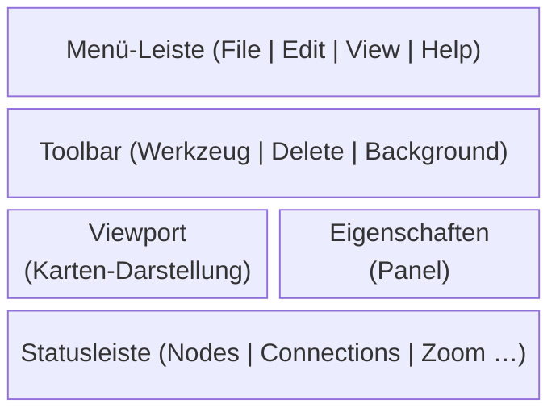
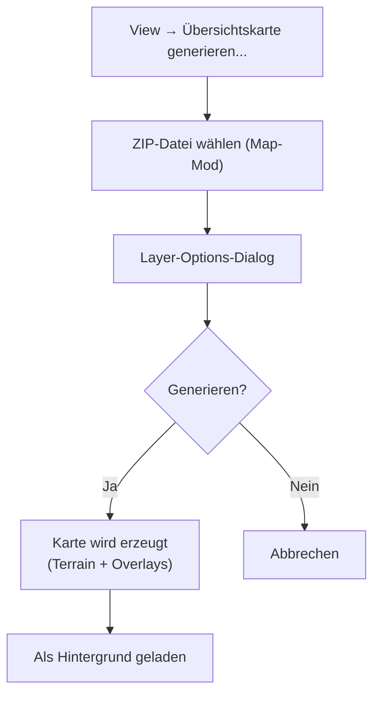
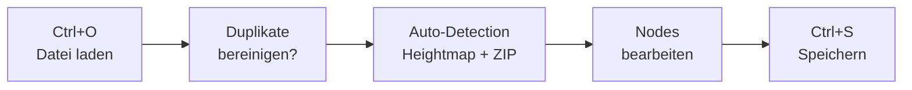
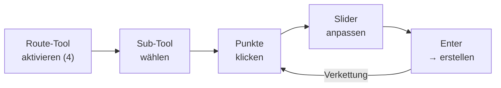
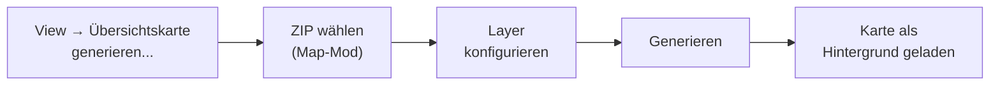

# FS25 AutoDrive Editor – Bedienungsanleitung

## Inhaltsverzeichnis

1. [Überblick](#überblick)
2. [Programmstart und Dateiverwaltung](#programmstart-und-dateiverwaltung)
3. [Benutzeroberfläche](#benutzeroberfläche)
4. [Tastatur-Shortcuts](#tastatur-shortcuts)
5. [Maus-Bedienung](#maus-bedienung)
6. [Werkzeuge (Tools)](#werkzeuge-tools)
7. [Selektion](#selektion)
8. [Verbindungen bearbeiten](#verbindungen-bearbeiten)
9. [Map-Marker](#map-marker)
10. [Kamera und Viewport](#kamera-und-viewport)
11. [Hintergrund-Karte](#hintergrund-karte)
12. [Übersichtskarten-Generierung](#übersichtskarten-generierung)
13. [Automatische Erkennung (Post-Load)](#automatische-erkennung-post-load)
14. [Heightmap](#heightmap)
15. [Duplikat-Bereinigung](#duplikat-bereinigung)
16. [Optionen](#optionen)
17. [Undo / Redo](#undo--redo)
18. [Typische Workflows](#typische-workflows)

---

## Überblick

Der FS25 AutoDrive Editor dient zum Erstellen und Bearbeiten von AutoDrive-Kursen für den Farming Simulator 25. Er lädt XML-Konfigurationsdateien (`AutoDrive_config*.xml`), stellt das Straßennetzwerk grafisch dar und ermöglicht das Bearbeiten von Wegpunkten (Nodes), Verbindungen (Connections) und Map-Markern.

**Kernfeatures:**
- GPU-beschleunigtes Rendering für 100.000+ Wegpunkte
- Rect- und Lasso-Selektion
- Verbindungs-Bearbeitung (Richtung, Priorität, Invertierung)
- Map-Marker erstellen und verwalten
- Heightmap-Support für Y-Koordinaten beim Export
- Hintergrund-Karte (PNG/JPG/DDS) als Orientierungshilfe
- Vollständiges Undo/Redo-System

---

## Programmstart und Dateiverwaltung

### Datei öffnen

| Aktion | Weg |
|--------|-----|
| Menü | **File → Open...** |
| Shortcut | `Ctrl+O` |

Öffnet einen Datei-Dialog zur Auswahl einer AutoDrive-XML-Konfigurationsdatei. Nach dem Laden wird die Kamera automatisch auf die Bounding-Box des Netzwerks zentriert.

**Automatische Erkennung:** Nach dem Laden prüft der Editor automatisch:
- Ob eine `terrain.heightmap.png` im selben Verzeichnis liegt → wird direkt als Heightmap gesetzt
- Ob im Mods-Verzeichnis (`../../mods/` relativ zum Savegame) ein passender Map-Mod-ZIP zum Kartennamen existiert → Dialog bietet Übersichtskarten-Generierung an

Das Matching berücksichtigt Umlaute (ä↔ae, ö↔oe, ü↔ue, ß↔ss), ist case-insensitive und behandelt Leerzeichen/Unterstriche als Wildcard.

### Datei speichern

| Aktion | Weg |
|--------|-----|
| Speichern | **File → Save** oder `Ctrl+S` |
| Speichern unter | **File → Save As...** |

Beim Speichern wird geprüft, ob eine Heightmap geladen ist. Falls nicht, erscheint eine Warnung, dass Y-Koordinaten nicht korrekt geschrieben werden können.

### Programm beenden

| Aktion | Weg |
|--------|-----|
| Menü | **File → Exit** |

---

## Benutzeroberfläche

Das Hauptfenster besteht aus folgenden Bereichen:



### Menü-Leiste

- **File**: Öffnen, Speichern, Heightmap, Exit
- **Edit**: Undo, Redo, Optionen
- **View**: Kamera-Reset, Zoom, Hintergrund-Karte, Render-Quality
- **Help**: About (Versionsinformation)

### Eigenschaften-Panel (rechte Seitenleiste)

Das Eigenschaften-Panel zeigt kontextabhängig Infos zur aktuellen Selektion und enthält die Standard-Verbindungseinstellungen sowie bei aktivem Route-Tool die Route-Konfiguration.

| Inhalt | Bedingung |
|--------|-----------|
| „Keine Selektion" | Kein Node selektiert |
| Node-ID, Position, Flag, Marker-Controls | Genau 1 Node selektiert |
| Verbindungs-Details, Richtungs-/Prioritäts-ComboBox, Trennen-Button | Genau 2 Nodes selektiert |
| „N Nodes selektiert" | 3+ Nodes selektiert |
| Standard-Richtung und Straßenart (ComboBox) | Immer sichtbar (unterer Bereich) |
| Route-Tool-Konfiguration (Slider) | Nur wenn Route-Tool aktiv |

### Toolbar

Zeigt die verfügbaren Werkzeuge:
- **⊹ Select (1)** — Standard-Werkzeug: Nodes selektieren und verschieben
- **⟷ Connect (2)** — Verbindungen zwischen Nodes erstellen
- **＋ Add Node (3)** — Neue Nodes auf der Karte platzieren- **Route-Tools (4)** — Route-Werkzeuge: Gerade Strecke, Bézier-Kurve, Spline- **🗑 Delete (Del)** — Selektierte Nodes löschen (nur aktiv bei Selektion)
- **Hintergrund-Controls** — Opacity-Slider und Sichtbarkeits-Toggle (rechts, nur wenn Hintergrund geladen)

### Statusleiste

Zeigt folgende Informationen (nur Anzeige, nicht interaktiv):
- Node-Count, Connection-Count, Marker-Count
- Map-Name (falls vorhanden)
- Zoom-Stufe und Kamera-Position
- Heightmap-Status (Dateiname oder "None")
- Anzahl selektierter Nodes
- FPS (rechts)

---

## Tastatur-Shortcuts

### Globale Shortcuts

| Shortcut | Aktion |
|----------|--------|
| `Ctrl+O` | Datei öffnen |
| `Ctrl+S` | Datei speichern |
| `Ctrl+Z` | Undo (Rückgängig) |
| `Ctrl+Y` | Redo (Wiederherstellen) |
| `Shift+Ctrl+Z` | Redo (Alternative) |
| `Ctrl+A` | Alle Nodes selektieren |
| `Escape` | Selektion aufheben |

### Werkzeug-Shortcuts

| Shortcut | Werkzeug |
|----------|----------|
| `1` | Select-Tool (Auswählen/Verschieben) |
| `2` | Connect-Tool (Verbindungen erstellen) |
| `3` | Add-Node-Tool (Nodes hinzufügen) |

### Bearbeitungs-Shortcuts

| Shortcut | Aktion | Bedingung |
|----------|--------|-----------|
| `Delete` / `Backspace` | Selektierte Nodes löschen | Mindestens 1 Node selektiert |
| `C` | Verbindung erstellen (Regular-Richtung) | Genau 2 Nodes selektiert |
| `X` | Verbindung zwischen Nodes trennen | Genau 2 Nodes selektiert |

---

## Maus-Bedienung

### Klick-Aktionen

| Maus-Aktion | Werkzeug | Ergebnis |
|-------------|----------|----------|
| **Linksklick** | Select | Node unter Mauszeiger selektieren (ersetzt bestehende Selektion) |
| **Ctrl+Linksklick** | Select | Node additiv zur Selektion hinzufügen |
| **Shift+Linksklick** | Select | Pfad-Selektion: Selektiert alle Nodes auf dem kürzesten Pfad zwischen Anker-Node und Ziel-Node |
| **Doppelklick** | Select | Segment-Selektion: Selektiert alle Nodes zwischen den nächsten Kreuzungen/Sackgassen |
| **Ctrl+Doppelklick** | Select | Segment additiv zur Selektion hinzufügen |
| **Linksklick** | Connect | Ers­ter Klick = Startknoten, Zweiter Klick = Zielknoten → Verbindung erstellen |
| **Linksklick** | Add Node | Neuen Node an Klickposition einfügen |

### Drag-Aktionen (Ziehen mit gedrückter Maustaste)

| Maus-Aktion | Ergebnis |
|-------------|----------|
| **Links-Drag auf selektiertem Node** | Alle selektierten Nodes gemeinsam verschieben |
| **Links-Drag auf leerem Bereich** | Kamera schwenken (Pan) |
| **Shift+Links-Drag** | Rechteck-Selektion → alle Nodes im Rechteck werden selektiert |
| **Shift+Ctrl+Links-Drag** | Rechteck-Selektion (additiv, erweitert bestehende Selektion) |
| **Alt+Links-Drag** | Lasso-Selektion → freigeformte Polygon-Selektion |
| **Alt+Ctrl+Links-Drag** | Lasso-Selektion (additiv, erweitert bestehende Selektion) |
| **Mittelklick-Drag** | Kamera schwenken (Pan) |
| **Rechtsklick-Drag** | Kamera schwenken (Pan) |

### Scroll-Aktionen

| Maus-Aktion | Ergebnis |
|-------------|----------|
| **Mausrad hoch** | Hineinzoomen (auf Mausposition) |
| **Mausrad runter** | Herauszoomen (von Mausposition) |

### Kontextmenü (Rechtsklick)

#### Bei 2+ selektierten Nodes (mit Verbindungen dazwischen)

| Menüpunkt | Aktion |
|-----------|--------|
| 🔗 Nodes verbinden | Verbindung erstellen (bei genau 2 Nodes ohne Verbindung) |
| ↦ Regular (Einbahn) | Alle Verbindungen auf Regular-Richtung setzen |
| ⇆ Dual (beidseitig) | Alle Verbindungen auf Dual-Richtung setzen |
| ↤ Reverse (rückwärts) | Alle Verbindungen auf Reverse-Richtung setzen |
| ⇄ Invertieren | Start/End aller Verbindungen tauschen |
| 🛣 Hauptstraße | Priorität aller Verbindungen auf Regular setzen |
| 🛤 Nebenstraße | Priorität aller Verbindungen auf SubPriority setzen |
| ✕ Alle trennen | Alle Verbindungen zwischen selektierten Nodes entfernen |

#### Bei 1 selektiertem Node

| Menüpunkt | Aktion |
|-----------|--------|
| 🗺 Marker erstellen | Neuen Map-Marker auf diesem Node anlegen |
| ✏ Marker ändern | Bestehenden Marker bearbeiten (Name, Gruppe) |
| ✕ Marker löschen | Marker von diesem Node entfernen |

---

## Werkzeuge (Tools)

### Select-Tool (1)

Das Standard-Werkzeug für Auswahl und Verschiebung von Nodes.

**Funktionen:**
- Einzelklick: Node selektieren (Pick-Radius: 12px)
- Ctrl+Klick: Additiv selektieren
- Shift+Klick: Pfad-Selektion (kürzester Pfad von Anker zu Ziel)
- Doppelklick: Segment zwischen Kreuzungen selektieren
- Drag auf selektiertem Node: Alle selektierten Nodes verschieben
- Drag auf leerem Bereich: Kamera schwenken

### Connect-Tool (2)

Erstellt Verbindungen zwischen zwei Nodes.

**Workflow:**
1. Ersten Node anklicken → in Toolbar erscheint "Startknoten: [ID] → Wähle Zielknoten"
2. Zweiten Node anklicken → Verbindung wird erstellt
3. Werkzeug bleibt aktiv für weitere Verbindungen

**Standard-Einstellungen:**
- Richtung: Regular (Einbahn vom Start zum Ziel)
- Priorität: Regular (Hauptstraße)

### Add-Node-Tool (3)

Platziert neue Wegpunkte auf der Karte.

**Workflow:**
- Klick auf eine beliebige Stelle → neuer Node wird an der Welt-Position eingefügt
- Der neue Node erhält automatisch die nächste freie ID

### Route-Tools (4)

Erstellt Strecken und Kurse über vordefinierte Geometrien. Im Route-Modus stehen drei Sub-Tools zur Verfügung:

#### 📏 Gerade Strecke

Zeichnet eine gerade Linie zwischen zwei Punkten mit automatischen Zwischen-Nodes.

**Workflow:**
1. Startpunkt klicken
2. Endpunkt klicken → Vorschau erscheint
3. Enter → Strecke wird erstellt

**Einstellungen:** Min. Abstand (Segment-Länge) und Anzahl Nodes.

#### 🔀 Kurve (Bézier)

Zeichnet eine Bézier-Kurve (Grad 2 oder 3) mit Steuerpunkten.

**Workflow:**
1. Startpunkt klicken
2. Endpunkt klicken
3. Steuerpunkt(e) klicken → Vorschau erscheint
4. Optional: Punkte per Drag anpassen
5. Enter → Kurve wird erstellt

**Einstellungen:** Grad (Quadratisch/Kubisch), Min. Abstand, Anzahl Nodes.

#### 〰️ Spline (Catmull-Rom)

Zeichnet einen interpolierenden Spline, der durch **alle geklickten Punkte** führt. Im Gegensatz zur Bézier-Kurve (die Steuerpunkte nur annähert) verläuft der Spline exakt durch jeden gesetzten Punkt.

**Workflow:**
1. Beliebig viele Punkte nacheinander klicken (mindestens 2)
2. Vorschau wird fortlaufend aktualisiert (Cursor = nächster Punkt)
3. Enter → Spline wird erstellt

**Einstellungen:** Min. Abstand (Segment-Länge) und Anzahl Nodes.

**Besonderheiten:**
- Ab 3 Punkten entsteht eine glatte Kurve (Catmull-Rom-Interpolation)
- Mit 2 Punkten wird eine gerade Strecke erzeugt
- Verkettung: Nach Enter wird der letzte Endpunkt automatisch als neuer Startpunkt übernommen
- Nachbearbeitung: Segment-Länge / Node-Anzahl können nach Erstellung geändert werden

#### Gemeinsame Eigenschaften aller Route-Tools

- **Enter** bestätigt und erstellt die Route
- **Escape** bricht ab und setzt das Tool zurück
- **Verkettung:** Nach Erstellung wird der letzte Endpunkt als neuer Startpunkt übernommen. Das Tool bleibt aktiv — der nächste Klick setzt den neuen Endpunkt. So können zusammenhängende Strecken nahtlos hintereinander erstellt werden.
- **Nachbearbeitung:** Segment-Länge/Node-Anzahl können nach Erstellung per Slider angepasst werden. Die zuletzt erstellte Strecke wird automatisch gelöscht und mit den neuen Parametern neu berechnet.
- **Snap:** Start- und Endpunkte rasten auf existierende Nodes ein (Snap-Radius: 3m)

#### Tangent-Ausrichtung (Kurve und Spline)

Wenn Start- oder Endpunkt einer **kubischen Bézier-Kurve** oder eines **Splines** auf einen existierenden Node snapt, kann die lokale Tangente an einer vorhandenen Verbindung ausgerichtet werden:

1. Route-Tool (Kurve oder Spline) aktivieren
2. Start- oder Endpunkt auf einen existierenden Node klicken (Snap)
3. Im **Eigenschaften-Panel** erscheint eine Tangent-Auswahl (ComboBox):
   - **Manuell** — keine automatische Tangente
   - **→ Node #42 (NO)** — Tangente entlang der Verbindung zum Nachbar-Node (mit Kompassrichtung)
4. Bei Auswahl einer Tangente wird der zugehörige Kontrollpunkt automatisch entlang der Verbindungsrichtung platziert
5. Der Tangent-Vorschlag kann durch manuelles Klicken/Drag überschrieben werden

> **Hinweis:** Tangent-Ausrichtung ist nur bei kubischen Kurven und Splines verfügbar, da diese separate Kontrollpunkte für Start und Ende haben.

#### Control-Point-Drag (nur Kurve)

Bei der **Bézier-Kurve** können die Steuerpunkte nach dem Setzen per Drag verschoben werden:

1. In der Kontrollpunkt-Phase auf einen Steuerpunkt klicken und ziehen
2. Die Kurve wird in Echtzeit aktualisiert
3. Loslassen fixiert die neue Position

Erkannte Drag-Ziele sind der/die Kontrollpunkt(e) sowie Start- und Endpunkt.

---

## Selektion

### Selektionsmodi

| Modus | Aktivierung | Beschreibung |
|-------|-------------|--------------|
| **Einzelselektion** | Linksklick | Ersetzt die aktuelle Selektion durch den angeklickten Node |
| **Additive Selektion** | Ctrl+Linksklick | Fügt den Node zur bestehenden Selektion hinzu |
| **Pfad-Selektion** | Shift+Linksklick | Selektiert alle Nodes auf dem kürzesten Pfad zwischen dem zuletzt selektierten Node (Anker) und dem angeklickten Node |
| **Segment-Selektion** | Doppelklick | Selektiert alle Nodes eines Segments (bis zur nächsten Kreuzung oder Sackgasse) |
| **Rechteck-Selektion** | Shift+Drag | Alle Nodes innerhalb des aufgezogenen Rechtecks |
| **Lasso-Selektion** | Alt+Drag | Alle Nodes innerhalb des freihand gezeichneten Polygons |
| **Alles selektieren** | Ctrl+A | Alle Nodes im Netzwerk selektieren |
| **Selektion aufheben** | Escape | Selektion komplett leeren |

### Additive Modi

Alle Selektionsmodi können mit **Ctrl** kombiniert werden, um die bestehende Selektion zu erweitern anstatt sie zu ersetzen:

- `Ctrl+Shift+Drag` → Rechteck-Selektion additiv
- `Ctrl+Alt+Drag` → Lasso-Selektion additiv
- `Ctrl+Doppelklick` → Segment additiv hinzufügen

### Selektion verschieben

Bei Drag auf einem bereits selektierten Node werden **alle selektierten Nodes gemeinsam verschoben**. Ein Undo-Snapshot wird automatisch beim Start des Drag erstellt.

---

## Verbindungen bearbeiten

### Verbindung erstellen

| Methode | Beschreibung |
|---------|--------------|
| **Connect-Tool (2)** | Zwei Nodes nacheinander anklicken |
| **Shortcut `C`** | Bei genau 2 selektierten Nodes → Regular-Verbindung erstellen |
| **Kontextmenü** | Rechtsklick bei genau 2 Nodes → "Nodes verbinden" |

### Verbindung entfernen

| Methode | Beschreibung |
|---------|--------------|
| **Shortcut `X`** | Bei genau 2 selektierten Nodes → Verbindung(en) trennen |
| **Kontextmenü** | Bei 2+ selektierten Nodes → "Alle trennen" |

### Richtung ändern

Über das **Kontextmenü** (Rechtsklick bei 2+ selektierten Nodes):

| Richtung | Symbol | Beschreibung |
|----------|--------|-------------|
| **Regular** | ↦ | Einbahnstraße (Start → Ende) |
| **Dual** | ⇆ | Bidirektional (beide Richtungen) |
| **Reverse** | ↤ | Umgekehrt (Ende → Start) |
| **Invertieren** | ⇄ | Start und Ende tauschen |

### Priorität ändern

Über das **Kontextmenü**:

| Priorität | Symbol | Beschreibung |
|-----------|--------|-------------|
| **Regular** | 🛣 | Hauptstraße |
| **SubPriority** | 🛤 | Nebenstraße (dünner dargestellt, Gelb-Markierung) |

### Farbcodierung

| Farbe | Bedeutung |
|-------|-----------|
| **Grün** | Regular-Verbindung (Einrichtung) |
| **Blau** | Dual-Verbindung (bidirektional) |
| **Orange** | Reverse-Verbindung |

---

## Map-Marker

Map-Marker sind benannte Ziele auf der Karte (z. B. „Hof", „Feld 1", „Silo").

### Marker erstellen

1. Einen einzelnen Node selektieren
2. Rechtsklick → **"🗺 Marker erstellen"**
3. Im Dialog Name und Gruppe eingeben
4. Bestätigen

### Marker bearbeiten

1. Den Node mit bestehendem Marker selektieren
2. Rechtsklick → **"✏ Marker ändern"**
3. Name/Gruppe anpassen
4. Bestätigen

### Marker löschen

1. Den Node mit Marker selektieren
2. Rechtsklick → **"✕ Marker löschen"**

### Darstellung

Marker werden als **rote Pin-Symbole** dargestellt:
- Pin-Spitze sitzt exakt auf dem Node-Zentrum
- Rote Füllung mit dunkelrotem Rand
- Größe: 2.0 Welteinheiten

---

## Kamera und Viewport

### Kamera-Steuerung

| Aktion | Weg |
|--------|-----|
| **Schwenken (Pan)** | Mittlere Maustaste / Rechte Maustaste ziehen, oder Links-Drag auf leerem Bereich |
| **Zoomen** | Mausrad (zoomt auf/von Mausposition) |
| **Zoom In** | View → Zoom In (Faktor 1.2) |
| **Zoom Out** | View → Zoom Out (Faktor 1/1.2) |
| **Kamera zurücksetzen** | View → Reset Camera |

### Automatische Zentrierung

Beim Laden einer Datei wird die Kamera automatisch auf die Bounding-Box des Netzwerks zentriert, sodass alle Nodes sichtbar sind.

### Render-Quality

Über **View → Render Quality**:

| Stufe | Beschreibung |
|-------|-------------|
| **Low** | Harte Kanten, maximale Performance |
| **Medium** | Standard Anti-Aliasing (empfohlen) |
| **High** | Breiteres Anti-Aliasing, weichere Kanten |

---

## Hintergrund-Karte

Eine Map-Übersicht (PNG, JPG oder DDS) kann als Hintergrund geladen werden, um Nodes und Verbindungen mit der Karte abzugleichen.

### Hintergrund laden

**View → Hintergrund laden...** — Datei-Dialog öffnet sich.

Optional kann beim Laden ein Center-Crop (quadratischer Ausschnitt) angegeben werden.

### Hintergrund-Controls (Toolbar)

Wenn ein Hintergrund geladen ist, erscheinen rechts in der Toolbar:

| Control | Beschreibung |
|---------|-------------|
| **Opacity-Slider** | Deckkraft einstellen (0.0 = unsichtbar bis 1.0 = voll sichtbar) |
| **👁 Sichtbar / 🚫 Ausgeblendet** | Hintergrund ein-/ausblenden |

---

## Übersichtskarten-Generierung

Anstatt eine fertige Übersichtskarte manuell zu laden, kann der Editor sie direkt aus einer Map-Mod-ZIP-Datei generieren.

### Workflow



### Übersichtskarte generieren

1. **View → Übersichtskarte generieren...** — öffnet den ZIP-Auswahl-Dialog
2. Eine Map-Mod-ZIP-Datei auswählen (enthält Terrain-Daten, GRLE-Farmlands, POIs)
3. Im **Layer-Options-Dialog** die gewünschten Layer ein-/ausschalten:

| Layer | Standard | Beschreibung |
|-------|----------|-------------|
| **Hillshade** | ✅ | Geländeschattierung für räumlichen Eindruck |
| **Farmland-Grenzen** | ✅ | Weiße Grenzlinien zwischen Farmland-Parzellen |
| **Farmland-IDs** | ✅ | Nummerierung der Farmland-Parzellen |
| **POI-Marker** | ✅ | Verkaufsstellen, Silos, Tankstellen etc. |
| **Legende** | ❌ | Farbcodierung der Bodentypen |

4. **Generieren** klicken — die Karte wird berechnet und als Hintergrund geladen

### Layer-Standardeinstellungen

Die Layer-Auswahl wird persistent in der Konfigurationsdatei (`fs25_auto_drive_editor.toml`) gespeichert. Beim nächsten Mal werden die zuletzt verwendeten Einstellungen vorausgewählt.

Die Standard-Layer können auch über **Edit → Optionen... → Übersichtskarte (Standard-Layer)** dauerhaft angepasst werden.

---

## Automatische Erkennung (Post-Load)

Nach dem Laden einer AutoDrive-XML-Datei prüft der Editor automatisch, ob zugehörige Dateien im selben Verzeichnis oder im Mods-Ordner vorhanden sind.

### Erkannte Dateien

| Datei | Pfad | Aktion |
|-------|------|--------|
| **Heightmap** | `terrain.heightmap.png` im XML-Verzeichnis | Wird automatisch als Heightmap gesetzt |
| **Map-Mod-ZIP** | `../../mods/FS25_*.zip` (Mods-Verzeichnis) | Dialog bietet Übersichtskarten-Generierung an |

### Matching-Logik für ZIP-Dateien

Der Kartenname aus der XML-Datei (z.B. `<MapName>Höflingen Valley</MapName>`) wird gegen die ZIP-Dateinamen im Mods-Verzeichnis abgeglichen:

- **Case-insensitive:** „Höflingen" matcht „hoeflingen", „HÖFLINGEN", usw.
- **Umlaut-tolerant:** ä↔ae, ö↔oe, ü↔ue, ß↔ss (bidirektional)
- **Trennzeichen-flexibel:** Leerzeichen und Underscores werden als Wildcard behandelt

**Beispiel:** Kartenname `Höflingen Valley` findet:
- `FS25_Hoeflingen.zip` ✓
- `FS25_Höflingen_V2.zip` ✓
- `FS25_Hoeflingen_Valley.zip` ✓

### Post-Load-Dialog

Falls Dateien erkannt werden, erscheint automatisch ein Dialog:

```
Nach dem Laden erkannt

✓ Heightmap automatisch geladen
   terrain.heightmap.png

Karte: "Höflingen"
Passender Map-Mod gefunden:
   📦 FS25_Hoeflingen.zip

[Übersichtskarte generieren]  [Schließen]
```

| Schaltfläche | Aktion |
|-------------|--------|
| **Übersichtskarte generieren** | Öffnet den Layer-Options-Dialog zur Übersichtskarten-Generierung |
| **Schließen** | Dialog schließen, keine weitere Aktion |

Bei mehreren passenden ZIPs kann der gewünschte Mod per RadioButton ausgewählt werden.

### Verzeichnisstruktur

Die Auto-Detection erwartet folgende Savegame-Struktur:

```
FarmingSimulator2025/
├── mods/
│   ├── FS25_Hoeflingen.zip
│   └── FS25_AnotherMap.zip
├── savegame1/
│   ├── AutoDrive_config.xml    ← diese Datei laden
│   └── terrain.heightmap.png   ← wird automatisch erkannt
└── savegame2/
    └── ...
```

---

## Heightmap

Die Heightmap wird für die korrekte Y-Koordinaten-Berechnung beim XML-Export benötigt.

### Heightmap laden

**File → Select Heightmap...** — Wählt eine PNG-Heightmap aus.

### Heightmap entfernen

**File → Clear Heightmap** — Entfernt die geladene Heightmap.

### Heightmap-Warnung

Beim Speichern ohne Heightmap erscheint eine Warnung. Sie können:
- **Bestätigen** → Speichern ohne Y-Koordinaten-Aktualisierung
- **Abbrechen** → Zurück zum Editor

---

## Duplikat-Bereinigung

Beim Laden einer AutoDrive-Konfiguration prüft der Editor automatisch, ob doppelte Wegpunkte vorhanden sind (Abstandstoleranz: 0,01 Welteinheiten).

### Duplikat-Dialog

Falls duplizierte Nodes gefunden werden, erscheint nach dem Laden automatisch ein Dialog:

```
Duplizierte Wegpunkte gefunden
X Duplikate in Y Gruppen gefunden.
Duplikate jetzt bereinigen?

[ Bereinigen ]   [ Abbrechen ]
```

| Schaltfläche | Aktion |
|-------------|--------|
| **Bereinigen** | Zusammenführen: Doppelte Nodes werden entfernt, Verbindungen umgeleitet, RoadMap bereinigt |
| **Abbrechen** | Dialog schließen, RoadMap unverändert beibehalten |

> **Hinweis:** Die Bereinigung kann nicht per Undo rückgängig gemacht werden. Bei Bedarf die Original-Datei sichern, bevor Duplikate bereinigt werden.

---

## Optionen

Über **Edit → Optionen...** wird der Optionen-Dialog geöffnet. Alle Einstellungen werden als `fs25_auto_drive_editor.toml` neben der Binary gespeichert.

### Konfigurierbare Werte

| Kategorie | Option | Standard |
|-----------|--------|----------|
| **Nodes** | Node-Größe | 0.5 Welteinheiten |
| | Farbe Regular | Cyan |
| | Farbe SubPrio | Gelb |
| | Farbe Selektiert | Magenta |
| | Farbe Warnung | Rot |
| **Selektion** | Pick-Radius | 12 Pixel |
| | Größenfaktor Selektiert | 1.8× |
| **Connections** | Linienstärke Normal | 0.2 |
| | Linienstärke SubPrio | 0.1 |
| | Pfeil-Länge / Breite | 1.0 / 0.6 |
| | Farbe Regular | Grün |
| | Farbe Dual | Blau |
| | Farbe Reverse | Orange |
| **Marker** | Marker-Größe | 2.0 |
| | Füllfarbe | Rot |
| | Outline-Farbe | Dunkelrot |
| **Kamera** | Zoom-Schritt (Menü) | 1.2 |
| | Zoom-Schritt (Mausrad) | 1.1 |
| **Übersichtskarte** | Hillshade | ✅ |
| | Farmland-Grenzen | ✅ |
| | Farmland-IDs | ✅ |
| | POI-Marker | ✅ |
| | Legende | ❌ |

---

## Undo / Redo

Alle destruktiven Operationen erzeugen automatisch einen Undo-Snapshot:

| Shortcut | Aktion |
|----------|--------|
| `Ctrl+Z` | Rückgängig (Undo) |
| `Ctrl+Y` oder `Shift+Ctrl+Z` | Wiederherstellen (Redo) |

Auch über **Edit → Undo / Redo** im Menü verfügbar (mit Anzeige ob verfügbar).

**Operationen mit Undo-Support:**
- Nodes hinzufügen / löschen
- Nodes verschieben
- Verbindungen erstellen / entfernen / ändern
- Marker erstellen / bearbeiten / löschen
- Bulk-Operationen (Richtung, Priorität, Invertierung, Trennen)

---

## Typische Workflows

### Neues Netzwerk bearbeiten



1. `Ctrl+O` → XML-Datei aus Savegame laden
2. Falls Duplikate gefunden: **Bereinigen** im Dialog wählen
3. Falls Heightmap/Map-Mod erkannt: Post-Load-Dialog nutzen (Heightmap wird automatisch gesetzt, optional Übersichtskarte generieren)
4. Nodes bearbeiten (Select-Tool, Drag zum Verschieben)
5. `Ctrl+S` → Speichern

### Route erstellen (mit Route-Tools)



1. **Route-Tool (4)** aktivieren
2. Sub-Tool wählen: Gerade Strecke, Kurve oder Spline
3. Punkte auf der Karte klicken (Vorschau wird live angezeigt)
4. Segment-Länge / Node-Anzahl per Slider anpassen
5. **Enter** → Route wird erstellt
6. Für weitere Segmente: Verkettung nutzt automatisch den letzten Endpunkt

### Route manuell erstellen

1. **Add-Node-Tool (3)** aktivieren
2. Nacheinander Nodes auf der Karte platzieren
3. **Connect-Tool (2)** aktivieren
4. Jeweils Start- und Ziel-Node anklicken um Verbindungen zu erstellen
5. Alternativ: 2 Nodes selektieren → `C` für schnelle Verbindung

### Segment bearbeiten

1. **Doppelklick** auf ein Segment → selektiert alle Nodes bis zur nächsten Kreuzung
2. Rechtsklick → Richtung/Priorität ändern oder invertieren
3. Oder: `Delete` um das ganze Segment zu löschen

### Bulk-Bearbeitung

1. **Shift+Drag** (Rechteck) oder **Alt+Drag** (Lasso) um viele Nodes zu selektieren
2. Alternativ: `Ctrl+A` für alle Nodes
3. Rechtsklick → Bulk-Operationen auf allen Verbindungen zwischen selektierten Nodes

### Übersichtskarte generieren



1. **View → Übersichtskarte generieren...** → ZIP-Datei der Map wählen
2. Im Layer-Dialog die gewünschten Layer aktivieren (Hillshade, Farmlands, POIs, …)
3. **Generieren** klicken
4. Die erzeugte Übersichtskarte wird automatisch als Hintergrund geladen

### Marker setzen

1. Ziel-Node selektieren (Linksklick)
2. Rechtsklick → "Marker erstellen"
3. Name eingeben (z. B. "Hof", "Feld 1")
4. Gruppe eingeben (z. B. "default")
5. Bestätigen

---

## Farbcodierung (Übersicht)

### Nodes

| Farbe | Bedeutung |
|-------|-----------|
| **Cyan** | Normaler Wegpunkt (Regular) |
| **Gelb** | Sub-Priorität (Nebenstraße) |
| **Magenta** | Selektiert |
| **Rot** | Warnung (Fehler/Problem) |

### Verbindungen

| Farbe | Bedeutung |
|-------|-----------|
| **Grün** | Regular (Einbahnstraße) |
| **Blau** | Dual (bidirektional) |
| **Orange** | Reverse (umgekehrt) |

### Marker

| Element | Farbe |
|---------|-------|
| **Füllung** | Rot |
| **Rand** | Dunkelrot |

---

## Dateiformat

Der Editor liest und schreibt AutoDrive-XML-Konfigurationsdateien (`AutoDrive_config*.xml`). Wichtige Details:

- **FS22/FS25-Kompatibilität:** Node-Flags 2 (AutoGenerated) und 4 (SplineGenerated) werden beim Import automatisch zu Regular (0) konvertiert
- **Listen-Trennzeichen:** Komma (`,`) für einfache Listen, Semikolon (`;`) für verschachtelte Listen (out/incoming)
- **Y-Koordinaten:** Werden beim Export aus der Heightmap berechnet (bikubische Interpolation)
