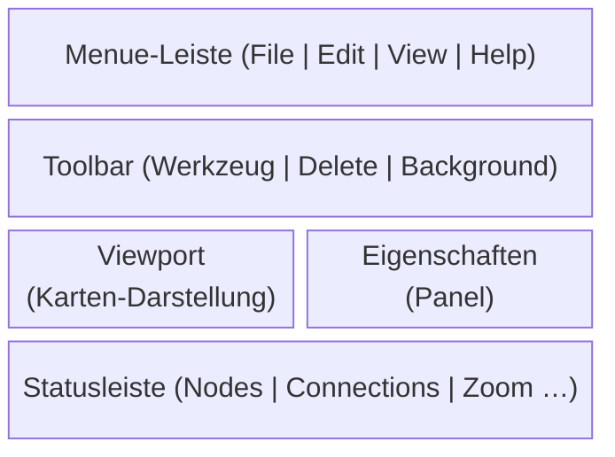
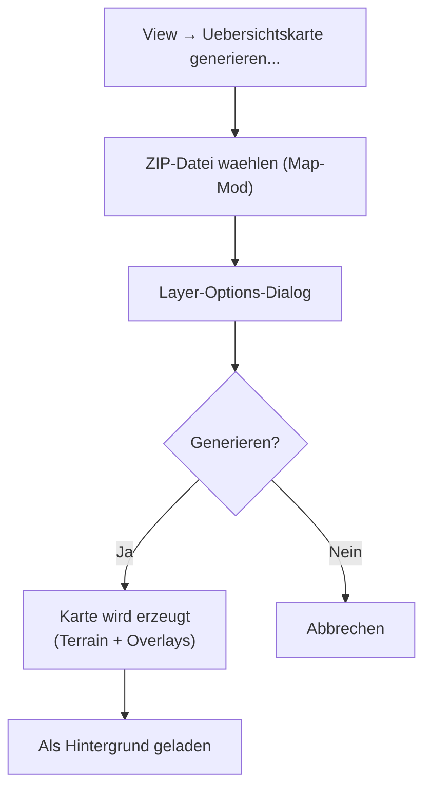
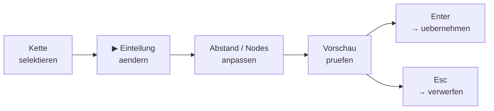
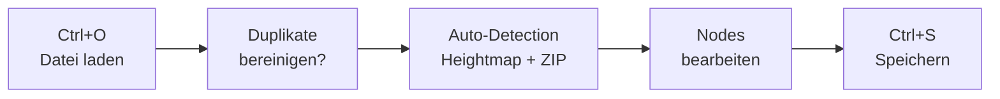
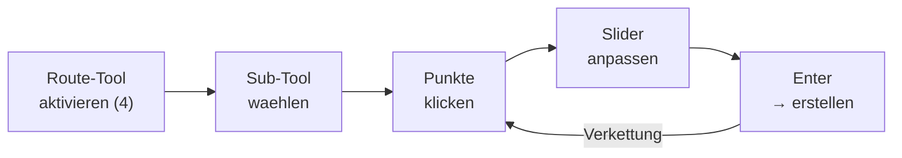
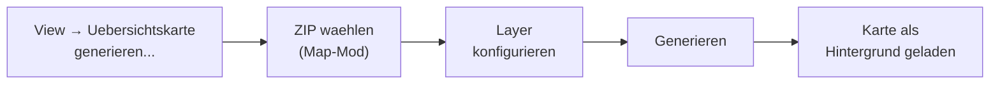

# FS25 AutoDrive Editor – Bedienungsanleitung

> **Hinweis:** Diese Datei wurde in mehrere thematische Unterseiten aufgeteilt.
> Die aktuelle Anleitung befindet sich unter **[docs/howto/index.md](howto/index.md)**.

---

## Inhaltsverzeichnis (veraltet – bitte howto/ verwenden)

1. [Ueberblick](#ueberblick)
2. [Programmstart und Dateiverwaltung](#programmstart-und-dateiverwaltung)
3. [Benutzeroberflaeche](#benutzeroberflaeche)
4. [Tastatur-Shortcuts](#tastatur-shortcuts)
5. [Maus-Bedienung](#maus-bedienung)
6. [Werkzeuge (Tools)](#werkzeuge-tools)
7. [Selektion](#selektion)
8. [Verbindungen bearbeiten](#verbindungen-bearbeiten)
9. [Map-Marker](#map-marker)
10. [Kamera und Viewport](#kamera-und-viewport)
11. [Hintergrund-Karte](#hintergrund-karte)
12. [Uebersichtskarten-Generierung](#uebersichtskarten-generierung)
13. [Automatische Erkennung (Post-Load)](#automatische-erkennung-post-load)
14. [Heightmap](#heightmap)
15. [Streckenteilung (Distanzen-Neuverteilung)](#streckenteilung-distanzen-neuverteilung)
16. [Duplikat-Bereinigung](#duplikat-bereinigung)
17. [Optionen](#optionen)
18. [Undo / Redo](#undo--redo)
19. [Typische Workflows](#typische-workflows)

---

## Ueberblick

Der FS25 AutoDrive Editor dient zum Erstellen und Bearbeiten von AutoDrive-Kursen fuer den Farming Simulator 25. Er laedt XML-Konfigurationsdateien (`AutoDrive_config*.xml`), stellt das Strassennetzwerk grafisch dar und ermoeglicht das Bearbeiten von Wegpunkten (Nodes), Verbindungen (Connections) und Map-Markern.

**Kernfeatures:**
- GPU-beschleunigtes Rendering fuer 100.000+ Wegpunkte
- Rect- und Lasso-Selektion
- Verbindungs-Bearbeitung (Richtung, Prioritaet, Invertierung)
- Map-Marker erstellen und verwalten
- Heightmap-Support fuer Y-Koordinaten beim Export
- Hintergrund-Karte (PNG/JPG/DDS) als Orientierungshilfe
- Vollstaendiges Undo/Redo-System

---

## Programmstart und Dateiverwaltung

### Datei oeffnen

| Aktion | Weg |
|--------|-----|
| Menue | **File → Open...** |
| Shortcut | `Ctrl+O` |

Oeffnet einen Datei-Dialog zur Auswahl einer AutoDrive-XML-Konfigurationsdatei. Nach dem Laden wird die Kamera automatisch auf die Bounding-Box des Netzwerks zentriert.

**Automatische Erkennung:** Nach dem Laden prueft der Editor automatisch:
- Ob eine `terrain.heightmap.png` im selben Verzeichnis liegt → wird direkt als Heightmap gesetzt
- Ob im Mods-Verzeichnis (`../../mods/` relativ zum Savegame) ein passender Map-Mod-ZIP zum Kartennamen existiert → Dialog bietet Uebersichtskarten-Generierung an

Das Matching beruecksichtigt Umlaute (ae↔ae, oe↔oe, ue↔ue, ss↔ss), ist case-insensitive und behandelt Leerzeichen/Unterstriche als Wildcard.

### Datei speichern

| Aktion | Weg |
|--------|-----|
| Speichern | **File → Save** oder `Ctrl+S` |
| Speichern unter | **File → Save As...** |

Beim Speichern wird geprueft, ob eine Heightmap geladen ist. Falls nicht, erscheint eine Warnung, dass Y-Koordinaten nicht korrekt geschrieben werden koennen.

### Programm beenden

| Aktion | Weg |
|--------|-----|
| Menue | **File → Exit** |

---

## Benutzeroberflaeche

Das Hauptfenster besteht aus folgenden Bereichen:


```mermaid
block-beta
    columns 2
    menu["Menue-Leiste (File | Edit | View | Help)"]:2
    toolbar["Toolbar (Werkzeug | Delete | Background)"]:2
    viewport["Viewport\n(Karten-Darstellung)"] props["Eigenschaften\n(Panel)"]
    status["Statusleiste (Nodes | Connections | Zoom …)"]:2
```

### Menue-Leiste

- **File**: Oeffnen, Speichern, Heightmap, Exit
- **Edit**: Undo, Redo, Optionen
- **View**: Kamera-Reset, Zoom, Hintergrund-Karte, Render-Quality
- **Help**: About (Versionsinformation)

### Eigenschaften-Panel (rechte Seitenleiste)

Das Eigenschaften-Panel zeigt kontextabhaengig Infos zur aktuellen Selektion und enthaelt die Standard-Verbindungseinstellungen sowie bei aktivem Route-Tool die Route-Konfiguration.

| Inhalt | Bedingung |
|--------|-----------|
| „Keine Selektion" | Kein Node selektiert |
| Node-ID, Position, Flag, Marker-Controls | Genau 1 Node selektiert |
| Verbindungs-Details, Richtungs-/Prioritaets-ComboBox, Trennen-Button | Genau 2 Nodes selektiert |
| „N Nodes selektiert" | 3+ Nodes selektiert |
| Standard-Richtung und Strassenart (ComboBox) | Immer sichtbar (unterer Bereich) |
| Route-Tool-Konfiguration (Slider) | Nur wenn Route-Tool aktiv |

### Toolbar

Zeigt die verfuegbaren Werkzeuge:
- **⊹ Select (1)** — Standard-Werkzeug: Nodes selektieren und verschieben
- **⟷ Connect (2)** — Verbindungen zwischen Nodes erstellen
- **＋ Add Node (3)** — Neue Nodes auf der Karte platzieren- **Route-Tools (4)** — Route-Werkzeuge: Gerade Strecke, Bézier-Kurve, Spline- **🗑 Delete (Del)** — Selektierte Nodes loeschen (nur aktiv bei Selektion)
- **Hintergrund-Controls** — Opacity-Slider und Sichtbarkeits-Toggle (rechts, nur wenn Hintergrund geladen)

### Statusleiste

Zeigt folgende Informationen (nur Anzeige, nicht interaktiv):
- Node-Count, Connection-Count, Marker-Count
- Map-Name (falls vorhanden)
- Zoom-Stufe und Kamera-Position
- Heightmap-Status (Dateiname oder "None")
- Anzahl selektierter Nodes
- FPS (rechts)

---

## Tastatur-Shortcuts

### Globale Shortcuts

| Shortcut | Aktion |
|----------|--------|
| `Ctrl+O` | Datei oeffnen |
| `Ctrl+S` | Datei speichern |
| `Ctrl+Z` | Undo (Rueckgaengig) |
| `Ctrl+Y` | Redo (Wiederherstellen) |
| `Shift+Ctrl+Z` | Redo (Alternative) |
| `Ctrl+A` | Alle Nodes selektieren |
| `Escape` | Selektion aufheben |

### Werkzeug-Shortcuts

| Shortcut | Werkzeug |
|----------|----------|
| `1` | Select-Tool (Auswaehlen/Verschieben) |
| `2` | Connect-Tool (Verbindungen erstellen) |
| `3` | Add-Node-Tool (Nodes hinzufuegen) |

### Bearbeitungs-Shortcuts

| Shortcut | Aktion | Bedingung |
|----------|--------|-----------|
| `Delete` / `Backspace` | Selektierte Nodes loeschen | Mindestens 1 Node selektiert |
| `C` | Verbindung erstellen (Regular-Richtung) | Genau 2 Nodes selektiert |
| `X` | Verbindung zwischen Nodes trennen | Genau 2 Nodes selektiert |

---

## Maus-Bedienung

### Klick-Aktionen

| Maus-Aktion | Werkzeug | Ergebnis |
|-------------|----------|----------|
| **Linksklick** | Select | Node unter Mauszeiger selektieren (ersetzt bestehende Selektion) |
| **Ctrl+Linksklick** | Select | Node additiv zur Selektion hinzufuegen |
| **Shift+Linksklick** | Select | Pfad-Selektion: Selektiert alle Nodes auf dem kuerzesten Pfad zwischen Anker-Node und Ziel-Node |
| **Doppelklick** | Select | Segment-Selektion: Selektiert alle Nodes zwischen den naechsten Kreuzungen/Sackgassen |
| **Ctrl+Doppelklick** | Select | Segment additiv zur Selektion hinzufuegen |
| **Linksklick** | Connect | Ers­ter Klick = Startknoten, Zweiter Klick = Zielknoten → Verbindung erstellen |
| **Linksklick** | Add Node | Neuen Node an Klickposition einfuegen |

### Drag-Aktionen (Ziehen mit gedrueckter Maustaste)

| Maus-Aktion | Ergebnis |
|-------------|----------|
| **Links-Drag auf selektiertem Node** | Alle selektierten Nodes gemeinsam verschieben |
| **Links-Drag auf leerem Bereich** | Kamera schwenken (Pan) |
| **Shift+Links-Drag** | Rechteck-Selektion → alle Nodes im Rechteck werden selektiert |
| **Shift+Ctrl+Links-Drag** | Rechteck-Selektion (additiv, erweitert bestehende Selektion) |
| **Alt+Links-Drag** | Lasso-Selektion → freigeformte Polygon-Selektion |
| **Alt+Ctrl+Links-Drag** | Lasso-Selektion (additiv, erweitert bestehende Selektion) |
| **Mittelklick-Drag** | Kamera schwenken (Pan) |
| **Rechtsklick-Drag** | Kamera schwenken (Pan) |

### Scroll-Aktionen

| Maus-Aktion | Ergebnis |
|-------------|----------|
| **Mausrad hoch** | Hineinzoomen (auf Mausposition) |
| **Mausrad runter** | Herauszoomen (von Mausposition) |

### Kontextmenue (Rechtsklick)

#### Bei 2+ selektierten Nodes (mit Verbindungen dazwischen)

| Menuepunkt | Aktion |
|-----------|--------|
| 🔗 Nodes verbinden | Verbindung erstellen (bei genau 2 Nodes ohne Verbindung) |
| ↦ Regular (Einbahn) | Alle Verbindungen auf Regular-Richtung setzen |
| ⇆ Dual (beidseitig) | Alle Verbindungen auf Dual-Richtung setzen |
| ↤ Reverse (rueckwaerts) | Alle Verbindungen auf Reverse-Richtung setzen |
| ⇄ Invertieren | Start/End aller Verbindungen tauschen |
| 🛣 Hauptstrasse | Prioritaet aller Verbindungen auf Regular setzen |
| 🛤 Nebenstrasse | Prioritaet aller Verbindungen auf SubPriority setzen |
| ✕ Alle trennen | Alle Verbindungen zwischen selektierten Nodes entfernen |

#### Bei 1 selektiertem Node

| Menuepunkt | Aktion |
|-----------|--------|
| 🗺 Marker erstellen | Neuen Map-Marker auf diesem Node anlegen |
| ✏ Marker aendern | Bestehenden Marker bearbeiten (Name, Gruppe) |
| ✕ Marker loeschen | Marker von diesem Node entfernen |

---

## Werkzeuge (Tools)

### Select-Tool (1)

Das Standard-Werkzeug fuer Auswahl und Verschiebung von Nodes.

**Funktionen:**
- Einzelklick: Node selektieren (Pick-Radius: 12px)
- Ctrl+Klick: Additiv selektieren
- Shift+Klick: Pfad-Selektion (kuerzester Pfad von Anker zu Ziel)
- Doppelklick: Segment zwischen Kreuzungen selektieren
- Drag auf selektiertem Node: Alle selektierten Nodes verschieben
- Drag auf leerem Bereich: Kamera schwenken

### Connect-Tool (2)

Erstellt Verbindungen zwischen zwei Nodes.

**Workflow:**
1. Ersten Node anklicken → in Toolbar erscheint "Startknoten: [ID] → Waehle Zielknoten"
2. Zweiten Node anklicken → Verbindung wird erstellt
3. Werkzeug bleibt aktiv fuer weitere Verbindungen

**Standard-Einstellungen:**
- Richtung: Regular (Einbahn vom Start zum Ziel)
- Prioritaet: Regular (Hauptstrasse)

### Add-Node-Tool (3)

Platziert neue Wegpunkte auf der Karte.

**Workflow:**
- Klick auf eine beliebige Stelle → neuer Node wird an der Welt-Position eingefuegt
- Der neue Node erhaelt automatisch die naechste freie ID

### Route-Tools (4)

Erstellt Strecken und Kurse ueber vordefinierte Geometrien. Im Route-Modus stehen drei Sub-Tools zur Verfuegung:

#### 📏 Gerade Strecke

Zeichnet eine gerade Linie zwischen zwei Punkten mit automatischen Zwischen-Nodes.

**Workflow:**
1. Startpunkt klicken
2. Endpunkt klicken → Vorschau erscheint
3. Enter → Strecke wird erstellt

**Einstellungen:** Min. Abstand (Segment-Laenge) und Anzahl Nodes.

#### 🔀 Kurve (Bézier)

Zeichnet eine Bézier-Kurve (Grad 2 oder 3) mit Steuerpunkten.

**Workflow:**
1. Startpunkt klicken
2. Endpunkt klicken
3. Steuerpunkt(e) klicken → Vorschau erscheint
4. Optional: Punkte per Drag anpassen
5. Enter → Kurve wird erstellt

**Einstellungen:** Grad (Quadratisch/Kubisch), Min. Abstand, Anzahl Nodes.

#### 〰️ Spline (Catmull-Rom)

Zeichnet einen interpolierenden Spline, der durch **alle geklickten Punkte** fuehrt. Im Gegensatz zur Bézier-Kurve (die Steuerpunkte nur annaehert) verlaeuft der Spline exakt durch jeden gesetzten Punkt.

**Workflow:**
1. Beliebig viele Punkte nacheinander klicken (mindestens 2)
2. Vorschau wird fortlaufend aktualisiert (Cursor = naechster Punkt)
3. Enter → Spline wird erstellt

**Einstellungen:** Min. Abstand (Segment-Laenge) und Anzahl Nodes.

**Besonderheiten:**
- Ab 3 Punkten entsteht eine glatte Kurve (Catmull-Rom-Interpolation)
- Mit 2 Punkten wird eine gerade Strecke erzeugt
- Verkettung: Nach Enter wird der letzte Endpunkt automatisch als neuer Startpunkt uebernommen
- Nachbearbeitung: Segment-Laenge / Node-Anzahl koennen nach Erstellung geaendert werden

#### Gemeinsame Eigenschaften aller Route-Tools

- **Enter** bestaetigt und erstellt die Route
- **Escape** bricht ab und setzt das Tool zurueck
- **Verkettung:** Nach Erstellung wird der letzte Endpunkt als neuer Startpunkt uebernommen. Das Tool bleibt aktiv — der naechste Klick setzt den neuen Endpunkt. So koennen zusammenhaengende Strecken nahtlos hintereinander erstellt werden.
- **Nachbearbeitung:** Segment-Laenge/Node-Anzahl koennen nach Erstellung per Slider angepasst werden. Die zuletzt erstellte Strecke wird automatisch geloescht und mit den neuen Parametern neu berechnet.
- **Snap:** Start- und Endpunkte rasten auf existierende Nodes ein (Snap-Radius: 3m)

#### Tangent-Ausrichtung (Kurve und Spline)

Wenn Start- oder Endpunkt einer **kubischen Bézier-Kurve** oder eines **Splines** auf einen existierenden Node snapt, kann die lokale Tangente an einer vorhandenen Verbindung ausgerichtet werden:

1. Route-Tool (Kurve oder Spline) aktivieren
2. Start- oder Endpunkt auf einen existierenden Node klicken (Snap)
3. Im **Eigenschaften-Panel** erscheint eine Tangent-Auswahl (ComboBox):
   - **Manuell** — keine automatische Tangente
   - **→ Node #42 (NO)** — Tangente entlang der Verbindung zum Nachbar-Node (mit Kompassrichtung)
4. Bei Auswahl einer Tangente wird der zugehoerige Kontrollpunkt automatisch entlang der Verbindungsrichtung platziert
5. Der Tangent-Vorschlag kann durch manuelles Klicken/Drag ueberschrieben werden

> **Hinweis:** Tangent-Ausrichtung ist nur bei kubischen Kurven und Splines verfuegbar, da diese separate Kontrollpunkte fuer Start und Ende haben.

#### Control-Point-Drag (nur Kurve)

Bei der **Bézier-Kurve** koennen die Steuerpunkte nach dem Setzen per Drag verschoben werden:

1. In der Kontrollpunkt-Phase auf einen Steuerpunkt klicken und ziehen
2. Die Kurve wird in Echtzeit aktualisiert
3. Loslassen fixiert die neue Position

Erkannte Drag-Ziele sind der/die Kontrollpunkt(e) sowie Start- und Endpunkt.

---

## Selektion

### Selektionsmodi

| Modus | Aktivierung | Beschreibung |
|-------|-------------|--------------|
| **Einzelselektion** | Linksklick | Ersetzt die aktuelle Selektion durch den angeklickten Node |
| **Additive Selektion** | Ctrl+Linksklick | Fuegt den Node zur bestehenden Selektion hinzu |
| **Pfad-Selektion** | Shift+Linksklick | Selektiert alle Nodes auf dem kuerzesten Pfad zwischen dem zuletzt selektierten Node (Anker) und dem angeklickten Node |
| **Segment-Selektion** | Doppelklick | Selektiert alle Nodes eines Segments (bis zur naechsten Kreuzung oder Sackgasse) |
| **Rechteck-Selektion** | Shift+Drag | Alle Nodes innerhalb des aufgezogenen Rechtecks |
| **Lasso-Selektion** | Alt+Drag | Alle Nodes innerhalb des freihand gezeichneten Polygons |
| **Alles selektieren** | Ctrl+A | Alle Nodes im Netzwerk selektieren |
| **Selektion aufheben** | Escape | Selektion komplett leeren |

### Additive Modi

Alle Selektionsmodi koennen mit **Ctrl** kombiniert werden, um die bestehende Selektion zu erweitern anstatt sie zu ersetzen:

- `Ctrl+Shift+Drag` → Rechteck-Selektion additiv
- `Ctrl+Alt+Drag` → Lasso-Selektion additiv
- `Ctrl+Doppelklick` → Segment additiv hinzufuegen

### Selektion verschieben

Bei Drag auf einem bereits selektierten Node werden **alle selektierten Nodes gemeinsam verschoben**. Ein Undo-Snapshot wird automatisch beim Start des Drag erstellt.

---

## Verbindungen bearbeiten

### Verbindung erstellen

| Methode | Beschreibung |
|---------|--------------|
| **Connect-Tool (2)** | Zwei Nodes nacheinander anklicken |
| **Shortcut `C`** | Bei genau 2 selektierten Nodes → Regular-Verbindung erstellen |
| **Kontextmenue** | Rechtsklick bei genau 2 Nodes → "Nodes verbinden" |

### Verbindung entfernen

| Methode | Beschreibung |
|---------|--------------|
| **Shortcut `X`** | Bei genau 2 selektierten Nodes → Verbindung(en) trennen |
| **Kontextmenue** | Bei 2+ selektierten Nodes → "Alle trennen" |

### Richtung aendern

Ueber das **Kontextmenue** (Rechtsklick bei 2+ selektierten Nodes):

| Richtung | Symbol | Beschreibung |
|----------|--------|-------------|
| **Regular** | ↦ | Einbahnstrasse (Start → Ende) |
| **Dual** | ⇆ | Bidirektional (beide Richtungen) |
| **Reverse** | ↤ | Umgekehrt (Ende → Start) |
| **Invertieren** | ⇄ | Start und Ende tauschen |

### Prioritaet aendern

Ueber das **Kontextmenue**:

| Prioritaet | Symbol | Beschreibung |
|-----------|--------|-------------|
| **Regular** | 🛣 | Hauptstrasse |
| **SubPriority** | 🛤 | Nebenstrasse (duenner dargestellt, Gelb-Markierung) |

### Farbcodierung

| Farbe | Bedeutung |
|-------|-----------|
| **Gruen** | Regular-Verbindung (Einrichtung) |
| **Blau** | Dual-Verbindung (bidirektional) |
| **Orange** | Reverse-Verbindung |

---

## Map-Marker

Map-Marker sind benannte Ziele auf der Karte (z. B. „Hof", „Feld 1", „Silo").

### Marker erstellen

1. Einen einzelnen Node selektieren
2. Rechtsklick → **"🗺 Marker erstellen"**
3. Im Dialog Name und Gruppe eingeben
4. Bestaetigen

### Marker bearbeiten

1. Den Node mit bestehendem Marker selektieren
2. Rechtsklick → **"✏ Marker aendern"**
3. Name/Gruppe anpassen
4. Bestaetigen

### Marker loeschen

1. Den Node mit Marker selektieren
2. Rechtsklick → **"✕ Marker loeschen"**

### Darstellung

Marker werden als **rote Pin-Symbole** dargestellt:
- Pin-Spitze sitzt exakt auf dem Node-Zentrum
- Rote Fuellung mit dunkelrotem Rand
- Groesse: 2.0 Welteinheiten

---

## Kamera und Viewport

### Kamera-Steuerung

| Aktion | Weg |
|--------|-----|
| **Schwenken (Pan)** | Mittlere Maustaste / Rechte Maustaste ziehen, oder Links-Drag auf leerem Bereich |
| **Zoomen** | Mausrad (zoomt auf/von Mausposition) |
| **Zoom In** | View → Zoom In (Faktor 1.2) |
| **Zoom Out** | View → Zoom Out (Faktor 1/1.2) |
| **Kamera zuruecksetzen** | View → Reset Camera |

### Automatische Zentrierung

Beim Laden einer Datei wird die Kamera automatisch auf die Bounding-Box des Netzwerks zentriert, sodass alle Nodes sichtbar sind.

### Render-Quality

Ueber **View → Render Quality**:

| Stufe | Beschreibung |
|-------|-------------|
| **Low** | Harte Kanten, maximale Performance |
| **Medium** | Standard Anti-Aliasing (empfohlen) |
| **High** | Breiteres Anti-Aliasing, weichere Kanten |

---

## Hintergrund-Karte

Eine Map-Uebersicht (PNG, JPG oder DDS) kann als Hintergrund geladen werden, um Nodes und Verbindungen mit der Karte abzugleichen.

### Hintergrund laden

**View → Hintergrund laden...** — Datei-Dialog oeffnet sich.

Optional kann beim Laden ein Center-Crop (quadratischer Ausschnitt) angegeben werden.

### Hintergrund-Controls (Toolbar)

Wenn ein Hintergrund geladen ist, erscheinen rechts in der Toolbar:

| Control | Beschreibung |
|---------|-------------|
| **Opacity-Slider** | Deckkraft einstellen (0.0 = unsichtbar bis 1.0 = voll sichtbar) |
| **👁 Sichtbar / 🚫 Ausgeblendet** | Hintergrund ein-/ausblenden |

---

## Uebersichtskarten-Generierung

Anstatt eine fertige Uebersichtskarte manuell zu laden, kann der Editor sie direkt aus einer Map-Mod-ZIP-Datei generieren.

### Workflow


```mermaid
flowchart TD
    A["View → Uebersichtskarte generieren..."] --> B["ZIP-Datei waehlen (Map-Mod)"]
    B --> C["Layer-Options-Dialog"]
    C --> D{"Generieren?"}
    D -- Ja --> E["Karte wird erzeugt\n(Terrain + Overlays)"]
    E --> F["Als Hintergrund geladen"]
    D -- Nein --> G["Abbrechen"]
```

### Uebersichtskarte generieren

1. **View → Uebersichtskarte generieren...** — oeffnet den ZIP-Auswahl-Dialog
2. Eine Map-Mod-ZIP-Datei auswaehlen (enthaelt Terrain-Daten, GRLE-Farmlands, POIs)
3. Im **Layer-Options-Dialog** die gewuenschten Layer ein-/ausschalten:

| Layer | Standard | Beschreibung |
|-------|----------|-------------|
| **Hillshade** | ✅ | Gelaendeschattierung fuer raeumlichen Eindruck |
| **Farmland-Grenzen** | ✅ | Weisse Grenzlinien zwischen Farmland-Parzellen |
| **Farmland-IDs** | ✅ | Nummerierung der Farmland-Parzellen |
| **POI-Marker** | ✅ | Verkaufsstellen, Silos, Tankstellen etc. |
| **Legende** | ❌ | Farbcodierung der Bodentypen |

4. **Generieren** klicken — die Karte wird berechnet und als Hintergrund geladen

### Layer-Standardeinstellungen

Die Layer-Auswahl wird persistent in der Konfigurationsdatei (`fs25_auto_drive_editor.toml`) gespeichert. Beim naechsten Mal werden die zuletzt verwendeten Einstellungen vorausgewaehlt.

Die Standard-Layer koennen auch ueber **Edit → Optionen... → Uebersichtskarte (Standard-Layer)** dauerhaft angepasst werden.

---

## Automatische Erkennung (Post-Load)

Nach dem Laden einer AutoDrive-XML-Datei prueft der Editor automatisch, ob zugehoerige Dateien im selben Verzeichnis oder im Mods-Ordner vorhanden sind.

### Erkannte Dateien

| Datei | Pfad | Aktion |
|-------|------|--------|
| **Heightmap** | `terrain.heightmap.png` im XML-Verzeichnis | Wird automatisch als Heightmap gesetzt |
| **Map-Mod-ZIP** | `../../mods/FS25_*.zip` (Mods-Verzeichnis) | Dialog bietet Uebersichtskarten-Generierung an |

### Matching-Logik fuer ZIP-Dateien

Der Kartenname aus der XML-Datei (z.B. `<MapName>Hoeflingen Valley</MapName>`) wird gegen die ZIP-Dateinamen im Mods-Verzeichnis abgeglichen:

- **Case-insensitive:** „Hoeflingen" matcht „hoeflingen", „HOeFLINGEN", usw.
- **Umlaut-tolerant:** ae↔ae, oe↔oe, ue↔ue, ss↔ss (bidirektional)
- **Trennzeichen-flexibel:** Leerzeichen und Underscores werden als Wildcard behandelt

**Beispiel:** Kartenname `Hoeflingen Valley` findet:
- `FS25_Hoeflingen.zip` ✓
- `FS25_Hoeflingen_V2.zip` ✓
- `FS25_Hoeflingen_Valley.zip` ✓

### Post-Load-Dialog

Falls Dateien erkannt werden, erscheint automatisch ein Dialog:

```
Nach dem Laden erkannt

✓ Heightmap automatisch geladen
   terrain.heightmap.png

Karte: "Hoeflingen"
Passender Map-Mod gefunden:
   📦 FS25_Hoeflingen.zip

[Uebersichtskarte generieren]  [Schliessen]
```

| Schaltflaeche | Aktion |
|-------------|--------|
| **Uebersichtskarte generieren** | Oeffnet den Layer-Options-Dialog zur Uebersichtskarten-Generierung |
| **Schliessen** | Dialog schliessen, keine weitere Aktion |

Bei mehreren passenden ZIPs kann der gewuenschte Mod per RadioButton ausgewaehlt werden.

### Verzeichnisstruktur

Die Auto-Detection erwartet folgende Savegame-Struktur:

```
FarmingSimulator2025/
├── mods/
│   ├── FS25_Hoeflingen.zip
│   └── FS25_AnotherMap.zip
├── savegame1/
│   ├── AutoDrive_config.xml    ← diese Datei laden
│   └── terrain.heightmap.png   ← wird automatisch erkannt
└── savegame2/
    └── ...
```

---

## Heightmap

Die Heightmap wird fuer die korrekte Y-Koordinaten-Berechnung beim XML-Export benoetigt.

### Heightmap laden

**File → Select Heightmap...** — Waehlt eine PNG-Heightmap aus.

### Heightmap entfernen

**File → Clear Heightmap** — Entfernt die geladene Heightmap.

### Heightmap-Warnung

Beim Speichern ohne Heightmap erscheint eine Warnung. Sie koennen:
- **Bestaetigen** → Speichern ohne Y-Koordinaten-Aktualisierung
- **Abbrechen** → Zurueck zum Editor

---

## Streckenteilung (Distanzen-Neuverteilung)

Die Streckenteilung ermoeglicht es, Nodes entlang einer selektierten Kette gleichmaessig neu zu verteilen. Die Funktion steht im **Eigenschaften-Panel** zur Verfuegung, wenn eine zusammenhaengende Kette von Nodes selektiert ist.

### Voraussetzung

- Mindestens 2 Nodes muessen selektiert sein
- Die selektierten Nodes muessen eine **zusammenhaengende Kette** bilden (durch Verbindungen verbunden, keine Verzweigungen)
- Bilden die Nodes keine gueltige Kette, erscheint die Meldung: *„⚠ Selektierte Nodes bilden keine zusammenhaengende Kette."*

### Workflow


```mermaid
flowchart LR
    A["Kette\nselektieren"] --> B["▶ Einteilung\naendern"]
    B --> C["Abstand / Nodes\nanpassen"]
    C --> D["Vorschau\npruefen"]
    D --> E["Enter\n→ uebernehmen"]
    D --> F["Esc\n→ verwerfen"]
```

1. Eine zusammenhaengende Kette von Nodes selektieren (z. B. per **Doppelklick** auf ein Segment oder **Shift+Klick** fuer Pfad-Selektion)
2. Im Eigenschaften-Panel erscheint **Streckenteilung** mit der berechneten Streckenlaenge
3. **▶ Einteilung aendern** klicken → Vorschau wird aktiviert
4. Parameter anpassen:
   - **Abstand** (DragValue, 1–25 m): Gewuenschter Abstand zwischen Nodes
   - **Nodes** (DragValue, 2–10000): Gewuenschte Anzahl Nodes auf der Strecke
5. Die Vorschau zeigt die neuberechneten Node-Positionen in Echtzeit
6. Optional: **Originale ausblenden** aktivieren, um nur die Vorschau zu sehen
7. **Enter** → Die bestehenden Nodes werden durch die neu verteilten Nodes ersetzt
8. **Escape** → Vorschau wird verworfen, keine Aenderung

### Einstellungs-Modi

| Modus | Beschreibung |
|-------|-------------|
| **Nach Abstand** | Abstand-DragValue aendern → Node-Anzahl wird automatisch berechnet |
| **Nach Anzahl** | Nodes-DragValue aendern → Abstand wird automatisch berechnet |

> **Hinweis:** Der Mindestabstand betraegt 1 m. Wird durch die gewaehlte Node-Anzahl ein Abstand < 1 m berechnet, wird automatisch auf 1 m korrigiert.

### Berechnung

Die Neuverteilung nutzt **Catmull-Rom-Spline-Interpolation** entlang der originalen Strecke. Dadurch werden die neuen Nodes gleichmaessig auf der tatsaechlichen Kurvengeometrie verteilt — nicht nur auf der Luftlinie zwischen den Endpunkten.

---

## Duplikat-Bereinigung

Beim Laden einer AutoDrive-Konfiguration prueft der Editor automatisch, ob doppelte Wegpunkte vorhanden sind (Abstandstoleranz: 0,01 Welteinheiten).

### Duplikat-Dialog

Falls duplizierte Nodes gefunden werden, erscheint nach dem Laden automatisch ein Dialog:

```
Duplizierte Wegpunkte gefunden
X Duplikate in Y Gruppen gefunden.
Duplikate jetzt bereinigen?

[ Bereinigen ]   [ Abbrechen ]
```

| Schaltflaeche | Aktion |
|-------------|--------|
| **Bereinigen** | Zusammenfuehren: Doppelte Nodes werden entfernt, Verbindungen umgeleitet, RoadMap bereinigt |
| **Abbrechen** | Dialog schliessen, RoadMap unveraendert beibehalten |

> **Hinweis:** Die Bereinigung kann nicht per Undo rueckgaengig gemacht werden. Bei Bedarf die Original-Datei sichern, bevor Duplikate bereinigt werden.

---

## Optionen

Ueber **Edit → Optionen...** wird der Optionen-Dialog geoeffnet. Alle Einstellungen werden als `fs25_auto_drive_editor.toml` neben der Binary gespeichert.

### Konfigurierbare Werte

| Kategorie | Option | Standard |
|-----------|--------|----------|
| **Nodes** | Node-Groesse | 0.5 Welteinheiten |
| | Farbe Regular | Cyan |
| | Farbe SubPrio | Gelb |
| | Farbe Selektiert | Magenta |
| | Farbe Warnung | Rot |
| **Selektion** | Pick-Radius | 12 Pixel |
| | Groessenfaktor Selektiert | 130% (Bereich 100-200%) |
| | Markierungsstil | Ring (alternativ: Farbverlauf) |
| **Connections** | Linienstaerke Normal | 0.2 |
| | Linienstaerke SubPrio | 0.1 |
| | Pfeil-Laenge / Breite | 1.0 / 0.6 |
| | Farbe Regular | Gruen |
| | Farbe Dual | Blau |
| | Farbe Reverse | Orange |
| **Marker** | Marker-Groesse | 2.0 |
| | Fuellfarbe | Rot |
| | Outline-Farbe | Dunkelrot |
| **Kamera** | Zoom-Schritt (Menue) | 1.2 |
| | Zoom-Schritt (Mausrad) | 1.1 |
| **Uebersichtskarte** | Hillshade | ✅ |
| | Farmland-Grenzen | ✅ |
| | Farmland-IDs | ✅ |
| | POI-Marker | ✅ |
| | Legende | ❌ |

---

## Undo / Redo

Alle destruktiven Operationen erzeugen automatisch einen Undo-Snapshot:

| Shortcut | Aktion |
|----------|--------|
| `Ctrl+Z` | Rueckgaengig (Undo) |
| `Ctrl+Y` oder `Shift+Ctrl+Z` | Wiederherstellen (Redo) |

Auch ueber **Edit → Undo / Redo** im Menue verfuegbar (mit Anzeige ob verfuegbar).

**Operationen mit Undo-Support:**
- Nodes hinzufuegen / loeschen
- Nodes verschieben
- Verbindungen erstellen / entfernen / aendern
- Marker erstellen / bearbeiten / loeschen
- Bulk-Operationen (Richtung, Prioritaet, Invertierung, Trennen)

---

## Typische Workflows

### Neues Netzwerk bearbeiten


```mermaid
flowchart LR
    A["Ctrl+O\nDatei laden"] --> B["Duplikate\nbereinigen?"]
    B --> C["Auto-Detection\nHeightmap + ZIP"]
    C --> D["Nodes\nbearbeiten"]
    D --> E["Ctrl+S\nSpeichern"]
```

1. `Ctrl+O` → XML-Datei aus Savegame laden
2. Falls Duplikate gefunden: **Bereinigen** im Dialog waehlen
3. Falls Heightmap/Map-Mod erkannt: Post-Load-Dialog nutzen (Heightmap wird automatisch gesetzt, optional Uebersichtskarte generieren)
4. Nodes bearbeiten (Select-Tool, Drag zum Verschieben)
5. `Ctrl+S` → Speichern

### Route erstellen (mit Route-Tools)


```mermaid
flowchart LR
    A["Route-Tool\naktivieren (4)"] --> B["Sub-Tool\nwaehlen"]
    B --> C["Punkte\nklicken"]
    C --> D["Slider\nanpassen"]
    D --> E["Enter\n→ erstellen"]
    E -->|Verkettung| C
```

1. **Route-Tool (4)** aktivieren
2. Sub-Tool waehlen: Gerade Strecke, Kurve oder Spline
3. Punkte auf der Karte klicken (Vorschau wird live angezeigt)
4. Segment-Laenge / Node-Anzahl per Slider anpassen
5. **Enter** → Route wird erstellt
6. Fuer weitere Segmente: Verkettung nutzt automatisch den letzten Endpunkt

### Route manuell erstellen

1. **Add-Node-Tool (3)** aktivieren
2. Nacheinander Nodes auf der Karte platzieren
3. **Connect-Tool (2)** aktivieren
4. Jeweils Start- und Ziel-Node anklicken um Verbindungen zu erstellen
5. Alternativ: 2 Nodes selektieren → `C` fuer schnelle Verbindung

### Segment bearbeiten

1. **Doppelklick** auf ein Segment → selektiert alle Nodes bis zur naechsten Kreuzung
2. Rechtsklick → Richtung/Prioritaet aendern oder invertieren
3. Oder: `Delete` um das ganze Segment zu loeschen

### Bulk-Bearbeitung

1. **Shift+Drag** (Rechteck) oder **Alt+Drag** (Lasso) um viele Nodes zu selektieren
2. Alternativ: `Ctrl+A` fuer alle Nodes
3. Rechtsklick → Bulk-Operationen auf allen Verbindungen zwischen selektierten Nodes

### Uebersichtskarte generieren


```mermaid
flowchart LR
    A["View → Uebersichtskarte\ngenerieren..."] --> B["ZIP waehlen\n(Map-Mod)"]
    B --> C["Layer\nkonfigurieren"]
    C --> D["Generieren"]
    D --> E["Karte als\nHintergrund geladen"]
```

1. **View → Uebersichtskarte generieren...** → ZIP-Datei der Map waehlen
2. Im Layer-Dialog die gewuenschten Layer aktivieren (Hillshade, Farmlands, POIs, …)
3. **Generieren** klicken
4. Die erzeugte Uebersichtskarte wird automatisch als Hintergrund geladen

### Marker setzen

1. Ziel-Node selektieren (Linksklick)
2. Rechtsklick → "Marker erstellen"
3. Name eingeben (z. B. "Hof", "Feld 1")
4. Gruppe eingeben (z. B. "default")
5. Bestaetigen

### Strecke neu aufteilen (Streckenteilung)

1. Zusammenhaengende Kette selektieren (z. B. Doppelklick auf Segment)
2. Im Eigenschaften-Panel: **▶ Einteilung aendern**
3. Abstand oder Node-Anzahl wie gewuenscht einstellen
4. Vorschau pruefen (optional: „Originale ausblenden")
5. **Enter** → Nodes werden gleichmaessig neu verteilt

---

## Farbcodierung (Uebersicht)

### Nodes

| Farbe | Bedeutung |
|-------|-----------|
| **Cyan** | Normaler Wegpunkt (Regular) |
| **Gelb** | Sub-Prioritaet (Nebenstrasse) |
| **Magenta** | Selektiert |
| **Rot** | Warnung (Fehler/Problem) |

### Verbindungen

| Farbe | Bedeutung |
|-------|-----------|
| **Gruen** | Regular (Einbahnstrasse) |
| **Blau** | Dual (bidirektional) |
| **Orange** | Reverse (umgekehrt) |

### Marker

| Element | Farbe |
|---------|-------|
| **Fuellung** | Rot |
| **Rand** | Dunkelrot |

---

## Dateiformat

Der Editor liest und schreibt AutoDrive-XML-Konfigurationsdateien (`AutoDrive_config*.xml`). Wichtige Details:

- **FS22/FS25-Kompatibilitaet:** Node-Flags 2 (AutoGenerated) und 4 (SplineGenerated) werden beim Import automatisch zu Regular (0) konvertiert
- **Listen-Trennzeichen:** Komma (`,`) fuer einfache Listen, Semikolon (`;`) fuer verschachtelte Listen (out/incoming)
- **Y-Koordinaten:** Werden beim Export aus der Heightmap berechnet (bikubische Interpolation)
