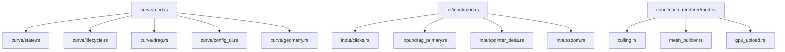

# Deep Rust Structure Audit — fs25_ad_editor

Stand: 2026-02-22  
Scope: Struktur, Modularisierung, DRY, Dokumentation, Performance-Muster, Trait-Konsistenz (ohne Codeänderungen)

## Executive Summary

Das Projekt ist architektonisch bereits gut getrennt (UI → App → Core, plus Render/XML/Shared), und die Guardrails sind aktiv und grün. Die größten Chancen liegen aktuell in **gezielten Dateisplits** und **lokalen Performance-Optimierungen im Frame-Pfad**.  

**Top-Prioritäten (P0/P1):**
1. `src/app/tools/curve.rs` (544 LOC) entlang von Lifecycle/State/Drag weiter modularisieren.
2. `src/ui/input.rs` (460 LOC) in klare Event-Phasen splitten (Start/Update/Ende/Klick/Scroll als Submodule).
3. `src/render/connection_renderer.rs` (433 LOC) in Culling + Geometry Assembly + GPU Upload trennen.
4. Per-Frame-Allokationen in `node_renderer`, `marker_renderer`, `app/render_scene` reduzieren.

---

## 1) Task Separation / Layering

### Beobachtung
- Layer-Aufbau ist klar und konsistent dokumentiert (`src/*/API.md`, `docs/ARCHITECTURE_PLAN.md`).
- Architektur-Guardrail ist vorhanden und aktuell **ohne Verstöße**:
  - `./scripts/check_layer_boundaries.sh` → „✓ Alle Layer-Grenzen eingehalten.”
- Positiv: UI nutzt Re-Exports aus `app` statt `core` direkt.

### Risiko
- Guardrail-Regeln prüfen harte Importverbote, aber nicht alle „weichen“ Architektur-Drifts (z. B. übergroße Orchestrierungsdateien).

### Empfehlung
- Guardrails später um „soft checks“ ergänzen (z. B. LOC-Limits pro Layerdatei, optional warnend).

---

## 2) Modularisierung & Dateigröße

### LOC-Ranking (Top)
- `src/app/tools/curve.rs` — **544 LOC**
- `src/ui/input.rs` — **460 LOC**
- `src/render/connection_renderer.rs` — **433 LOC**
- `src/app/tools/spline/mod.rs` — 389 LOC
- `src/xml/parser.rs` — 387 LOC
- `src/core/road_map.rs` — 377 LOC

### Split-Kandidaten (priorisiert)

#### P0 — `src/app/tools/curve.rs`
**Problem:** Tool-State, Flow, Drag, Tangenten-Handling und Teile der UI-Lifecycle-Logik liegen eng in einer Datei.  
**Vorschlag:**
- `curve/state.rs` (Struct, enums, ctor, sync/helpers)
- `curve/lifecycle.rs` (`on_click`, `execute`, `reset`, `set_last_created`, recreate)
- `curve/drag.rs` (`drag_targets`, `on_drag_*`)
- `curve/mod.rs` als Facade + Re-Exports

#### P0 — `src/ui/input.rs`
**Problem:** zentraler Hotpath bündelt sehr viele Verantwortungen (Drag-Start/Update/Ende, Klick, Delta, Scroll, Dispatch).  
**Vorschlag:**
- `ui/input/mod.rs` (InputState + collect orchestration)
- `ui/input/drag_primary.rs`
- `ui/input/clicks.rs`
- `ui/input/pointer_delta.rs`
- `ui/input/zoom.rs`

#### P1 — `src/render/connection_renderer.rs`
**Problem:** Culling, Geometrieerzeugung und GPU-Buffermanagement in einem Block; erschwert Profiling und Tests.  
**Vorschlag:**
- `render/connection_renderer/culling.rs`
- `render/connection_renderer/mesh_builder.rs`
- `render/connection_renderer/gpu_upload.rs`
- `render/connection_renderer/mod.rs`

---

## 3) Generalisierung & DRY

### Verifizierte Duplikate

#### P0 — Löschpfad-Duplikation
- `src/app/use_cases/editing/delete_nodes.rs`
- `src/app/use_cases/editing/delete_nodes_by_ids.rs`

Beide enthalten nahezu identische Schritte:
- Nachbar-IDs sammeln
- `remove_node` in Schleife
- `recalculate_node_flags`
- `ensure_spatial_index`

**Refactor-Vorschlag:**
- Gemeinsame interne Funktion, z. B. `delete_nodes_internal(road_map, ids, remove_markers, clear_selection)`.
- Öffentliche Use-Cases bleiben als dünne Adapter für Semantik (Undo/Snapshot, Selection-Verhalten).

#### P1 — Tangenten-ComboBox-UI in Curve/Spline
- `src/app/tools/curve/config_ui.rs`
- `src/app/tools/spline/config_ui.rs`

Wiederkehrende Muster: Auswahltext, Nachbar-Iteration, `TangentSource::Connection`, Recreate-Flag.

**Refactor-Vorschlag:**
- In `tools/common.rs` einen UI-Helfer (`render_tangent_selector`) extrahieren.

#### P2 — Segment-Slider-Logik
`SegmentConfig` deckt viel bereits ab (positiv), aber Spline hat noch teilweise manuelle Slider-Logik im Config-UI.

**Refactor-Vorschlag:**
- Spline-Config vollständig auf `SegmentConfig::render_*`-Pfad harmonisieren.

---

## 4) Dokumentationsabdeckung (Rust + Markdown)

### Positiv
- API-Dokumente pro Layer vorhanden:
  - `src/app/API.md`, `src/core/API.md`, `src/render/API.md`, `src/ui/API.md`, `src/xml/API.md`, `src/shared/API.md`
- Architektur-/Roadmap-Dokumentation gut ausgebaut.

### Befund
- Automatischer Schnellcheck meldet **44 Public-Items ohne direkt vorangestellte `///`-Zeile** (Heuristik).  
  Wichtig: Das ist ein Indikator, kein endgültiger Defektbericht (mehrzeilige Kommentarblöcke/Placement können false positives liefern).

Typische Treffer:
- `src/core/connection.rs` (`ConnectionDirection`, `ConnectionPriority`, `Connection`)
- `src/core/node.rs` (`NodeFlag`, `MapNode`)
- `src/shared/render_scene.rs` (`RenderScene`)
- `src/app/events.rs` (`AppIntent`, `AppCommand`)
- `src/app/state.rs` (mehrere Public-Structs)

### Markdown-Review (Outdated-Risiken)
- `docs/ROADMAP.md` Statusstand „2026-02-20“ ist potenziell veraltet gegenüber aktuellem Code-Stand.
- `docs/ARCHITECTURE_PLAN.md` listet einige Dateipfade/Strukturen, die inzwischen teilweise feiner gesplittet sind (z. B. Tool-Unterordner-Details).

**Empfehlung:**
- „Last verified“-Stempel pro Doku-Datei und quartalsweiser Doku-Review-Task.

---

## 5) Performance Patterns (Hot Paths)

### Befunde

#### P0 — Per-frame HashSet/Vec-Aufbau in Node-Renderer
- `src/render/node_renderer.rs`
- `selected_node_ids` wird in jedem Render-Call in `HashSet` materialisiert.
- `instances` wird pro Frame neu aufgebaut.

**Empfehlung:**
- Scratch-Buffer analog `connection_renderer.vertex_scratch` einführen.
- Optional: `selected_node_ids` als sortierter Slice + two-pointer oder einmalig gecachter `HashSet` im Scene-Builder.

#### P1 — Per-frame `collect()` in Marker-Renderer
- `src/render/marker_renderer.rs`
- `instances: Vec<MarkerInstance> = ...collect()` pro Frame.

**Empfehlung:**
- Wiederverwendbaren `instance_scratch` im Renderer halten (clear + refill).

#### P1 — Clone/Collect im Scene-Build
- `src/app/render_scene.rs`
- `selected_node_ids.iter().copied().collect()` pro Build.
- Options/Camera cloning je Frame.

**Empfehlung:**
- Prüfen, was als Copy günstig bleibt und was über referenzierte Caches/IDs reduziert werden kann.

#### P2 — Main-Loop Materialisierung für Properties
- `src/main.rs`
- `road_map_for_properties.clone()` + `selected_for_properties.collect()` im UI-Durchlauf.

**Empfehlung:**
- Nur bei tatsächlicher Panel-Anzeige berechnen oder memoizen.

---

## 6) Trait-Implementation-Konsistenz (`RouteTool`)

### Positiv
- Implementierungen vorhanden und konsistent in Grundstruktur:
  - `CurveTool`, `SplineTool`, `StraightLineTool`
- Lifecycle-Orchestrierung ist zentral in `src/app/handlers/route_tool.rs` sauber gekapselt.

### Befund
- `reset()`-Semantik unterscheidet sich bewusst zwischen Tools (z. B. was für Recreate/Verkettung erhalten bleibt). Das ist funktional legitim, aber wartungsanfällig bei neuen Tools.

### Empfehlung
- In `RouteTool`-Doku explizit dokumentieren, welche Zustände `reset()` *bewahren darf/soll*.
- Optional Default-Helfer im Trait für gemeinsames Recreate-Handling (falls weitere Tools dazukommen).

---

## 7) Fehlende/unterrepräsentierte Tests (strukturell relevant)

### Gute Abdeckung
- XML/Parser/Roundtrip und Tool-Tests sind vorhanden.

### Lücken
- `src/app/render_scene.rs`: kaum direkte Invariantentests für Build-Vertrag.
- `src/render/node_renderer.rs` & `src/render/marker_renderer.rs`: Datenaufbereitungslogik nur begrenzt isoliert testbar.
- `src/ui/input.rs`: zentrale Orchestrierung groß, aber Tests auf Modulgrenzen könnten robuster sein.

### Test-Empfehlungen
1. RenderScene-Builder: Snapshot-/Invariantentests (selected IDs, visibility flags, options passthrough).
2. Node/Marker preprocessing: reine Funktionen extrahieren und unit-testen.
3. Input-State: table-driven Tests pro Drag-/Click-Modus.

---

## 8) Priorisierte Refactor-Roadmap (ohne Implementierung)

## P0 (sofort)
- Split `curve.rs` in State/Lifecycle/Drag.
- Konsolidiere Delete-Use-Cases über gemeinsame interne Funktion.
- Reduziere per-frame Allokationen in Node-Renderer.

## P1 (nächster Zyklus)
- Split `ui/input.rs` nach Event-Phasen.
- Split `connection_renderer.rs` in Culling/Mesh/GPU.
- Tangenten-UI-Helfer für Curve/Spline extrahieren.

## P2 (stetig)
- Docstring-Lücken (heuristisch 44 Treffer) verifizieren und schließen.
- Roadmap-/Architektur-Dokumente auf aktuellen Datei-/Modulzuschnitt bringen.
- Zusätzliche Testabdeckung in rendernahen Datenpfaden.

---

## Vorschlag für Commit-Slices

### Commit A (P0, strukturell)
`refactor(app/tools): split curve tool into state/lifecycle/drag modules`

### Commit B (P0, DRY)
`refactor(app/use_cases/editing): unify node deletion internals`

### Commit C (P0, perf)
`perf(render/node): reuse instance scratch buffers and reduce per-frame allocations`

### Commit D (P1, modular)
`refactor(ui/input): split input orchestration into mode-specific modules`

### Commit E (P1, modular/perf)
`refactor(render/connection): extract culling and mesh assembly modules`

### Commit F (P2, docs/tests)
`docs+tests: close public docstring gaps and add render-scene invariant tests`

---

## Umsetzungs-Checklist (Todo)

- [ ] `curve.rs` in 3–4 Submodule splitten, öffentliche API unverändert lassen
- [ ] Gemeinsame Delete-Internal-Funktion einführen, alte APIs als Wrapper behalten
- [ ] `NodeRenderer` um `instance_scratch` ergänzen
- [ ] `MarkerRenderer` um wiederverwendbaren Scratch-Vektor ergänzen
- [ ] `ui/input.rs` in phasenbasierte Submodule zerlegen
- [ ] `connection_renderer.rs` in Culling/Mesh/GPU aufteilen
- [ ] Tangenten-ComboBox-UI als Shared Helper extrahieren
- [ ] Heuristische Liste „missing docstrings“ manuell verifizieren und bereinigen
- [ ] `docs/ROADMAP.md` und `docs/ARCHITECTURE_PLAN.md` auf Ist-Stand aktualisieren
- [ ] Zusätzliche Unit-Tests für RenderScene-Builder und Input-Moduswechsel ergänzen

---

## Architektur-Skizze (Refactor-Zielbild)

---

## Hinweise zur Audit-Methode

- Der Audit ist read-only durchgeführt (keine Implementierung/Mutation).
- LOC-Werte basieren auf `wc -l` über `src/**/*.rs`.
- Docstring-Lücken basieren auf heuristischer Prüfung „Public Item ohne direkt vorangestellte `///`“.
- Guardrails wurden direkt ausgeführt und waren grün.
