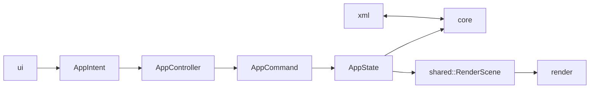
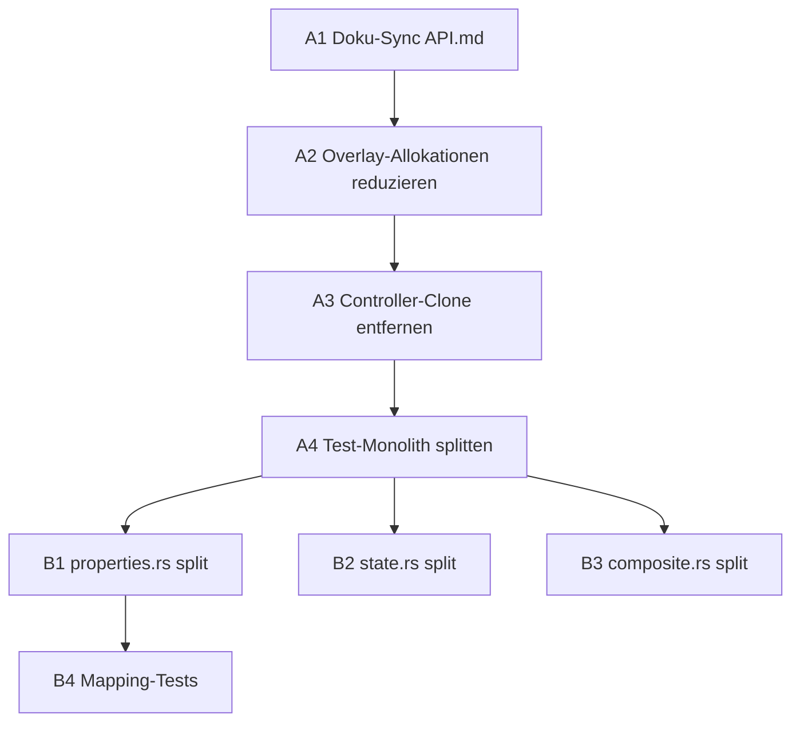

# Strukturelles Architektur-Audit

Stand: 2026-02-24  
Scope: gesamtes Workspace (`src/`, `crates/`, `docs/`, `tests/`)  
Methode: statische Analyse (read-only), Guardrail-Check, LOC- und Pattern-Scan

## Executive Summary

Das Projekt ist architektonisch bereits gut diszipliniert: Layer-Grenzen werden aktiv über ein CI-Skript erzwungen und sind aktuell eingehalten. Der größte Hebel liegt nicht in der Trennung der Schichten, sondern in **Wartbarkeit und Konsistenz**: mehrere große Dateien (UI/App/Test), dokumentarische Drift zwischen API.md und Code sowie einige konkrete Performance-Hotspots im Frame-/Command-Pfad.

**Priorität A (kurzfristig, hoher Nutzen):**
1. API-Doku mit Ist-Code synchronisieren (`RenderScene.hidden_node_ids`, UI-Panel-Verhalten).
2. Hotpath-Allokationen im Distanzen-Overlay und unnötiges Command-Clone im Controller reduzieren.
3. Größten Test-Monolith (`tests/controller_flow_tests.rs`) thematisch splitten.

---

## 1) Task Separation (Layer, Module, Verantwortlichkeiten)

### Befund
- Layer-Schnitt klar in Top-Level-Modulen sichtbar: `app`, `core`, `render`, `xml`, `shared`, `ui`.
- `shared` erfüllt die beabsichtigte Entkopplung (`RenderScene`, `RenderQuality`, Optionen).
- Guardrail-Regeln sind explizit und umfassend (u. a. UI→Core verboten, Core→UI/App/Render verboten, XML→App/UI/Render verboten).

### Nachweis
- `src/lib.rs`, `src/app/mod.rs`, `src/core/mod.rs`, `src/render/mod.rs`, `src/ui/mod.rs`, `src/xml/mod.rs`, `src/shared/mod.rs`
- `scripts/check_layer_boundaries.sh`
- Ergebnis Guardrail-Check: keine Verletzung festgestellt.

### Bewertung
- **Status: Grün**
- **Risiko:** niedrig, solange Guardrail-Skript weiterhin in CI/Gates aktiv bleibt.

---

## 2) Modularisierung & Dateigrößen

### Größte Dateien (LOC)
- `tests/controller_flow_tests.rs` — 1454
- `src/app/tools/curve/tests.rs` — 729
- `src/ui/properties.rs` — 572
- `crates/fs25_map_overview/src/composite.rs` — 513
- `src/app/state.rs` — 442
- `src/core/road_map.rs` — 395 (knapp unter 400, aber funktionsreich)

### Befund
1. `src/ui/properties.rs` bündelt mehrere Verantwortungen (Node-Details, Verbindungseditor, Marker-UI, Distanzen-Workflow, Tool-Config).
2. `src/app/state.rs` ist ein State-Monolith mit hoher Kopplung und steigender Änderungsfläche.
3. `crates/fs25_map_overview/src/composite.rs` vereint mehrere Pipeline-Schritte (Layer-Komposition, Labels, Legendenelemente).
4. `tests/controller_flow_tests.rs` ist zu groß für präzise Fehlerlokalisierung und Reviewbarkeit.

### Empfehlung (Split-Zielbild)
- `src/ui/properties.rs` → `ui/properties/{panel.rs, connection_edit.rs, marker_edit.rs, distanzen.rs, tool_config.rs}`
- `src/app/state.rs` → `app/state/{view_state.rs, ui_state.rs, selection_state.rs, editor_state.rs, dialogs.rs, mod.rs}`
- `crates/fs25_map_overview/src/composite.rs` → `composite/{layers.rs, labels.rs, legend.rs, compose.rs, mod.rs}`
- `tests/controller_flow_tests.rs` → `tests/controller_flow/{file_io.rs, selection.rs, editing.rs, route_tools.rs, dialogs.rs}`

### Bewertung
- **Status: Gelb**
- **Risiko:** mittel (Wartbarkeit, Merge-Konflikte, Onboarding-Kosten)

---

## 3) Generalisierung & DRY

### Positive bestehende Generalisierung
- RouteTool-Lifecycle bereits gut abstrahiert:
  - Trait-Defaults in `src/app/tools/route_tool.rs`
  - Wiederverwendbarer Lifecycle- und Segment-Config-Block in `src/app/tools/common/lifecycle.rs`
  - Reduktion von Boilerplate via `impl_lifecycle_delegation!`.

### DRY-Kandidaten
1. **Intent/Command-Spiegelung**
   - Hohe strukturelle Spiegelung zwischen `app/events/intent.rs`, `app/events/command.rs`, `app/intent_mapping.rs`.
   - Risiko: Drift bei neuen Events/Kommandos.
   - Empfehlung: „Mapping-Tests pro Intent-Familie“ + optionale Makro-/Table-basierte Erzeugung für triviale 1:1-Fälle.

2. **UI-Selector-Logik im Properties-Panel**
   - Ähnliche Muster für Richtung/Priorität in mehreren Blöcken.
   - Empfehlung: kleine UI-Helferkomponenten (`render_direction_selector`, `render_priority_selector`) in dediziertem Modul.

3. **Parameterguppen (bereits teilweise gelöst)**
   - Positiv: `SegmentConfig` kapselt `max_segment_length`, `node_count`, `last_edited` bereits zentral.
   - Empfehlung: dieses Pattern auch außerhalb der Route-Tools prüfen, falls ähnliche gekoppelte Slider/Derived-Werte entstehen.

### Bewertung
- **Status: Gelb-Grün**
- **Risiko:** mittel bei Event/Command-Wachstum

---

## 4) Dokumentations-Abdeckung (API.md + Rust-Docstrings)

### Befund
- API.md-Dateien in allen Hauptlayern vorhanden (gute Grundlage).
- Konkrete dokumentarische Drift identifiziert:
  1. `RenderScene` enthält im Code `hidden_node_ids`, aber Shared-/Render-API-Doku führt Feld nicht.
  2. UI-API beschreibt AddNode-spezifisches Anzeigenverhalten im Properties-Panel, das nicht mehr exakt zum aktuellen Verhalten passt.
- Öffentliche Item-Doku insgesamt gut; ein heuristischer Scan fand nur wenige Kandidaten ohne direkt vorangestelltes `///`.

### Betroffene Pfade
- `src/shared/render_scene.rs`
- `src/shared/API.md`
- `src/render/API.md`
- `src/ui/API.md`

### Empfehlung
- Doku-Sync als eigenes kleines Arbeitspaket (A-Priorität), da in diesem Repo Doku-Synchronität explizite Vorgabe ist.

### Bewertung
- **Status: Gelb**
- **Risiko:** mittel (Missverständnisse bei API-Nutzern, Review-Reibung)

---

## 5) Markdown-Review (README/docs)

### Befund
- `docs/ARCHITECTURE_PLAN.md` ist grundsätzlich konsistent mit dem Layer-Zielbild und enthält hilfreiche Mermaid-Diagramme.
- Die kritischste Drift liegt in modulnahen API-Dokus (`src/*/API.md`), nicht in der High-Level-Architektur-Doku.

### Empfehlung
- Markdown-Pflege priorisiert auf API-nahen Dateien beginnen; danach stichprobenartig `README.md` und `docs/ROADMAP.md` auf Terminologie/Statusangleichung prüfen.

### Bewertung
- **Status: Gelb-Grün**

---

## 6) Performance Patterns (Hotpaths)

### Befund A1: Per-Frame-Allokation im Distanzen-Overlay
- In `src/main.rs` werden pro Frame für das Overlay eine neue Connection-Liste und ein `positions.clone()` erzeugt.
- Das ist in einem Render-Loop unnötig teuer bei langen Vorschaupfaden.

### Befund A2: Unnötiges Command-Clone im Controller
- `src/app/controller.rs` klont jedes `AppCommand` für Logging (`executed_command = command.clone()`), obwohl der Log typischerweise String-basiert ausreichen kann.
- Potenziell teuer für payload-reiche Varianten (z. B. Lasso-Polygon).

### Befund B1: Optionen-Clone im RenderScene-Build
- `src/app/render_scene.rs` klont mehrere Strukturen pro Frame; teils erwartbar (`Arc` O(1)), aber bei `options.clone()` prüfen, ob Borrow/Arc-basierter Zugriff möglich ist.

### Befund B2: Geometrie-Rebuild-Pattern
- `src/core/road_map.rs` baut temporäre Vektoren bei Rebuild-Schritten; in Move-intensiven Szenarien ggf. mit wiederverwendbaren Puffern optimierbar.

### Bewertung
- **Status: Gelb**
- **Risiko:** mittel bis hoch in großen Karten/hoher Interaktionsfrequenz

---

## 7) Trait-Implementierungs-Konsistenz (RouteTool)

### Befund
- Drei Implementierer (`StraightLineTool`, `SplineTool`, `CurveTool`) folgen derselben Lifecycle-Struktur mit konsistenter Methodenreihenfolge.
- Default-Methoden im Trait werden sinnvoll genutzt; curve-spezifische Zusätze (Drag, Kontextmenü, Segment-Record) bleiben lokal.
- `common/lifecycle.rs` reduziert Duplikate effektiv.

### Bewertung
- **Status: Grün**
- **Empfehlung:** current pattern beibehalten; bei neuen Tools Methodensortierung als Review-Checkliste nutzen.

---

## 8) Teststruktur & Lücken

### Befund
- Gute Mischung aus Integrationstests (`tests/*.rs`) und Modul-Unit-Tests (`#[cfg(test)]` in vielen Kernmodulen).
- Große Lücke ist weniger „kein Test“, sondern **Test-Monolithisierung**:
  - `tests/controller_flow_tests.rs` vereint zu viele Szenarien.
- Potenzielle Ergänzungen:
  - gezielte Mapping-Tests für `intent_mapping`
  - isolierte Dispatch-Tests für `AppController::handle_command`
  - renderer-nahe Verhaltenstests auf Datenebene (ohne GPU-Integration), sofern praktikabel.

### Bewertung
- **Status: Gelb-Grün**

---

## Priorisierte Maßnahmen (A/B/C)

### Priorität A
1. API-Doku-Sync für `RenderScene.hidden_node_ids` und UI-Properties-Verhalten.
2. Hotpath-Fix im Distanzen-Overlay (`main.rs`: Clone/Collect minimieren).
3. Controller-Logging ohne unnötiges `AppCommand`-Clone.
4. Test-Monolith `controller_flow_tests.rs` in thematische Dateien zerlegen.

### Priorität B
1. Split `ui/properties.rs` in Submodule.
2. Split `app/state.rs` in state-Teilmodule.
3. Split `map_overview/composite.rs` entlang klarer Render-/Layer-Grenzen.
4. Mapping-Testpaket für Intent/Command-Drift-Prävention.

### Priorität C
1. Weitere Micro-Optimierungen in `render_scene`/`road_map` nach Profiling.
2. Optional table-/macro-gestützte Reduktion für triviale Intent→Command-Mappings.

---

## Vorgeschlagene Commit-Schnitte

1. `docs: sync API docs with current RenderScene and properties behavior`
2. `perf: remove avoidable per-frame allocations in distance preview overlay`
3. `perf: avoid full AppCommand clone in controller logging path`
4. `test: split controller_flow_tests into focused integration modules`
5. `refactor(ui): split properties panel into focused submodules`
6. `refactor(app): split AppState definitions into dedicated state modules`
7. `refactor(map-overview): decompose composite renderer into layer modules`
8. `test(app): add intent_mapping and controller dispatch consistency tests`

---

## Mermaid: Ist-Architekturfluss (kompakt)

## Mermaid: Refactoring-Priorität (A zuerst)

---

## TODO-Checkliste (umsetzbar)

- [ ] `src/shared/API.md` und `src/render/API.md` um `hidden_node_ids` ergänzen.
- [ ] `src/ui/API.md` auf tatsächliches Properties-Panel-Verhalten angleichen.
- [ ] `src/main.rs` Distanzen-Preview ohne unnötige per-frame `clone/collect` umbauen.
- [ ] `src/app/controller.rs` Loggingpfad ohne vollständiges Command-Clone gestalten.
- [ ] `tests/controller_flow_tests.rs` in thematische Integrationsdateien aufteilen.
- [ ] `src/ui/properties.rs` modularisieren und gemeinsame Selector-Helfer extrahieren.
- [ ] `src/app/state.rs` in Teilmodule aufspalten.
- [ ] `crates/fs25_map_overview/src/composite.rs` in Layer-/Compose-Module zerlegen.
- [ ] Konsistenztests für `intent_mapping` ergänzen.

---

## Scope-Abgrenzung

Nicht Teil dieses Audits:
- Konkrete Implementierung der Refactorings/Optimierungen.
- Laufzeit-Profiling (Benchmark-/Tracing-Läufe) mit Messwerten.
- GPU-spezifische Visual-Artefakt-Validierung im Live-Renderpfad.

Der Bericht ist bewusst als umsetzbarer Arbeitsplan mit Priorisierung und Commit-Schnitten formuliert.