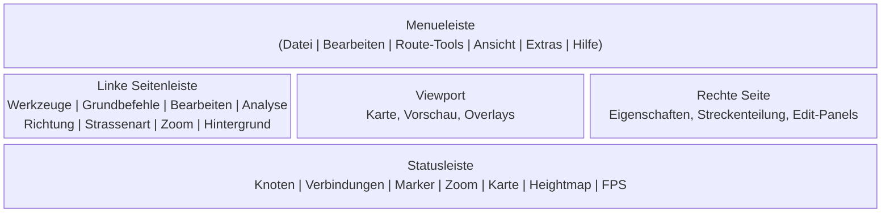

# Benutzeroberflaeche

← [Start & Dateiverwaltung](01-start.md) | [Zurueck zur Uebersicht](index.md)

## Fensteraufbau

Das Hauptfenster besteht aus folgenden Bereichen:

### Menueleiste

- **Datei**: Oeffnen, Speichern, Speichern unter, Heightmap waehlen, Uebersichtskarte generieren, Beenden
- **Bearbeiten**: Undo, Redo, Kopieren, Einfuegen, Optionen
- **Route-Tools**: derselbe Route-Tool-Katalog wie in Sidebar, Floating-Menues und Command Palette
- **Ansicht**: Kamera zuruecksetzen, Zoom, Hintergrund laden/aendern, Renderqualitaet
- **Extras**: Alle Felder nachzeichnen, Courseplay-Import, Courseplay-Export
- **Hilfe**: About / Versionsinformation

### Linke Seitenleiste

Die linke Seitenleiste ist die dauerhaft sichtbare Schnellsteuerung fuer Werkzeuge und Standardwerte.

| Bereich | Inhalt |
|--------|--------|
| **Werkzeuge** | Select, Connect, Add Node |
| **Grundbefehle** | Gerade Strecke, Bezier Grad 2, Bezier Grad 3, Spline, Geglaettete Kurve |
| **Bearbeiten** | Ausweichstrecke, Parkplatz, Strecke versetzen |
| **Analyse** | Feld erkennen, Feldweg erkennen, Farb-Pfad erkennen |
| **Richtung** | Standard-Richtung fuer neue Verbindungen |
| **Strassenart** | Standard-Prioritaet fuer neue Verbindungen |
| **Zoom** | Hinein, Heraus, Auf komplette Map, Auf Auswahl |
| **Hintergrund** | Sichtbarkeit und Skalierung, sobald eine Hintergrundkarte geladen ist |

### Rechte Seite und schwebende Panels

Rechts werden Eigenschaften und modale Bearbeitungsflaechen angezeigt:

| Inhalt | Wann sichtbar |
|--------|---------------|
| **Keine Selektion** | Kein Node ist selektiert |
| **Node-Details** | Genau 1 Node ist selektiert |
| **Verbindungs-Editor** | Genau 2 Nodes sind selektiert |
| **N Nodes selektiert** | 3 oder mehr Nodes sind selektiert |
| **Streckenteilung** | Ab 2 selektierten Nodes |
| **Route-Tool-Panel** | Sobald ein Route-Tool aktiv ist |
| **Gruppen-Bearbeitung** | Wenn eine Gruppe im Bearbeitungsmodus geoeffnet ist |

Das schwebende Route-Tool-Panel zeigt Status, Richtung, Strassenart, tool-spezifische Konfiguration sowie **Ausfuehren** und **Abbrechen**.

### Gemeinsamer Route-Tool-Katalog

Die Route-Tools erscheinen ueberall mit demselben Katalog und denselben Gruppen:

- **Grundbefehle**: Gerade Strecke, Bezier Grad 2, Bezier Grad 3, Spline, Geglaettete Kurve
- **Bearbeiten**: Ausweichstrecke, Parkplatz, Strecke versetzen
- **Analyse**: Feld erkennen, Feldweg erkennen, Farb-Pfad erkennen

Wenn ein Tool Voraussetzungen hat, bleibt es trotzdem sichtbar. Statt zu verschwinden, wird es deaktiviert und zeigt den Grund an, zum Beispiel:

- **Farmland-Daten zuerst laden**
- **Hintergrundkarte zuerst laden**
- **Geordnete Node-Kette selektieren**

### Command Palette

Die Command Palette wird mit **`K`** oder **`Ctrl+K`** geoeffnet und durchsucht:

- globale Befehle wie Oeffnen, Speichern, Undo, Redo, Kopieren und Einfuegen
- die drei Basis-Werkzeuge Select, Connect und Add Node
- alle Route-Tools aus dem kanonischen Katalog

Wichtig fuer die Discoverability:

- deaktivierte Route-Tools bleiben sichtbar
- der Disabled-Grund wird direkt in der Liste angezeigt
- nur aktivierbare Eintraege reagieren auf Klick oder **`Enter`**

---

## Tastatur-Shortcuts

### Globale Befehle

| Shortcut | Aktion |
|----------|--------|
| `Ctrl+O` | Datei oeffnen |
| `Ctrl+S` | Datei speichern |
| `Ctrl+Z` | Undo |
| `Ctrl+Y` | Redo |
| `Shift+Ctrl+Z` | Redo (Alternative) |
| `Ctrl+A` | Alle Nodes selektieren |
| `Ctrl+C` | Selektion kopieren |
| `Ctrl+V` | Einfuegen-Vorschau starten |
| `K` | Command Palette umschalten |
| `Ctrl+K` | Command Palette umschalten |
| `Escape` | Kontextabhaengig: Route-Tool abbrechen, Selektion aufheben oder zum Select-Tool zurueckkehren |

### Floating-Menues

Jeder Shortcut oeffnet ein kleines Menue an der Mausposition:

| Shortcut | Menue | Inhalt |
|----------|-------|--------|
| `T` | Werkzeuge | Select, Connect, Add Node |
| `G` | Grundbefehle | Gerade Strecke, Bezier Grad 2, Bezier Grad 3, Spline, Geglaettete Kurve |
| `B` | Bearbeiten | Ausweichstrecke, Parkplatz, Strecke versetzen |
| `A` | Analyse | Feld erkennen, Feldweg erkennen, Farb-Pfad erkennen |
| `R` | Richtung & Strassenart | Regular, Dual, Reverse, Hauptstrasse, Nebenstrasse |
| `Z` | Zoom | Hinein, Heraus, Auf komplette Map, Auf Auswahl |

### Bearbeitung und Navigation

| Shortcut | Aktion | Bedingung |
|----------|--------|-----------|
| `Delete` / `Backspace` | Selektierte Nodes loeschen | Mindestens 1 Node selektiert |
| `C` | Verbindung erstellen | Genau 2 Nodes selektiert |
| `X` | Verbindung trennen | Genau 2 Nodes selektiert |
| `Enter` | Aktives Route-Tool ausfuehren | Route-Tool aktiv |
| `Pfeil hoch` / `Pfeil runter` | Node-Anzahl des aktiven Route-Tools erhoehen / verringern | Route-Tool zeichnet gerade |
| `Pfeil links` / `Pfeil rechts` | Segmentlaenge des aktiven Route-Tools verringern / erhoehen | Route-Tool zeichnet gerade |
| `Pfeiltasten` | Kamera schwenken | Kein aktives Route-Tool mit laufender Eingabe |
| `+` | Stufenweise hineinzoomen | Viewport aktiv |
| `-` | Stufenweise herauszoomen | Viewport aktiv |

---

## Maus-Bedienung

### Klick-Aktionen

| Maus-Aktion | Werkzeug | Ergebnis |
|-------------|----------|----------|
| **Linksklick** | Select | Node unter Maus selektieren |
| **Ctrl+Linksklick** | Select | Node additiv zur Selektion hinzufuegen |
| **Shift+Linksklick** | Select | Pfad-Selektion zwischen Anker und Ziel |
| **Doppelklick** | Select | Wenn der Node zu einer Gruppe gehoert: ganze Gruppe selektieren, sonst Abschnitt zwischen den naechsten Kreuzungen selektieren |
| **Ctrl+Doppelklick** | Select | Gruppen- oder Abschnitts-Selektion additiv erweitern |
| **Linksklick** | Connect | Erster Klick = Start, zweiter Klick = Ziel |
| **Linksklick** | Add Node | Neuen Node an der Klickposition einfuegen |
| **Linksklick** | Route-Tool | Naechsten Anker-, End- oder Kontrollpunkt setzen |

### Drag-Aktionen

| Maus-Aktion | Ergebnis |
|-------------|----------|
| **Links-Drag auf selektiertem Node** | Alle selektierten Nodes gemeinsam verschieben |
| **Links-Drag auf leerem Bereich** | Kamera schwenken |
| **Shift+Links-Drag** | Rechteck-Selektion |
| **Shift+Ctrl+Links-Drag** | Rechteck-Selektion additiv |
| **Alt+Links-Drag** | Lasso-Selektion |
| **Alt+Ctrl+Links-Drag** | Lasso-Selektion additiv |
| **Alt+Links-Drag im Farb-Pfad-Sampling** | Werkzeug-Lasso fuer Farbproben statt normaler Node-Selektion |
| **Mittelklick-Drag** | Kamera schwenken |
| **Rechtsklick-Drag** | Kamera schwenken |

### Scroll-Aktionen

| Maus-Aktion | Ergebnis |
|-------------|----------|
| **Mausrad hoch / runter** | Auf Mausposition hinein- oder herauszoomen |
| **Alt+Mausrad im Select-Tool** | Aktuelle Selektion in 5-Grad-Schritten rotieren |
| **Alt+Mausrad im Route-Tool** | Route-Tool-Vorschau drehen, z. B. Parkplatz |
| **Mausrad auf Zahleneingaben** | Wert in Scroll-Richtung anpassen; **Alt** vergroessert den Schritt (x10), **Ctrl** verkleinert ihn bei Float-Feldern (x0.1), bei Ganzzahlen bleibt der Basisschritt erhalten; umgebende Scroll-Bereiche bewegen sich dabei nicht gleichzeitig |

> **Tipp:** Das gilt besonders im Route-Tool- und Analyse-Panel: Distanz-, Winkel- und Mengenfelder folgen dem Mausrad direkt unter dem Cursor.

### Kontextmenue

Per Rechtsklick oeffnet sich ein kontextabhaengiges Menue:

- **Leerer Bereich**: Werkzeug-, Zoom- und Route-Untermenues
- **Selektion**: Verbinden, Strecke erzeugen, Richtung, Strassenart, Streckenteilung, Gruppe bearbeiten
- **Gruppen-Selektion**: zusaetzlich Gruppe entfernen, aufloesen oder im Tool-Edit oeffnen, falls editierbar
- **Einzelner Node**: Marker erstellen, bearbeiten oder loeschen

---

← [Start & Dateiverwaltung](01-start.md) | [Zurueck zur Uebersicht](index.md) | → [Werkzeuge](03-werkzeuge.md)
