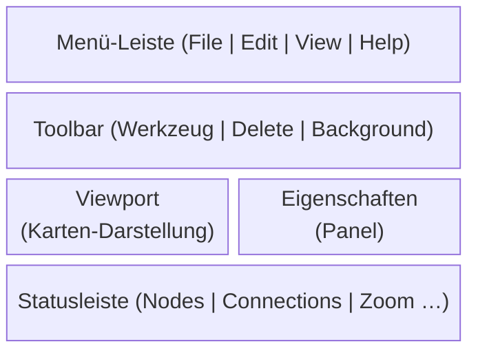

# Benutzeroberfläche

← [Start & Dateiverwaltung](01-start.md) | [Zurück zur Übersicht](index.md)

## Fensteraufbau

Das Hauptfenster besteht aus folgenden Bereichen:

### Menü-Leiste

- **File**: Öffnen, Speichern, Heightmap, Exit
- **Edit**: Undo, Redo, Optionen
- **View**: Kamera-Reset, Zoom, Hintergrund-Karte, Render-Quality
- **Help**: About (Versionsinformation)

### Eigenschaften-Panel (rechte Seitenleiste)

Das Eigenschaften-Panel zeigt kontextabhängig Infos zur aktuellen Selektion und enthält die Standard-Verbindungseinstellungen sowie bei aktivem Route-Tool die Route-Konfiguration.

| Inhalt | Bedingung |
|--------|-----------|
| „Keine Selektion" | Kein Node selektiert |
| Node-ID, Position, Flag, Marker-Controls | Genau 1 Node selektiert |
| Verbindungs-Details, Richtungs-/Prioritäts-ComboBox, Trennen-Button | Genau 2 Nodes selektiert |
| „N Nodes selektiert" | 3+ Nodes selektiert |
| Standard-Richtung und Straßenart (ComboBox) | Immer sichtbar (unterer Bereich) |
| Route-Tool-Konfiguration (Slider) | Nur wenn Route-Tool aktiv |

### Toolbar

Zeigt die verfügbaren Werkzeuge:
- **⊹ Select (1)** — Standard-Werkzeug: Nodes selektieren und verschieben
- **⟷ Connect (2)** — Verbindungen zwischen Nodes erstellen
- **＋ Add Node (3)** — Neue Nodes auf der Karte platzieren
- **Route-Tools (4)** — Route-Werkzeuge: Gerade Strecke, Bézier-Kurve, Spline
- **🗑 Delete (Del)** — Selektierte Nodes löschen (nur aktiv bei Selektion)
- **Hintergrund-Controls** — Opacity-Slider und Sichtbarkeits-Toggle (rechts, nur wenn Hintergrund geladen)

### Statusleiste

Zeigt folgende Informationen (nur Anzeige, nicht interaktiv):
- Node-Count, Connection-Count, Marker-Count
- Map-Name (falls vorhanden)
- Zoom-Stufe und Kamera-Position
- Heightmap-Status (Dateiname oder "None")
- Anzahl selektierter Nodes
- FPS (rechts)

---

## Tastatur-Shortcuts

### Globale Shortcuts

| Shortcut | Aktion |
|----------|--------|
| `Ctrl+O` | Datei öffnen |
| `Ctrl+S` | Datei speichern |
| `Ctrl+Z` | Undo (Rückgängig) |
| `Ctrl+Y` | Redo (Wiederherstellen) |
| `Shift+Ctrl+Z` | Redo (Alternative) |
| `Ctrl+A` | Alle Nodes selektieren |
| `Escape` | Selektion aufheben |

### Werkzeug-Shortcuts

| Shortcut | Werkzeug |
|----------|----------|
| `1` | Select-Tool (Auswählen/Verschieben) |
| `2` | Connect-Tool (Verbindungen erstellen) |
| `3` | Add-Node-Tool (Nodes hinzufügen) |

### Bearbeitungs-Shortcuts

| Shortcut | Aktion | Bedingung |
|----------|--------|-----------|
| `Delete` / `Backspace` | Selektierte Nodes löschen | Mindestens 1 Node selektiert |
| `C` | Verbindung erstellen (Regular-Richtung) | Genau 2 Nodes selektiert |
| `X` | Verbindung zwischen Nodes trennen | Genau 2 Nodes selektiert |

---

## Maus-Bedienung

### Klick-Aktionen

| Maus-Aktion | Werkzeug | Ergebnis |
|-------------|----------|----------|
| **Linksklick** | Select | Node unter Mauszeiger selektieren (ersetzt bestehende Selektion) |
| **Ctrl+Linksklick** | Select | Node additiv zur Selektion hinzufügen |
| **Shift+Linksklick** | Select | Pfad-Selektion: Selektiert alle Nodes auf dem kürzesten Pfad zwischen Anker-Node und Ziel-Node |
| **Doppelklick** | Select | Segment-Selektion: Selektiert alle Nodes zwischen den nächsten Kreuzungen/Sackgassen |
| **Ctrl+Doppelklick** | Select | Segment additiv zur Selektion hinzufügen |
| **Linksklick** | Connect | Erster Klick = Startknoten, Zweiter Klick = Zielknoten → Verbindung erstellen |
| **Linksklick** | Add Node | Neuen Node an Klickposition einfügen |

### Drag-Aktionen (Ziehen mit gedrückter Maustaste)

| Maus-Aktion | Ergebnis |
|-------------|----------|
| **Links-Drag auf selektiertem Node** | Alle selektierten Nodes gemeinsam verschieben |
| **Links-Drag auf leerem Bereich** | Kamera schwenken (Pan) |
| **Shift+Links-Drag** | Rechteck-Selektion → alle Nodes im Rechteck werden selektiert |
| **Shift+Ctrl+Links-Drag** | Rechteck-Selektion (additiv, erweitert bestehende Selektion) |
| **Alt+Links-Drag** | Lasso-Selektion → freigeformte Polygon-Selektion |
| **Alt+Ctrl+Links-Drag** | Lasso-Selektion (additiv, erweitert bestehende Selektion) |
| **Mittelklick-Drag** | Kamera schwenken (Pan) |
| **Rechtsklick-Drag** | Kamera schwenken (Pan) |

### Scroll-Aktionen

| Maus-Aktion | Ergebnis |
|-------------|----------|
| **Mausrad hoch** | Hineinzoomen (auf Mausposition) |
| **Mausrad runter** | Herauszoomen (von Mausposition) |

### Kontextmenü (Rechtsklick)

#### Bei 2+ selektierten Nodes (mit Verbindungen dazwischen)

| Menüpunkt | Aktion |
|-----------|--------|
| 🔗 Nodes verbinden | Verbindung erstellen (bei genau 2 Nodes ohne Verbindung) |
| ↦ Regular (Einbahn) | Alle Verbindungen auf Regular-Richtung setzen |
| ⇆ Dual (beidseitig) | Alle Verbindungen auf Dual-Richtung setzen |
| ↤ Reverse (rückwärts) | Alle Verbindungen auf Reverse-Richtung setzen |
| ⇄ Invertieren | Start/End aller Verbindungen tauschen |
| 🛣 Hauptstraße | Priorität aller Verbindungen auf Regular setzen |
| 🛤 Nebenstraße | Priorität aller Verbindungen auf SubPriority setzen |
| ✕ Alle trennen | Alle Verbindungen zwischen selektierten Nodes entfernen |

#### Bei 1 selektiertem Node

| Menüpunkt | Aktion |
|-----------|--------|
| 🗺 Marker erstellen | Neuen Map-Marker auf diesem Node anlegen |
| ✏ Marker ändern | Bestehenden Marker bearbeiten (Name, Gruppe) |
| ✕ Marker löschen | Marker von diesem Node entfernen |

---

← [Start & Dateiverwaltung](01-start.md) | [Zurück zur Übersicht](index.md) | → [Werkzeuge](03-werkzeuge.md)
