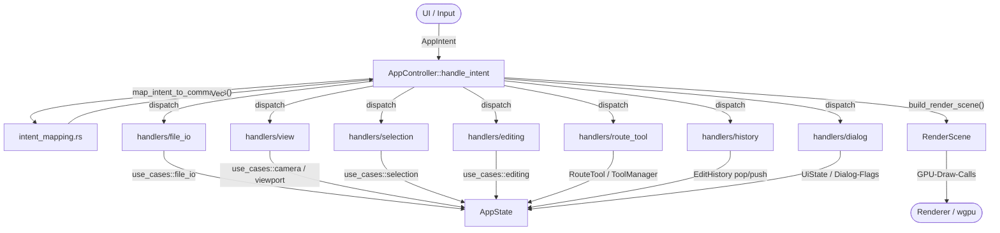

# App API Documentation

## Überblick

Das `app`-Modul verwaltet den globalen State, verarbeitet `AppIntent`s zentral über den `AppController`, mappt diese auf `AppCommand`s und baut die `RenderScene` für das Rendering.

**Hinweis:** `Camera2D` lebt im `core`-Modul (reiner Geometrie-Typ). `app` re-exportiert `Camera2D`, `ConnectionDirection`, `ConnectionPriority` und `RoadMap` aus `core`.

## Haupttypen

### `AppController`

Zentrale Intent-Verarbeitung, Command-Dispatch an Feature-Handler und Render-Scene-Aufbau.

```rust
pub struct AppController;
```

**Methoden:**

```rust
let mut controller = AppController::new();
let mut state = AppState::new();

controller.handle_intent(&mut state, AppIntent::ZoomInRequested)?;
let scene = controller.build_render_scene(&state, [width, height]);
```

**Features:**
- Verarbeitet UI- und Input-Intents gegen `AppState`
- Mappt Intents auf Commands (Mapping ist in `intent_mapping.rs` ausgelagert)
- Dispatcht Commands an Feature-Handler (`handlers/`)
- Baut den expliziten Render-Vertrag (`RenderScene`)

**Handler-Module** (`app/handlers/`):
- `file_io` — Datei-Operationen (Öffnen, Speichern, Heightmap)
- `view` — Kamera, Viewport, Background-Map
- `selection` — Selektions-Operationen
- `editing` — Node/Connection-Editing, Marker
- `route_tool` — Route-Tool-Operationen
- `dialog` — Dialog-State und Anwendungssteuerung
- `history` — Undo/Redo

**Intent-Mapping** (`intent_mapping.rs`):
```rust
pub fn map_intent_to_commands(state: &AppState, intent: AppIntent) -> Vec<AppCommand>
```
Übersetzt einen `AppIntent` in eine Liste von `AppCommand`s. Reine Funktion ohne Seiteneffekte — alle Entscheidungslogik (z.B. Pick-Radius-Berechnung, aktuellen Dateipfad prüfen) ist hier lokalisiert.

---

### `AppState`

Zentraler Anwendungszustand. Enthält keine I/O-Logik — alle Dateisystem-Operationen sind in `use_cases::file_io` zentralisiert.

```rust
pub struct AppState {
    pub road_map: Option<Arc<RoadMap>>,
    pub view: ViewState,
    pub ui: UiState,
    pub selection: SelectionState,
    pub editor: EditorToolState,
    pub command_log: CommandLog,
    pub history: EditHistory,
    pub options: EditorOptions,
    pub show_options_dialog: bool,
    pub segment_registry: SegmentRegistry,  // In-Session-Registry für nachträgliche Bearbeitung
    pub should_exit: bool,
}

pub struct SelectionState {
    pub selected_node_ids: Arc<HashSet<u64>>,  // Arc für O(1)-Clone in RenderScene (CoW)
    pub selection_anchor_node_id: Option<u64>,
}
```

**Methoden:**

```rust
// CoW-Mutation: klont HashSet nur wenn der Arc nicht alleinig gehalten wird
sel.ids_mut().insert(42);
```

- `new() → Self`
- `ids_mut() → &mut HashSet<u64>` — Mutable Zugriff via `Arc::make_mut` (Copy-on-Write)

pub struct UiState {
    pub show_file_dialog: bool,
    pub show_save_file_dialog: bool,
    pub show_heightmap_dialog: bool,
    pub show_background_map_dialog: bool,
    pub show_overview_dialog: bool,
    pub show_heightmap_warning: bool,
    pub heightmap_warning_confirmed: bool,
    pub pending_save_path: Option<String>,
    pub current_file_path: Option<String>,
    pub heightmap_path: Option<String>,
    pub marker_dialog: MarkerDialogState,
    pub status_message: Option<String>,
    pub dedup_dialog: DedupDialogState,
    pub zip_browser: Option<ZipBrowserState>,
    pub overview_options_dialog: OverviewOptionsDialogState,
    pub post_load_dialog: PostLoadDialogState,
    /// Konfiguration für das Distanzen-Neuverteilen-Feature
    pub distanzen: DistanzenState,
}

pub struct DistanzenState {
    /// true = nach Anzahl, false = nach Abstand
    pub by_count: bool,
    /// Gewünschte Anzahl an Waypoints (bei `by_count = true`)
    pub count: u32,
    /// Maximaler Abstand zwischen Waypoints in Welteinheiten (bei `by_count = false`)
    pub distance: f32,
    /// Berechnete Streckenlänge der aktuellen Selektion (für wechselseitige Berechnung)
    pub path_length: f32,
    /// Vorschau-Modus aktiv (Spline-Preview wird im Viewport gezeichnet)
    pub active: bool,
    /// Originale Strecke während der Vorschau ausblenden
    pub hide_original: bool,
    /// Vorschau-Positionen (berechnete Resample-Punkte für Overlay)
    pub preview_positions: Vec<Vec2>,
}

**Methoden:**
- `sync_from_distance()` — Berechnet `count` aus `distance` und `path_length`
- `sync_from_count()` — Berechnet `distance` aus `count` und `path_length`
- `deactivate()` — Deaktiviert den Vorschau-Modus und löscht die Vorschau-Daten
- `should_hide_original() -> bool` — Gibt `true` zurück wenn Original-Strecke ausgeblendet werden soll

pub struct ZipBrowserState {
    pub zip_path: String,
    pub entries: Vec<ZipImageEntry>,
    pub selected: Option<usize>,
    pub filter_overview: bool,
}

pub struct MarkerDialogState {
    pub visible: bool,
    pub node_id: Option<u64>,
    pub name: String,
    pub group: String,
    pub is_new: bool,
}

pub struct DedupDialogState {
    pub visible: bool,
    pub duplicate_count: u32,
    pub group_count: u32,
}

pub struct OverviewOptionsDialogState {
    pub visible: bool,
    pub zip_path: String,
    pub layers: OverviewLayerOptions,
}

pub struct PostLoadDialogState {
    pub visible: bool,
    pub heightmap_set: bool,
    pub heightmap_path: Option<String>,
    pub matching_zips: Vec<PathBuf>,
    pub selected_zip_index: usize,
    pub map_name: String,
}

pub struct ViewState {
    pub camera: Camera2D,
    pub viewport_size: [f32; 2],
    pub render_quality: RenderQuality,
    pub background_map: Option<Arc<BackgroundMap>>,
    pub background_opacity: f32,
    pub background_visible: bool,
    pub background_scale: f32,      // Skalierungsfaktor (1.0 = Original)
    pub background_dirty: bool,  // GPU-Upload-Signal
}

pub struct EditorToolState {
    pub active_tool: EditorTool,
    pub connect_source_node: Option<u64>,
    pub default_direction: ConnectionDirection,
    pub default_priority: ConnectionPriority,
    pub tool_manager: ToolManager,
}
```

**Methoden:**

```rust
let state = AppState::new();
let nodes = state.node_count();
let connections = state.connection_count();
let can_undo = state.can_undo();
let can_redo = state.can_redo();
```

---

### `EditorTool`

Aktives Editor-Werkzeug.

```rust
pub enum EditorTool {
    Select,   // Standard: Nodes selektieren und verschieben
    Connect,  // Verbindungen zwischen Nodes erstellen
    AddNode,  // Neue Nodes auf der Karte platzieren
    Route,    // Route-Tools (Linie, Parkplatz, Kurve, …)
}
```

---

### `AppIntent` und `AppCommand`

`AppIntent` beschreibt Eingaben aus UI/System. `AppCommand` beschreibt mutierende Schritte am State.

```rust
pub enum AppIntent {
    // Datei-Operationen
    OpenFileRequested,
    SaveRequested,
    SaveAsRequested,
    ExitRequested,
    FileSelected { path: String },
    SaveFilePathSelected { path: String },

    // Heightmap
    HeightmapSelectionRequested,
    HeightmapCleared,
    HeightmapSelected { path: String },
    HeightmapWarningConfirmed,
    HeightmapWarningCancelled,

    // Kamera / Viewport
    ResetCameraRequested,
    ZoomInRequested,
    ZoomOutRequested,
    ViewportResized { size: [f32; 2] },
    CameraPan { delta: glam::Vec2 },
    CameraZoom { factor: f32, focus_world: Option<glam::Vec2> },
    RenderQualityChanged { quality: RenderQuality },

    // Selektion
    NodePickRequested { world_pos: glam::Vec2, additive: bool, extend_path: bool },
    NodeSegmentBetweenIntersectionsRequested { world_pos: glam::Vec2, additive: bool },
    SelectNodesInRectRequested { min: glam::Vec2, max: glam::Vec2, additive: bool },
    SelectNodesInLassoRequested { polygon: Vec<glam::Vec2>, additive: bool },

    // Move-Lifecycle (Drag-Verschieben selektierter Nodes)
    BeginMoveSelectedNodesRequested,
    MoveSelectedNodesRequested { delta_world: glam::Vec2 },
    EndMoveSelectedNodesRequested,

    // Undo / Redo
    UndoRequested,
    RedoRequested,

    // Editor-Werkzeug
    SetEditorToolRequested { tool: EditorTool },

    // Editing
    AddNodeRequested { world_pos: glam::Vec2 },
    DeleteSelectedRequested,
    ConnectToolNodeClicked { world_pos: glam::Vec2 },
    AddConnectionRequested { from_id: u64, to_id: u64, direction: ConnectionDirection, priority: ConnectionPriority },
    RemoveConnectionBetweenRequested { node_a: u64, node_b: u64 },
    SetConnectionDirectionRequested { start_id: u64, end_id: u64, direction: ConnectionDirection },
    SetConnectionPriorityRequested { start_id: u64, end_id: u64, priority: ConnectionPriority },
    SetDefaultDirectionRequested { direction: ConnectionDirection },
    SetDefaultPriorityRequested { priority: ConnectionPriority },

    // Bulk-Operationen auf selektierten Verbindungen
    SetAllConnectionsDirectionBetweenSelectedRequested { direction: ConnectionDirection },
    RemoveAllConnectionsBetweenSelectedRequested,
    InvertAllConnectionsBetweenSelectedRequested,
    SetAllConnectionsPriorityBetweenSelectedRequested { priority: ConnectionPriority },
    ConnectSelectedNodesRequested,

    // Background-Map
    BackgroundMapSelectionRequested,
    BackgroundMapSelected { path: String, crop_size: Option<u32> },
    SetBackgroundOpacity { opacity: f32 },
    ToggleBackgroundVisibility,
    ScaleBackground { factor: f32 },
    ZipBackgroundBrowseRequested { path: String },
    ZipBackgroundFileSelected { zip_path: String, entry_name: String },
    ZipBrowserCancelled,

    // Übersichtskarte
    GenerateOverviewRequested,
    GenerateOverviewFromZip { path: String },
    OverviewOptionsConfirmed,
    OverviewOptionsCancelled,

    // Post-Load-Dialog (Auto-Detection)
    PostLoadGenerateOverview { zip_path: String },
    PostLoadDialogDismissed,

    // Map-Marker
    CreateMarkerRequested { node_id: u64 },
    RemoveMarkerRequested { node_id: u64 },
    EditMarkerRequested { node_id: u64 },
    MarkerDialogConfirmed { node_id: u64, name: String, group: String, is_new: bool },
    MarkerDialogCancelled,

    // Selektion (Bulk)
    ClearSelectionRequested,
    SelectAllRequested,

    // Duplikat-Bereinigung
    DeduplicateConfirmed,
    DeduplicateCancelled,

    // Optionen
    OpenOptionsDialogRequested,
    CloseOptionsDialogRequested,
    OptionsChanged { options: EditorOptions },
    ResetOptionsRequested,

    // Route-Tool
    RouteToolClicked { world_pos: glam::Vec2, ctrl: bool },
    RouteToolExecuteRequested,
    RouteToolCancelled,
    SelectRouteToolRequested { index: usize },
    RouteToolConfigChanged,

    // Route-Tool Drag (Steuerpunkt-Verschiebung)
    RouteToolDragStarted { world_pos: glam::Vec2 },
    RouteToolDragUpdated { world_pos: glam::Vec2 },
    RouteToolDragEnded,

    // Segment-Bearbeitung (nachträgliche Bearbeitung erstellter Linien)
    EditSegmentRequested { record_id: u64 },
    // Distanzen: Selektierte Nodes-Kette gleichmäßig neu verteilen
    ResamplePathRequested,
}

pub enum AppCommand {
    // Datei-Operationen
    LoadFile { path: String },
    SaveFile { path: Option<String> },
    RequestOpenFileDialog,
    RequestSaveFileDialog,
    RequestExit,
    ConfirmAndSaveFile,

    // Kamera
    ResetCamera,
    ZoomIn,
    ZoomOut,
    PanCamera { delta: glam::Vec2 },
    ZoomCamera { factor: f32, focus_world: Option<glam::Vec2> },
    SetViewportSize { size: [f32; 2] },
    SetRenderQuality { quality: RenderQuality },

    // Selektion
    SelectNearestNode { world_pos: glam::Vec2, max_distance: f32, additive: bool, extend_path: bool },
    SelectSegmentBetweenNearestIntersections { world_pos: glam::Vec2, max_distance: f32, additive: bool },
    SelectNodesInRect { min: glam::Vec2, max: glam::Vec2, additive: bool },
    SelectNodesInLasso { polygon: Vec<glam::Vec2>, additive: bool },
    ClearSelection,
    SelectAllNodes,
    BeginMoveSelectedNodes,
    MoveSelectedNodes { delta_world: glam::Vec2 },
    EndMoveSelectedNodes,

    // Editing
    SetEditorTool { tool: EditorTool },
    AddNodeAtPosition { world_pos: glam::Vec2 },
    DeleteSelectedNodes,
    ConnectToolPickNode { world_pos: glam::Vec2, max_distance: f32 },
    AddConnection { from_id: u64, to_id: u64, direction: ConnectionDirection, priority: ConnectionPriority },
    RemoveConnectionBetween { node_a: u64, node_b: u64 },
    SetConnectionDirection { start_id: u64, end_id: u64, direction: ConnectionDirection },
    SetConnectionPriority { start_id: u64, end_id: u64, priority: ConnectionPriority },
    SetDefaultDirection { direction: ConnectionDirection },
    SetDefaultPriority { priority: ConnectionPriority },
    SetAllConnectionsDirectionBetweenSelected { direction: ConnectionDirection },
    RemoveAllConnectionsBetweenSelected,
    InvertAllConnectionsBetweenSelected,
    SetAllConnectionsPriorityBetweenSelected { priority: ConnectionPriority },
    ConnectSelectedNodes,

    // Heightmap / Background
    RequestHeightmapDialog,
    RequestBackgroundMapDialog,
    ClearHeightmap,
    SetHeightmap { path: String },
    DismissHeightmapWarning,
    LoadBackgroundMap { path: String, crop_size: Option<u32> },
    UpdateBackgroundOpacity { opacity: f32 },
    ToggleBackgroundVisibility,
    ScaleBackground { factor: f32 },
    BrowseZipBackground { path: String },
    LoadBackgroundFromZip { zip_path: String, entry_name: String, crop_size: Option<u32> },
    CloseZipBrowser,

    // Übersichtskarte
    RequestOverviewDialog,
    OpenOverviewOptionsDialog { path: String },
    GenerateOverviewWithOptions,
    CloseOverviewOptionsDialog,

    // Post-Load-Dialog
    DismissPostLoadDialog,

    // Marker
    CreateMarker { node_id: u64, name: String, group: String },
    RemoveMarker { node_id: u64 },
    OpenMarkerDialog { node_id: u64, is_new: bool },
    UpdateMarker { node_id: u64, name: String, group: String },
    CloseMarkerDialog,

    // Duplikat-Bereinigung
    DeduplicateNodes,
    DismissDeduplicateDialog,

    // Optionen
    OpenOptionsDialog,
    CloseOptionsDialog,
    ApplyOptions { options: EditorOptions },
    ResetOptions,

    // Undo/Redo
    Undo,
    Redo,

    // Route-Tool
    RouteToolClick { world_pos: glam::Vec2, ctrl: bool },
    RouteToolExecute,
    RouteToolCancel,
    SelectRouteTool { index: usize },
    RouteToolRecreate,

    // Route-Tool Drag (Steuerpunkt-Verschiebung)
    RouteToolDragStart { world_pos: glam::Vec2 },
    RouteToolDragUpdate { world_pos: glam::Vec2 },
    RouteToolDragEnd,

    // Segment-Bearbeitung
    EditSegment { record_id: u64 },
    // Distanzen: Selektierte Nodes-Kette per Catmull-Rom-Spline neu verteilen
    ResamplePath,
}
```

---

### `Camera2D` (re-exportiert aus `core`)

2D-Kamera mit Pan und Zoom. Siehe `core/API.md` für Details.

## Use-Cases

### `use_cases::camera`
- `reset_camera(state)` — Kamera auf Default zurücksetzen
- `zoom_in(state)` / `zoom_out(state)` — Stufenweise zoomen (Faktor 1.2)
- `pan(state, delta)` — Kamera verschieben (Delta in Welt-Einheiten)
- `zoom_towards(state, factor, focus_world)` — Zoom mit optionalem Fokuspunkt in Weltkoordinaten
- `center_on_road_map(state, road_map)` — Kamera auf Bounding-Box der geladenen RoadMap zentrieren

### `use_cases::file_io`
- `request_open_file(state)` — Open-Dialog triggern
- `load_selected_file(state, path)` — XML laden, Kamera zentrieren; anschließend wird automatisch die Post-Load-Detection ausgeführt (Heightmap + ZIP-Suche)
- `request_save_file(state)` — Save-Dialog triggern
- `save_current_file(state)` — Unter aktuellem Pfad speichern
- `save_file_as(state, path)` — Unter neuem Pfad speichern
- `save_with_heightmap_check(state, path)` — Speichern mit Heightmap-Prüfung (zeigt Warnung wenn nötig)
- `confirm_and_save(state)` — Speichern nach Bestätigung der Heightmap-Warnung

### `use_cases::heightmap`
- `request_heightmap_dialog(state)` — Heightmap-Dialog öffnen
- `clear_heightmap(state)` — Heightmap entfernen
- `set_heightmap(state, path)` — Heightmap setzen
- `dismiss_heightmap_warning(state)` — Heightmap-Warnung schließen

### `use_cases::selection`
- `select_nearest_node(state, world_pos, max_distance, additive, extend_path)` — Node per Klick selektieren; `additive` für Ctrl/Shift-Add, `extend_path` nur für Shift-Pfadselektion zwischen Anker und Ziel
- `select_segment_between_nearest_intersections(state, world_pos, max_distance, additive)` — Doppelklick selektiert den Korridor bis zu den nächsten Segmentgrenzen (Kreuzung oder Sackgassen-Endpunkt)
- `select_nodes_in_rect(state, corner_a, corner_b, additive)` — Rechteckselektion (Shift + Drag)
- `select_nodes_in_lasso(state, polygon, additive)` — Lasso-Selektion (Alt + Drag)
- `move_selected_nodes(state, delta_world)` — Alle selektierten Nodes gemeinsam verschieben
- `clear_selection(state)` — Selektion explizit löschen

### `use_cases::auto_detect`
- `detect_post_load(xml_path, map_name) -> PostLoadDetectionResult` — Sucht nach `terrain.heightmap.png` im XML-Verzeichnis und passenden Map-Mod-ZIPs im Mods-Verzeichnis (`../../mods/` relativ zum Savegame). Matching: case-insensitive, Underscores/Spaces als Wildcard, bidirektionale Umlaut-Expansion (ä↔ae, ö↔oe, ü↔ue, ß↔ss).

### `use_cases::editing`
- `add_node_at_position(state, world_pos) -> AddNodeResult` — Neuen Node einfügen oder existierenden selektieren

```rust
pub enum AddNodeResult {
    NoMap,
    SelectedExisting(u64), // Snap auf existierenden Node
    Created(u64),          // Neuer Node erstellt
}
```
- `delete_selected_nodes(state)` — Selektierte Nodes + betroffene Connections löschen
- `connect_tool_pick_node(state, world_pos, max_distance)` — Connect-Tool: Source/Target-Node auswählen
- `add_connection(state, from_id, to_id, direction, priority)` — Verbindung erstellen
- `remove_connection_between(state, node_a, node_b)` — Alle Verbindungen zwischen zwei Nodes entfernen
- `set_connection_direction(state, start_id, end_id, direction)` — Richtung ändern
- `set_connection_priority(state, start_id, end_id, priority)` — Priorität ändern
- `set_all_connections_direction_between_selected(state, direction)` — Bulk: Richtung aller Verbindungen zwischen Selektion ändern
- `remove_all_connections_between_selected(state)` — Bulk: Alle Verbindungen zwischen Selektion trennen
- `invert_all_connections_between_selected(state)` — Bulk: Richtung invertieren (start↔end)
- `set_all_connections_priority_between_selected(state, priority)` — Bulk: Priorität ändern
- `apply_tool_result(state, result) -> Vec<u64>` — Wendet ein `ToolResult` auf den AppState an (mit Undo-Snapshot): erstellt Nodes + Connections, setzt Selektion; ruft danach `make_segment_record()` auf dem aktiven Tool auf und speichert den Record in `state.segment_registry`
- `apply_tool_result_no_snapshot(state, result) -> Vec<u64>` — Wie `apply_tool_result`, aber ohne Undo-Snapshot (für Neuberechnung)
- `delete_nodes_by_ids(state, ids)` — Löscht Nodes mit den angegebenen IDs + zugehörige Connections; invalidiert betroffene Einträge in `state.segment_registry`

### `use_cases::viewport`
- `resize(state, size)` — Viewport-Größe setzen
- `set_render_quality(state, quality)` — Kantenglättung steuern

### `use_cases::background_map`
- `request_background_map_dialog(state)` — Background-Map-Dialog öffnen
- `load_background_map(state, path, crop_size) -> anyhow::Result<()>` — Background-Map laden (PNG/JPG/DDS), Fehler werden an den Controller propagiert
- `set_background_opacity(state, opacity)` — Opacity setzen (0.0–1.0)
- `toggle_background_visibility(state)` — Sichtbarkeit umschalten
- `clear_background_map(state)` — Background-Map entfernen
- `generate_overview_with_options(state) -> anyhow::Result<()>` — Übersichtskarte aus Map-Mod-ZIP generieren (Layer-Optionen aus Dialog-State), Einstellungen persistent speichern

### `use_cases::editing::markers`
- `open_marker_dialog(state, node_id, is_new)` — Marker-Dialog öffnen (neu oder bearbeiten)
- `create_marker(state, node_id, &name, &group)` — Marker erstellen (mit Undo-Snapshot)
- `update_marker(state, node_id, &name, &group)` — Bestehenden Marker aktualisieren (mit Undo-Snapshot)
- `remove_marker(state, node_id)` — Marker eines Nodes entfernen (mit Undo-Snapshot)

---

## `SegmentRegistry`

In-Session-Registry aller erstellten Segmente (für nachträgliche Bearbeitung).

- **Transient:** Wird **nicht** in Undo/Redo-Snapshots aufgenommen; leer nach Datei-Reload.
- **Gespeichert:** Alle Tool-Parameter (CPs, Tangenten, Anker, Richtung, Priorität, max_segment_length).
- **Invalidierung:** Beim manuellen Löschen von Nodes werden betroffene Records automatisch entfernt.

```rust
pub enum SegmentKind {
    Straight     { direction, priority, max_segment_length },
    CurveQuad    { cp1, direction, priority, max_segment_length },
    CurveCubic   { cp1, cp2, tangent_start, tangent_end, direction, priority, max_segment_length },
    Spline       { anchors, tangent_start, tangent_end, direction, priority, max_segment_length },
}

// Tool-Index-Konstanten (stimmen mit ToolManager::new()-Reihenfolge überein,
// abgesichert durch Unit-Test `tool_index_stimmt_mit_tool_manager_reihenfolge_ueberein`):
pub const TOOL_INDEX_STRAIGHT: usize = 0;
pub const TOOL_INDEX_CURVE_QUAD: usize = 1;
pub const TOOL_INDEX_CURVE_CUBIC: usize = 2;
pub const TOOL_INDEX_SPLINE: usize = 3;

pub struct SegmentRecord {
    pub id: u64,
    pub node_ids: Vec<u64>,
    pub start_anchor: ToolAnchor,
    pub end_anchor: ToolAnchor,
    pub kind: SegmentKind,
}
```

**Methoden:**

```rust
registry.register(record) -> u64
registry.get(record_id) -> Option<&SegmentRecord>
registry.remove(record_id)
registry.find_by_node_ids(node_ids: &HashSet<u64>) -> Vec<&SegmentRecord>
registry.invalidate_by_node_ids(node_ids)  // bei manuellem Node-Löschen
registry.len() / is_empty()
```

### Bearbeitungs-Flow (`EditSegmentRequested`)

```
Properties-Panel (Button "Bearbeiten")
  → AppIntent::EditSegmentRequested { record_id }
  → AppCommand::EditSegment { record_id }
  → handlers::editing::edit_segment(state, record_id)
      1. Record aus Registry holen (Clone)
      2. Undo-Snapshot erstellen
      3. delete_nodes_by_ids() — Segment-Nodes aus RoadMap entfernen
      4. Registry-Record entfernen
      5. route_tool::select() — passendes Tool aktivieren
      6. tool.load_for_edit() — Tool mit gespeicherten Parametern befüllen
```

### `RouteTool`-Trait Erweiterungen (für Registry)

```rust
// Wird nach execute() + apply_tool_result() aufgerufen:
fn make_segment_record(&self, id: u64, node_ids: &[u64]) -> Option<SegmentRecord>;

// Wird in edit_segment() aufgerufen um das Tool wiederherzustellen:
fn load_for_edit(&mut self, record: &SegmentRecord, kind: &SegmentKind);
```

Implementierungen: `StraightLineTool`, `CurveTool` (Quad + Cubic), `SplineTool`.

---

## AppIntent-Flow (Übersicht)



*Ablauf:* UI emittiert `AppIntent` → `AppController` übersetzt via `map_intent_to_commands()` in `Vec<AppCommand>` → Handler-Module mutieren `AppState` via Use-Cases → `build_render_scene()` serialisiert den State in den `RenderScene`-Vertrag → Renderer zeichnet.

## Interaktions-Pattern

### Typisches Update-Loop (Intent-basiert)

```rust
let mut intents = Vec::new();
intents.push(AppIntent::ZoomInRequested);

for intent in intents {
    controller.handle_intent(&mut state, intent)?;
}

let scene = controller.build_render_scene(&state, [viewport_w, viewport_h]);
```

### Pan-Delta-Umrechnung

Das Maus-Delta (Pixel) wird vor dem Intent in Welt-Einheiten umgerechnet:

```rust
let wpp = camera.world_per_pixel(viewport_height);
AppIntent::CameraPan { delta: Vec2::new(-dx * wpp, -dy * wpp) }
```

## Design-Prinzipien

1. **Single Source of Truth:** `AppState` hält die Laufzeitdaten (kein I/O)
2. **Intent Boundary:** UI emittiert primär `AppIntent`; reine UI-/Tool-Konfiguration im `AppState` kann gezielt direkt aktualisiert werden
3. **Command Execution:** `AppController` mappt Intents auf Commands und führt diese aus
4. **Render Contract:** Ausgabe an Renderer erfolgt nur über `RenderScene`
5. **I/O in Use-Cases:** Dateisystem-Operationen sind in `use_cases::file_io` zentralisiert
6. **Re-Exports:** `app` re-exportiert `Camera2D`, `ConnectionDirection`, `ConnectionPriority`, `RoadMap` aus `core`, damit UI nicht direkt auf `core` zugreift

## Weitere Typen

### `CommandLog`

Protokoliert ausgeführte AppCommands für Debugging.

```rust
pub struct CommandLog { /* intern */ }
```

**Methoden:**
- `new() → Self`
- `record(&mut self, command: &AppCommand)` — Command protokollieren (speichert Debug-String)
- `len() → usize` — Anzahl geloggter Commands
- `is_empty() → bool` — Prüfen, ob keine Einträge vorhanden sind
- `entries() → &[String]` — Read-only Sicht auf alle Einträge (Debug-Strings)

---

### `EditHistory` / `Snapshot`

COW-basiertes Undo/Redo-System.

```rust
pub struct EditHistory { /* intern */ }
pub struct Snapshot { /* intern */ }
```

**EditHistory-Methoden:**
- `new_with_capacity(max_depth: usize) → Self` — Manager mit maximaler Undo/Redo-Tiefe erstellen
- `record_snapshot(snapshot: Snapshot)` — Snapshot auf den Undo-Stack legen (löscht Redo-Stack)
- `pop_undo_with_current(current: Snapshot) → Option<Snapshot>` — Undo: aktuellen Zustand auf Redo-Stack, vorherigen Snapshot zurückgeben
- `pop_redo_with_current(current: Snapshot) → Option<Snapshot>` — Redo: aktuellen Zustand auf Undo-Stack, nächsten Snapshot zurückgeben
- `can_undo() → bool` / `can_redo() → bool`

**AppState Helper:**
- `record_undo_snapshot(&mut self)` — Convenience-Methode: erstellt Snapshot via `Snapshot::from_state(self)` und legt ihn auf den History-Stack

---

## Tools

### `ToolManager`

Verwaltet registrierte Route-Tools und den aktiven Tool-Index.

```rust
pub struct ToolManager { /* intern */ }
```

**Methoden:**
- `new() → Self` — Erstellt ToolManager mit vorregistrierten Standard-Tools (StraightLine, Bézier Grad 2, Bézier Grad 3, Spline)
- `register(tool)` — Neues Route-Tool registrieren
- `tool_count() → usize` — Anzahl registrierter Tools
- `tool_names() → Vec<(usize, &str)>` — Name + Index aller Tools
- `tool_entries() → Vec<(usize, &str, &str)>` — Index, Name und Icon aller Tools (für Dropdown-Rendering)
- `set_active(index)` — Aktives Tool setzen (Reset des vorherigen)
- `active_index() → Option<usize>` — Index des aktiven Tools
- `active_tool() → Option<&dyn RouteTool>` — Referenz auf aktives Tool
- `active_tool_mut() → Option<&mut dyn RouteTool>` — Mutable Referenz
- `reset()` — Alle Tools zurücksetzen, aktives deaktivieren

---

### `RouteTool` (Trait)

Schnittstelle für alle Route-Tools (Linie, Kurve, …). Tools sind zustandsbehaftet und erzeugen Preview-Geometrie + `ToolResult`.

**Pflicht-Methoden:**
- `name() → &str` — Anzeigename
- `icon() → &str` — Icon-Zeichen für das Dropdown (rechts vom Label); Default: `""`
- `description() → &str` — Tooltip-Text
- `status_text() → &str` — Statustext für Properties-Panel
- `on_click(pos, road_map, ctrl) → ToolAction` — Viewport-Klick verarbeiten
- `preview(cursor_pos, road_map) → ToolPreview` — Preview-Geometrie berechnen
- `render_config(ui) → bool` — Tool-Konfiguration im Properties-Panel
- `execute(road_map) → Option<ToolResult>` — Ergebnis erzeugen
- `reset()` — Tool-Zustand zurücksetzen
- `is_ready() → bool` — Bereit zur Ausführung?

**Optionale Methoden (Default-Implementierung):**
- `has_pending_input() → bool` — Hat das Tool angefangene Eingaben? (für stufenweise Escape-Logik)
- `set_direction(dir)` / `set_priority(prio)` — Editor-Defaults übernehmen
- `set_snap_radius(radius)` — Snap-Radius für Node-Snapping setzen
- `set_last_created(ids, road_map)` / `last_created_ids() → &[u64]` — Erstellte Node-IDs (für Verkettung, road_map dient zur End-Anchor-Ermittlung)
- `last_end_anchor() → Option<ToolAnchor>` — Letzter Endpunkt für Verkettung
- `needs_recreate() → bool` / `clear_recreate_flag()` — Neuberechnung bei Config-Änderung
- `execute_from_anchors(road_map) → Option<ToolResult>` — ToolResult aus gespeicherten Ankern
- `drag_targets() → Vec<Vec2>` — Weltpositionen verschiebbarer Punkte (für Drag-Hit-Test)
- `on_drag_start(pos, road_map, pick_radius) → bool` — Drag auf einen Punkt starten
- `on_drag_update(pos)` — Position des gegriffenen Punkts aktualisieren
- `on_drag_end(road_map)` — Drag beenden (Re-Snap bei Start/Ende)
- `render_context_menu(response) → bool` — Kontextmenü im Viewport rendern (z.B. Tangenten-Auswahl)

---

### Registrierte Tools

| Idx | Tool | Icon | Konstruktor |
|-----|------|------|-------------|
| 0 | `StraightLineTool` | `━` | `StraightLineTool::new()` |
| 1 | `CurveTool` (Grad 2) | `⌒` | `CurveTool::new()` |
| 2 | `CurveTool` (Grad 3) | `〜` | `CurveTool::new_cubic()` |
| 3 | `SplineTool` | `〰` | `SplineTool::new()` |

- **`StraightLineTool`** — Gerade Strecke zwischen zwei Punkten mit konfigurierbarem Nodeabstand
- **`CurveTool`** — Bézier-Kurve wahlweise Grad 2 (quadratisch, 1 Steuerpunkt) oder Grad 3 (kubisch, 2 Steuerpunkte). `name()` und `description()` sind grad-spezifisch. Konstruktoren: `CurveTool::new()` (Grad 2), `CurveTool::new_cubic()` (Grad 3). Modulstruktur: `state.rs` (Enums, Struct, Ctors), `lifecycle.rs` (RouteTool-Impl), `drag.rs` (Drag-Logik), `config_ui.rs` (egui-Panel), `geometry.rs` (Bézier-Mathe), `tests.rs`

  **Cubic-Extras (Grad 3):**
  - **Auto-Tangente:** Beim Eintreten in Phase::Control wird automatisch der beste Start-Nachbar gewählt (bevorzugt eingehende Verbindungen; max `dot(continuation_dir, chord_dir)`). CP1 und CP2 werden sofort gesetzt.
  - **Virtueller Scheitelpunkt (Apex):** `virtual_apex = B(0.5)` wird als fünftes Drag-Handle angeboten. Drag verschiebt B(0.5) und passt CP1/CP2 via inverser Bézier-Formel an:
    - Mit Start-Tangente: CP1 fixiert → nur CP2 = `(8·apex − P0 − 3·CP1 − P3) / 3`
    - Mit End-Tangente: CP2 fixiert → nur CP1 = `(8·apex − P0 − 3·CP2 − P3) / 3`
    - Ohne Tangente: beide CPs symmetrisch aus Apex (`cps_from_apex_symmetric`)
- **`SplineTool`** — Catmull-Rom-Spline: interpolierende Kurve durch alle geklickten Punkte. Beliebig viele Kontrollpunkte, fortlaufende Vorschau (Cursor als nächster Punkt), Enter bestätigt. Nachbearbeitung (Segment-Länge/Node-Anzahl) und Verkettung unterstützt.

---

### Gemeinsame Tool-Infrastruktur (`tools/common/`)

Aufgeteilt in vier Submodule (alle privat, Re-Exporte via `common/mod.rs`):
- **`geometry.rs`** — `angle_to_compass`, `node_count_from_length`, `populate_neighbors`, `linear_connections`, `tangent_options`
- **`tangent.rs`** — `TangentSource`, `TangentState`, `render_tangent_combo`
- **`lifecycle.rs`** — `ToolLifecycleState`, `SegmentConfig`, `LastEdited`, `render_segment_config_3modes`, `impl_lifecycle_delegation!`
  - `save_created_ids(&mut self, ids: &[u64], road_map: &RoadMap)` — Speichert erstellte Node-IDs und ermittelt End-Anker aus der RoadMap
  - `has_last_created() → bool` — Prüft ob letzte erstellte IDs vorhanden sind
  - `chaining_start_anchor() → Option<ToolAnchor>` — Gibt den End-Anker für die Verkettung zurück, wobei `NewPosition` zu `ExistingNode` hochgestuft wird (verhindert doppelte Nodes am Verkettungspunkt)
  - `prepare_for_chaining(&mut lifecycle, &mut seg, &last_anchors)` — Setzt den Lifecycle-State und die SegmentConfig für die nächste Verkettung zurück (DRY-Hilfsmethode, gemeinsam von allen RouteTools genutzt)
- **`builder.rs`** — `assemble_tool_result`

**`SegmentConfig`** — Gekapselte Konfiguration für Segment-Länge und Node-Anzahl, die alle Route-Tools gemeinsam nutzen:
- `max_segment_length: f32` — Maximaler Abstand zwischen Zwischen-Nodes
- `node_count: usize` — Gewünschte Anzahl Nodes (inkl. Start+End)
- `last_edited: LastEdited` — Welcher Wert zuletzt geändert wurde (bestimmt Sync-Richtung)
- `sync_from_length(length)` — Synchronisiert abhängigen Wert aus Streckenlänge

**`render_segment_config_3modes(seg, ui, adjusting, ready, length, label) → (changed, recreate)`** — Gemeinsame Hilfsfunktion für die 3 SegmentConfig-Darstellungsmodi (Adjusting/Live/Default). Wird von allen Route-Tools in `render_config()` genutzt statt direkter Aufrufe auf `SegmentConfig`.

**`impl_lifecycle_delegation!`** — Makro zur Delegation der Standard-RouteTool-Lifecycle-Methoden (`on_deactivate`, `chaining_start_anchor`, `is_adjusting`, `segment_config_mut`) an die gemeinsamen `ToolLifecycleState`/`SegmentConfig`-Felder. Eliminiert ~20 Zeilen Boilerplate pro Tool.

**`TangentSource`** — Tangenten-Quelle am Start-/Endpunkt (für Curve + Spline):
- `None` — Kein Tangenten-Vorschlag
- `Connection { neighbor_id, angle }` — Tangente aus bestehender Verbindung

**`render_tangent_combo(ui, id_salt, label, none_label, current, neighbors) → bool`** — Gemeinsamer UI-Baustein für Tangenten-ComboBoxen (verwendet von Curve + Spline config_ui).

**`assemble_tool_result(positions, start, end, direction, priority, road_map) → ToolResult`** — Gemeinsame Logik aller Route-Tools: Nimmt berechnete Positionen, erstellt neue Nodes (überspringt existierende) und baut interne/externe Verbindungen auf.

---

### `render_scene::build()`

Baut die `RenderScene` aus dem aktuellen `AppState` und der Viewport-Größe.

```rust
pub fn build(state: &AppState, viewport_size: [f32; 2]) -> RenderScene
```
