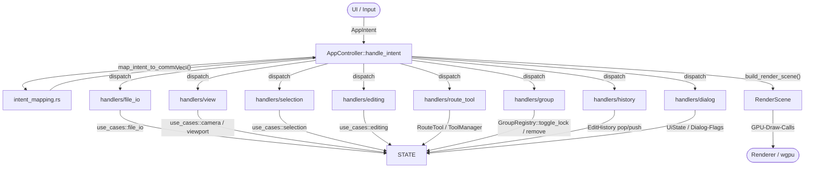

# App API Documentation

## Ueberblick

Das `app`-Modul verwaltet den globalen State, verarbeitet `AppIntent`s zentral ueber den `AppController`, mappt diese auf `AppCommand`s und baut die `RenderScene` fuer das Rendering.

**Hinweis:** `Camera2D` lebt im `core`-Modul (reiner Geometrie-Typ). `app` re-exportiert `Camera2D`, `ConnectionDirection`, `ConnectionPriority`, `RoadMap`, `ParkingConfig`, `ToolAnchor`, `compute_ring` und andere zentrale Typen aus `core` und `tools`.

**Weitere API-Dokumentationen:**
- [`handlers/API.md`](handlers/API.md) — alle Handler-Funktionen mit detaillierter Dokumentation
- [`use_cases/API.md`](use_cases/API.md) — alle Use-Case-Funktionen (camera, file_io, selection, editing, …)
- [`tools/API.md`](tools/API.md) — ToolManager, RouteTool-Trait, registrierte Tools, gemeinsame Infrastruktur

## Haupttypen

### `AppController`

Zentrale Intent-Verarbeitung, Command-Dispatch an Feature-Handler und Render-Scene-Aufbau.

```rust
pub struct AppController;
```

**Methoden:**

```rust
let mut controller = AppController::new();
let mut state = AppState::new();

controller.handle_intent(&mut state, AppIntent::ZoomInRequested)?;
let scene = controller.build_render_scene(&state, [width, height]);
```

**Features:**
- Verarbeitet UI- und Input-Intents gegen `AppState`
- Mappt Intents auf Commands (Mapping ist in `intent_mapping.rs` ausgelagert)
- Dispatcht Commands an Feature-Handler (`handlers/`)
- Baut den expliziten Render-Vertrag (`RenderScene`)

**Handler-Module** (`app/handlers/`):
- `file_io` — Datei-Operationen (Oeffnen, Speichern, Heightmap)
- `view` — Kamera, Viewport, Background-Map
- `selection` — Selektions-Operationen
- `editing` — Node/Connection-Editing, Marker
- `route_tool` — Route-Tool-Operationen
- `group` — Gruppen-Lock-Toggle, Gruppen-Aufloesung
- `dialog` — Dialog-State und Anwendungssteuerung
- `history` — Undo/Redo

**Intent-Mapping** (`intent_mapping.rs`):
```rust
pub fn map_intent_to_commands(state: &AppState, intent: AppIntent) -> Vec<AppCommand>
```
Uebersetzt einen `AppIntent` in eine Liste von `AppCommand`s. Reine Funktion ohne Seiteneffekte — alle Entscheidungslogik (z.B. Pick-Radius-Berechnung, aktuellen Dateipfad pruefen) ist hier lokalisiert.

---

### `AppState`

Zentraler Anwendungszustand. Enthaelt keine I/O-Logik — alle Dateisystem-Operationen sind in `use_cases::file_io` zentralisiert.

```rust
pub struct AppState {
    pub road_map: Option<Arc<RoadMap>>,
    pub view: ViewState,
    pub ui: UiState,
    pub selection: SelectionState,
    pub editor: EditorToolState,
    pub clipboard: Clipboard,            // Zwischenablage fuer Copy/Paste
    pub paste_preview_pos: Option<Vec2>, // Aktuelle Paste-Vorschau-Position (None = kein aktiver Paste)
    pub command_log: CommandLog,
    pub history: EditHistory,
    pub options: EditorOptions,
    // options_arc: Arc<EditorOptions>  -- privat; Zugriff via options_arc()
    pub show_options_dialog: bool,
    pub group_registry: GroupRegistry,   // In-Session-Registry fuer nachtraegliche Bearbeitung
    pub should_exit: bool,
    /// Geladene Farmland-Polygone fuer das FieldBoundaryTool.
    /// Wird beim Laden einer Uebersichtskarte befuellt; `None` solange keine Map geladen ist.
    pub farmland_polygons: Option<Arc<Vec<FieldPolygon>>>,
    /// GRLE-Raster mit Farmland-IDs fuer Pixel-basierte Analysen (z.B. Feldweg-Erkennung).
    /// `None` solange kein Overview mit GRLE-Daten geladen wurde.
    pub farmland_grid: Option<Arc<FarmlandGrid>>,
    /// Gecachtes Hintergrundbild fuer farbbasierte Tool-Analysen.
    /// `None` solange kein Overview geladen wurde.
    pub background_image: Option<Arc<image::DynamicImage>>,
    /// Aktiver Gruppen-Edit-Modus (None = Normal-Modus, Some = nicht-destruktives Editing aktiv).
    pub group_editing: Option<GroupEditState>,
    /// Record-ID des aktuell per Tool bearbeiteten Segments (fuer Cancel-Wiederherstellung).
    /// `None` = kein aktiver Tool-Edit.
    pub tool_editing_record_id: Option<u64>,
    /// Gesicherter GroupRecord des aktuell bearbeiteten Segments.
    /// Bei Cancel wird der Record wiederhergestellt; bei Confirm wird das Backup geleert.
    pub tool_editing_record_backup: Option<GroupRecord>,
    // dimmed_ids_cache: RefCell<Option<(u64, u64, Arc<IndexSet<u64>>)>> -- intern; Cache fuer compute_dimmed_ids
}

/// Zustand einer aktiven Gruppen-Bearbeitung (nicht-destruktiver Edit-Modus).
pub struct GroupEditState {
    pub record_id: u64,      // Record-ID der bearbeiteten Gruppe
    pub was_locked: bool,    // Lock-Zustand vor dem Edit (wird bei Apply/Cancel wiederhergestellt)
}

pub struct SelectionState {
    pub selected_node_ids: Arc<IndexSet<u64>>,  // Arc fuer O(1)-Clone in RenderScene (CoW)
    pub selection_anchor_node_id: Option<u64>,
    /// Monoton steigender Zaehler: wird bei jeder Mutation via `ids_mut()` erhoeht.
    /// Dient als Invalidierungs-Token fuer den `dimmed_ids`-Cache in `AppState`.
    pub generation: u64,
}

pub struct Clipboard {
    pub nodes: Vec<MapNode>,        // Kopierte Nodes
    pub connections: Vec<Connection>, // Interne Verbindungen (beide Endpunkte im Clipboard)
    pub markers: Vec<MapMarker>,    // Kopierte Marker der selektierten Nodes
    pub center: Vec2,               // Geometrisches Zentrum (Offset-Basis beim Paste)
}
```

**Methoden:**

```rust
// CoW-Mutation: klont IndexSet nur wenn der Arc nicht alleinig gehalten wird
sel.ids_mut().insert(42);
```

- `new() → Self`
- `ids_mut() → &mut IndexSet<u64>` — Mutable Zugriff via `Arc::make_mut` (Copy-on-Write)

pub struct UiState {
    pub show_file_dialog: bool,
    pub show_save_file_dialog: bool,
    pub show_heightmap_dialog: bool,
    pub show_background_map_dialog: bool,
    pub show_overview_dialog: bool,
    pub show_command_palette: bool,
    pub floating_menu: Option<FloatingMenuState>,
    pub show_heightmap_warning: bool,
    pub heightmap_warning_confirmed: bool,
    pub pending_save_path: Option<String>,
    pub current_file_path: Option<String>,
    pub heightmap_path: Option<String>,
    pub marker_dialog: MarkerDialogState,
    pub status_message: Option<String>,
    pub dedup_dialog: DedupDialogState,
    pub zip_browser: Option<ZipBrowserState>,
    pub overview_options_dialog: OverviewOptionsDialogState,
    pub post_load_dialog: PostLoadDialogState,
    pub save_overview_dialog: SaveOverviewDialogState,
    /// Konfiguration fuer das Distanzen-Neuverteilen-Feature
    pub distanzen: DistanzenState,
    /// Gruppen-Einstellungs-Popup (Doppelklick auf Gruppen-Node)
    pub group_settings_popup: GroupSettingsPopupState,
    /// ID der Gruppe, deren Auflösung vom User bestätigt werden soll (`None` = kein Dialog)
    pub confirm_dissolve_group_id: Option<u64>,
}

pub struct FloatingMenuState {
    pub kind: FloatingMenuKind,
    pub pos: egui::Pos2,
}

pub enum FloatingMenuKind {
    /// Werkzeug-Menue (Select/Connect/AddNode) — Shortcut: `T`
    Tools,
    /// Basis-Menue (Gerade/Kurve/Spline/Constraint) — Shortcut: `G`
    Basics,
    /// Menue fuer Abschnittswerkzeuge (Bypass/Parking/RouteOffset) — Shortcut: `B`
    SectionTools,
    /// Richtungs- und Strassenart-Menue (Regular/Dual/Reverse, Haupt/Neben) — Shortcut: `R`
    DirectionPriority,
    /// Zoom-Menue (Auf Map einpassen / Auf Auswahl einpassen) — Shortcut: `Z`
    Zoom,
}

pub struct DistanzenState {
    /// true = nach Anzahl, false = nach Abstand
    pub by_count: bool,
    /// Gewuenschte Anzahl an Waypoints (bei `by_count = true`)
    pub count: u32,
    /// Maximaler Abstand zwischen Waypoints in Welteinheiten (bei `by_count = false`)
    pub distance: f32,
    /// Berechnete Streckenlaenge der aktuellen Selektion (fuer wechselseitige Berechnung)
    pub path_length: f32,
    /// Vorschau-Modus aktiv (Spline-Preview wird im Viewport gezeichnet)
    pub active: bool,
    /// Originale Strecke waehrend der Vorschau ausblenden
    pub hide_original: bool,
    /// Vorschau-Positionen (berechnete Resample-Punkte fuer Overlay)
    pub preview_positions: Vec<Vec2>,
}

**Methoden:**
- `sync_from_distance()` — Berechnet `count` aus `distance` und `path_length`
- `sync_from_count()` — Berechnet `distance` aus `count` und `path_length`
- `deactivate()` — Deaktiviert den Vorschau-Modus und loescht die Vorschau-Daten
- `should_hide_original() -> bool` — Gibt `true` zurueck wenn Original-Strecke ausgeblendet werden soll

pub struct ZipBrowserState {
    pub zip_path: String,
    pub entries: Vec<ZipImageEntry>,
    pub selected: Option<usize>,
    pub filter_overview: bool,
}

pub struct MarkerDialogState {
    pub visible: bool,
    pub node_id: Option<u64>,
    pub name: String,
    pub group: String,
    pub is_new: bool,
}

pub struct DedupDialogState {
    pub visible: bool,
    pub duplicate_count: u32,
    pub group_count: u32,
}

pub struct OverviewOptionsDialogState {
    pub visible: bool,
    pub zip_path: String,
    pub layers: OverviewLayerOptions,
}

pub struct PostLoadDialogState {
    pub visible: bool,
    pub heightmap_set: bool,
    pub heightmap_path: Option<String>,
    pub overview_loaded: bool,
    pub matching_zips: Vec<PathBuf>,
    pub selected_zip_index: usize,
    pub map_name: String,
}

pub struct SaveOverviewDialogState {
    pub visible: bool,
    pub target_path: String,
}

pub struct GroupSettingsPopupState {
    /// Ob das Popup sichtbar ist
    pub visible: bool,
    /// Welt-Position des Doppelklicks (fuer Neu-Selektion bei Parameteraenderung)
    pub world_pos: glam::Vec2,
}

pub struct ViewState {
    pub camera: Camera2D,
    pub viewport_size: [f32; 2],
    pub render_quality: RenderQuality,
    pub background_map: Option<Arc<BackgroundMap>>,
    pub background_visible: bool,
    pub background_scale: f32,      // Skalierungsfaktor (1.0 = Original)
    pub background_dirty: bool,  // GPU-Upload-Signal
}

pub struct EditorToolState {
    pub active_tool: EditorTool,
    pub connect_source_node: Option<u64>,
    pub default_direction: ConnectionDirection,
    pub default_priority: ConnectionPriority,
    /// Zuletzt gewählter Tool-Index in „Grundbefehle" (Gerade + alle Kurven).
    pub last_basic_command_index: usize,
    pub last_smooth_curve_index: usize,
    pub last_section_tool_index: usize,
    pub tool_manager: ToolManager,
}
```

**Methoden:**

```rust
let state = AppState::new();
let nodes = state.node_count();
let connections = state.connection_count();
let can_undo = state.can_undo();
let can_redo = state.can_redo();

// Komfort-Accessor fuer die geladene RoadMap (vermeidet .as_ref().unwrap() in Use-Cases)
if let Some(rm) = state.road_map_ref() { /* rm: &RoadMap */ }

// Arc-Optionen fuer zero-copy RenderScene-Build
let arc = state.options_arc(); // Arc<EditorOptions> — O(1)-Clone pro Frame
state.set_options(new_options); // setzt options + aktualisiert den geteilten Arc

// Undo-Snapshot in einem Schritt anlegen (Boilerplate-Reduktion)
state.record_undo_snapshot();
```

- `road_map_ref() -> Option<&RoadMap>` — Kurzform fuer `road_map.as_deref()`
- `options_arc() -> Arc<EditorOptions>` — Liefert den gecachten Arc (zero-copy pro Frame)
- `set_options(opts: EditorOptions)` — Setzt `options` und aktualisiert `options_arc` atomar
- `record_undo_snapshot()` — Erstellt Snapshot via `Snapshot::from_state()` und schreibt in `history`

---

### `EditorTool`

Aktives Editor-Werkzeug.

```rust
pub enum EditorTool {
    Select,   // Standard: Nodes selektieren und verschieben
    Connect,  // Verbindungen zwischen Nodes erstellen
    AddNode,  // Neue Nodes auf der Karte platzieren
    Route,    // Route-Tools (Linie, Parkplatz, Kurve, …)
}
```

---

### `BoundaryDirection` und `BoundaryInfo`

Gecachte Boundary-Informationen aus `GroupRegistry::warm_boundary_cache()`.

```rust
/// Richtung einer Gruppen-Grenz-Verbindung.
pub enum BoundaryDirection {
    Entry,        // Nur eingehende externe Verbindungen
    Exit,         // Nur ausgehende externe Verbindungen
    Bidirectional, // Ein- und ausgehende externe Verbindungen
}

/// Gecachte Information ueber einen Gruppen-Grenz-Node.
pub struct BoundaryInfo {
    pub node_id: u64,
    /// true = mindestens eine Verbindung fuehrt zu einem Node ausserhalb JEDER registrierten Gruppe
    pub has_external_connection: bool,
    pub direction: BoundaryDirection,
    /// Maximale Winkelabweichung zwischen interner Fahrtrichtung und externer Verbindung (Radiant, 0..PI).
    /// `None` wenn keine internen Verbindungen vorhanden (Winkelvergleich nicht moeglich).
    pub max_external_angle_deviation: Option<f32>,
}
```

Re-exportiert aus `app`: `BoundaryDirection`, `BoundaryInfo`.

---

### `GroupBase` und `GroupKind`

Gemeinsame Basis-Parameter fuer alle Route-Tools. Wird von `GroupKind` verwendet.

```rust
pub struct GroupBase {
    /// Verbindungsrichtung
    pub direction: ConnectionDirection,
    /// Strassenart (Regular oder SubPriority)
    pub priority: ConnectionPriority,
    /// Maximaler Abstand zwischen Zwischen-Nodes
    pub max_segment_length: f32,
}

pub enum GroupKind {
    Straight { base: GroupBase },
    CurveCubic {
        cp1: Vec2,
        cp2: Vec2,
        tangent_start: TangentSource,
        tangent_end: TangentSource,
        base: GroupBase,
    },
    CurveQuad {
        cp1: Vec2,
        base: GroupBase,
    },
    Spline {
        anchors: Vec<ToolAnchor>,
        tangent_start: TangentSource,
        tangent_end: TangentSource,
        base: GroupBase,
    },
    SmoothCurve {
        control_nodes: Vec<Vec2>,
        max_angle_deg: f32,
        min_distance: f32,
        base: GroupBase,
    },
    Bypass {
        chain_positions: Vec<Vec2>,
        chain_start_id: u64,
        chain_end_id: u64,
        offset: f32,
        base_spacing: f32,
        base: GroupBase,
    },
    Parking {
        origin: Vec2,
        angle: f32,
        config: ParkingConfig,
        base: GroupBase,
    },
    /// Feldgrenz-Route (geschlossener Ring entlang eines Feldes)
    FieldBoundary {
        field_id: u32,          // Farmland-ID des verwendeten Feldes
        node_spacing: f32,      // Abstand zwischen Nodes in Metern
        offset: f32,            // Versatz nach innen (<0) oder aussen (>0) in Metern
        straighten_tolerance: f32, // Douglas-Peucker-Toleranz in Metern (0 = keine)
        /// Winkel-Schwellwert fuer Ecken-Erkennung in Grad (None = deaktiviert).
        /// Ist ein Wert gesetzt, werden Eckpunkte beim Ring-Resampling exakt erhalten.
        corner_angle_threshold: Option<f32>,
        /// Verrundungsradius fuer erkannte Ecken in Metern (None = keine Verrundung).
        /// Ecken werden durch einen Kreisbogen ersetzt; Verrundungspunkte erhalten NodeFlag::RoundedCorner.
        corner_rounding_radius: Option<f32>,
        base: GroupBase,
    },
    /// Parallelversatz einer selektierten Kette (ohne S-Kurven-Anbindung)
    RouteOffset {
        chain_positions: Vec<Vec2>,  // Geordnete Positionen der Quell-Kette
        chain_start_id: u64,         // ID des ersten Ketten-Nodes
        chain_end_id: u64,           // ID des letzten Ketten-Nodes
        offset_left: f32,            // Versatz links in Metern (0.0 = deaktiviert)
        offset_right: f32,           // Versatz rechts in Metern (0.0 = deaktiviert)
        keep_original: bool,         // Original-Kette beibehalten?
        base_spacing: f32,           // Node-Abstand auf der Offset-Kette
        base: GroupBase,
    },
    /// Manuell gruppierte Nodes (kein Tool-Hintergrund — via Kontextmenü "Gruppe erstellen")
    Manual {
        base: GroupBase,
    },
}

/// Tool-Indizes im ToolManager
pub const TOOL_INDEX_STRAIGHT: usize = 0;
pub const TOOL_INDEX_CURVE_QUAD: usize = 1;
pub const TOOL_INDEX_CURVE_CUBIC: usize = 2;
pub const TOOL_INDEX_SPLINE: usize = 3;
pub const TOOL_INDEX_BYPASS: usize = 4;
pub const TOOL_INDEX_SMOOTH_CURVE: usize = 5;
pub const TOOL_INDEX_PARKING: usize = 6;
pub const TOOL_INDEX_FIELD_BOUNDARY: usize = 7;
pub const TOOL_INDEX_ROUTE_OFFSET: usize = 8;
```

**Methoden:**

```rust
pub fn tool_index(&self) -> Option<usize>
```
Gibt den Tool-Index im ToolManager fuer diese GroupKind-Variante zurueck (z.B. `GroupKind::Bypass { .. }.tool_index()` → `Some(TOOL_INDEX_BYPASS)`). Gibt `None` fuer `Manual`-Segmente zurueck, die keinem Tool zugeordnet sind.

---

### `GroupKind`

Gruppen-Art mit tool-spezifischen Parametern. Re-exportiert aus `app` (definiert in `group_registry/types.rs`).

```rust
pub enum GroupKind {
    /// Gerade Strecke
    Straight { base: GroupBase },
    /// Kubische Bézier-Kurve (Grad 3)
    CurveCubic {
        cp1: Vec2, cp2: Vec2,
        tangent_start: TangentSource,
        tangent_end: TangentSource,
        base: GroupBase,
    },
    /// Quadratische Bézier-Kurve (Grad 2)
    CurveQuad { cp1: Vec2, base: GroupBase },
    /// Catmull-Rom-Spline
    Spline {
        anchors: Vec<ToolAnchor>,
        tangent_start: TangentSource,
        tangent_end: TangentSource,
        base: GroupBase,
    },
    /// Geglättete Kurve (winkelgeglaettet mit automatischen Tangenten)
    SmoothCurve {
        control_nodes: Vec<Vec2>,
        max_angle_deg: f32,
        min_distance: f32,
        base: GroupBase,
    },
    /// Ausweichstrecke zur selektierten Kette
    Bypass {
        chain_positions: Vec<Vec2>,
        chain_start_id: u64,
        chain_end_id: u64,
        offset: f32,
        base_spacing: f32,
        base: GroupBase,
    },
    /// Parkplatz-Layout (Wendekreis + Parkreihen)
    Parking {
        origin: Vec2,
        angle: f32,
        config: ParkingConfig,
        base: GroupBase,
    },
    /// Feldgrenz-Route (geschlossener Ring entlang eines Feldes)
    FieldBoundary {
        field_id: u32,             // Farmland-ID
        node_spacing: f32,         // Node-Abstand in Metern
        offset: f32,               // Innen-/Aussenversatz in Metern
        straighten_tolerance: f32, // Douglas-Peucker-Toleranz in Metern
        /// Winkel-Schwellwert fuer Ecken-Erkennung in Grad (None = deaktiviert).
        /// Ist ein Wert gesetzt, werden Eckpunkte beim Ring-Resampling exakt erhalten.
        corner_angle_threshold: Option<f32>,
        /// Verrundungsradius fuer erkannte Ecken in Metern (None = keine Verrundung).
        /// Ecken werden durch einen Kreisbogen ersetzt; Verrundungspunkte erhalten NodeFlag::RoundedCorner.
        corner_rounding_radius: Option<f32>,
        base: GroupBase,
    },
    /// Parallelversatz einer selektierten Kette (ohne S-Kurven-Anbindung)
    RouteOffset {
        chain_positions: Vec<Vec2>, // Geordnete Positionen der Quell-Kette
        chain_start_id: u64,        // ID des ersten Ketten-Nodes
        chain_end_id: u64,          // ID des letzten Ketten-Nodes
        offset_left: f32,           // Versatz links in Metern (0.0 = deaktiviert)
        offset_right: f32,          // Versatz rechts in Metern
        keep_original: bool,        // Original-Kette beibehalten?
        base_spacing: f32,          // Node-Abstand auf der Offset-Kette
        base: GroupBase,
    },
    /// Manuell gruppierte Nodes (kein Tool-Hintergrund — via Kontextmenü "Gruppe erstellen")
    Manual {
        base: GroupBase,
    },
}
```

**Methoden:**
- `tool_index() → Option<usize>` — Index des zugehoerigen Tools im `ToolManager`. Gibt `None` fuer `Manual`-Segmente zurueck, da sie keinem Tool zugeordnet sind.
- `is_tool_backed() → bool` — `true` wenn die Gruppe von einem Route-Tool erstellt wurde (alle Varianten ausser `Manual`).

**Hinweis:** Alle Varianten enthalten `base: GroupBase` mit gemeinsamen Parametern. Die `group_registry` speichert diese Metadaten fuer nachtraegliche Bearbeitung.

---

### `GroupRecord`

Gespeicherte Gruppen-Parametrisierung fuer nachtraegliche Bearbeitung.

```rust
pub struct GroupRecord {
    /// Eindeutige Registry-ID
    pub id: u64,
    /// IDs aller neu erstellten Nodes
    pub node_ids: Vec<u64>,
    /// Start-Anker (ExistingNode oder NewPosition)
    pub start_anchor: ToolAnchor,
    /// End-Anker (ExistingNode oder NewPosition)
    pub end_anchor: ToolAnchor,
    /// Tool-spezifische Parameter
    pub kind: GroupKind,
    /// Original-Positionen der Nodes zum Zeitpunkt der Erstellung
    pub original_positions: Vec<Vec2>,
    /// IDs der Nodes mit Map-Markern (fuer Cleanup bei Gruppen-Edit; leer wenn keine Marker)
    pub marker_node_ids: Vec<u64>,
    /// Ob die Gruppe gesperrt ist (true = alle Nodes bewegen sich gemeinsam beim Drag)
    pub locked: bool,
    /// Explizit gesetzte Einfahrt-Node-ID fuer das Boundary-Icon (None = kein Icon).
    /// Wird vom ParkingTool beim Erstellen gesetzt; aenderbar per Gruppen-Edit-Panel.
    pub entry_node_id: Option<u64>,
    /// Explizit gesetzte Ausfahrt-Node-ID fuer das Boundary-Icon (None = kein Icon).
    /// Wird vom ParkingTool beim Erstellen gesetzt; aenderbar per Gruppen-Edit-Panel.
    pub exit_node_id: Option<u64>,
}
```

---

### `GroupRegistry`

In-Session-Registry aller erstellten Gruppen — ermöglicht nachträgliches Editieren von Gruppen durch Speicherung der Tool-Parameter und Validitätspruefung.

**Modulstruktur** (`app/group_registry/`):
- `types.rs` — Datentypen: `GroupBase`, `GroupKind`, `GroupRecord`, Tool-Index-Konstanten
- `query.rs` — Lookup- und Query-Methoden (read-only)
- `lock.rs` — Lock- und Edit-Guard-Methoden
- `mutation.rs` — Mutierende Methoden (register, remove, update)
- `boundary_cache.rs` — Boundary-Cache-Logik (`warm_boundary_cache`, `boundary_cache_for`)

**Merkmale:**
- Nicht persistent: Wird beim Laden einer Datei geleert
- Interne Speicherung als `HashMap<u64, GroupRecord>` fuer O(1)-Zugriff nach ID
- Reverse-Index `node_to_records: HashMap<u64, Vec<u64>>` fuer effiziente Node→Segment-Abfragen
- Generations-Zaehler `dimmed_generation: u64` — wird bei jeder node_ids-Mutation erhoehen; dient als Invalidierungs-Token fuer den `dimmed_ids`-Cache in `AppState`
- Segment-Validierung: Prueft ob alle Nodes noch existieren und Positionen unveraendert sind
- Segment-Selektion: Erlaubt Klick auf Gruppen-Node → Selektion aller Gruppen-Nodes

**Methoden:**

```rust
pub fn register(&mut self, record: GroupRecord) -> u64 // Registriert neu erstellte Gruppe
pub fn next_id(&mut self) -> u64 // Erzeugt naechste auto-increment ID (vor Konstruktion eines Records)
pub fn get(&self, record_id: u64) -> Option<&GroupRecord> // Findet Record nach ID
pub fn remove(&mut self, record_id: u64) // Loescht Record
pub fn remove_nodes_from_record(&mut self, record_id: u64, nodes_to_remove: &[u64]) -> bool // Entfernt Nodes aus Record; loest Record automatisch auf wenn < 2 Nodes verbleiben
pub fn find_by_node_ids(&self, node_ids: &IndexSet<u64>) -> Vec<&GroupRecord> // Alle Records mit mind. einer Node-ID
pub fn find_first_by_node_id(&self, node_id: u64) -> Option<&GroupRecord> // Erstes Record mit dieser Node
pub fn is_group_valid(&self, record: &GroupRecord, road_map: &RoadMap) -> bool // Validitaetspruefung
pub fn records(&self) -> impl Iterator<Item = &GroupRecord> // Alle Records als Iterator
pub fn records_mut(&mut self) -> impl Iterator<Item = &mut GroupRecord> // Alle Records (veränderlich)
pub fn records_map(&self) -> &HashMap<u64, GroupRecord> // Direkter Zugriff auf interne HashMap
pub fn groups_for_node(&self, node_id: u64) -> Vec<u64> // Alle Gruppen-IDs die diesen Node enthalten
pub fn toggle_lock(&mut self, group_id: u64) // Lock-Zustand der Gruppe umschalten
pub fn set_locked(&mut self, group_id: u64, locked: bool) // Lock-Zustand explizit setzen
pub fn is_locked(&self, group_id: u64) -> bool // Lock-Zustand abfragen (false wenn nicht gefunden)
pub fn set_edit_guard(&mut self, record_id: Option<u64>) // Guard fuer Group-Edit: dieser Record wird nicht invalidiert
pub fn update_record(&mut self, record_id: u64, node_ids: Vec<u64>, original_positions: Vec<Vec2>) -> bool // Record in-place aktualisieren
pub fn group_bounding_box(&self, group_id: u64, road_map: &RoadMap) -> Option<(Vec2, Vec2)> // AABB der Gruppe (min, max)
pub fn expand_locked_selection(&self, selected_nodes: &[u64]) -> Vec<u64> // Selektion um Nodes aller betroffenen locked Gruppen erweitern
pub fn update_original_positions(&mut self, group_id: u64, road_map: &RoadMap) // original_positions nach Lock-Move aktualisieren
pub fn set_entry_exit(&mut self, record_id: u64, entry: Option<u64>, exit: Option<u64>) -> bool // Einfahrt/Ausfahrt-IDs setzen; validiert Node-Zugehoerigkeit; invalidiert Boundary-Cache; gibt false zurueck wenn Record nicht gefunden oder IDs nicht im Record
pub fn warm_boundary_cache(&mut self, road_map: &RoadMap) // Boundary-Cache fuer alle Records aufwaermen (Connection-basiert, einmal pro Frame vor dem Rendering; Parking-Sonderfall entfernt — Icons ausschliesslich ueber entry_node_id/exit_node_id)
pub fn boundary_cache_for(&self, record_id: u64) -> Option<&[BoundaryInfo]> // Gecachte BoundaryInfos fuer einen Record abfragen
pub fn open_nodes(&self, record_id: u64, road_map: &RoadMap) -> Option<Vec<BoundaryNode>> // Boundary-Nodes (ungecacht, fuer Sonderfaelle)
```

**Beispiel:**

```rust
// Klick auf Gruppen-Node → Auto-Selektion aller Nodes
if let Some(record) = group_registry.find_first_by_node_id(clicked_node_id) {
    if group_registry.is_group_valid(record, &road_map) {
        for id in &record.node_ids {
            selection.insert(*id);
        }
    }
}
```

---

### `AppIntent` und `AppCommand`

`AppIntent` beschreibt Eingaben aus UI/System. `AppCommand` beschreibt mutierende Schritte am State.

Kanonische Definitionen liegen in:
- `src/app/events/intent.rs`
- `src/app/events/command.rs`

Die folgenden Bloecke spiegeln die aktuell verwendeten Varianten (gekuerzt um Feldkommentare).

```rust
pub enum AppIntent {
    // Datei-Operationen
    OpenFileRequested,
    SaveRequested,
    SaveAsRequested,
    ExitRequested,
    FileSelected { path: String },
    SaveFilePathSelected { path: String },

    // Heightmap
    HeightmapSelectionRequested,
    HeightmapCleared,
    HeightmapSelected { path: String },
    HeightmapWarningConfirmed,
    HeightmapWarningCancelled,

    // Kamera / Viewport
    ResetCameraRequested,
    ZoomInRequested,
    ZoomOutRequested,
    ViewportResized { size: [f32; 2] },
    CameraPan { delta: glam::Vec2 },
    CameraZoom { factor: f32, focus_world: Option<glam::Vec2> },
    RenderQualityChanged { quality: RenderQuality },

    // Selektion
    NodePickRequested { world_pos: glam::Vec2, additive: bool, extend_path: bool },
    NodeSegmentBetweenIntersectionsRequested { world_pos: glam::Vec2, additive: bool },
    SelectNodesInRectRequested { min: glam::Vec2, max: glam::Vec2, additive: bool },
    SelectNodesInLassoRequested { polygon: Vec<glam::Vec2>, additive: bool },

    // Move-Lifecycle (Drag-Verschieben selektierter Nodes)
    BeginMoveSelectedNodesRequested,
    MoveSelectedNodesRequested { delta_world: glam::Vec2 },
    EndMoveSelectedNodesRequested,

    // Rotation-Lifecycle (Alt+Mausrad Gruppen-Rotation)
    BeginRotateSelectedNodesRequested,
    RotateSelectedNodesRequested { delta_angle: f32 },
    EndRotateSelectedNodesRequested,

    // Undo / Redo
    UndoRequested,
    RedoRequested,

    // Editor-Werkzeug
    SetEditorToolRequested { tool: EditorTool },

    // Editing
    AddNodeRequested { world_pos: glam::Vec2 },
    DeleteSelectedRequested,
    ConnectToolNodeClicked { world_pos: glam::Vec2 },
    AddConnectionRequested { from_id: u64, to_id: u64, direction: ConnectionDirection, priority: ConnectionPriority },
    RemoveConnectionBetweenRequested { node_a: u64, node_b: u64 },
    SetConnectionDirectionRequested { start_id: u64, end_id: u64, direction: ConnectionDirection },
    SetConnectionPriorityRequested { start_id: u64, end_id: u64, priority: ConnectionPriority },
    NodeFlagChangeRequested { node_id: u64, flag: NodeFlag },
    SetDefaultDirectionRequested { direction: ConnectionDirection },
    SetDefaultPriorityRequested { priority: ConnectionPriority },

    // Bulk-Operationen auf selektierten Verbindungen
    SetAllConnectionsDirectionBetweenSelectedRequested { direction: ConnectionDirection },
    RemoveAllConnectionsBetweenSelectedRequested,
    InvertAllConnectionsBetweenSelectedRequested,
    SetAllConnectionsPriorityBetweenSelectedRequested { priority: ConnectionPriority },
    ConnectSelectedNodesRequested,

    // Background-Map
    BackgroundMapSelectionRequested,
    BackgroundMapSelected { path: String, crop_size: Option<u32> },
    ToggleBackgroundVisibility,
    ScaleBackground { factor: f32 },
    ZipBackgroundBrowseRequested { path: String },
    ZipBackgroundFileSelected { zip_path: String, entry_name: String },
    ZipBrowserCancelled,

    // Uebersichtskarte
    GenerateOverviewRequested,
    GenerateOverviewFromZip { path: String },
    OverviewOptionsConfirmed,
    OverviewOptionsCancelled,

    // Post-Load-Dialog (Auto-Detection)
    PostLoadGenerateOverview { zip_path: String },
    PostLoadDialogDismissed,

    // Map-Marker
    CreateMarkerRequested { node_id: u64 },
    RemoveMarkerRequested { node_id: u64 },
    EditMarkerRequested { node_id: u64 },
    MarkerDialogConfirmed { node_id: u64, name: String, group: String, is_new: bool },
    MarkerDialogCancelled,

    // Selektion (Bulk)
    ClearSelectionRequested,
    SelectAllRequested,

    // Duplikat-Bereinigung
    DeduplicateConfirmed,
    DeduplicateCancelled,

    // Optionen
    OpenOptionsDialogRequested,
    CloseOptionsDialogRequested,
    OptionsChanged { options: Box<EditorOptions> },
    ResetOptionsRequested,
    CommandPaletteToggled,
    ToggleFloatingMenu { kind: FloatingMenuKind },

    // Route-Tool
    RouteToolClicked { world_pos: glam::Vec2, ctrl: bool },
    RouteToolExecuteRequested,
    RouteToolCancelled,
    SelectRouteToolRequested { index: usize },
    RouteToolConfigChanged,
    RouteToolWithAnchorsRequested { index: usize, start_node_id: u64, end_node_id: u64 },
    RouteToolTangentSelected { start: TangentSource, end: TangentSource },
    RouteToolRecreateRequested,

    // Route-Tool Drag (Steuerpunkt-Verschiebung)
    RouteToolDragStarted { world_pos: glam::Vec2 },
    RouteToolDragUpdated { world_pos: glam::Vec2 },
    RouteToolDragEnded,

    // Route-Tool Scroll-Rotation (Alt+Scroll fuer ParkingTool-Winkel-Steuerung)
    RouteToolScrollRotated { delta: f32 },

    // Route-Tool Schnellsteuerung (Keyboard-Shortcuts)
    IncreaseRouteToolNodeCount,
    DecreaseRouteToolNodeCount,
    IncreaseRouteToolSegmentLength,
    DecreaseRouteToolSegmentLength,

    // Gruppen-Bearbeitung (nachtraegliche Bearbeitung erstellter Gruppen)
    EditGroupRequested { record_id: u64 },
    // Distanzen: Selektierte Nodes-Kette gleichmaessig neu verteilen
    ResamplePathRequested,
    StreckenteilungAktivieren,

    // Hintergrund als Uebersichtskarte speichern
    SaveBackgroundAsOverviewConfirmed,
    SaveBackgroundAsOverviewDismissed,

    // Viewport
    ZoomToFitRequested,

    // Selektion (erweitert)
    InvertSelectionRequested,

    // Copy/Paste-Lifecycle
    CopySelectionRequested,
    PasteStartRequested,
    PastePreviewMoved { world_pos: glam::Vec2 },
    PasteConfirmRequested,
    PasteCancelled,

    // Gruppen-Lock
    /// Gruppen-Lock umschalten (gesperrt ↔ entsperrt)
    ToggleGroupLockRequested { segment_id: u64 },
    /// Segment aufloesen — öffnet zuerst einen Bestätigungsdialog
    DissolveGroupRequested { segment_id: u64 },
    /// Segment aufloesen nach Nutzer-Bestätigung im Confirm-Dialog
    DissolveGroupConfirmed { segment_id: u64 },

    /// Selektierte zusammenhaengende Nodes als neue Gruppe in der Registry registrieren
    GroupSelectionAsGroupRequested,
    /// Selektierte Nodes aus ihrer Gruppe entfernen (Nodes bleiben in RoadMap erhalten)
    RemoveSelectedNodesFromGroupRequested,
    /// Einfahrt/Ausfahrt-Nodes einer Gruppe explizit setzen
    SetGroupBoundaryNodes {
        record_id: u64,
        entry_node_id: Option<u64>,
        exit_node_id: Option<u64>,
    },

    // Extras
    /// Alle erkannten Farmland-Polygone als Wegpunkt-Ring nachzeichnen
    TraceAllFieldsRequested,

    // Curseplay-Import/Export
    /// Curseplay-Import-Dialog anfordern (rfd-Dateidialog)
    CurseplayImportRequested,
    /// Curseplay-Export-Dialog anfordern (rfd-Dateidialog)
    CurseplayExportRequested,
    /// Curseplay-Datei ausgewaehlt → Import starten
    CurseplayFileSelected { path: String },
    /// Zieldatei fuer Curseplay-Export ausgewaehlt → Export starten
    CurseplayExportPathSelected { path: String },

    // Viewport (erweitert)
    /// Kamera auf die Bounding Box der Selektion zoomen
    ZoomToSelectionBoundsRequested,

    // Nicht-destruktives Gruppen-Editing
    /// Gruppen-Edit-Modus starten (entsperrt Nodes, legt Undo-Snapshot an)
    GroupEditStartRequested { record_id: u64 },
    /// Gruppen-Edit abschliessen (Aenderungen uebernehmen, Record aktualisieren)
    GroupEditApplyRequested,
    /// Gruppen-Edit abbrechen (Undo zum Snapshot vor Edit-Start)
    GroupEditCancelRequested,
    /// Aus dem Gruppen-Edit-Modus heraus das Tool-Edit starten (destruktiv/regenerativ)
    GroupEditToolRequested { record_id: u64 },
}

pub enum AppCommand {
    // Datei-Operationen
    LoadFile { path: String },
    SaveFile { path: Option<String> },
    RequestOpenFileDialog,
    RequestSaveFileDialog,
    RequestExit,
    ConfirmAndSaveFile,

    // Kamera
    ResetCamera,
    ZoomIn,
    ZoomOut,
    PanCamera { delta: glam::Vec2 },
    ZoomCamera { factor: f32, focus_world: Option<glam::Vec2> },
    SetViewportSize { size: [f32; 2] },
    SetRenderQuality { quality: RenderQuality },

    // Selektion
    SelectNearestNode { world_pos: glam::Vec2, max_distance: f32, additive: bool, extend_path: bool },
    SelectSegmentBetweenNearestIntersections { world_pos: glam::Vec2, max_distance: f32, additive: bool, stop_at_junction: bool, max_angle_deg: f32 },
    SelectGroupByNearestNode { world_pos: glam::Vec2, max_distance: f32, additive: bool },
    SelectNodesInRect { min: glam::Vec2, max: glam::Vec2, additive: bool },
    SelectNodesInLasso { polygon: Vec<glam::Vec2>, additive: bool },
    ClearSelection,
    SelectAllNodes,
    BeginMoveSelectedNodes,
    MoveSelectedNodes { delta_world: glam::Vec2 },
    EndMoveSelectedNodes,
    BeginRotateSelectedNodes,
    RotateSelectedNodes { delta_angle: f32 },
    EndRotateSelectedNodes,

    // Editing
    SetEditorTool { tool: EditorTool },
    AddNodeAtPosition { world_pos: glam::Vec2 },
    DeleteSelectedNodes,
    ConnectToolPickNode { world_pos: glam::Vec2, max_distance: f32 },
    AddConnection { from_id: u64, to_id: u64, direction: ConnectionDirection, priority: ConnectionPriority },
    RemoveConnectionBetween { node_a: u64, node_b: u64 },
    SetConnectionDirection { start_id: u64, end_id: u64, direction: ConnectionDirection },
    SetConnectionPriority { start_id: u64, end_id: u64, priority: ConnectionPriority },
    SetNodeFlag { node_id: u64, flag: NodeFlag },
    SetDefaultDirection { direction: ConnectionDirection },
    SetDefaultPriority { priority: ConnectionPriority },
    SetAllConnectionsDirectionBetweenSelected { direction: ConnectionDirection },
    RemoveAllConnectionsBetweenSelected,
    InvertAllConnectionsBetweenSelected,
    SetAllConnectionsPriorityBetweenSelected { priority: ConnectionPriority },
    ConnectSelectedNodes,

    // Heightmap / Background
    RequestHeightmapDialog,
    RequestBackgroundMapDialog,
    ClearHeightmap,
    SetHeightmap { path: String },
    DismissHeightmapWarning,
    LoadBackgroundMap { path: String, crop_size: Option<u32> },
    ToggleBackgroundVisibility,
    ScaleBackground { factor: f32 },
    BrowseZipBackground { path: String },
    LoadBackgroundFromZip { zip_path: String, entry_name: String, crop_size: Option<u32> },
    CloseZipBrowser,

    // Uebersichtskarte
    RequestOverviewDialog,
    OpenOverviewOptionsDialog { path: String },
    GenerateOverviewWithOptions,
    CloseOverviewOptionsDialog,

    // Post-Load-Dialog
    DismissPostLoadDialog,

    // Marker
    CreateMarker { node_id: u64, name: String, group: String },
    RemoveMarker { node_id: u64 },
    OpenMarkerDialog { node_id: u64, is_new: bool },
    UpdateMarker { node_id: u64, name: String, group: String },
    CloseMarkerDialog,

    // Duplikat-Bereinigung
    DeduplicateNodes,
    DismissDeduplicateDialog,

    // Optionen
    OpenOptionsDialog,
    CloseOptionsDialog,
    ApplyOptions { options: Box<EditorOptions> },
    ResetOptions,
    ToggleCommandPalette,

    // Undo/Redo
    Undo,
    Redo,

    // Route-Tool
    RouteToolClick { world_pos: glam::Vec2, ctrl: bool },
    RouteToolExecute,
    RouteToolCancel,
    SelectRouteTool { index: usize },
    RouteToolRecreate,
    RouteToolWithAnchors { index: usize, start_node_id: u64, end_node_id: u64 },
    RouteToolApplyTangent { start: TangentSource, end: TangentSource },

    // Route-Tool Schnellsteuerung
    IncreaseRouteToolNodeCount,
    DecreaseRouteToolNodeCount,
    IncreaseRouteToolSegmentLength,
    DecreaseRouteToolSegmentLength,

    // Route-Tool Drag (Steuerpunkt-Verschiebung)
    RouteToolDragStart { world_pos: glam::Vec2 },
    RouteToolDragUpdate { world_pos: glam::Vec2 },
    RouteToolDragEnd,

    // Route-Tool Rotation (Scroll-basierte Winkel-Anpassung)
    RouteToolRotate { delta: f32 },

    // Gruppen-Bearbeitung
    EditGroup { record_id: u64 },
    // Distanzen: Selektierte Nodes-Kette per Catmull-Rom-Spline neu verteilen
    ResamplePath,
    StreckenteilungAktivieren,

    // Hintergrund als Uebersichtskarte speichern
    SaveBackgroundAsOverview { path: String },
    DismissSaveOverviewDialog,

    // Viewport
    ZoomToFit,
    /// Kamera auf Bounding Box der aktuellen Selektion zoomen
    ZoomToSelectionBounds,

    // Selektion (erweitert)
    InvertSelection,

    // Copy/Paste
    CopySelectionToClipboard,
    StartPastePreview,
    UpdatePastePreview { world_pos: glam::Vec2 },
    ConfirmPaste,
    CancelPastePreview,

    // Gruppen-Lock
    /// Gruppen-Lock umschalten (gesperrt ↔ entsperrt)
    ToggleGroupLock { segment_id: u64 },
    /// Bestätigungsdialog für Segment-Auflösung öffnen (setzt `UiState::confirm_dissolve_segment_id`)
    OpenDissolveConfirmDialog { segment_id: u64 },
    /// Segment aufloesen (Gruppen-Record entfernen, Nodes beibehalten)
    DissolveGroup { segment_id: u64 },
    /// Selektierte zusammenhaengende Nodes als neue Gruppe registrieren
    GroupSelectionAsGroup,
    /// Selektierte Nodes aus ihren zugehoerigen Gruppen entfernen
    RemoveSelectedNodesFromGroups,
    /// Einfahrt/Ausfahrt-Nodes einer Gruppe explizit setzen
    SetGroupBoundaryNodes {
        record_id: u64,
        entry_node_id: Option<u64>,
        exit_node_id: Option<u64>,
    },

    // Extras
    /// Alle Farmland-Polygone als Wegpunkt-Ring nachzeichnen (Batch-Operation)
    TraceAllFields,

    // Curseplay-Import/Export
    /// Dateidialog fuer Curseplay-Import anzeigen
    RequestCurseplayImportDialog,
    /// Curseplay-XML-Datei importieren: Vertices → Nodes + Ring-Verbindungen
    ImportCurseplay { path: String },
    /// Dateidialog fuer Curseplay-Export anzeigen
    RequestCurseplayExportDialog,
    /// Selektierte Nodes als Curseplay-XML exportieren
    ExportCurseplay { path: String },

    // Gruppen-Einstellungs-Popup
    /// Gruppen-Einstellungs-Popup an angegebener Welt-Position oeffnen
    OpenGroupSettingsPopup { world_pos: glam::Vec2 },

    // Nicht-destruktives Gruppen-Editing
    /// Gruppen-Edit-Modus nicht-destruktiv starten
    GroupEditStart { record_id: u64 },
    /// Gruppen-Edit uebernehmen (Aenderungen persistieren, Record aktualisieren)
    GroupEditApply,
    /// Gruppen-Edit abbrechen (Undo zum Snapshot)
    GroupEditCancel,
    /// Aus Gruppen-Edit-Modus heraus das Tool-Edit starten (Cleanup + Undo + edit_group)
    BeginToolEditFromGroup { record_id: u64 },
}
```

---

### `Camera2D` (re-exportiert aus `core`)

2D-Kamera mit Pan und Zoom. Siehe `core/API.md` fuer Details.

## Use-Cases

Alle Use-Case-Funktionen sind in [`use_cases/API.md`](use_cases/API.md) dokumentiert.

Module: `camera` · `file_io` · `heightmap` · `selection` · `auto_detect` · `editing` (inkl. `markers`, `resample_path`, `generate_bypass`, `copy_paste`) · `viewport` · `background_map`

---

## AppIntent-Flow (Uebersicht)


```mermaid
flowchart TD
    UI([UI / Input]) -->|"AppIntent"| CTRL[AppController::handle_intent]
    CTRL -->|"map_intent_to_commands()"| MAP[intent_mapping.rs]
    MAP -->|"Vec<AppCommand>"| CTRL

    CTRL -->|dispatch| H_FILE[handlers/file_io]
    CTRL -->|dispatch| H_VIEW[handlers/view]
    CTRL -->|dispatch| H_SEL[handlers/selection]
    CTRL -->|dispatch| H_EDIT[handlers/editing]
    CTRL -->|dispatch| H_ROUTE[handlers/route_tool]
    CTRL -->|dispatch| H_SEG[handlers/group]
    CTRL -->|dispatch| H_HIST[handlers/history]
    CTRL -->|dispatch| H_DLG[handlers/dialog]

    H_FILE -->|"use_cases::file_io"| STATE
    H_VIEW -->|"use_cases::camera / viewport"| STATE
    H_SEL -->|"use_cases::selection"| STATE
    H_EDIT -->|"use_cases::editing"| STATE
    H_ROUTE -->|"RouteTool / ToolManager"| STATE
    H_SEG -->|"GroupRegistry::toggle_lock / remove"| STATE
    H_HIST -->|"EditHistory pop/push"| STATE
    H_DLG -->|"UiState / Dialog-Flags"| STATE

    CTRL -->|"build_render_scene()"| SCENE[RenderScene]
    SCENE -->|GPU-Draw-Calls| GPU([Renderer / wgpu])
```

*Ablauf:* UI emittiert `AppIntent` → `AppController` uebersetzt via `map_intent_to_commands()` in `Vec<AppCommand>` → Handler-Module mutieren `AppState` via Use-Cases → `build_render_scene()` serialisiert den State in den `RenderScene`-Vertrag → Renderer zeichnet.

## Interaktions-Pattern

### Typisches Update-Loop (Intent-basiert)

```rust
let mut intents = Vec::new();
intents.push(AppIntent::ZoomInRequested);

for intent in intents {
    controller.handle_intent(&mut state, intent)?;
}

let scene = controller.build_render_scene(&state, [viewport_w, viewport_h]);
```

### Pan-Delta-Umrechnung

Das Maus-Delta (Pixel) wird vor dem Intent in Welt-Einheiten umgerechnet:

```rust
let wpp = camera.world_per_pixel(viewport_height);
AppIntent::CameraPan { delta: Vec2::new(-dx * wpp, -dy * wpp) }
```

## Design-Prinzipien

1. **Single Source of Truth:** `AppState` haelt die Laufzeitdaten (kein I/O)
2. **Intent Boundary:** UI emittiert primaer `AppIntent`; reine UI-/Tool-Konfiguration im `AppState` kann gezielt direkt aktualisiert werden
3. **Command Execution:** `AppController` mappt Intents auf Commands und fuehrt diese aus
4. **Render Contract:** Ausgabe an Renderer erfolgt nur ueber `RenderScene`
5. **I/O in Use-Cases:** Dateisystem-Operationen sind in `use_cases::file_io` zentralisiert
6. **Re-Exports:** `app` re-exportiert `Camera2D`, `ConnectionDirection`, `ConnectionPriority`, `RoadMap` aus `core` sowie `ToolAnchor`, `compute_ring`, `ParkingConfig` aus `tools`, damit UI nicht direkt auf `core` zugreift

## Weitere Typen

### `CommandLog`

Protokoliert ausgefuehrte AppCommands fuer Debugging.

```rust
pub struct CommandLog { /* intern */ }
```

**Methoden:**
- `new() → Self`
- `record(&mut self, command: &AppCommand)` — Command protokollieren (speichert Debug-String)
- `len() → usize` — Anzahl geloggter Commands
- `is_empty() → bool` — Pruefen, ob keine Eintraege vorhanden sind
- `entries() → &[String]` — Read-only Sicht auf alle Eintraege (Debug-Strings)

---

### `EditHistory` / `Snapshot`

COW-basiertes Undo/Redo-System.

```rust
pub struct EditHistory { /* intern */ }
pub struct Snapshot { /* intern */ }
```

**EditHistory-Methoden:**
- `new_with_capacity(max_depth: usize) → Self` — Manager mit maximaler Undo/Redo-Tiefe erstellen
- `record_snapshot(snapshot: Snapshot)` — Snapshot auf den Undo-Stack legen (loescht Redo-Stack)
- `pop_undo_with_current(current: Snapshot) → Option<Snapshot>` — Undo: aktuellen Zustand auf Redo-Stack, vorherigen Snapshot zurueckgeben
- `pop_redo_with_current(current: Snapshot) → Option<Snapshot>` — Redo: aktuellen Zustand auf Undo-Stack, naechsten Snapshot zurueckgeben
- `can_undo() → bool` / `can_redo() → bool`

**AppState Helper:**
- `record_undo_snapshot(&mut self)` — Convenience-Methode: erstellt Snapshot via `Snapshot::from_state(self)` und legt ihn auf den History-Stack
- `road_map_ref(&self) → Option<&RoadMap>` — Sicherer Zugriff auf die aktuelle RoadMap (ersetzt `road_map.as_ref().unwrap()`)
- `node_count(&self) → usize` — Anzahl der Nodes (0 wenn keine Map geladen)
- `connection_count(&self) → usize` — Anzahl der Verbindungen (0 wenn keine Map geladen)

---

## Tools

Alle Tool-Typen, Traits und gemeinsame Infrastruktur sind in [`tools/API.md`](tools/API.md) dokumentiert.

**Neuigkeiten aus diesem Refactoring:**

- **`ToolPreview::from_polyline(positions, direction, priority) → Self`** — gemeinsamer Konstruktor; verbindet `positions` linear und weist jeder Verbindung denselben Stil zu. Wird von `StraightLineTool`, `CurveTool`, `SmoothCurveTool` und anderen genutzt. (→ `tools/API.md`)

- **`impl_lifecycle_delegation_no_seg!()`** — Makro in `tools/common/lifecycle.rs`; implementiert automatisch `set_direction`, `set_priority`, `set_snap_radius`, `last_created_ids`, `last_end_anchor`, `needs_recreate`, `clear_recreate_flag` und `set_last_created` fuer Tools ohne `SegmentConfig` (`BypassTool`, `ParkingTool`, `FieldBoundaryTool`, `RouteOffsetTool`). (→ `tools/API.md`)

---

### `render_scene::build()`

Baut die `RenderScene` aus dem aktuellen `AppState` und der Viewport-Groesse.

```rust
pub fn build(state: &AppState, viewport_size: [f32; 2]) -> RenderScene
```

Erzeugt `dimmed_node_ids` via `compute_dimmed_ids()` — alle Segment-Nodes, die NICHT selektiert
sind, werden in die Dimm-Menge aufgenommen (50% Opacity im Renderer). Ergebnis wird lazy gecacht:
`AppState::dimmed_ids_cache` speichert Tupel `(selection_generation, registry_dimmed_generation, Arc<IndexSet<u64>>)`.
Cache-Invalidierung erfolgt wenn sich `SelectionState::generation` oder `GroupRegistry::dimmed_generation` aendert.

---

## `editor_app` (Modul)

Das `src/editor_app/`-Modul ist der eframe-App-Einstiegspunkt. Es wurde in Submodule aufgeteilt:

| Submodul | Verantwortlichkeit |
|---|---|
| `event_collection.rs` | UI-Events sammeln und zu `AppIntent`s buendeln (`collect_ui_events()`) |
| `overlays.rs` | Viewport-Overlays zeichnen (Tool-Preview, GroupBoundary-Icons, Selektion) |
| `helpers.rs` | Interne Hilsfunktionen (Kamera-Viewport-Berechnungen, Cursor-Transformation) |
| `mod.rs` | `EditorApp`-Struct + `eframe::App::update()` Haupt-Loop |

**`EditorApp`-Felder:**

```rust
pub(crate) struct EditorApp {
    state: AppState,
    controller: AppController,
    renderer: Arc<Mutex<render::Renderer>>,
    device: wgpu::Device,
    queue: wgpu::Queue,
    input: ui::InputState,
    /// Gecachte Cursor-Weltposition (bleibt erhalten wenn Maus den Viewport verlaesst)
    last_cursor_world: Option<Vec2>,
    /// Gecachte egui-Textur-Handles fuer Gruppen-Boundary-Icons (lazy initialisiert)
    group_boundary_icons: Option<ui::GroupBoundaryIcons>,
}
```
