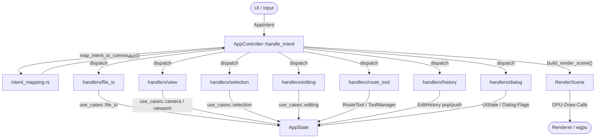

# App API Documentation

## Überblick

Das `app`-Modul verwaltet den globalen State, verarbeitet `AppIntent`s zentral über den `AppController`, mappt diese auf `AppCommand`s und baut die `RenderScene` für das Rendering.

**Hinweis:** `Camera2D` lebt im `core`-Modul (reiner Geometrie-Typ). `app` re-exportiert `Camera2D`, `ConnectionDirection`, `ConnectionPriority` und `RoadMap` aus `core`.

**Weitere API-Dokumentationen:**
- [`use_cases/API.md`](use_cases/API.md) — alle Use-Case-Funktionen (camera, file_io, selection, editing, …)
- [`tools/API.md`](tools/API.md) — ToolManager, RouteTool-Trait, registrierte Tools, gemeinsame Infrastruktur

## Haupttypen

### `AppController`

Zentrale Intent-Verarbeitung, Command-Dispatch an Feature-Handler und Render-Scene-Aufbau.

```rust
pub struct AppController;
```

**Methoden:**

```rust
let mut controller = AppController::new();
let mut state = AppState::new();

controller.handle_intent(&mut state, AppIntent::ZoomInRequested)?;
let scene = controller.build_render_scene(&state, [width, height]);
```

**Features:**
- Verarbeitet UI- und Input-Intents gegen `AppState`
- Mappt Intents auf Commands (Mapping ist in `intent_mapping.rs` ausgelagert)
- Dispatcht Commands an Feature-Handler (`handlers/`)
- Baut den expliziten Render-Vertrag (`RenderScene`)

**Handler-Module** (`app/handlers/`):
- `file_io` — Datei-Operationen (Öffnen, Speichern, Heightmap)
- `view` — Kamera, Viewport, Background-Map
- `selection` — Selektions-Operationen
- `editing` — Node/Connection-Editing, Marker
- `route_tool` — Route-Tool-Operationen
- `dialog` — Dialog-State und Anwendungssteuerung
- `history` — Undo/Redo

**Intent-Mapping** (`intent_mapping.rs`):
```rust
pub fn map_intent_to_commands(state: &AppState, intent: AppIntent) -> Vec<AppCommand>
```
Übersetzt einen `AppIntent` in eine Liste von `AppCommand`s. Reine Funktion ohne Seiteneffekte — alle Entscheidungslogik (z.B. Pick-Radius-Berechnung, aktuellen Dateipfad prüfen) ist hier lokalisiert.

---

### `AppState`

Zentraler Anwendungszustand. Enthält keine I/O-Logik — alle Dateisystem-Operationen sind in `use_cases::file_io` zentralisiert.

```rust
pub struct AppState {
    pub road_map: Option<Arc<RoadMap>>,
    pub view: ViewState,
    pub ui: UiState,
    pub selection: SelectionState,
    pub editor: EditorToolState,
    pub command_log: CommandLog,
    pub history: EditHistory,
    pub options: EditorOptions,
    pub show_options_dialog: bool,
    pub segment_registry: SegmentRegistry,  // In-Session-Registry für nachträgliche Bearbeitung
    pub should_exit: bool,
}

pub struct SelectionState {
    pub selected_node_ids: Arc<IndexSet<u64>>,  // Arc für O(1)-Clone in RenderScene (CoW)
    pub selection_anchor_node_id: Option<u64>,
}
```

**Methoden:**

```rust
// CoW-Mutation: klont IndexSet nur wenn der Arc nicht alleinig gehalten wird
sel.ids_mut().insert(42);
```

- `new() → Self`
- `ids_mut() → &mut IndexSet<u64>` — Mutable Zugriff via `Arc::make_mut` (Copy-on-Write)

pub struct UiState {
    pub show_file_dialog: bool,
    pub show_save_file_dialog: bool,
    pub show_heightmap_dialog: bool,
    pub show_background_map_dialog: bool,
    pub show_overview_dialog: bool,
    pub show_heightmap_warning: bool,
    pub heightmap_warning_confirmed: bool,
    pub pending_save_path: Option<String>,
    pub current_file_path: Option<String>,
    pub heightmap_path: Option<String>,
    pub marker_dialog: MarkerDialogState,
    pub status_message: Option<String>,
    pub dedup_dialog: DedupDialogState,
    pub zip_browser: Option<ZipBrowserState>,
    pub overview_options_dialog: OverviewOptionsDialogState,
    pub post_load_dialog: PostLoadDialogState,
    pub save_overview_dialog: SaveOverviewDialogState,
    /// Konfiguration für das Distanzen-Neuverteilen-Feature
    pub distanzen: DistanzenState,
}

pub struct DistanzenState {
    /// true = nach Anzahl, false = nach Abstand
    pub by_count: bool,
    /// Gewünschte Anzahl an Waypoints (bei `by_count = true`)
    pub count: u32,
    /// Maximaler Abstand zwischen Waypoints in Welteinheiten (bei `by_count = false`)
    pub distance: f32,
    /// Berechnete Streckenlänge der aktuellen Selektion (für wechselseitige Berechnung)
    pub path_length: f32,
    /// Vorschau-Modus aktiv (Spline-Preview wird im Viewport gezeichnet)
    pub active: bool,
    /// Originale Strecke während der Vorschau ausblenden
    pub hide_original: bool,
    /// Vorschau-Positionen (berechnete Resample-Punkte für Overlay)
    pub preview_positions: Vec<Vec2>,
}

**Methoden:**
- `sync_from_distance()` — Berechnet `count` aus `distance` und `path_length`
- `sync_from_count()` — Berechnet `distance` aus `count` und `path_length`
- `deactivate()` — Deaktiviert den Vorschau-Modus und löscht die Vorschau-Daten
- `should_hide_original() -> bool` — Gibt `true` zurück wenn Original-Strecke ausgeblendet werden soll

pub struct ZipBrowserState {
    pub zip_path: String,
    pub entries: Vec<ZipImageEntry>,
    pub selected: Option<usize>,
    pub filter_overview: bool,
}

pub struct MarkerDialogState {
    pub visible: bool,
    pub node_id: Option<u64>,
    pub name: String,
    pub group: String,
    pub is_new: bool,
}

pub struct DedupDialogState {
    pub visible: bool,
    pub duplicate_count: u32,
    pub group_count: u32,
}

pub struct OverviewOptionsDialogState {
    pub visible: bool,
    pub zip_path: String,
    pub layers: OverviewLayerOptions,
}

pub struct PostLoadDialogState {
    pub visible: bool,
    pub heightmap_set: bool,
    pub heightmap_path: Option<String>,
    pub overview_loaded: bool,
    pub matching_zips: Vec<PathBuf>,
    pub selected_zip_index: usize,
    pub map_name: String,
}

pub struct SaveOverviewDialogState {
    pub visible: bool,
    pub target_path: String,
}

pub struct ViewState {
    pub camera: Camera2D,
    pub viewport_size: [f32; 2],
    pub render_quality: RenderQuality,
    pub background_map: Option<Arc<BackgroundMap>>,
    pub background_visible: bool,
    pub background_scale: f32,      // Skalierungsfaktor (1.0 = Original)
    pub background_dirty: bool,  // GPU-Upload-Signal
}

pub struct EditorToolState {
    pub active_tool: EditorTool,
    pub connect_source_node: Option<u64>,
    pub default_direction: ConnectionDirection,
    pub default_priority: ConnectionPriority,
    pub tool_manager: ToolManager,
}
```

**Methoden:**

```rust
let state = AppState::new();
let nodes = state.node_count();
let connections = state.connection_count();
let can_undo = state.can_undo();
let can_redo = state.can_redo();
```

---

### `EditorTool`

Aktives Editor-Werkzeug.

```rust
pub enum EditorTool {
    Select,   // Standard: Nodes selektieren und verschieben
    Connect,  // Verbindungen zwischen Nodes erstellen
    AddNode,  // Neue Nodes auf der Karte platzieren
    Route,    // Route-Tools (Linie, Parkplatz, Kurve, …)
}
```

---

### `AppIntent` und `AppCommand`

`AppIntent` beschreibt Eingaben aus UI/System. `AppCommand` beschreibt mutierende Schritte am State.

```rust
pub enum AppIntent {
    // Datei-Operationen
    OpenFileRequested,
    SaveRequested,
    SaveAsRequested,
    ExitRequested,
    FileSelected { path: String },
    SaveFilePathSelected { path: String },

    // Heightmap
    HeightmapSelectionRequested,
    HeightmapCleared,
    HeightmapSelected { path: String },
    HeightmapWarningConfirmed,
    HeightmapWarningCancelled,

    // Kamera / Viewport
    ResetCameraRequested,
    ZoomInRequested,
    ZoomOutRequested,
    ViewportResized { size: [f32; 2] },
    CameraPan { delta: glam::Vec2 },
    CameraZoom { factor: f32, focus_world: Option<glam::Vec2> },
    RenderQualityChanged { quality: RenderQuality },

    // Selektion
    NodePickRequested { world_pos: glam::Vec2, additive: bool, extend_path: bool },
    NodeSegmentBetweenIntersectionsRequested { world_pos: glam::Vec2, additive: bool },
    SelectNodesInRectRequested { min: glam::Vec2, max: glam::Vec2, additive: bool },
    SelectNodesInLassoRequested { polygon: Vec<glam::Vec2>, additive: bool },

    // Move-Lifecycle (Drag-Verschieben selektierter Nodes)
    BeginMoveSelectedNodesRequested,
    MoveSelectedNodesRequested { delta_world: glam::Vec2 },
    EndMoveSelectedNodesRequested,

    // Undo / Redo
    UndoRequested,
    RedoRequested,

    // Editor-Werkzeug
    SetEditorToolRequested { tool: EditorTool },

    // Editing
    AddNodeRequested { world_pos: glam::Vec2 },
    DeleteSelectedRequested,
    ConnectToolNodeClicked { world_pos: glam::Vec2 },
    AddConnectionRequested { from_id: u64, to_id: u64, direction: ConnectionDirection, priority: ConnectionPriority },
    RemoveConnectionBetweenRequested { node_a: u64, node_b: u64 },
    SetConnectionDirectionRequested { start_id: u64, end_id: u64, direction: ConnectionDirection },
    SetConnectionPriorityRequested { start_id: u64, end_id: u64, priority: ConnectionPriority },
    SetDefaultDirectionRequested { direction: ConnectionDirection },
    SetDefaultPriorityRequested { priority: ConnectionPriority },

    // Bulk-Operationen auf selektierten Verbindungen
    SetAllConnectionsDirectionBetweenSelectedRequested { direction: ConnectionDirection },
    RemoveAllConnectionsBetweenSelectedRequested,
    InvertAllConnectionsBetweenSelectedRequested,
    SetAllConnectionsPriorityBetweenSelectedRequested { priority: ConnectionPriority },
    ConnectSelectedNodesRequested,

    // Background-Map
    BackgroundMapSelectionRequested,
    BackgroundMapSelected { path: String, crop_size: Option<u32> },
    ToggleBackgroundVisibility,
    ScaleBackground { factor: f32 },
    ZipBackgroundBrowseRequested { path: String },
    ZipBackgroundFileSelected { zip_path: String, entry_name: String },
    ZipBrowserCancelled,

    // Übersichtskarte
    GenerateOverviewRequested,
    GenerateOverviewFromZip { path: String },
    OverviewOptionsConfirmed,
    OverviewOptionsCancelled,

    // Post-Load-Dialog (Auto-Detection)
    PostLoadGenerateOverview { zip_path: String },
    PostLoadDialogDismissed,

    // Map-Marker
    CreateMarkerRequested { node_id: u64 },
    RemoveMarkerRequested { node_id: u64 },
    EditMarkerRequested { node_id: u64 },
    MarkerDialogConfirmed { node_id: u64, name: String, group: String, is_new: bool },
    MarkerDialogCancelled,

    // Selektion (Bulk)
    ClearSelectionRequested,
    SelectAllRequested,

    // Duplikat-Bereinigung
    DeduplicateConfirmed,
    DeduplicateCancelled,

    // Optionen
    OpenOptionsDialogRequested,
    CloseOptionsDialogRequested,
    OptionsChanged { options: EditorOptions },
    ResetOptionsRequested,

    // Route-Tool
    RouteToolClicked { world_pos: glam::Vec2, ctrl: bool },
    RouteToolExecuteRequested,
    RouteToolCancelled,
    SelectRouteToolRequested { index: usize },
    RouteToolConfigChanged,
    RouteToolWithAnchorsRequested { anchors: Vec<glam::Vec2>, direction: ConnectionDirection, priority: ConnectionPriority },
    RouteToolTangentSelected { is_start: bool, neighbor_id: Option<u64> },
    RouteToolRecreateRequested,

    // Route-Tool Drag (Steuerpunkt-Verschiebung)
    RouteToolDragStarted { world_pos: glam::Vec2 },
    RouteToolDragUpdated { world_pos: glam::Vec2 },
    RouteToolDragEnded,

    // Route-Tool Schnellsteuerung (Keyboard-Shortcuts)
    IncreaseRouteToolNodeCount,
    DecreaseRouteToolNodeCount,
    IncreaseRouteToolSegmentLength,
    DecreaseRouteToolSegmentLength,

    // Segment-Bearbeitung (nachträgliche Bearbeitung erstellter Linien)
    EditSegmentRequested { record_id: u64 },
    // Distanzen: Selektierte Nodes-Kette gleichmäßig neu verteilen
    ResamplePathRequested,
    StreckenteilungAktivieren,

    // Hintergrund als Übersichtskarte speichern
    SaveBackgroundAsOverviewConfirmed,
    SaveBackgroundAsOverviewDismissed,

    // Viewport
    ZoomToFitRequested,

    // Selektion (erweitert)
    InvertSelectionRequested,
}

pub enum AppCommand {
    // Datei-Operationen
    LoadFile { path: String },
    SaveFile { path: Option<String> },
    RequestOpenFileDialog,
    RequestSaveFileDialog,
    RequestExit,
    ConfirmAndSaveFile,

    // Kamera
    ResetCamera,
    ZoomIn,
    ZoomOut,
    PanCamera { delta: glam::Vec2 },
    ZoomCamera { factor: f32, focus_world: Option<glam::Vec2> },
    SetViewportSize { size: [f32; 2] },
    SetRenderQuality { quality: RenderQuality },

    // Selektion
    SelectNearestNode { world_pos: glam::Vec2, max_distance: f32, additive: bool, extend_path: bool },
    SelectSegmentBetweenNearestIntersections { world_pos: glam::Vec2, max_distance: f32, additive: bool },
    SelectNodesInRect { min: glam::Vec2, max: glam::Vec2, additive: bool },
    SelectNodesInLasso { polygon: Vec<glam::Vec2>, additive: bool },
    ClearSelection,
    SelectAllNodes,
    BeginMoveSelectedNodes,
    MoveSelectedNodes { delta_world: glam::Vec2 },
    EndMoveSelectedNodes,

    // Editing
    SetEditorTool { tool: EditorTool },
    AddNodeAtPosition { world_pos: glam::Vec2 },
    DeleteSelectedNodes,
    ConnectToolPickNode { world_pos: glam::Vec2, max_distance: f32 },
    AddConnection { from_id: u64, to_id: u64, direction: ConnectionDirection, priority: ConnectionPriority },
    RemoveConnectionBetween { node_a: u64, node_b: u64 },
    SetConnectionDirection { start_id: u64, end_id: u64, direction: ConnectionDirection },
    SetConnectionPriority { start_id: u64, end_id: u64, priority: ConnectionPriority },
    SetDefaultDirection { direction: ConnectionDirection },
    SetDefaultPriority { priority: ConnectionPriority },
    SetAllConnectionsDirectionBetweenSelected { direction: ConnectionDirection },
    RemoveAllConnectionsBetweenSelected,
    InvertAllConnectionsBetweenSelected,
    SetAllConnectionsPriorityBetweenSelected { priority: ConnectionPriority },
    ConnectSelectedNodes,

    // Heightmap / Background
    RequestHeightmapDialog,
    RequestBackgroundMapDialog,
    ClearHeightmap,
    SetHeightmap { path: String },
    DismissHeightmapWarning,
    LoadBackgroundMap { path: String, crop_size: Option<u32> },
    ToggleBackgroundVisibility,
    ScaleBackground { factor: f32 },
    BrowseZipBackground { path: String },
    LoadBackgroundFromZip { zip_path: String, entry_name: String, crop_size: Option<u32> },
    CloseZipBrowser,

    // Übersichtskarte
    RequestOverviewDialog,
    OpenOverviewOptionsDialog { path: String },
    GenerateOverviewWithOptions,
    CloseOverviewOptionsDialog,

    // Post-Load-Dialog
    DismissPostLoadDialog,

    // Marker
    CreateMarker { node_id: u64, name: String, group: String },
    RemoveMarker { node_id: u64 },
    OpenMarkerDialog { node_id: u64, is_new: bool },
    UpdateMarker { node_id: u64, name: String, group: String },
    CloseMarkerDialog,

    // Duplikat-Bereinigung
    DeduplicateNodes,
    DismissDeduplicateDialog,

    // Optionen
    OpenOptionsDialog,
    CloseOptionsDialog,
    ApplyOptions { options: EditorOptions },
    ResetOptions,

    // Undo/Redo
    Undo,
    Redo,

    // Route-Tool
    RouteToolClick { world_pos: glam::Vec2, ctrl: bool },
    RouteToolExecute,
    RouteToolCancel,
    SelectRouteTool { index: usize },
    RouteToolRecreate,
    RouteToolWithAnchors { anchors: Vec<glam::Vec2>, direction: ConnectionDirection, priority: ConnectionPriority },
    RouteToolApplyTangent { is_start: bool, neighbor_id: Option<u64> },

    // Route-Tool Schnellsteuerung
    IncreaseRouteToolNodeCount,
    DecreaseRouteToolNodeCount,
    IncreaseRouteToolSegmentLength,
    DecreaseRouteToolSegmentLength,

    // Route-Tool Drag (Steuerpunkt-Verschiebung)
    RouteToolDragStart { world_pos: glam::Vec2 },
    RouteToolDragUpdate { world_pos: glam::Vec2 },
    RouteToolDragEnd,

    // Segment-Bearbeitung
    EditSegment { record_id: u64 },
    // Distanzen: Selektierte Nodes-Kette per Catmull-Rom-Spline neu verteilen
    ResamplePath,
    StreckenteilungAktivieren,

    // Hintergrund als Übersichtskarte speichern
    SaveBackgroundAsOverview { path: String },
    DismissSaveOverviewDialog,

    // Viewport
    ZoomToFit,

    // Selektion (erweitert)
    InvertSelection,
}
```

---

### `Camera2D` (re-exportiert aus `core`)

2D-Kamera mit Pan und Zoom. Siehe `core/API.md` für Details.

## Use-Cases

Alle Use-Case-Funktionen sind in [`use_cases/API.md`](use_cases/API.md) dokumentiert.

Module: `camera` · `file_io` · `heightmap` · `selection` · `auto_detect` · `editing` (inkl. `markers`, `resample_path`, `generate_bypass`) · `viewport` · `background_map` · `SegmentRegistry`

---

## AppIntent-Flow (Übersicht)


```mermaid
flowchart TD
    UI([UI / Input]) -->|"AppIntent"| CTRL[AppController::handle_intent]
    CTRL -->|"map_intent_to_commands()"| MAP[intent_mapping.rs]
    MAP -->|"Vec<AppCommand>"| CTRL

    CTRL -->|dispatch| H_FILE[handlers/file_io]
    CTRL -->|dispatch| H_VIEW[handlers/view]
    CTRL -->|dispatch| H_SEL[handlers/selection]
    CTRL -->|dispatch| H_EDIT[handlers/editing]
    CTRL -->|dispatch| H_ROUTE[handlers/route_tool]
    CTRL -->|dispatch| H_HIST[handlers/history]
    CTRL -->|dispatch| H_DLG[handlers/dialog]

    H_FILE -->|"use_cases::file_io"| STATE[AppState]
    H_VIEW -->|"use_cases::camera / viewport"| STATE
    H_SEL -->|"use_cases::selection"| STATE
    H_EDIT -->|"use_cases::editing"| STATE
    H_ROUTE -->|"RouteTool / ToolManager"| STATE
    H_HIST -->|"EditHistory pop/push"| STATE
    H_DLG -->|"UiState / Dialog-Flags"| STATE

    CTRL -->|"build_render_scene()"| SCENE[RenderScene]
    SCENE -->|GPU-Draw-Calls| GPU([Renderer / wgpu])
```

*Ablauf:* UI emittiert `AppIntent` → `AppController` übersetzt via `map_intent_to_commands()` in `Vec<AppCommand>` → Handler-Module mutieren `AppState` via Use-Cases → `build_render_scene()` serialisiert den State in den `RenderScene`-Vertrag → Renderer zeichnet.

## Interaktions-Pattern

### Typisches Update-Loop (Intent-basiert)

```rust
let mut intents = Vec::new();
intents.push(AppIntent::ZoomInRequested);

for intent in intents {
    controller.handle_intent(&mut state, intent)?;
}

let scene = controller.build_render_scene(&state, [viewport_w, viewport_h]);
```

### Pan-Delta-Umrechnung

Das Maus-Delta (Pixel) wird vor dem Intent in Welt-Einheiten umgerechnet:

```rust
let wpp = camera.world_per_pixel(viewport_height);
AppIntent::CameraPan { delta: Vec2::new(-dx * wpp, -dy * wpp) }
```

## Design-Prinzipien

1. **Single Source of Truth:** `AppState` hält die Laufzeitdaten (kein I/O)
2. **Intent Boundary:** UI emittiert primär `AppIntent`; reine UI-/Tool-Konfiguration im `AppState` kann gezielt direkt aktualisiert werden
3. **Command Execution:** `AppController` mappt Intents auf Commands und führt diese aus
4. **Render Contract:** Ausgabe an Renderer erfolgt nur über `RenderScene`
5. **I/O in Use-Cases:** Dateisystem-Operationen sind in `use_cases::file_io` zentralisiert
6. **Re-Exports:** `app` re-exportiert `Camera2D`, `ConnectionDirection`, `ConnectionPriority`, `RoadMap` aus `core`, damit UI nicht direkt auf `core` zugreift

## Weitere Typen

### `CommandLog`

Protokoliert ausgeführte AppCommands für Debugging.

```rust
pub struct CommandLog { /* intern */ }
```

**Methoden:**
- `new() → Self`
- `record(&mut self, command: &AppCommand)` — Command protokollieren (speichert Debug-String)
- `len() → usize` — Anzahl geloggter Commands
- `is_empty() → bool` — Prüfen, ob keine Einträge vorhanden sind
- `entries() → &[String]` — Read-only Sicht auf alle Einträge (Debug-Strings)

---

### `EditHistory` / `Snapshot`

COW-basiertes Undo/Redo-System.

```rust
pub struct EditHistory { /* intern */ }
pub struct Snapshot { /* intern */ }
```

**EditHistory-Methoden:**
- `new_with_capacity(max_depth: usize) → Self` — Manager mit maximaler Undo/Redo-Tiefe erstellen
- `record_snapshot(snapshot: Snapshot)` — Snapshot auf den Undo-Stack legen (löscht Redo-Stack)
- `pop_undo_with_current(current: Snapshot) → Option<Snapshot>` — Undo: aktuellen Zustand auf Redo-Stack, vorherigen Snapshot zurückgeben
- `pop_redo_with_current(current: Snapshot) → Option<Snapshot>` — Redo: aktuellen Zustand auf Undo-Stack, nächsten Snapshot zurückgeben
- `can_undo() → bool` / `can_redo() → bool`

**AppState Helper:**
- `record_undo_snapshot(&mut self)` — Convenience-Methode: erstellt Snapshot via `Snapshot::from_state(self)` und legt ihn auf den History-Stack

---

## Tools

Alle Tool-Typen, Traits und gemeinsame Infrastruktur sind in [`tools/API.md`](tools/API.md) dokumentiert.

---

### `render_scene::build()`

Baut die `RenderScene` aus dem aktuellen `AppState` und der Viewport-Größe.

```rust
pub fn build(state: &AppState, viewport_size: [f32; 2]) -> RenderScene
```
